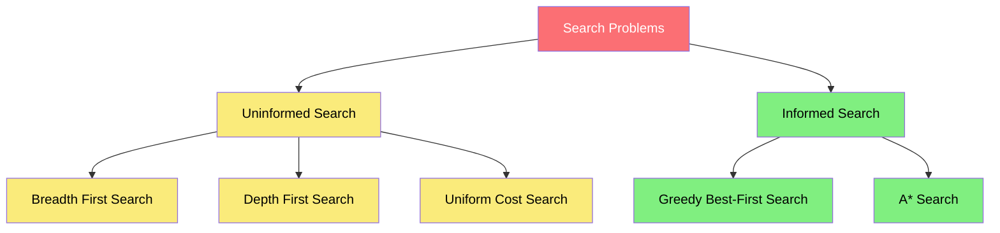
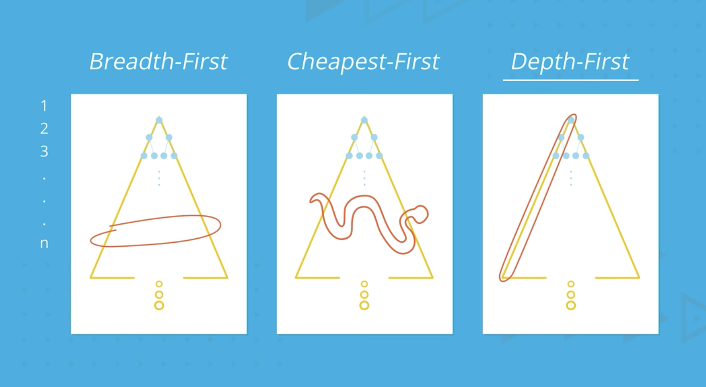
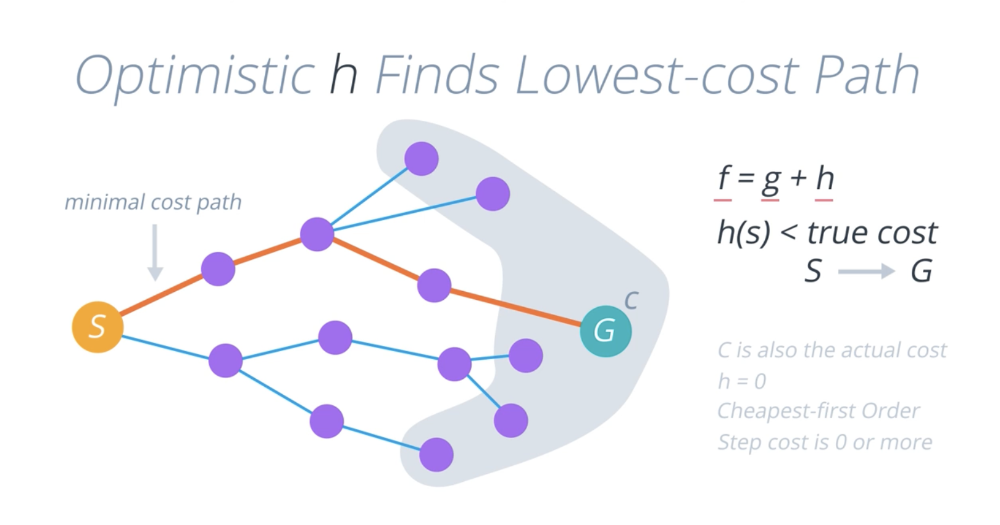

# S-2: Understanding Search Algorithms and Planning

# C-1: Classical Search

1. Uninformed Search Algorithms
    - What Is A Problem?
    - Tree Search Algorithm
    - Graph Search Algorithm
    - Breadth-First Search (BFS)
    - Depth-First Search (DFS)
    - Uniform Cost Search (UCS)
    - Algorithm Comparison
2. Informed Search Strategies
    - Heuristic Functions
    - A\* Search Algorithm
    - Optimistic Heuristics
    - Greedy Best-First Search
    - Search Algorithm Tradeoffs
3. Advanced Search Techniques
    - Bidirectional Search
    - Memory-Bounded Search Methods
    - Iterative Deepening A* (IDA*)
    - Recursive Best-First Search (RBFS)
    - Simplified Memory-Bounded A* (SMA*)
    - Trade-offs in Memory-Bounded Approaches

#### Classical Search

Classical search focuses on finding paths from an initial state to a goal state through a state space. These algorithms
systematically explore possible states to find solutions to problems like route planning, puzzle-solving, and game
playing.

##### Uninformed Search Algorithms

Uninformed search strategies have no additional information about states beyond that provided in the problem definition.
They can only proceed by generating successors until they find a goal state. These are sometimes called "blind search"
strategies because they explore without any insight about which directions might be more promising.

A search problem can be formulated with the following components:

1. **Initial state (S₀)**: The starting point of the search
2. **Actions {a₁, a₂, a₃, ...}**: Possible actions available to the agent at any given state
3. **Result (S')**: The new state where the agent ends up after taking an action
4. **Goal Test**: A boolean function checking whether the current state is the goal state
5. **Path Cost**: The sum of the cost of individual steps (e.g., distance between cities)

For example, in a route-finding problem, the initial state might be a starting city, actions are roads to other cities,
results are the cities reached, the goal test checks if we've reached our destination, and path cost is the total
distance traveled.

<div align="center">

<p style="color: #555;">Figure: Different search strategies use different approaches to explore the state space</p>
</div>

##### Tree Search Algorithm

The tree search algorithm constructs a search tree from the initial state by generating successor states and checking if
any of them is a goal state.

```python
function Tree.Search (problem):
    frontier = { [initial] }
    loop:
        if frontier is empty: return FAIL
        path = remove.choice(frontier)
        s = path.end
        if s is a goal: return path
        for a in actions:
            add [path + a > Result(s,a)]
            to frontier
```

In this algorithm, `frontier` is the set of paths that have been generated but not yet explored fully. The line
`add[path + a > Results(s,a)]` appends the current action `a` to the previous path, leading to a new state
`Results(s,a)`.

##### Graph Search Algorithm

The graph search algorithm improves on tree search by keeping track of states that have already been explored to avoid
redundant exploration:

```python
function Graph.Search (problem):
   frontier = { [initial] }; explored = { }
   loop:
       if frontier is empty: return FAIL
       path = remove.choice(frontier)
       s = path.end; add s to explored
       if s is a goal: return path
       for a in actions:
           add [path + a -> Result(s,a)]
           to frontier
           unless Result(s,a) in frontier or explored
```

The key difference is the addition of the `explored` set, which prevents revisiting states we've already examined. This
is crucial for efficiency in environments where multiple paths might lead to the same state.



##### Breadth-First Search (BFS)

Breadth-First Search explores a graph layer by layer, like ripples spreading from a point. It explores all nodes at the
current depth level before moving deeper.

<div align="center">

<p style="color: #555;">Figure: Cycles in search can lead to inefficiency that graph search mitigates</p>
</div>

**Technical Details**:

- Implements the frontier as a FIFO queue
- Ensures the shortest path in terms of number of steps
- Complete (will find a solution if one exists)
- Optimal for unweighted graphs
- Time complexity: O(b^d) where b is branching factor and d is depth
- Space complexity: O(b^d)

##### Depth-First Search (DFS)

Depth-First Search explores as deeply as possible along each branch before backtracking. It's like exploring a maze by
following each path to its end before trying alternatives.

**Technical Details**:

- Implements the frontier as a LIFO stack
- Uses much less memory than BFS
- Complete only in finite spaces with cycle detection
- Not guaranteed to find shortest paths
- Time complexity: O(b^m) where m is maximum depth
- Space complexity: O(m)

##### Uniform Cost Search (UCS)

Uniform Cost Search is a variant of Dijkstra's algorithm that finds the least-cost path to a goal by always expanding
the node with the lowest path cost.

**Technical Details**:

- Implements the frontier as a priority queue ordered by path cost
- Optimal for all non-negative edge costs
- Complete if all costs > 0
- Time complexity: O(b^(1 + ⌊C*/ε⌋)) where C* is the cost of the optimal solution and ε is the minimum action cost
- Space complexity: O(b^(1 + ⌊C\*/ε⌋))

##### Algorithm Comparison

When choosing a search algorithm, we need to consider several properties:

| Search Method  | Optimal? | Frontier Size | Size @ n = 20 | Complete? |
| -------------- | -------- | ------------- | ------------- | --------- |
| Breadth-First  | Yes      | 2^n           | 1,048,576     | Yes       |
| Cheapest-First | Yes      | 2^n           | 1,048,576     | Yes       |
| Depth-First    | No       | n             | 20            | No\*      |

\* DFS is incomplete on infinite spaces without cycle detection

This comparison highlights a fundamental trade-off in search algorithms: BFS and UCS guarantee optimal solutions but
have exponential memory requirements, while DFS has much more modest memory needs but doesn't guarantee optimality.

<div align="center">

<p style="color: #555;">Figure: Visual representation of how different search strategies traverse a search tree</p>
</div>

The different search patterns are also illustrated below:

<div align="center">

<p style="color: #555;">Figure: Comparison of path exploration patterns in different search strategies</p>
</div>
Space complexity often becomes the deciding factor in real-world applications. For problems with large or infinite state
spaces, DFS might be the only feasible approach despite its lack of optimality guarantees.

#### Informed Search Strategies

While uninformed search methods explore the state space without any additional guidance, informed search strategies
leverage domain-specific knowledge to make the search process more efficient. These algorithms use heuristic functions
to estimate the cost or distance to the goal, allowing them to prioritize more promising paths.

##### Heuristic Functions

A heuristic function, denoted as h(n), estimates the cost of the cheapest path from node n to a goal state. This is an
educated guess that helps the search algorithm decide which nodes to explore first.

Properties of good heuristic functions:

1. **Admissibility**: A heuristic is admissible if it never overestimates the true cost to reach the goal.
   Mathematically, for all nodes $n$: $h(n) ≤ h*(n)$, where $h*(n)$ is the true optimal cost from n to the goal.
2. **Consistency/Monotonicity**: A heuristic is consistent if for every node n and successor n' with step cost $c$:
   $h(n) ≤ c(n, n') + h(n')$. This means the estimated cost to the goal from n is no greater than the step cost to n'
   plus the estimated cost from n' to the goal.
3. **Dominance**: If for all nodes, $h₂(n) ≥ h₁(n)$ and both are admissible, then h₂ dominates h₁ and is considered the
   better heuristic.

In practice, domain-specific knowledge helps us design effective heuristics. For example, in a route-finding problem,
the straight-line distance to the destination is an admissible heuristic since it never overestimates the actual driving
distance.

##### A\* Search Algorithm

A\* (pronounced "A-star") combines the strengths of uniform-cost search and greedy best-first search. It uses a
heuristic function to guide the search while still guaranteeing an optimal solution under certain conditions.

The key insight of A\* is the evaluation function $f(n) = g(n) + h(n)$, where:

- $g(n)$ is the cost of the path from the start node to node n
- $h(n)$ is the estimated cost from n to the goal

By minimizing this combined value, A\* balances between:

- exploiting our current path (measured by g(n))
- exploring new, promising directions (guided by h(n))

A* is optimal if the heuristic function h(n) is admissible, meaning it never overestimates the true cost to reach the
goal. When h(n) is also consistent, A* explores fewer nodes than any other optimal algorithm with the same heuristic.

<div align="center">

<p style="color: #555;">Figure: Optimistic heuristic guiding A* search to find the optimal path</p>
</div>

The algorithm maintains two sets:

- Open set: Nodes that have been discovered but not yet evaluated completely
- Closed set: Nodes that have been completely evaluated

At each step, A\* selects the node with the lowest f(n) value from the open set, similar to how Dijkstra's algorithm
selects the node with the smallest known distance.

##### Optimistic Heuristics

An optimistic (or admissible) heuristic never overestimates the true cost to reach the goal. This property ensures that
A\* will find an optimal solution. If a heuristic is optimistic, we can say:

h(n) ≤ h\*(n) for all nodes n

Where h\*(n) is the true optimal cost from n to the goal.

Some examples of optimistic heuristics:

- In path finding: Straight-line (Euclidean) distance
- In the 8-puzzle: Manhattan distance or number of misplaced tiles
- In the Traveling Salesman Problem: Minimum spanning tree cost

When a heuristic is optimistic, A\* will never eliminate a path that could be optimal. This guarantee comes at the cost
of potentially exploring more nodes than a less cautious algorithm might.

The image illustrates how an optimistic heuristic helps A\* find the minimal cost path from start (S) to goal (G). The
formula f = g + h guides the search, where h(s) < true cost from s to G.

##### Greedy Best-First Search

Greedy best-first search is a simpler informed search algorithm that always expands the node that seems closest to the
goal according to the heuristic function h(n).

Unlike $A^*$, greedy search completely ignores the path cost so far (g(n)) and only considers the estimated cost to the
goal:

$f(n) = h(n)$

This makes greedy search very efficient in some cases, but it has significant limitations:

- Not guaranteed to find the optimal solution
- May get stuck in loops without proper cycle detection
- Can waste time exploring paths that seem promising but lead to dead ends

Greedy search works well when the heuristic is very accurate or when finding any solution quickly is more important than
finding the optimal solution.

##### Search Algorithm Tradeoffs

When choosing between informed search algorithms, we face important tradeoffs:

1. **Completeness**: Will the algorithm always find a solution if one exists?
    - BFS, UCS, and A\* (with proper implementation) are complete
    - DFS can fail in infinite spaces
    - Greedy search may get trapped in loops
2. **Optimality**: Does the algorithm guarantee finding the optimal solution?
    - UCS is optimal for uniform-cost problems
    - A\* is optimal if the heuristic is admissible
    - Greedy and DFS do not guarantee optimality
3. **Time Efficiency**: How many nodes must be explored?
    - In the worst case, all algorithms might explore an exponential number of nodes
    - Good heuristics in A\* can dramatically reduce exploration
    - Greedy search often explores the fewest nodes but may miss optimal solutions
4. **Space Efficiency**: How much memory is required?
    - DFS uses linear space relative to maximum search depth
    - BFS, UCS, and A\* typically require exponential space
    - Memory constraints often make DFS the only viable option for very deep searches

The ideal search algorithm depends on the specific problem characteristics:

- If the state space is small, BFS or UCS might be sufficient
- If optimality matters and a good heuristic exists, A\* is excellent
- If memory is severely limited but the solution is deep, DFS may be necessary
- If finding any solution quickly matters more than optimality, greedy search can excel

Understanding these tradeoffs helps us select the most appropriate algorithm for each problem we encounter. By matching
the algorithm's strengths to the problem's characteristics, we can solve complex search problems more efficiently.

#### Advanced Search Techniques

The search algorithms we've explored so far—BFS, DFS, UCS, and A\*—provide powerful tools for finding solutions to
search problems. However, they all face significant limitations when applied to complex, real-world problems. In this
section, we'll explore advanced search techniques designed to overcome these limitations, particularly focusing on
memory efficiency and the ability to handle larger search spaces.

##### Bidirectional Search

Bidirectional search attacks a problem from both ends simultaneously: one search starts from the initial state and works
forward, while another search starts from the goal state and works backward. When the two searches meet in the middle, a
complete path has been found.

The key insight behind bidirectional search is that $b^{d/2} + b^{d/2}$ is much smaller than $b^d$ for large values of
$b$ and $d$, where $b$ is the branching factor and $d$ is the solution depth. By searching from both ends, we can
dramatically reduce the number of nodes explored.

For example, if $b = 10$ and $d = 8$, a unidirectional search might explore up to $10^8 = 100,000,000$ nodes, while a
bidirectional search would explore approximately $2 \times 10^4 = 20,000$ nodes—a reduction by a factor of 5,000.

The algorithm works as follows:

```python
function BIDIRECTIONAL-SEARCH(initial, goal) returns solution or failure
    if initial = goal then return [initial]

    // Initialize forward and backward frontiers
    forward_frontier ← {initial}
    backward_frontier ← {goal}

    // Initialize explored sets
    forward_explored ← {}
    backward_explored ← {}

    // Initialize path mappings
    forward_paths ← a mapping from initial to []
    backward_paths ← a mapping from goal to []

    while forward_frontier is not empty and backward_frontier is not empty do
        // Check for intersection
        if forward_frontier ∩ backward_frontier is not empty then
            return EXTRACT-SOLUTION(initial, goal, forward_frontier ∩ backward_frontier,
                                   forward_paths, backward_paths)

        // Expand forward frontier
        next_forward_frontier ← {}
        for each state in forward_frontier do
            add state to forward_explored
            for each successor of state do
                if successor not in forward_explored and successor not in next_forward_frontier then
                    add successor to next_forward_frontier
                    forward_paths[successor] ← forward_paths[state] + [successor]

                    // Check if successor is in backward_explored
                    if successor in backward_explored then
                        return EXTRACT-SOLUTION(initial, goal, {successor},
                                               forward_paths, backward_paths)

        forward_frontier ← next_forward_frontier

        // Similar expansion for backward frontier
        // ...

    return failure
```

The implementation needs to handle a few complexities:

1. **Action Reversibility**: To search backward from the goal, we need to generate predecessor states, which requires
   actions to be reversible or a model of predecessors.
2. **Frontier Intersection**: We must efficiently detect when the frontiers intersect, typically using a hash table or
   similar data structure.
3. **Path Reconstruction**: When the frontiers meet, we need to stitch together the forward and backward paths to create
   a complete solution.

Bidirectional search is particularly effective for problems where:

- Forward and backward branching factors are similar
- The goal state is fully specified (not a goal test)
- Actions are easily reversible or predecessors are easily computed

It's less suitable when:

- The goal is specified implicitly (e.g., "any state where the puzzle is solved")
- The branching factor in one direction is much larger than in the other
- Generating predecessors is difficult or impossible

##### Memory-Bounded Search Methods

Standard search algorithms like A\* deliver optimal solutions but can consume enormous amounts of memory by storing all
generated nodes. Memory-bounded search methods address this limitation by restricting memory usage, sometimes at the
cost of optimality.

The core challenge is to effectively use limited memory while still making progress toward the goal. Several approaches
have been developed:

1. **Beam Search**: Keeps only the $k$ best nodes at each depth level, discarding the rest. While this dramatically
   reduces memory usage, beam search is incomplete and can miss optimal solutions.
2. **Depth-First Branch-and-Bound**: Performs depth-first search but prunes branches that can't possibly lead to
   solutions better than the best found so far. This approach is memory-efficient but might explore more nodes than
   necessary.
3. **Memory-Bounded A\* Variants**: These algorithms (IDA*, RBFS, SMA*) maintain the advantages of A\* while imposing
   strict memory limits.

Memory-bounded search is essential for problems with large state spaces, where even the most efficient standard search
algorithms would exhaust available memory before finding a solution.

##### Iterative Deepening A* (IDA*)

Iterative Deepening A* (IDA\*) combines the memory efficiency of iterative deepening with the informed nature of A\*
Instead of using depth as a cutoff, IDA* uses the $f(n) = g(n) + h(n)$ value, performing a series of depth-first
searches with progressively increasing $f$-value thresholds.

In each iteration:

1. Perform depth-first search, but cut off a branch when its $f$-value exceeds the current threshold

2. When the search completes without finding a solution, increase the threshold to the minimum $f$-value that exceeded
   the threshold in the previous iteration

```python
function IDA*(initial) returns a solution, or failure
    threshold ← h(initial)

    loop do
        result ← DFS-CONTOUR(initial, threshold, 0)
        if result = SOLUTION-FOUND then return result
        if result = ∞ then return failure
        threshold ← result

function DFS-CONTOUR(node, threshold, g) returns a solution, or a new threshold, or failure
    f ← g + h(node)
    if f > threshold then return f
    if node is a goal then return SOLUTION-FOUND

    min ← ∞
    for each successor of node do
        result ← DFS-CONTOUR(successor, threshold, g + cost(node, successor))
        if result = SOLUTION-FOUND then return SOLUTION-FOUND
        min ← MIN(min, result)

    return min
```

The key properties of IDA\* include:

1. **Memory Efficiency**: IDA\* requires storage only for the current path being explored and a small amount of
   overhead, making its space complexity O(d) where d is the solution depth.
2. **Completeness and Optimality**: Like A*, IDA* is complete and optimal when using an admissible heuristic.
3. **Time Efficiency**: While IDA\* may re-explore states multiple times, its overall time complexity is still
   manageable. For a tree with branching factor b and solution depth d, the worst-case time complexity is O(b^d).

The main drawback of IDA* is the repeated expansion of states across iterations. This redundant work can make IDA*
inefficient for graphs with many paths to the same states or when the number of distinct f-values is large, causing many
iterations.

##### Recursive Best-First Search (RBFS)

Recursive Best-First Search (RBFS) attempts to mimic the node-expansion order of A\* while using only linear space. It
maintains the best alternative path available at each choice point so it can revert to the second-best path when the
current path exceeds a limit.

RBFS works as follows:

1. Expand the node with the lowest $f$-value
2. As the search progresses deeper, keep track of the best alternative (second-best $f$-value) at each level
3. If the current node's $f$-value exceeds the best alternative anywhere on the path, backtrack to explore that
   alternative
4. When backtracking, update the backed-up $f$-value of the abandoned path to indicate the minimum $f$-value in that
   subtree

```
function RBFS(initial, f_limit) returns a solution, or failure and a new f-cost limit
    return RBFS-RECURSIVE(MAKE-NODE(initial), f_limit)

function RBFS-RECURSIVE(node, f_limit) returns a solution, or failure and a new f-cost limit
    if node is a goal then return node

    successors ← EXPAND(node)
    if successors is empty then return failure, ∞

    for each s in successors do
        s.f ← MAX(s.g + h(s), node.f)

    loop do
        best ← the successor with lowest f-value
        if best.f > f_limit then return failure, best.f
        alternative ← the second-lowest f-value among successors
        result, best.f ← RBFS-RECURSIVE(best, MIN(f_limit, alternative))
        if result ≠ failure then return result
```

RBFS has several important characteristics:

1. **Memory Efficiency**: Like IDA\*, RBFS uses space linear in the depth of the search.
2. **Node Ordering**: RBFS expands nodes in an order more similar to A* than IDA* does, potentially leading to fewer
   node expansions.
3. **Optimality**: RBFS is optimal when using an admissible heuristic.

The primary disadvantage of RBFS is that it may repeatedly regenerate states when backtracking, which can be
computationally expensive. Additionally, the algorithm's recursion and backtracking mechanisms can be complex to
implement efficiently.

##### Simplified Memory-Bounded A* (SMA*)

Simplified Memory-Bounded A* (SMA*) takes a different approach to memory limitations. Instead of restricting itself to
linear space like IDA* and RBFS, SMA* uses all available memory but gracefully adapts when memory is full.

The key insight behind SMA\* is that when memory is exhausted, we can remove the least promising nodes, but we need to
remember their quality so their parent nodes have accurate information about their subtrees.

SMA\* works as follows:

1. Maintain an open list of frontier nodes, ordered by $f$-value
2. Always expand the best node according to $f$-value
3. When memory is full, drop the worst leaf node, but update its parent's $f$-value to remember the quality of the
   dropped subtree
4. Continue this process, potentially backtracking and re-expanding nodes as necessary

```
function SMA*(initial, memory_limit) returns a solution or failure
    closed ← {}
    open ← {MAKE-NODE(initial)}

    while open is not empty do
        node ← node in open with lowest f-value
        if node is a goal then return SOLUTION(node)

        remove node from open
        add node to closed

        successors ← EXPAND(node)
        for each successor in successors do
            if successor is not in closed and successor is not in open then
                add successor to open
            else if successor is in open with higher f-value then
                replace the existing successor with the new one

            if size(open) + size(closed) > memory_limit then
                worst_leaf ← the leaf node in open with highest f-value
                remove worst_leaf from open
                update f-value of worst_leaf's parent

    return failure
```

The distinctive properties of SMA\* include:

1. **Full Memory Utilization**: SMA\* uses all available memory efficiently.
2. **Graceful Degradation**: As memory constraints become more severe, SMA\* gradually sacrifices optimality but
   continues to make progress.
3. **Anytime Behavior**: SMA\* can return the best solution found so far if interrupted.
4. **Recovery Capability**: If memory limitations force the algorithm to drop nodes from a promising path, it can
   recover and re-explore those paths when less promising alternatives are exhausted.

SMA\* is particularly useful when:

- Memory is limited but not extremely constrained
- The problem has varying difficulty regions (some areas much harder than others)
- The ability to find good solutions quickly, even if not optimal, is valuable

##### Trade-offs in Memory-Bounded Approaches

When choosing among memory-bounded search algorithms, several important trade-offs must be considered:

1. **Memory-Time Trade-off**: Generally, algorithms that use less memory require more computation time. This
   relationship is often non-linear—slightly relaxing memory constraints can sometimes dramatically reduce computation
   time.

    | Algorithm | Memory Usage | Node Regeneration | Implementation Complexity |
    | --------- | ------------ | ----------------- | ------------------------- |
    | IDA\*     | O(d)         | High              | Low                       |
    | RBFS      | O(d)         | Medium            | Medium                    |
    | SMA\*     | O(m)         | Low               | High                      |

2. **Implementation Complexity**: Simpler algorithms like IDA* are easier to implement correctly and efficiently, while
   more sophisticated algorithms like SMA* require careful attention to detail.

3. **Problem Characteristics**: The best algorithm depends on the specific search problem:

    - For problems with few distinct f-values (like grid-based path finding), IDA\* often performs well
    - For problems with accurate heuristics, RBFS can be very effective
    - For problems with deceptive heuristics or widely varying difficulty regions, SMA\* may be superior

4. **Solution Quality vs. Finding Any Solution**: Some applications require optimal solutions, while others prioritize
   finding any solution quickly. Memory-bounded algorithms can be tuned to reflect these priorities.

5. **Anytime Operation**: In time-critical applications, algorithms that can provide progressively better solutions
   (like SMA*) may be preferred over those that provide only a final solution (like IDA*).

The choice of memory-bounded search algorithm ultimately depends on:

- Available memory
- Computational resources
- The nature of the search space
- The quality of available heuristics
- The requirements of the specific application

In practice, hybrid approaches often provide the best performance, combining elements of different algorithms or
switching between strategies based on the current state of the search.

Advanced search techniques like bidirectional search and memory-bounded methods have transformed what was once
theoretically correct but practically limited algorithms into powerful tools for solving complex real-world problems. By
understanding the strengths and limitations of each approach, we can select the most appropriate technique for a given
problem, balancing optimality, memory efficiency, and computational resources.
