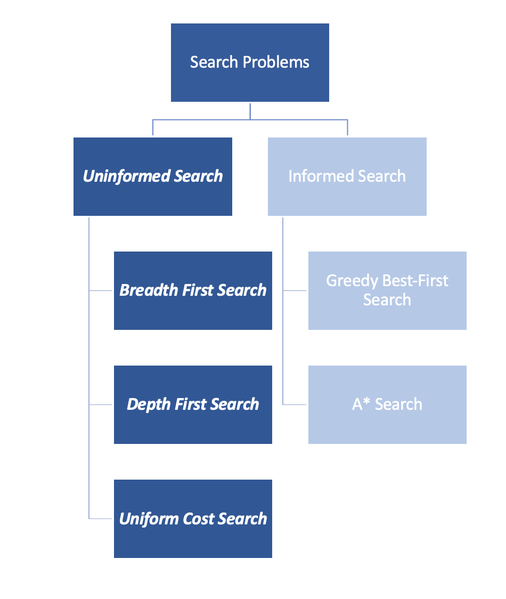

# C-1: CLASSICAL SEARCH

1. Uninformed Search Algorithms
    - What Is A Problem?
    - Tree Search Algorithm
    - Graph Search Algorithm
    - Breadth-First Search (BFS)
    - Depth-First Search (DFS)
    - Uniform Cost Search (UCS)
    - Algorithm Comparison
2. Informed Search Strategies
    - Heuristic Functions
    - A\* Search Algorithm
    - Optimistic Heuristics
    - Greedy Best-First Search
    - Search Algorithm Tradeoffs

# C-1: Classical Search

## What is Classical Search?

Classical search focuses on finding paths from an initial state to a goal state through a state space. These algorithms
systematically explore possible states to find solutions to problems like route planning, puzzle-solving, and game
playing.

#### Uninformed Search Algorithms

Uninformed search strategies have no additional information about states beyond that provided in the problem definition.
They can only proceed by generating successors until they find a goal state. These are sometimes called "blind search"
strategies because they explore without any insight about which directions might be more promising.

##### What Is A Problem?

A search problem can be formulated with the following components:

1. **Initial state (S₀)**: The starting point of the search
2. **Actions {a₁, a₂, a₃, ...}**: Possible actions available to the agent at any given state
3. **Result (S')**: The new state where the agent ends up after taking an action
4. **Goal Test**: A boolean function checking whether the current state is the goal state
5. **Path Cost**: The sum of the cost of individual steps (e.g., distance between cities)

For example, in a route-finding problem, the initial state might be a starting city, actions are roads to other cities,
results are the cities reached, the goal test checks if we've reached our destination, and path cost is the total
distance traveled.

<div align="center">  <p style="color: #555;">Figure: Different search strategies use different approaches to explore the state space</p> </div>

##### Tree Search Algorithm

The tree search algorithm constructs a search tree from the initial state by generating successor states and checking if
any of them is a goal state.

```
function Tree.Search (problem):
    frontier = { [initial] }
    loop:
        if frontier is empty: return FAIL
        path = remove.choice(frontier)
        s = path.end
        if s is a goal: return path
        for a in actions:
            add [path + a > Result(s,a)]
            to frontier
```

In this algorithm, `frontier` is the set of paths that have been generated but not yet explored fully. The line
`add[path + a > Results(s,a)]` appends the current action `a` to the previous path, leading to a new state
`Results(s,a)`.

##### Graph Search Algorithm

The graph search algorithm improves on tree search by keeping track of states that have already been explored to avoid
redundant exploration:

```
function Graph.Search (problem):
   frontier = { [initial] }; explored = { }
   loop:
       if frontier is empty: return FAIL
       path = remove.choice(frontier)
       s = path.end; add s to explored
       if s is a goal: return path
       for a in actions:
           add [path + a -> Result(s,a)]
           to frontier
           unless Result(s,a) in frontier or explored
```

The key difference is the addition of the `explored` set, which prevents revisiting states we've already examined. This
is crucial for efficiency in environments where multiple paths might lead to the same state.

<div align="center">  <p style="color: #555;">Figure: Cycles in search can lead to inefficiency that graph search mitigates</p> </div>

##### Breadth-First Search (BFS)

Breadth-First Search explores a graph layer by layer, like ripples spreading from a point. It explores all nodes at the
current depth level before moving deeper.

**Technical Details**:

- Implements the frontier as a FIFO queue
- Ensures the shortest path in terms of number of steps
- Complete (will find a solution if one exists)
- Optimal for unweighted graphs
- Time complexity: O(b^d) where b is branching factor and d is depth
- Space complexity: O(b^d)

<div align="center">  <p style="color: #555;">Figure: Breadth-First Search explores the state space level by level</p> </div>

##### Depth-First Search (DFS)

Depth-First Search explores as deeply as possible along each branch before backtracking. It's like exploring a maze by
following each path to its end before trying alternatives.

**Technical Details**:

- Implements the frontier as a LIFO stack
- Uses much less memory than BFS
- Complete only in finite spaces with cycle detection
- Not guaranteed to find shortest paths
- Time complexity: O(b^m) where m is maximum depth
- Space complexity: O(m)

<div align="center">  <p style="color: #555;">Figure: Depth-First Search explores the state space by diving deep into each path</p> </div>

##### Uniform Cost Search (UCS)

Uniform Cost Search is a variant of Dijkstra's algorithm that finds the least-cost path to a goal by always expanding
the node with the lowest path cost.

**Technical Details**:

- Implements the frontier as a priority queue ordered by path cost
- Optimal for all non-negative edge costs
- Complete if all costs > 0
- Time complexity: O(b^(1 + ⌊C*/ε⌋)) where C* is the cost of the optimal solution and ε is the minimum action cost
- Space complexity: O(b^(1 + ⌊C\*/ε⌋))

<div align="center">  <p style="color: #555;">Figure: Uniform Cost Search explores the state space by always choosing the lowest cumulative cost path</p> </div>

##### Algorithm Comparison

When choosing a search algorithm, we need to consider several properties:

| Search Method  | Optimal? | Frontier Size | Size @ n = 20 | Complete? |
| -------------- | -------- | ------------- | ------------- | --------- |
| Breadth-First  | Yes      | 2^n           | 1,048,576     | Yes       |
| Cheapest-First | Yes      | 2^n           | 1,048,576     | Yes       |
| Depth-First    | No       | n             | 20            | No\*      |

\* DFS is incomplete on infinite spaces without cycle detection

This comparison highlights a fundamental trade-off in search algorithms: BFS and UCS guarantee optimal solutions but
have exponential memory requirements, while DFS has much more modest memory needs but doesn't guarantee optimality.

<div align="center">  <p style="color: #555;">Figure: Visual representation of how different search strategies traverse a search tree</p> </div>

The different search patterns are also illustrated below:

<div align="center">  <p style="color: #555;">Figure: Comparison of path exploration patterns in different search strategies</p> </div>

Space complexity often becomes the deciding factor in real-world applications. For problems with large or infinite state
spaces, DFS might be the only feasible approach despite its lack of optimality guarantees.

# C-1: Classical Search (Continued)

#### Informed Search Strategies

While uninformed search methods explore the state space without any additional guidance, informed search strategies
leverage domain-specific knowledge to make the search process more efficient. These algorithms use heuristic functions
to estimate the cost or distance to the goal, allowing them to prioritize more promising paths.

##### Heuristic Functions

A heuristic function, denoted as h(n), estimates the cost of the cheapest path from node n to a goal state. This is an
educated guess that helps the search algorithm decide which nodes to explore first.

Properties of good heuristic functions:

1. **Admissibility**: A heuristic is admissible if it never overestimates the true cost to reach the goal.
   Mathematically, for all nodes n: h(n) ≤ h*(n), where h*(n) is the true optimal cost from n to the goal.
2. **Consistency/Monotonicity**: A heuristic is consistent if for every node n and successor n' with step cost c: h(n) ≤
   c(n, n') + h(n'). This means the estimated cost to the goal from n is no greater than the step cost to n' plus the
   estimated cost from n' to the goal.
3. **Dominance**: If for all nodes, h₂(n) ≥ h₁(n) and both are admissible, then h₂ dominates h₁ and is considered the
   better heuristic.

In practice, domain-specific knowledge helps us design effective heuristics. For example, in a route-finding problem,
the straight-line distance to the destination is an admissible heuristic since it never overestimates the actual driving
distance.

##### A\* Search Algorithm

A\* (pronounced "A-star") combines the strengths of uniform-cost search and greedy best-first search. It uses a
heuristic function to guide the search while still guaranteeing an optimal solution under certain conditions.

The key insight of A\* is the evaluation function f(n) = g(n) + h(n), where:

- g(n) is the cost of the path from the start node to node n
- h(n) is the estimated cost from n to the goal

By minimizing this combined value, A\* balances between:

- exploiting our current path (measured by g(n))
- exploring new, promising directions (guided by h(n))

A* is optimal if the heuristic function h(n) is admissible, meaning it never overestimates the true cost to reach the
goal. When h(n) is also consistent, A* explores fewer nodes than any other optimal algorithm with the same heuristic.

<div align="center">  <p style="color: #555;">Figure: Optimistic heuristic guiding A* search to find the optimal path</p> </div>

The algorithm maintains two sets:

- Open set: Nodes that have been discovered but not yet evaluated completely
- Closed set: Nodes that have been completely evaluated

At each step, A\* selects the node with the lowest f(n) value from the open set, similar to how Dijkstra's algorithm
selects the node with the smallest known distance.

##### Optimistic Heuristics

An optimistic (or admissible) heuristic never overestimates the true cost to reach the goal. This property ensures that
A\* will find an optimal solution. If a heuristic is optimistic, we can say:

h(n) ≤ h\*(n) for all nodes n

Where h\*(n) is the true optimal cost from n to the goal.

Some examples of optimistic heuristics:

- In path finding: Straight-line (Euclidean) distance
- In the 8-puzzle: Manhattan distance or number of misplaced tiles
- In the Traveling Salesman Problem: Minimum spanning tree cost

When a heuristic is optimistic, A\* will never eliminate a path that could be optimal. This guarantee comes at the cost
of potentially exploring more nodes than a less cautious algorithm might.

<div align="center">  <p style="color: #555;">Figure: Visualization of how an optimistic heuristic helps find the lowest-cost path</p> </div>

The image illustrates how an optimistic heuristic helps A\* find the minimal cost path from start (S) to goal (G). The
formula f = g + h guides the search, where h(s) < true cost from s to G.

##### Greedy Best-First Search

Greedy best-first search is a simpler informed search algorithm that always expands the node that seems closest to the
goal according to the heuristic function h(n).

Unlike A\*, greedy search completely ignores the path cost so far (g(n)) and only considers the estimated cost to the
goal:

f(n) = h(n)

This makes greedy search very efficient in some cases, but it has significant limitations:

- Not guaranteed to find the optimal solution
- May get stuck in loops without proper cycle detection
- Can waste time exploring paths that seem promising but lead to dead ends

Greedy search works well when the heuristic is very accurate or when finding any solution quickly is more important than
finding the optimal solution.

##### Search Algorithm Tradeoffs

When choosing between informed search algorithms, we face important tradeoffs:

1. **Completeness**: Will the algorithm always find a solution if one exists?
    - BFS, UCS, and A\* (with proper implementation) are complete
    - DFS can fail in infinite spaces
    - Greedy search may get trapped in loops
2. **Optimality**: Does the algorithm guarantee finding the optimal solution?
    - UCS is optimal for uniform-cost problems
    - A\* is optimal if the heuristic is admissible
    - Greedy and DFS do not guarantee optimality
3. **Time Efficiency**: How many nodes must be explored?
    - In the worst case, all algorithms might explore an exponential number of nodes
    - Good heuristics in A\* can dramatically reduce exploration
    - Greedy search often explores the fewest nodes but may miss optimal solutions
4. **Space Efficiency**: How much memory is required?
    - DFS uses linear space relative to maximum search depth
    - BFS, UCS, and A\* typically require exponential space
    - Memory constraints often make DFS the only viable option for very deep searches

<div align="center">  <p style="color: #555;">Figure: Different search strategies prioritize different paths through the state space</p> </div>

The ideal search algorithm depends on the specific problem characteristics:

- If the state space is small, BFS or UCS might be sufficient
- If optimality matters and a good heuristic exists, A\* is excellent
- If memory is severely limited but the solution is deep, DFS may be necessary
- If finding any solution quickly matters more than optimality, greedy search can excel

Understanding these tradeoffs helps us select the most appropriate algorithm for each problem we encounter. By matching
the algorithm's strengths to the problem's characteristics, we can solve complex search problems more efficiently.
