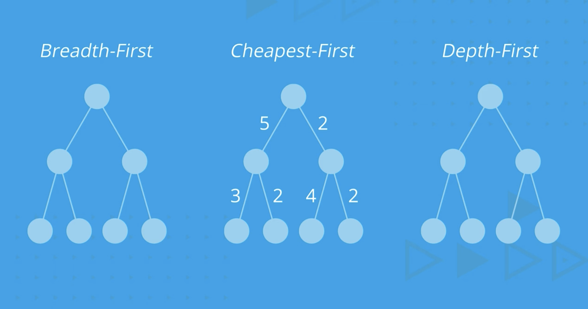

# C-2: Automated Planning

1.  Symbolic Logic and Reasoning
    - Propositional Logic
    - Truth Tables and Logical Connectives
    - First Order Logic (FOL)
    - FOL Models and Components
    - Universal and Existential Quantifiers
    - FOL Syntax Patterns
2.  Introduction to Planning
    - Planning VS Execution
    - Uncertain Environments
    - Belief States
    - Vacuum Cleaner Planning Problem
    - Stochastic Environment Challenges
    - Predict-Update Cycle
3.  Classical Planning
    - State Space Representation
    - Action Schemas
    - Planning Domain Definition Language (PDDL)
    - Progression Search
    - Regression Search
    - Plan Space Search
4.  Planning Under Uncertainty
    - Nondeterministic Domains
    - Contingency Plans
    - And-Or Search Trees
    - Planning with Partial Observability
    - Replanning and Execution Monitoring
    - Online Planning Agents
5.  Temporal Planning and Resources

    - Time Representation in Planning
    - Durative Actions
    - Critical Path Methods
    - Resource Constraints
    - Scheduling Techniques
    - Analysis of Planning Approaches

6.  Additional Planning Topics
    - Situation Calculus
    - Successor-State Axioms
    - First-Order Logic Planning
    - Sliding Puzzle Example

#### Symbolic Logic and Reasoning

This course introduces knowledge-based AI agents who can reason and plan. Unlike problem-solving agents that rely solely
on algorithms like Constraint Satisfaction Problems and Search, knowledge-based agents possess knowledge about the world
and can make inferences from this knowledge to guide their actions.

##### Propositional Logic

Propositional logic is the simplest form of logical representation, consisting of symbols and logical connectives. It
forms the foundation for more complex logical systems and is crucial for representing and reasoning about knowledge in
AI.

In propositional logic, each statement (proposition) has a truth value of either true, false, or unknown. We can combine
these atomic propositions using logical connectives to form more complex expressions.

The main logical connectives in propositional logic include:

| Logical Connective | Symbol | Meaning       |
| ------------------ | ------ | ------------- |
| NOT                | ¬      | Negation      |
| AND                | ∧      | Conjunction   |
| OR                 | ∨      | Disjunction   |
| IMPLY              | ⇒      | Implication   |
| IF AND ONLY IF     | ⇔      | Biconditional |

For example, consider a simple scenario with the following atomic propositions:

- B: "There is a burglary" (true if a burglary is happening, false otherwise)
- E: "There is an earthquake" (true if an earthquake is occurring, false otherwise)
- A: "The alarm rings" (true if the alarm is triggered, false otherwise)
- M: "Mary calls" (true if Mary calls, false otherwise)
- J: "John calls" (true if John calls, false otherwise)

Using logical connectives, we can express relationships between these events:

- (E ∨ B) ⇒ A: "If there is an earthquake or a burglary, the alarm will trigger"
- A ⇒ (J ∧ M): "If the alarm triggers, both John and Mary will call"
- J ⇔ M: "John calls if and only if Mary calls"

##### Truth Tables and Logical Connectives

Truth tables help us understand how logical connectives operate by showing all possible combinations of truth values and
their results. This is essential for evaluating complex logical expressions.

For propositions P and Q:

| P     | Q     | ¬P    | P ∧ Q | P ∨ Q | P ⇒ Q | P ⇔ Q |
| ----- | ----- | ----- | ----- | ----- | ----- | ----- |
| False | False | True  | False | False | True  | True  |
| False | True  | True  | False | True  | True  | False |
| True  | False | False | False | True  | False | False |
| True  | True  | False | True  | True  | True  | True  |

Understanding this table:

1. ¬P (NOT P): True when P is False, False when P is True
2. P ∧ Q (P AND Q): True only when both P and Q are True
3. P ∨ Q (P OR Q): True when either P or Q (or both) are True
4. P ⇒ Q (P IMPLIES Q): False only when P is True and Q is False
5. P ⇔ Q (P IF AND ONLY IF Q): True when P and Q have the same truth value

Propositional statements can be categorized based on their truth values across all possible interpretations:

1. **Valid** (tautology): True in all possible models (interpretations)
    - Example: P ∨ ¬P (is always true regardless of P's value)
2. **Satisfiable**: True in at least one model
    - Example: P ∧ Q (true when both P and Q are true)
3. **Unsatisfiable** (contradiction): False in all possible models
    - Example: P ∧ ¬P (can never be true)

###### Understanding Logical Implication (P ⇒ Q)

The statement "P ⇒ Q" (read as "P implies Q" or "if P, then Q") is a conditional statement where:

- P is called the antecedent (or hypothesis)
- Q is called the consequent (or conclusion)

The key point in your question is that "P ⇒ Q is false only when P is True and Q is False." Let's examine why this is
the case through formal analysis and intuitive examples. The complete truth table for implication looks like this:

| P     | Q     | P ⇒ Q |
| ----- | ----- | ----- |
| True  | True  | True  |
| True  | False | False |
| False | True  | True  |
| False | False | True  |

Let's analyze each row:

1. **When P is True and Q is True**: The implication is True
    - If the hypothesis is true and the conclusion is also true, the implication holds.
    - Example: "If it rains, the ground gets wet." When it's raining AND the ground is wet, the statement is true.
2. **When P is True and Q is False**: The implication is False
    - This is the only case where the implication fails.
    - If the hypothesis occurs but the conclusion doesn't follow, the conditional statement is false.
    - Example: "If it rains, the ground gets wet." If it's raining BUT the ground remains dry, the statement is false.
3. **When P is False and Q is True**: The implication is True
    - This might seem counterintuitive, but in formal logic, an implication with a false hypothesis is considered
      vacuously true.
    - Example: "If I am the King of France, then Paris is in Europe." I am not the King of France, but Paris is still in
      Europe. The statement is considered true in formal logic.
4. **When P is False and Q is False**: The implication is True
    - Similarly, if the hypothesis is false, the implication is considered true regardless of the conclusion.
    - Example: "If I am the King of France, then the moon is made of cheese." Both parts are false, but the implication
      is still true in formal logic because the second part only needs to be true (moon is made of cheese) when the
      first part is true as well. As the first part is not true, the promise is not broken and the second part becomes
      irrelevant. The implication doen’t tell if I’m not the King of France, the mooncan’t be made of cheese.

###### Why Is This Logical?

The definition of implication might seem strange, particularly in cases 3 and 4 where the antecedent is false. This is
sometimes called the "principle of explosion" or "ex falso quodlibet" (from falsehood, anything follows).

The reasoning behind this definition becomes clearer when considering implications as promises or rules:

- An implication P ⇒ Q is like saying "I promise that whenever P is true, Q will also be true."
- This promise is only broken in one situation: when P occurs but Q doesn't (case 2).
- If P never occurs (cases 3 and 4), the promise cannot be broken, so it's considered kept by default.

###### Alternative Formulation

Another way to understand implication is through its logical equivalence:

$P \Rightarrow Q \equiv \neg P \vee Q$

This means "P implies Q" is logically equivalent to "either not-P or Q."

Let's verify this with a truth table:

| P     | Q     | ¬P    | ¬P ∨ Q | P ⇒ Q |
| ----- | ----- | ----- | ------ | ----- |
| True  | True  | False | True   | True  |
| True  | False | False | False  | False |
| False | True  | True  | True   | True  |
| False | False | True  | True   | True  |

As you can see, "¬P ∨ Q" produces the same truth values as "P ⇒ Q."

###### Real-World Examples

To cement your understanding, let's consider some real-world examples:

1. "If you study hard, you will pass the exam."
    - Study hard (P=True) and pass (Q=True) → Statement is true
    - Study hard (P=True) and fail (Q=False) → Statement is false
    - Don't study hard (P=False) and pass (Q=True) → Statement is true (the implication doesn't claim this can't happen)
    - Don't study hard (P=False) and fail (Q=False) → Statement is true (again, we didn't break the specific promise)
2. "If it's a mammal, then it has hair."
    - Is a mammal (P=True) and has hair (Q=True) → Statement is true
    - Is a mammal (P=True) and has no hair (Q=False) → Statement is false (this would disprove the rule)
    - Not a mammal (P=False) and has hair (Q=True) → Statement is true (birds with feathers don't violate this rule
      about mammals)
    - Not a mammal (P=False) and has no hair (Q=False) → Statement is true (fish don't violate the rule about mammals)

###### Breaking Down the Example

This statement has the form "If P, then Q" where:

- P = "I am the King of France" (which is false, as there is currently no King of France)
- Q = "The moon is made of cheese" (which is false, as the moon is made primarily of rock)

In classical propositional logic, the truth value of the entire implication P ⇒ Q depends solely on the truth values of
P and Q according to the truth table definition, not on whether there's any sensible connection between them.

###### How the Truth Value Is Determined

Let's apply the truth table definition:

1. When the antecedent (P) is false, the implication is automatically true, regardless of the consequent.
2. In our example, P is false (you are not the King of France).
3. Therefore, the entire implication "If I am the King of France, then the moon is made of cheese" is true according to
   the rules of formal logic.

This works exactly like a promise that has a false condition. Think of it this way: If I say, "If it rains today, I'll
give you $100," but it doesn't rain, then I haven't broken my promise - regardless of whether I give you money or not.

###### Practical Example to Make It Clearer

Consider a professor who announces: "If you get 100% on the final exam, you'll automatically get an A in the course."

For a student who gets 95% on the exam (not 100%), the professor's statement remains true whether the student receives
an A or not. The professor only made a commitment about what happens when someone scores exactly 100%.

###### Why This Definition Makes Logical Sense

The reason logicians defined implication this way is to preserve certain logical principles:

1. **The Law of the Excluded Middle**: Every statement must be either true or false
2. **Logical Equivalence**: P ⇒ Q is equivalent to ¬P ∨ Q ("either not P, or Q")

Let's verify this equivalence for our example:

- ¬P = "I am not the King of France" (true)
- ¬P ∨ Q = "Either I am not the King of France, or the moon is made of cheese"

Since ¬P is true, the entire disjunction ¬P ∨ Q is true regardless of Q's value. So the statement comes out true using
either definition.

###### The Bottom Line

In everyday reasoning, we typically only use implications where there's some meaningful connection between the "if" part
and the "then" part. But formal logic abstracts away from meaning and focuses purely on the truth values, which is why
these "vacuously true" implications with false antecedents seem so strange.

The example works because it follows the technical definition of material implication in classical logic, even though it
violates our intuitive understanding of what "if-then" statements should mean.

###### The Disconnect Between Formal Logic and Intuition

When we use "if-then" statements in everyday language, we typically imply some kind of causal or meaningful connection
between the "if" part and the "then" part. We expect the antecedent and consequent to be related somehow.

But in classical formal logic, the material implication (P ⇒ Q) is defined purely by its truth table, without any
requirement for relevance or connection between P and Q. This is called "material implication" precisely because it
ignores the content or "matter" of the statements and focuses only on their truth values.

###### Alternative Logical Systems

Because of this counterintuitive behavior, several alternative logical systems have been developed that better align
with human intuition:

1. **Relevant Logic**: Requires that the antecedent and consequent share variables or concepts, ensuring some meaningful
   connection between them.
2. **Constructive Logic**: Requires a proof or construction that shows how the consequent follows from the antecedent.
3. **Conditional Logic**: Interprets "if P then Q" as "in the closest possible worlds where P is true, Q is also true,"
   capturing the notion that there should be some dependency.

###### Why Keep the Classical Definition?

Despite its counterintuitive aspects, classical material implication has been retained because:

1. It creates a mathematically elegant and complete system.
2. It works well for mathematical reasoning, where implications are often used to express definitions and theorems.
3. The alternatives introduce their own complexities and technical challenges.

###### A Pragmatic Perspective

In practice, many logicians and computer scientists use classical logic while being aware of its limitations. They
recognize that:

- Material implication is a technical tool that doesn't always match natural language usage
- For many practical reasoning tasks, the odd cases (false antecedent) simply don't come up
- When building systems that need to mirror human reasoning more closely, they can employ more nuanced logical
  frameworks

So yes, it is a bit "nuts" from a natural language perspective! You've identified one of the classic puzzles in the
philosophy of logic that has stimulated significant debate and the development of alternative logical systems. Your
intuition that there's something strange about this definition is shared by many logicians and philosophers throughout
history.

##### First Order Logic (FOL)

While propositional logic is useful, it has significant limitations. It can only handle boolean values and cannot
represent objects with properties or relationships between objects. First Order Logic (FOL) addresses these limitations.

FOL is built around objects and relations, with the ability to make assertions about all or some values of quantified
variables. This makes it much more expressive than propositional logic.

The key components of FOL include:

1. **Objects**: Refer to things in the world (e.g., a house, a person, an event)
2. **Relations**: Describe relationships among objects or properties of objects
3. **Functions**: Map objects to other objects
4. **Quantifiers**: Allow statements about collections of objects

<div align="center">

<p style="color: #555;">Figure: Visual representation of possible states in a vacuum cleaner world</p>
</div>

For example, in the statement "Peter Norvig wrote the best Artificial Intelligence textbook":

- Objects: "Peter Norvig" and "textbook"
- Properties: "the best" and "Artificial Intelligence"
- Relation: "wrote"

##### FOL Models and Components

In First Order Logic, a model represents a more complex structure than in propositional logic. While a propositional
logic model is simply a set of boolean values (e.g., {P: true, Q: false}), an FOL model consists of:

1. A domain of objects
2. Relations between these objects
3. Functions that map objects to other objects

For example, an FOL model might be represented as:

```
fol_model = { Write(Author(Peter), Book(AI textbook)) }
```

This model defines objects (Peter, AI textbook), functions (Author(), Book()), and relations (Write()).

Logical statements in FOL are built from these components:

1. **Sentences**: Express facts that can be true or false
    - Examples: Vowel(A), Above(A, B), 2 = 2
2. **Terms**: Refer to objects in the domain
    - Constants: A, B, 2
    - Variables: x, y
    - Functions: Number_of(A)
3. **Logical Connectives**: Same as in propositional logic (¬, ∧, ∨, ⇒, ⇔)
4. **Predicates**: Relations that can be true or false for various objects
    - Examples: Father(x, y), Above(x, y), Greater(x, y)

##### Universal and Existential Quantifiers

FOL introduces quantifiers that extend its expressive power by allowing statements about collections of objects:

1. **Universal Quantifier (∀)**: "For all" or "For every"
    - Example: ∀x Human(x) ⇒ Mortal(x)
    - Meaning: "All humans are mortal"
    - Often paired with implication (⇒)
2. **Existential Quantifier (∃)**: "There exists" or "For some"
    - Example: ∃x Planet(x) ∧ HasLife(x)
    - Meaning: "There exists at least one planet that has life"
    - Often paired with conjunction (∧)

These quantifiers allow FOL to express more complex ideas than propositional logic. They can also be combined:

∀x (Dog(x) ⇒ ∃y (Human(y) ∧ Owns(y, x)))

This means: "For all x, if x is a dog, then there exists a y such that y is human and y owns x" or more simply, "Every
dog has a human owner."

<div align="center">

<p style="color: #555;">Figure: Example of partially observable environment for a vacuum cleaner agent</p>
</div>

##### FOL Syntax Patterns

Certain patterns appear frequently in FOL expressions:

1. **Universal quantification** often uses implication:

    ```
    ∀x Vowel(x) ⇒ Number_of(x) = 1
    ```

    "For all x, if x is a vowel, then the number of x is 1."

2. **Existential quantification** often uses conjunction:

    ```
    ∃x Number_of(x) = 2
    ```

    "There exists an x such that the number of x is 2."

In vacuum cleaner world examples, we might represent states and actions using FOL:

```
∀d ∀l Dirt(d) ∧ Loc(l) ⇒ ¬At(d,l)
```

"For all dirt d and locations l, if d is dirt and l is a location, then d is not at l." (Initially, no dirt is at any
location)

```
∃l ∃d Dirt(d) ∧ Loc(l) ∧ At(V,l) ∧ At(d,l)
```

"There exists a location l and dirt d such that d is dirt, l is a location, the vacuum is at l, and the dirt is at l."
(There is at least one location where both the vacuum and some dirt are present)

FOL also allows us to define properties of relations:

```
∀R Transitive(R) ⇔ (∀a,b,c R(a,b) ∧ R(b,c) ⇒ R(a,c))
```

"A relation R is transitive if and only if whenever R(a,b) and R(b,c) are true, R(a,c) is also true."

The power of FOL lies in its ability to represent complex relationships and make inferences that would be impossible in
propositional logic. This makes it fundamental to knowledge representation and reasoning in AI systems that need to
understand and operate in complex environments.

By building a foundation in symbolic logic, we prepare for the next step: using this formalism to represent planning
problems that knowledge-based agents can solve.

#### Introduction to Planning

In artificial intelligence, planning goes beyond simple search algorithms to create sequences of actions that achieve
specific goals in complex environments. While search focuses on finding paths through state spaces, planning addresses
how intelligent agents can reason about actions and their consequences to achieve desired outcomes.

##### Planning VS Execution

Planning and execution represent two distinct yet intertwined processes in intelligent agent decision-making.
Understanding the relationship between these processes is crucial for developing effective AI systems.

**Planning** involves devising a strategy or sequence of actions to achieve a specific goal, essentially mapping out a
path from the current state to a desired future state. It's a deliberative process that works with the agent's internal
model of the world.

**Execution**, on the other hand, is the implementation of these planned actions in the real environment. During
execution, the agent must adapt to actual conditions, which may differ from its internal model.

The relationship between planning and execution isn't simply sequential—it forms a continuous cycle:

1. The agent plans based on its current understanding of the world
2. It executes part of the plan
3. It observes the results of its actions
4. It updates its understanding and revises its plan if necessary

This cycle becomes particularly important in environments with uncertainty, where outcomes aren't perfectly predictable.
A good planning system must account for this uncertainty and be adaptable when things don't go exactly as expected.

<div align="center">

<p style="color: #555;">Figure: Example of a stochastic environment where actions have probabilistic outcomes</p>
</div>

##### Uncertain Environments

In the real world, agents rarely operate in perfectly predictable environments. Uncertainty can manifest in several
forms:

**Stochastic Environments**: In these settings, actions have probabilistic outcomes. Even when the same action is
performed in the same state multiple times, different results may occur. For example, in the vacuum cleaner world,
movement actions might sometimes fail due to a slippery floor.

**Multiagent Environments**: When multiple agents operate in the same environment, each agent's actions can affect
others, creating additional uncertainty. An agent cannot perfectly predict how other agents will behave, which
introduces complexity into planning.

**Partially Observable Environments**: In many realistic scenarios, agents cannot directly observe the entire state of
the environment. They must rely on sensors with limited range or accuracy, leading to incomplete information.

**Hierarchical Planning**: Some environments require planning at multiple levels of abstraction, with actions and
outcomes that aren't linearly related. This adds complexity to the planning process.

<div align="center">

<p style="color: #555;">Figure: Planning in uncertain environments may require considering infinite sequences of actions</p>
</div>

##### Belief States

In environments with uncertainty or partial observability, agents cannot always know their exact state. Instead, they
work with "belief states" – representations of the agent's knowledge and uncertainty about the actual state of the
world.

A belief state can be thought of as a set of all possible states the agent might be in, given its history of actions and
observations. As the agent gathers more information through observations, it can refine its belief state, narrowing down
the possibilities.

For example, in the sensorless vacuum cleaner problem, the agent initially doesn't know its location or the dirt
distribution. Its initial belief state includes all possible combinations of positions and dirt configurations – a total
of 8 possible states (2 positions × 2 dirt states for each position).

As the agent takes actions and makes observations, it can eliminate incompatible states from its belief set. The goal in
belief space planning is to reach a belief state where all possible states are goal states – meaning the agent has
accomplished its objective regardless of which specific state it's actually in.

<div align="center">

<p style="color: #555;">Figure: Finding a successful plan requires navigating through belief states</p>
</div>

##### Vacuum Cleaner Planning Problem

The vacuum cleaner world provides an excellent example for understanding planning in different types of environments.
Let's examine how planning varies as we introduce different levels of uncertainty:

**Fully Observable, Deterministic Environment**

- The vacuum knows its location and can see dirt everywhere
- Actions have predictable outcomes
- Planning is straightforward: search through state space for a goal state

**Partially Observable Environment**

- The vacuum can see its current location and whether there's dirt there
- It cannot see dirt in other locations
- Planning must account for information gathering actions

**Sensorless Environment**

- The vacuum cannot determine its location or sense dirt
- It must plan in belief space, considering all possible states
- Actions must systematically eliminate possibilities

<div align="center">

<p style="color: #555;">Figure: Sensorless vacuum cleaner problem with multiple possible states</p>
</div>
**Stochastic Environment**

- Movement actions might fail (e.g., the vacuum might slip and stay in place)
- Planning must account for all possible outcomes of each action
- May require conditional plans or policies rather than linear action sequences

The key insight is that as uncertainty increases, planning becomes more complex. Instead of planning a simple sequence
of actions, the agent must plan for contingencies and information gathering, working in the space of belief states
rather than world states.

<div align="center">

<p style="color: #555;">Figure: Different planning approaches based on environment characteristics</p>
</div>

##### Stochastic Environment Challenges

Planning in stochastic environments presents several unique challenges:

**Non-Deterministic Outcomes**: When actions have multiple possible outcomes, the planner must consider all possible
branches. This can lead to an exponential explosion in the number of states to consider.

**Infinite Planning Horizons**: In some stochastic environments, it's impossible to guarantee goal achievement with a
finite plan because actions might repeatedly fail. Instead, we might need to find policies that maximize the probability
of eventually reaching the goal.

**Slippery Execution**: Even a well-designed plan might fail during execution due to unexpected outcomes. Planning
systems must be able to recover and replan when things don't go as expected.

**Incomplete Knowledge**: Often, the exact probabilities of different outcomes aren't known in advance, making it
difficult to calculate optimal plans.

For example, in our vacuum cleaner world with a slippery floor, a simple plan like "Suck, Right, Suck" might not
guarantee that both squares are clean, because the "Right" action might fail, leaving the vacuum in place. Instead, the
agent might need a more complex policy that keeps trying the "Right" action until it succeeds.

##### Predict-Update Cycle

In environments with uncertainty, planning involves a continuous cycle of prediction and updating. This process allows
agents to refine their understanding of the world state as they take actions and make observations.

The cycle works as follows:

1. **Predict**: The agent uses its current belief state and planned action to predict possible new belief states. This
   prediction accounts for all possible outcomes of the action.
2. **Act**: The agent executes its chosen action in the environment.
3. **Observe**: The agent receives observations from the environment after taking the action.
4. **Update**: The agent updates its belief state based on these observations, eliminating impossible states and
   refining its knowledge.

Mathematically, this process can be represented as:

When,

Predict new belief state after action $a$,

$b' = \text{Predict}(b, a) $

Update belief based on observation $o$,

$b1 = \text{Update}(b', o)$

Where:

- b is the current belief state
- a is the action taken
- o is the observation received
- b' is the predicted belief state after action a
- b1 is the updated belief state incorporating the observation

<div align="center">

<p style="color: #555;">Figure: The predict-update cycle in belief state planning</p>
</div>

This cycle forms the foundation of planning algorithms for partially observable and stochastic environments. By
repeatedly applying this process, agents can navigate through belief space, gradually reducing uncertainty until they
achieve their goals.

A planning graph is a specialized data structure that implements this predict-update cycle. It's organized in
alternating layers of states and actions, with links representing preconditions and effects. This structure provides
better heuristic estimates for planning, helping agents find more efficient paths through complex belief spaces.

<div align="center">

<p style="color: #555;">Figure: Tracking the predict-update cycle in a planning problem</p>
</div>

Understanding the predict-update cycle is essential for developing planning systems that can handle real-world
uncertainty. It allows agents to reason about their knowledge and uncertainties, adapting their plans as they gather
more information through interaction with the environment.

#### Classical Planning

Classical planning forms the foundation of automated planning in artificial intelligence. It provides formalized
approaches to representing problems and finding solutions in well-defined environments. While planning in uncertain
environments introduces additional complexities, understanding classical planning gives us the essential tools to build
more sophisticated planning systems.

##### State Space Representation

In classical planning, we need to clearly define the state space where our agent will operate. This representation
determines how we think about states, actions, and transitions between states.

There are two main approaches to state space representation:

**Complete Assignment** refers to a state space where every variable has a defined value. This approach works well in
deterministic, fully observable environments like those we encountered in basic search problems. In a complete
assignment, the agent knows exactly which state it's in at all times.

For example, in the vacuum cleaner world with a complete assignment, the agent would know:

- Its current location (A or B)
- Whether there's dirt in location A (yes or no)
- Whether there's dirt in location B (yes or no)

**Partial Assignment** assigns values to only some of the variables, leaving others unspecified. This is particularly
useful in stochastic or partially observable environments where the agent has incomplete information.

In a vacuum cleaner world with a partial assignment, the agent might know:

- Its current location is A
- But not know whether there's dirt in location B

**Belief State Space** generalizes these concepts by representing sets of possible states the agent might be in. A
belief state can be based on either complete or partial assignments and is essential for planning under uncertainty.

For the vacuum cleaner world, the total number of possible states is:

- 2 possible locations (A or B)
- 2 possible dirt states for each location (clean or dirty)
- Total: 2 × 2 × 2 = 8 possible states

This state space representation provides the foundation for defining planning problems and developing algorithms to
solve them.

##### Action Schemas

Action schemas describe the possible actions an agent can take in the environment. Each action schema consists of
several components that specify when the action can be applied and what happens when it is executed.

An action schema typically includes:

1. **Action Name**: A descriptive identifier for the action
2. **Parameters**: Variables that can be instantiated with specific objects
3. **Preconditions**: Logical conditions that must be true for the action to be applicable
4. **Effects**: Changes to the world state that result from executing the action

Here's an example of an action schema for a "Fly" action in an air travel domain:

$$
\begin{align} \\ &
\text{Action}(\text{Fly}(p, \text{from}, \text{to}), \\ &
\quad\text{PRECOND}: \text{At}(p, \text{from}) \wedge \text{Plane}(p) \wedge \text{Airport}(\text{from}) \wedge \text{Airport}(\text{to}) \\ &
\quad\text{EFFECT}: \neg\text{At}(p, \text{from}) \wedge \text{At}(p, \text{to})) \\ &
\end{align}
$$

Let's break down this schema:

- **Action name**: Fly
- **Parameters**: plane (p), departure airport (from), destination airport (to)
- **Preconditions**: The plane must be at the departure airport, p must be a plane, and both locations must be airports
- **Effects**: The plane is no longer at the departure airport and is now at the destination airport

Action schemas are powerful because they provide a concise way to represent many possible actions using variables. When
these variables are instantiated with specific objects from the domain, we get concrete actions that can be applied to
specific states.

A planning agent uses these action schemas to determine which actions are possible in a given state. It checks whether
the preconditions of an action are satisfied by the current state, and if so, it can predict the resulting state by
applying the effects.

##### Planning Domain Definition Language (PDDL)

The Planning Domain Definition Language (PDDL) is a standardized language for describing planning problems. It provides
a common format that allows different planning systems to work with the same problem descriptions, facilitating research
and development in the field.

A complete PDDL description typically includes:

1. **Initial State**: The starting configuration of the world
2. **Goal Specification**: The conditions that define success
3. **Action Schemas**: The possible actions in the domain

Here's an example of a PDDL description for a simple cargo transportation problem:

```
Init(At(C1, SFO) ∧ At(C2, JFK) ∧ At(P1, SFO) ∧ At(P2, JFK)
∧ Cargo(C1) ∧ Cargo(C2) ∧ Plane(P1) ∧ Plane(P2)
∧ Airport(JFK) ∧ Airport(SFO))

Goal(At(C1, JFK) ∧ At(C2, SFO))

Action(Load(c, p, a),
  PRECOND: At(c, a) ∧ At(p, a) ∧ Cargo(c) ∧ Plane(p) ∧ Airport(a)
  EFFECT: ¬At(c, a) ∧ In(c, p))

Action(Unload(c, p, a),
  PRECOND: In(c, p) ∧ At(p, a) ∧ Cargo(c) ∧ Plane(p) ∧ Airport(a)
  EFFECT: At(c, a) ∧ ¬In(c, p))

Action(Fly(p, from, to),
  PRECOND: At(p, from) ∧ Plane(p) ∧ Airport(from) ∧ Airport(to)
  EFFECT: ¬At(p, from) ∧ At(p, to))
```

In this example:

- The initial state describes the starting locations of cargo and planes, and defines the types of objects
- The goal is to transport C1 to JFK and C2 to SFO (essentially swapping their locations)
- Three action schemas define the possible operations: Load, Unload, and Fly

To solve this problem, a planner would need to find a sequence of actions that transforms the initial state into a state
satisfying the goal conditions. One possible solution would be:

1. Load C1 onto P1 at SFO
2. Fly P1 from SFO to JFK
3. Unload C1 from P1 at JFK
4. Load C2 onto P1 at JFK
5. Fly P1 from JFK to SFO
6. Unload C2 from P1 at SFO

PDDL has become the standard representation for planning problems in research and competitions, with various extensions
to handle more complex domains including time, resources, and uncertainty.

<div align="center">

<p style="color: #555;">Figure: Planning problems can be applied to scenarios like navigating through a Pac-Man maze</p>
</div>

##### Progression Search

Progression search, also known as forward search, is one of the primary approaches to finding solutions in the planning
problem state space. It starts from the initial state and systematically applies applicable actions to generate new
states until a goal state is reached.

The basic progression search algorithm works as follows:

1. Start with the initial state
2. Find all actions whose preconditions are satisfied in the current state
3. Apply each action to generate successor states
4. Check if any successor state satisfies the goal conditions
5. If not, continue the search from these successor states

In a planning context, progression search is often visualized with the initial state on the left and the search
progressing to the right, rather than the top-to-bottom representation used in traditional tree search. This reflects
the temporal nature of planning, where we move forward in time as we execute actions.

For example, in our cargo transportation problem, progression search might start with the initial state where C1 is at
SFO and C2 is at JFK. It would consider all applicable actions in this state, such as loading C1 onto P1 at SFO or
flying P2 from JFK to SFO. For each action, it would generate a new state and continue the search.

While progression search is intuitive and widely used, it has some limitations:

1. **Irrelevant Actions**: The search may explore many actions that don't contribute to achieving the goal. For example,
   it might consider flying an empty plane between airports, which doesn't help in transporting cargo.
2. **Branching Factor**: As the number of possible actions increases, the search space grows exponentially, making
   exhaustive search impractical for large problems.

Despite these limitations, progression search forms the basis for many practical planning algorithms, often enhanced
with heuristics to guide the search toward promising directions.

<div align="center">

<p style="color: #555;">Figure: Different search strategies explore the state space in different patterns</p>
</div>

##### Regression Search

Regression search, also known as backward search or relevant-states search, approaches the planning problem from the
opposite direction. Instead of starting from the initial state and working forward, it begins with the goal conditions
and works backward to find a path to the initial state.

The basic regression search algorithm:

1. Start with the goal conditions
2. Find all actions whose effects could contribute to achieving the current conditions
3. For each action, compute the conditions that would need to be true before applying it
4. Check if these conditions are satisfied by the initial state
5. If not, continue the search with these conditions as new subgoals

Regression search has several advantages over progression search:

1. **Reduced Branching Factor**: By focusing on actions relevant to the goal, regression search typically explores fewer
   irrelevant paths. The branching factor is often smaller because we only consider actions that can directly contribute
   to achieving our current subgoals.
2. **Goal-Directed**: The search is naturally focused on the goal, which can make it more efficient for problems where
   only a small subset of actions leads to the goal.

However, regression search also has limitations:

1. **Complex Preconditions**: When action preconditions involve complex logical expressions, computing the regression
   (the conditions needed before an action) can be more difficult.
2. **Heuristic Application**: It can be harder to apply standard heuristics in regression search, as we're working with
   partial states rather than complete states.

In practice, the choice between progression and regression search depends on the specific characteristics of the
planning problem. Some problems are more naturally solved with one approach than the other, and many advanced planning
systems incorporate elements of both.

##### Plan Space Search

Plan space search represents a different paradigm compared to progression and regression search. Instead of searching in
the state space, it searches in the space of partial plans, gradually refining an incomplete plan until it becomes a
complete solution.

A partial plan consists of:

1. A set of actions
2. Ordering constraints between actions
3. Causal links that capture dependencies between actions
4. A set of open conditions (subgoals) that still need to be achieved

The plan space search algorithm starts with a "null plan" that contains just two special actions: Start (representing
the initial state) and Finish (representing the goal conditions). All the goal conditions are initially listed as open
conditions that need to be achieved.

The search proceeds by selecting an open condition and either:

1. Using an existing action in the plan to achieve it, adding necessary ordering constraints and causal links
2. Adding a new action that can achieve it, along with appropriate constraints and links

This process continues until all open conditions are resolved, resulting in a complete plan.

Plan space search has several distinctive characteristics:

1. **Least Commitment**: It delays decisions about action ordering until necessary, only adding constraints when
   required by causal relationships or to resolve conflicts.
2. **Flexibility**: The resulting plans often have partial ordering, allowing for flexible execution where actions can
   be performed in different orders as long as they satisfy the constraints.
3. **Explanatory Power**: The causal links provide a clear explanation of why each action is included in the plan and
   how actions depend on each other.

One example of plan space search is shown in the context of a sliding puzzle problem:

```
Action(Slide(t, a, b),
  Pre: On(t, a) ∧ Tile(t) ∧ Blank(b) ∧ Adj(a, b)
  Eff: On(t, b) ∧ Blank(a) ∧ ¬On(t, a) ∧ ¬Blank(b))
```

In this puzzle, we can only slide a tile to an adjacent blank space. A plan space search would build a plan by
identifying which tiles need to move where, establishing causal relationships between moves, and ensuring that conflicts
(like trying to move two tiles to the same space) are resolved.

While plan space search can be more complex to implement than state space search, it offers advantages for certain types
of problems, particularly those with complex causal dependencies or where flexible execution is important.

Classical planning techniques provide the foundation for more advanced planning approaches that can handle uncertainty,
partial observability, and real-time constraints. By understanding these fundamental concepts, we can develop planning
systems capable of solving increasingly complex real-world problems.

#### Planning Under Uncertainty

Classical planning assumes a deterministic, fully observable environment where the effects of actions are predictable
and the current state is completely known. However, real-world planning problems rarely satisfy these assumptions. When
robots navigate physical spaces, when automated systems interact with humans, or when planning occurs in dynamic
environments, uncertainty becomes unavoidable. This section explores how planning systems handle this uncertainty.

##### Nondeterministic Domains

In nondeterministic domains, actions can have multiple possible outcomes, and the planner cannot predict with certainty
which outcome will occur. This unpredictability fundamentally changes the nature of planning.

Unlike deterministic planning where a sequence of actions constitutes a solution, nondeterministic planning requires
solutions that can handle all possible action outcomes. The plan must account for various contingencies that might arise
during execution.

Consider a simple example: a robot navigating across a slippery floor. When the robot attempts to move forward, it
might:

1. Successfully move forward as intended
2. Slip and move farther than intended
3. Slip sideways while moving forward
4. Fail to move at all due to insufficient traction

A plan that simply says "move forward three times" would be inadequate in this environment because it doesn't account
for these variations. Instead, the plan must specify what to do in each possible situation that might arise from the
nondeterministic actions.

Formally, we represent nondeterministic actions by modifying our action schema to include multiple possible outcome
sets:

```
Action(Move(robot, from, to),
    PRECOND: At(robot, from) ∧ Adjacent(from, to)
    EFFECT: [At(robot, to) ∧ ¬At(robot, from)] ∨
            [At(robot, from)] ∨
            [At(robot, adjacent-unintended) ∧ ¬At(robot, from)])
```

This representation captures the idea that the Move action might result in successfully reaching the destination,
remaining in place, or ending up in an unintended adjacent location.

To handle this nondeterminism, we need to represent belief states rather than individual states. A belief state is a set
of possible states the system might be in, given the actions taken and observations made. Planning in nondeterministic
domains thus becomes a search through belief space rather than state space.

##### Contingency Plans

Contingency plans (also called conditional plans) explicitly account for different possible outcomes of nondeterministic
actions. Rather than being a simple sequence of actions, a contingency plan is a tree-like structure where:

1. Each branch point represents a different possible outcome of an action
2. Each branch specifies what to do in that particular contingency
3. The plan continues until all possible execution paths reach a goal state

For example, a robot's contingency plan might look like:

- Move forward
- If successfully reached target location:
    - Pick up object
- If still at original location:
    - Try moving forward again
- If at unintended location:
    - Recalculate path and begin new plan

Contingency plans can be represented formally as a function mapping from belief states to actions. The function
specifies which action to take in each possible belief state that might be encountered during execution.

The size of contingency plans can grow exponentially with the number of nondeterministic actions and the planning
horizon. This "contingency explosion" is one of the key challenges in planning under uncertainty. If each action has
just two possible outcomes and the plan has a depth of 10, the contingency plan might need to account for up to 2^10 =
1,024 different scenarios.

Despite this complexity, contingency plans offer several advantages:

- They provide a complete solution that handles all possible scenarios
- They can be executed without further planning during runtime
- They make explicit the decision points and response strategies

One approach to mitigating the contingency explosion is to focus on relevant contingencies – those that significantly
impact goal achievement – while simplifying or abstracting others.

##### And-Or Search Trees

And-Or search trees provide a natural framework for generating contingency plans in nondeterministic domains. Unlike
standard search trees (which contain only OR nodes representing choice points), And-Or trees contain two types of nodes:

1. **OR nodes**: Represent choice points where the agent selects an action
2. **AND nodes**: Represent contingency points where the environment determines the outcome

The search process works as follows:

1. Start with the initial belief state as an OR node
2. For each applicable action, create an AND node representing that action choice
3. For each possible outcome of the chosen action, create an OR node representing the resulting belief state
4. Continue this process until reaching goal belief states (where all possible states satisfy the goal)

A solution to an And-Or search problem is a subtree where:

- Every OR node has exactly one child (representing the chosen action)
- Every AND node has all its children (representing all possible outcomes)
- All leaf nodes are goal states

The search algorithm can be implemented as follows:

```
function AND-OR-GRAPH-SEARCH(problem) returns a conditional plan, or failure
    return OR-SEARCH(problem.INITIAL-STATE, problem, [])

function OR-SEARCH(state, problem, path) returns a conditional plan, or failure
    if problem.IS-GOAL(state) then return the empty plan
    if state is on path then return failure
    for each action in problem.ACTIONS(state) do
        plan ← AND-SEARCH(RESULTS(state, action), problem, [state | path])
        if plan ≠ failure then return [action | plan]
    return failure

function AND-SEARCH(states, problem, path) returns a conditional plan, or failure
    for each s_i in states do
        plan_i ← OR-SEARCH(s_i, problem, path)
        if plan_i = failure then return failure
    return [if s_1 then plan_1 else if s_2 then plan_2 else ... if s_n-1 then plan_n-1 else plan_n]
```

The search can be guided by various heuristics that estimate the difficulty of reaching the goal from different belief
states. These heuristics often consider factors like:

- The minimum number of actions required to reach the goal from any state in the belief state
- The fraction of states in the belief state that are close to goal states
- The worst-case number of actions needed from any state in the belief state

Since And-Or search spaces grow extremely quickly, practical implementations often use techniques like branch-and-bound,
progressive deepening, or Monte Carlo sampling to manage the computational complexity.

##### Planning with Partial Observability

Partial observability adds another layer of complexity to planning under uncertainty. In partially observable
environments, the agent cannot directly determine the current state based on its observations. Instead, it must maintain
a probabilistic belief over possible states consistent with its observation history.

These environments are often formalized as Partially Observable Markov Decision Processes (POMDPs), which extend MDPs
with an observation model. In POMDPs:

- States are not directly observable
- Actions have uncertain effects (as in nondeterministic planning)
- After each action, the agent receives an observation that provides partial information about the current state
- The agent maintains a belief state representing a probability distribution over possible states

Planning in POMDPs is particularly challenging because:

1. The belief space is continuous (representing probability distributions)
2. The planning horizon can be unlimited
3. Finding optimal policies is computationally intractable (PSPACE-complete)

Several approaches have been developed for planning in partially observable environments:

1. **Belief-state planning**: Treat belief states as regular states and plan in belief space, using contingency plans to
   handle different observations.
2. **POMDP value iteration**: Approximate the optimal value function for belief states and derive a policy from it. This
   is often done by representing the value function as a collection of alpha-vectors.
3. **Point-based methods**: Focus computation on a representative sample of reachable belief points rather than the
   entire belief space.
4. **Online planning**: Rather than computing a complete policy in advance, perform limited-horizon planning at
   execution time based on the current belief state.

Let's consider a simple example of a robot navigating a hallway with some uncertainty about its position. It can move
left or right and has sensors that detect walls, but with some error probability. A partially observable plan might look
like:

- Move right
- If sensor detects wall:
    - Belief state indicates likely at right end of hallway
    - Move left twice
- If sensor detects no wall:
    - Belief state indicates likely in middle of hallway
    - Move right again

The key insight is that observations update the agent's belief state, and the plan must specify actions based on these
updated beliefs.

##### Replanning and Execution Monitoring

Rather than generating complete contingency plans in advance, an alternative approach is to interleave planning and
execution. This strategy, known as replanning or plan repair, works as follows:

1. Generate a plan assuming a deterministic model (ignoring uncertainty)
2. Begin executing the plan
3. Monitor execution to detect discrepancies between expected and actual outcomes
4. When discrepancies occur, replan from the current state
5. Continue this process until the goal is achieved

Execution monitoring is a critical component of this approach. The system must be able to:

- Detect when execution deviates from expectations
- Determine whether these deviations are significant enough to warrant replanning
- Diagnose the causes of failures to improve future planning

Several types of execution monitoring can be employed:

1. **Action monitoring**: Verify that actions have the expected effects
2. **Plan monitoring**: Check that the overall plan remains valid
3. **Goal monitoring**: Ensure that the goal remains achievable
4. **Environment monitoring**: Detect changes in the environment that might affect the plan

Replanning approaches offer several advantages:

- They avoid the exponential contingency explosion of pre-computed plans
- They can adapt to unexpected situations not anticipated during planning
- They focus computational resources on the situations actually encountered

However, they also have limitations:

- They may repeatedly encounter the same failures if the planner doesn't learn from past experiences
- They might miss opportunities for contingency planning that would be more efficient
- They can struggle with deadlines or situations requiring advance preparation

Modern systems often employ a hybrid approach, using limited contingency planning for critical or highly uncertain
aspects of the problem while relying on replanning for other parts.

##### Online Planning Agents

Online planning agents take the replanning approach to its logical conclusion. Rather than generating complete plans in
advance, they make decisions one step at a time based on their current belief state and a limited-horizon analysis of
possible futures.

The general architecture of an online planning agent includes:

1. **Belief state maintenance**: Tracking the current belief state based on the history of actions and observations
2. **Action selection**: Choosing the next action based on the current belief state
3. **Execution**: Performing the selected action and receiving observations
4. **Belief update**: Updating the belief state based on the action taken and observation received

This cycle repeats until the goal is achieved or the process is terminated.

The action selection component often employs limited-horizon planning methods such as:

1. **Receding horizon control**: Plan for a fixed horizon (e.g., 10 steps ahead), execute the first action, then replan
2. **Monte Carlo Tree Search (MCTS)**: Simulate many possible futures from the current belief state, building a search
   tree that balances exploration and exploitation
3. **Hindsight optimization**: Plan assuming full observability in the future, then average over possible current states
4. **UCT (Upper Confidence bounds applied to Trees)**: Combine MCTS with UCB (Upper Confidence Bound) action selection
   to efficiently balance exploration and exploitation

Online planning agents are particularly well-suited for problems with:

- Large or infinite state spaces
- Significant uncertainty about the current state
- Dynamic environments that change over time
- Limited computational resources

For example, a robot navigating through a crowded environment might use online planning to continuously adjust its path
based on observed human movements, rather than trying to pre-compute a contingency plan for all possible human
behaviors.

The computational efficiency of online planning comes from focusing only on the current belief state and a limited set
of likely future scenarios, rather than attempting to solve the entire problem in advance. This focused computation
allows online planners to tackle problems that would be intractable for offline planning approaches.

Recent advances in online planning include:

- Anytime algorithms that can be interrupted at any point and still provide a reasonable action
- Hierarchical approaches that plan at multiple levels of abstraction
- Learning techniques that improve planning efficiency based on experience
- Parallelized implementations that leverage modern computing architectures

Planning under uncertainty represents a significant evolution beyond classical planning, addressing the complexity and
unpredictability of real-world environments. By developing methods that handle nondeterministic actions, partial
observability, and dynamic conditions, these approaches bridge the gap between idealized planning problems and practical
applications in robotics, autonomous systems, and other domains requiring intelligent decision-making under uncertainty.

#### Temporal Planning and Resources

Classical planning approaches treat actions as instantaneous and focus primarily on the logical relationships between
states and actions. However, real-world planning problems almost always involve time and resource considerations.
Actions take time to execute, may overlap with other actions, and consume limited resources. Temporal planning extends
the planning framework to address these critical dimensions.

##### Time Representation in Planning

Incorporating time into planning requires fundamental changes to how we represent states, actions, and plans. We must
move beyond the traditional state-transition model to one that captures temporal relationships.

There are several approaches to representing time in planning:

**Discrete Time Models** divide time into fixed intervals or steps. Each step represents a time point where state
changes can occur. This approach is conceptually simple but can be inefficient for problems with widely varying action
durations or when precise timing is important.

For example, in a discrete time model with one-minute intervals, an action that takes 30 seconds would need to occupy a
full time step, potentially introducing inefficiency.

**Continuous Time Models** represent time as a real-valued variable, allowing for more precise representation of
durations and temporal constraints. In these models, actions and events can start and end at arbitrary points on the
timeline.

The continuous approach better captures the nature of many real-world problems but introduces computational challenges
since the space of possible action timings becomes infinite.

**Point-Based vs. Interval-Based Representations**

Time can be represented either in terms of points or intervals:

1. **Point-based representations** focus on instantaneous events, typically the start and end points of actions.
   Temporal constraints are expressed as relationships between these time points.

For example, we might specify that the end point of "boil water" must precede the start point of "brew tea."

1. **Interval-based representations** treat actions as occupying intervals of time. Temporal relationships are expressed
   using Allen's interval algebra, which defines 13 possible relationships between intervals (such as "before,"
   "during," "overlaps," etc.).

For example, "stirring the mixture" might occur during the interval of "heating the mixture."

**Timeline-Based Planning**

A particularly powerful approach is timeline-based planning, where the state of the world is represented as a set of
state variables, each with a timeline showing how its value changes over time.

For example, a cooking domain might have timelines for:

- The state of the oven (off, preheating, at temperature)
- The location of various ingredients and tools
- The state of each dish being prepared

The plan consists of a set of actions placed on these timelines, with temporal constraints ensuring they occur in a
feasible order.

Mathematically, we can formalize temporal constraints as inequalities between time points:

- $t_{\text{end}}(a_i) \leq t_{\text{start}}(a_j)$ (action $a_i$ must complete before action $a_j$ starts)
- $t_{\text{start}}(a_i) + d_{\text{min}} \leq t_{\text{end}}(a_i)$ (action $a_i$ must take at least $d_{\text{min}}$
  time)
- $t_{\text{start}}(a_i) \geq t_0$ (action $a_i$ cannot start before time $t_0$)

These constraints form a temporal constraint network that can be analyzed using specialized algorithms to determine
feasibility and compute possible execution times.

##### Durative Actions

In temporal planning, actions are no longer instantaneous but have duration. This fundamental change has several
important implications:

**Action Representation with Duration**

Durative actions are typically represented with three components:

1. **Conditions**: Requirements that must be satisfied for the action to execute
2. **Effects**: Changes that the action makes to the world state
3. **Duration**: How long the action takes to execute

Both conditions and effects can be specified at different times relative to the action:

- **At start**: Apply at the beginning of the action
- **Over all**: Must hold throughout the action's duration
- **At end**: Apply at the conclusion of the action

For example, a "move" action might be represented as:

```
Action(Move(robot, from, to, duration),
    AT-START: At(robot, from) ∧ PathClear(from, to)
    OVER-ALL: PathClear(from, to)
    AT-END: At(robot, to) ∧ ¬At(robot, from)
    DURATION: Distance(from, to) / Speed(robot))
```

This representation captures that the robot must initially be at the starting location, the path must remain clear
throughout the movement, and at the end, the robot will be at the destination.

**Concurrent Actions**

With durative actions, multiple actions can execute concurrently if their conditions and effects are compatible. This
introduces new complexity but also opportunities for more efficient plans.

For example, while a robot is moving from one location to another, it might simultaneously be processing data or
planning its next moves.

Concurrency requires careful tracking of interactions between actions. Two actions can execute concurrently only if:

- Neither action negates the conditions required by the other
- The effects of one action don't conflict with the effects of the other

For instance, two robots cannot simultaneously occupy the same location, but they can move along different paths at the
same time.

**Temporal Constraints**

Durative actions create implicit temporal constraints between the start and end points of actions. Additional explicit
constraints might include:

- **Deadlines**: Actions must complete by a specified time
- **Release times**: Actions cannot start before a specified time
- **Synchronization**: Multiple actions must start or end simultaneously
- **Temporal separation**: Two actions must be separated by a minimum time interval

These constraints are typically represented in a Simple Temporal Network (STN) or a Temporal Constraint Satisfaction
Problem (TCSP), which can be analyzed to determine the feasibility of the plan and to compute execution windows for each
action.

##### Critical Path Methods

Critical path analysis is a key technique in temporal planning and scheduling, originating from project management. It
identifies the sequence of actions that determine the minimum completion time for the entire plan.

**Critical Path Calculation**

To identify the critical path in a temporal plan:

1. Represent the plan as a directed graph where:
    - Nodes represent events (action start and end points)
    - Edges represent actions or temporal constraints
    - Edge weights indicate durations or temporal constraints
2. Calculate the earliest possible start time (ES) for each event by traversing the graph from start to finish:
    - ES(start) = 0
    - ES(j) = max{ES(i) + duration(i,j)} for all predecessors i of j
3. Calculate the latest allowable start time (LS) for each event by traversing the graph backward:
    - LS(finish) = ES(finish)
    - LS(i) = min{LS(j) - duration(i,j)} for all successors j of i
4. Calculate the slack (float) for each activity:
    - Slack(i,j) = LS(j) - ES(i) - duration(i,j)
5. The critical path consists of all activities with zero slack

Activities on the critical path must be executed as scheduled, with no delays, or the overall completion time will
increase. This information helps planners identify which parts of the plan require the most careful monitoring and
management.

**Critical Path in Planning**

In automated planning, critical path analysis serves several purposes:

1. **Plan Optimization**: Identifying the critical path helps focus optimization efforts on actions that directly impact
   the plan's overall duration.
2. **Resource Allocation**: Critical activities should receive priority when allocating limited resources.
3. **Risk Management**: Actions on the critical path represent potential bottlenecks and may warrant contingency
   planning.
4. **Heuristic Guidance**: During plan generation, heuristics based on critical path analysis can guide the search
   toward promising action sequences.

For example, in a construction planning scenario, the critical path might include site preparation, foundation
construction, and structural work, while interior finishing might have considerable slack. Resources should be
prioritized for the critical activities to ensure the project completes on time.

##### Resource Constraints

Real-world planning problems almost always involve resource constraints. Resources might include equipment, personnel,
energy, materials, or space. Incorporating resource constraints significantly increases the complexity of planning but
is essential for generating executable plans.

**Types of Resources**

Resources can be classified along several dimensions:

1. **Consumable vs. Reusable**:
    - Consumable resources (like fuel or raw materials) are depleted when used
    - Reusable resources (like machines or personnel) become available again after use
2. **Discrete vs. Continuous**:
    - Discrete resources come in indivisible units (like vehicles or workers)
    - Continuous resources can be allocated in arbitrary amounts (like water or energy)
3. **Unary vs. Multi-capacity**:
    - Unary resources can only be used by one action at a time
    - Multi-capacity resources can support multiple concurrent users up to a capacity limit

**Resource Constraint Representation**

Resource constraints can be represented in various ways:

1. **Resource Profiles**: Timelines showing resource availability and consumption over time
2. **Resource Capacity Constraints**: Inequalities ensuring that resource usage never exceeds capacity
3. **Resource Dependency Constraints**: Relationships between actions competing for the same resources

For example, if actions A and B both require the same unary resource, they cannot execute concurrently, creating an
implicit temporal constraint.

Mathematically, resource constraints can be expressed as:

$$\sum_{a \in A(t)} r(a) \leq C_r \quad \forall t, r$$

Where:

- $A(t)$ is the set of actions executing at time $t$
- $r(a)$ is the amount of resource $r$ required by action $a$
- $C_r$ is the capacity of resource $r$

**Resource Conflict Resolution**

When resources are insufficient to support all desired actions, conflict resolution strategies include:

1. **Scheduling**: Sequencing actions to avoid simultaneous resource demands
2. **Resource Substitution**: Using alternative resources when preferred ones are unavailable
3. **Action Postponement**: Delaying non-critical actions when resources are constrained
4. **Plan Refinement**: Modifying the plan to reduce resource requirements

For instance, if two delivery tasks require the same vehicle, one approach is to schedule them sequentially.
Alternatively, if another vehicle is available, resource substitution might allow concurrent execution.

**Resource Optimization**

Beyond mere feasibility, planners often seek to optimize resource utilization:

1. **Minimizing Resource Consumption**: Finding plans that achieve goals with minimal resource use
2. **Balancing Resource Load**: Distributing resource requirements evenly across time
3. **Maximizing Resource Efficiency**: Achieving the most value from limited resources

These objectives might be incorporated into the planning process through cost functions or constraints that guide the
search toward resource-efficient solutions.

##### Scheduling Techniques

Scheduling is closely related to planning but focuses specifically on determining when actions should occur,
particularly when resources are limited. Several powerful scheduling techniques can be integrated with planning
approaches.

**Job Shop Scheduling**

The job shop scheduling problem is a fundamental model in scheduling theory. It involves:

- A set of jobs, each consisting of a sequence of operations
- A set of machines, each capable of performing certain operations
- Constraints on operation ordering within each job
- The goal of minimizing the overall completion time (makespan)

This framework can represent many real-world scheduling scenarios, from manufacturing to process control.

Job shop scheduling is typically NP-hard, but effective heuristic methods include:

- **Dispatching Rules**: Priority rules for selecting which operation to schedule next (e.g., earliest due date,
  shortest processing time)
- **Shifting Bottleneck Procedure**: Iteratively identifies and schedules the most constrained resources
- **Tabu Search and Genetic Algorithms**: Meta-heuristic approaches that explore the space of possible schedules

**Constraint-Based Scheduling**

Constraint programming offers a powerful framework for scheduling:

1. Variables represent start times and resource assignments for activities
2. Constraints capture temporal requirements and resource limitations
3. Specialized constraint propagation techniques efficiently prune infeasible schedules
4. Search strategies explore the remaining solution space

Constraint-based approaches excel at handling complex scheduling problems with diverse constraints, such as
non-overlapping activities, resource capacity limits, and temporal dependencies.

For example, in a hospital scheduling scenario, constraint programming can handle requirements like:

- Each patient procedure must occur in a specific sequence
- Certain procedures require specialized equipment available in limited quantities
- Staff schedules limit when certain procedures can be performed
- Emergency cases must be accommodated with minimal disruption

**Critical Chain Scheduling**

The Critical Chain method, derived from the Theory of Constraints, focuses on managing uncertainty in project
scheduling:

1. Create a feasible schedule based on reasonable activity duration estimates
2. Identify the critical chain (similar to the critical path, but accounting for resource constraints)
3. Add buffers strategically:
    - Project buffer at the end of the critical chain
    - Feeding buffers where non-critical chains join the critical chain
    - Resource buffers to ensure critical resources are available when needed

This approach provides protection against schedule disruptions while avoiding the inefficiencies of padding individual
activity durations.

**Integration with Planning**

Several approaches integrate scheduling techniques with planning:

1. **Decomposition**: First generate a logical plan (what to do), then schedule it (when to do it)
2. **Constraint Posting**: Interleave planning and scheduling, adding temporal and resource constraints as the plan
   develops
3. **Unified Models**: Represent planning and scheduling within a single framework, solving both aspects simultaneously

Integration challenges include:

- Balancing logical correctness (planning) with temporal/resource feasibility (scheduling)
- Managing the increased computational complexity of the combined problem
- Handling interactions between logical dependencies and resource constraints

Advanced approaches like Hierarchical Task Network (HTN) planning naturally incorporate both planning and scheduling
considerations, making them well-suited for complex real-world applications.

##### Analysis of Planning Approaches

With the various approaches to temporal and resource-constrained planning, it's important to understand their relative
strengths, limitations, and appropriate applications.

**Complexity Analysis**

Adding time and resources significantly increases the computational complexity of planning:

- Classical STRIPS planning is PSPACE-complete
- Temporal planning is generally EXPSPACE-complete
- Resource-constrained planning and scheduling combinations are typically NP-hard or worse

This increased complexity necessitates careful algorithm design and heuristic development to achieve practical
performance on real-world problems.

**Completeness and Optimality**

Different planning approaches offer varying guarantees:

1. **Complete Methods**: Guarantee finding a valid plan if one exists
    - SAT-based temporal planners
    - Some constraint-based approaches
2. **Optimal Methods**: Guarantee finding the best plan according to some metric
    - Temporal A\* variants with admissible heuristics
    - Mixed Integer Linear Programming formulations
3. **Incomplete/Suboptimal Methods**: Trade guarantees for computational efficiency
    - Local search approaches
    - Decomposition methods
    - Many practical industrial planners

The appropriate choice depends on the application requirements and problem characteristics.

**Scalability Comparison**

Empirical analysis reveals different scaling behaviors:

1. **State-Space Temporal Planners** (like SAPA, TFD):
    - Good performance on problems with complex logical structure
    - Can struggle with many concurrent actions
    - Scale well with the number of objects and actions
2. **Constraint-Based Approaches** (like IxTeT, EUROPA):
    - Excel at complex temporal constraints
    - Handle resource reasoning effectively
    - May struggle with large domains having many possible actions
3. **Decomposition Approaches** (like SHOP2):
    - Scale well for problems with natural hierarchical structure
    - Can leverage domain-specific knowledge effectively
    - May miss optimal solutions due to early commitment

**Domain-Specific Considerations**

The effectiveness of different approaches varies by domain:

1. **Logistics and Transportation**:
    - Temporal planners with good resource modeling typically excel
    - Critical path analysis provides valuable heuristic guidance
    - Mixed discrete/continuous representations often appropriate
2. **Manufacturing and Production**:
    - Job-shop scheduling techniques integrate well
    - Hierarchical approaches match natural process decomposition
    - Resource alternatives and substitutions are important
3. **Space and Satellite Operations**:
    - Timeline-based approaches handle complex state evolution
    - Continuous time models capture precise timing requirements
    - Uncertainty handling is critical

**Practical Implementation Considerations**

When implementing temporal and resource-constrained planning systems, several practical factors should be considered:

1. **Modeling Effort**: Some approaches require more detailed domain modeling, creating a trade-off between model
   development time and solver efficiency.
2. **Solution Quality**: Applications vary in their emphasis on finding optimal solutions versus finding good solutions
   quickly.
3. **Explainability**: Some approaches produce plans that are easier to understand and justify to human users.
4. **Adaptability**: Real-world execution often requires plan adaptation when circumstances change; some approaches
   facilitate this better than others.
5. **Integration Capabilities**: Many applications require integration with existing systems, databases, or human
   workflows.

Temporal planning with resource constraints represents the frontier where planning theory meets practical application.
By considering time and resource dimensions, these approaches can address complex real-world problems across domains
including manufacturing, logistics, healthcare, construction, and space operations. The field continues to advance
through theoretical developments, algorithmic innovations, and practical lessons from deployed systems.

#### Additional Planning Topics

As we delve deeper into automated planning, we encounter more sophisticated frameworks that build upon the foundation of
classical planning. These approaches provide greater expressiveness and flexibility, allowing us to represent and solve
increasingly complex problems.

##### Situation Calculus

Situation Calculus is a logical formalism specifically designed for reasoning about actions and change in dynamic
worlds. Developed by John McCarthy in the 1960s and refined over decades, it offers a powerful framework for
representing planning problems within first-order logic.

The key insight of Situation Calculus is treating situations—complete snapshots of the world at a particular moment—as
first-class objects that can be reasoned about. This allows us to formally represent how actions transform one situation
into another.

The fundamental components of Situation Calculus include:

1. **Situations**: Objects that represent complete states of the world at specific points in time. The initial situation
   is typically denoted as S₀.
2. **Actions**: Objects that represent things that can be done (like Fly(p,x,y) for a plane p flying from x to y).
3. **Fluents**: Relations or functions whose values can change across situations. Fluents take a situation as their last
   argument. For example, At(p,x,s) means "plane p is at location x in situation s."
4. **Result Function**: Written as Result(s,a) or sometimes do(a,s), this represents the new situation that results from
   performing action a in situation s.
5. **Possibility Axiom**: Poss(a,s) is true if action a is possible to execute in situation s.

Let's see how Situation Calculus represents a simple flying scenario:

```
Plane(p,s) ∧ Airport(x,s) ∧ Airport(y,s) ∧ At(p,x,s) ⇒ Poss(Fly(p,x,y),s)
```

This axiom states: "If p is a plane, x and y are airports, and the plane is at x in situation s, then it's possible for
the plane to fly from x to y."

The power of Situation Calculus comes from its ability to express complex dynamics within the familiar framework of
first-order logic. This means we can use standard logical inference mechanisms to reason about actions and their effects
over time.

##### Successor-State Axioms

A key challenge in representing dynamic worlds is the frame problem—specifying what stays the same when an action
occurs. Intuitively, most properties of the world remain unchanged by most actions, but explicitly listing all these
non-effects would be impractical.

Successor-State Axioms provide an elegant solution to this problem. Rather than separately specifying what changes and
what stays the same, they offer a complete specification of when a fluent is true in the result of an action.

The general form of a successor-state axiom for a fluent F is:

```
Poss(a,s) ⇒ [F(result(a,s)) ⇔ (a made F true) ∨ (F was already true and a didn't make it false)]
```

For example, consider the successor-state axiom for the In(c,p,s) fluent, which indicates that cargo c is in plane p in
situation s:

```
Poss(a,s) ⇒ In(c,p,result(a,s)) ⇔ (a=Load(c,p,x) ∨ (In(c,p,s) ∧ a≠Unload(c,p,x)))
```

This axiom states that cargo c is in plane p after action a if and only if either:

1. Action a was loading c into p, or
2. c was already in p and action a wasn't unloading c from p

The beauty of successor-state axioms is that they simultaneously handle both effects (what changes) and frame axioms
(what stays the same) in a single, concise formula. This makes them a powerful tool for representing dynamic domains.

When combined with initial state axioms (describing S₀) and goal statements, successor-state axioms allow us to
formulate planning problems entirely within first-order logic:

```
Initial state: S₀
    At(P₁,JFK,S₀)    ∀c Cargo(c)⇒ At(c,JFK,S₀)
Goal    ∃s ∀c    Cargo(c)⇒ At(c,SFO,s)
```

This example represents a cargo transportation problem where:

- Initially, plane P₁ and all cargo are at JFK airport
- The goal is to find a situation s where all cargo is at SFO airport

Since these formulations are expressed in standard first-order logic, we can use existing theorem provers to find
solutions without needing specialized planning algorithms.

##### First-Order Logic Planning

First-Order Logic (FOL) planning combines the expressive power of FOL with planning techniques. This approach allows us
to represent and reason about complex relationships and dependencies that would be difficult to capture in simpler
formalisms.

The key advantages of FOL planning include:

1. **Expressiveness**: FOL can represent complex relationships, quantified statements, and conditional effects that
   propositional representations struggle with.
2. **Generalization**: FOL planning problems can be specified independently of the specific objects involved, allowing
   for generalized solutions.
3. **Theoretical Foundation**: The well-established semantics and inference rules of FOL provide a solid foundation for
   planning algorithms.

For example, consider a complex planning problem involving multiple agents, resources, and locations. In FOL, we can
concisely express constraints like:

```
∀a,t,l (Agent(a) ∧ Task(t) ∧ Location(l) ∧ AssignedTo(a,t) ∧ At(t,l)) ⇒ MustBeAt(a,l)
```

This axiom states that if an agent a is assigned to a task t, and task t is at location l, then agent a must be at
location l.

FOL planning approaches include:

1. **Deductive Planning**: Using logical inference to derive a plan from axioms describing the domain.
2. **Inductive Planning**: Learning planning knowledge from examples of successful plans.
3. **Hybrid Approaches**: Combining logical reasoning with heuristic search or other planning techniques.

While FOL planning is powerful, it comes with computational challenges. The expressiveness of FOL makes inference more
complex, and many reasoning tasks in FOL are theoretically undecidable. Despite these challenges, FOL planning
techniques have been successfully applied to domains requiring rich representations, such as robotic manipulation,
natural language understanding, and complex workflow management.

<div align="center">

<p style="color: #555;">Figure: First-Order Logic planning enables sophisticated reasoning about complex problem domains</p>
</div>

##### Sliding Puzzle Example

The sliding puzzle provides a concrete example that demonstrates many of the planning concepts we've discussed. In a
sliding puzzle, tiles must be moved into a specific configuration by sliding them into an adjacent empty space.

Let's formalize this using an action schema:

```
Action(Slide(t, a, b),
  Pre: On(t, a) ∧ Tile(t) ∧ Blank(b) ∧ Adj(a, b)
  Eff: On(t, b) ∧ Blank(a) ∧ ¬On(t, a) ∧ ¬Blank(b))
```

Breaking down this action schema:

- **Action**: Slide(t, a, b) - Slide tile t from position a to position b

- Preconditions

    :

    - On(t, a) - Tile t is currently at position a
    - Tile(t) - t is a tile
    - Blank(b) - Position b is empty
    - Adj(a, b) - Positions a and b are adjacent

- Effects

    :

    - On(t, b) - Tile t is now at position b
    - Blank(a) - Position a is now empty
    - ¬On(t, a) - Tile t is no longer at position a
    - ¬Blank(b) - Position b is no longer empty

This formalization captures the essential constraints of the puzzle:

1. Tiles can only move to adjacent positions
2. Tiles can only move to blank positions
3. When a tile moves, it leaves behind a blank space

Solving a sliding puzzle requires finding a sequence of Slide actions that transform the initial configuration into the
goal configuration. This is a challenging planning problem because:

1. **Long Solution Sequences**: Even small puzzles can require dozens of moves to solve
2. **Large State Space**: An 8-puzzle (3×3 grid) has 9!/2 = 181,440 possible states
3. **Deadlocks**: Some configurations are unsolvable
4. **Reversibility**: Actions can be undone, potentially leading to cycles

We can address these challenges using various planning techniques:

- **Heuristic Search**: A\* search with the Manhattan distance heuristic (sum of the distances of tiles from their goal
  positions) can efficiently find optimal solutions for small puzzles.
- **Pattern Databases**: Precomputing solution costs for subproblems can create more informative heuristics for larger
  puzzles.
- **Abstraction Hierarchies**: Solving the puzzle in stages (e.g., first placing the top row, then the left column,
  etc.) can break down the problem into manageable subproblems.

The sliding puzzle example illustrates how formal planning representations can capture real-world problems and how
different planning techniques can be applied to find solutions efficiently. It also demonstrates the challenges that
planning algorithms face when dealing with complex state spaces and lengthy solution sequences.

Throughout this exploration of automated planning, we've seen how formal representations and algorithms can help
intelligent agents develop plans to achieve their goals in various environments. From basic state-space search to
sophisticated logical formalisms, planning techniques provide powerful tools for reasoning about actions and their
consequences, enabling the development of systems that can operate effectively in complex, dynamic worlds.
