# C-2: Automated Planning

1.  Symbolic Logic and Reasoning
    - Propositional Logic
    - Truth Tables and Logical Connectives
    - First Order Logic (FOL)
    - FOL Models and Components
    - Universal and Existential Quantifiers
    - FOL Syntax Patterns
2.  Introduction to Planning
    - Planning VS Execution
    - Uncertain Environments
    - Belief States
    - Vacuum Cleaner Planning Problem
    - Stochastic Environment Challenges
    - Predict-Update Cycle
3.  Classical Planning
    - State Space Representation
    - Action Schemas
    - Planning Domain Definition Language (PDDL)
    - Progression Search
    - Regression Search
    - Plan Space Search
4.  Planning Under Uncertainty
    - Nondeterministic Domains
    - Contingency Plans
    - And-Or Search Trees
    - Planning with Partial Observability
    - Replanning and Execution Monitoring
    - Online Planning Agents
5.  Temporal Planning and Resources

    - Time Representation in Planning
    - Durative Actions
    - Critical Path Methods
    - Resource Constraints
    - Scheduling Techniques
    - Analysis of Planning Approaches

6.  Additional Planning Topics
    - Situation Calculus
    - Successor-State Axioms
    - First-Order Logic Planning
    - Sliding Puzzle Example

#### Symbolic Logic and Reasoning

This course introduces knowledge-based AI agents who can reason and plan. Unlike problem-solving agents that rely solely
on algorithms like Constraint Satisfaction Problems and Search, knowledge-based agents possess knowledge about the world
and can make inferences from this knowledge to guide their actions.

##### Propositional Logic

Propositional logic is the simplest form of logical representation, consisting of symbols and logical connectives. It
forms the foundation for more complex logical systems and is crucial for representing and reasoning about knowledge in
AI.

In propositional logic, each statement (proposition) has a truth value of either **true**, **false**, or **unknown**. We
can combine these atomic propositions using logical connectives to form more complex expressions.

The main logical connectives in propositional logic include:

| Logical Connective | Symbol | Meaning       |
| ------------------ | ------ | ------------- |
| NOT                | ¬      | Negation      |
| AND                | ∧      | Conjunction   |
| OR                 | ∨      | Disjunction   |
| IMPLY              | ⇒      | Implication   |
| IF AND ONLY IF     | ⇔      | Biconditional |

For example, consider a simple scenario with the following atomic propositions:

- B: "There is a burglary" (true if a burglary is happening, false otherwise)
- E: "There is an earthquake" (true if an earthquake is occurring, false otherwise)
- A: "The alarm rings" (true if the alarm is triggered, false otherwise)
- M: "Mary calls" (true if Mary calls, false otherwise)
- J: "John calls" (true if John calls, false otherwise)

Using logical connectives, we can express relationships between these events:

- (E ∨ B) ⇒ A: "If there is an earthquake or a burglary, the alarm will trigger"
- A ⇒ (J ∧ M): "If the alarm triggers, both John and Mary will call"
- J ⇔ M: "John calls if and only if Mary calls"

##### Truth Tables and Logical Connectives

Truth tables help us understand how logical connectives operate by showing all possible combinations of truth values and
their results. This is essential for evaluating complex logical expressions.

For propositions P and Q:

| P     | Q     | ¬P    | P ∧ Q | P ∨ Q | P ⇒ Q | P ⇔ Q |
| ----- | ----- | ----- | ----- | ----- | ----- | ----- |
| False | False | True  | False | False | True  | True  |
| False | True  | True  | False | True  | True  | False |
| True  | False | False | False | True  | False | False |
| True  | True  | False | True  | True  | True  | True  |

Understanding this table:

1. ¬P (NOT P): True when P is False, False when P is True
2. P ∧ Q (P AND Q): True only when both P and Q are True
3. P ∨ Q (P OR Q): True when either P or Q (or both) are True
4. P ⇒ Q (P IMPLIES Q): False only when P is True and Q is False
5. P ⇔ Q (P IF AND ONLY IF Q): True when P and Q have the same truth value

Propositional statements can be categorized based on their truth values across all possible interpretations:

1. **Valid** (tautology): True in all possible models (interpretations)
    - Example: P ∨ ¬P (is always true regardless of P's value)
2. **Satisfiable**: True in at least one model
    - Example: P ∧ Q (true when both P and Q are true)
3. **Unsatisfiable** (contradiction): False in all possible models
    - Example: P ∧ ¬P (can never be true)

###### Understanding Logical Implication (P ⇒ Q)

The statement "P ⇒ Q" (read as "P implies Q" or "if P, then Q") is a conditional statement where:

- P is called the antecedent (or hypothesis)
- Q is called the consequent (or conclusion)

The key point in your question is that "P ⇒ Q is false only when P is True and Q is False." Let's examine why this is
the case through formal analysis and intuitive examples. The complete truth table for implication looks like this:

| P     | Q     | P ⇒ Q |
| ----- | ----- | ----- |
| True  | True  | True  |
| True  | False | False |
| False | True  | True  |
| False | False | True  |

Let's analyze each row:

1. **When P is True and Q is True**: The implication is True
    - If the hypothesis is true and the conclusion is also true, the implication holds.
    - Example: "If it rains, the ground gets wet." When it's raining AND the ground is wet, the statement is true.
2. **When P is True and Q is False**: The implication is False
    - This is the only case where the implication fails.
    - If the hypothesis occurs but the conclusion doesn't follow, the conditional statement is false.
    - Example: "If it rains, the ground gets wet." If it's raining BUT the ground remains dry, the statement is false.
3. **When P is False and Q is True**: The implication is True
    - This might seem counterintuitive, but in formal logic, an implication with a false hypothesis is considered
      vacuously true.
    - Example: "If I am the King of France, then Paris is in Europe." I am not the King of France, but Paris is still in
      Europe. The statement is considered true in formal logic.
4. **When P is False and Q is False**: The implication is True
    - Similarly, if the hypothesis is false, the implication is considered true regardless of the conclusion.
    - Example: "If I am the King of France, then the moon is made of cheese." Both parts are false, but the implication
      is still true in formal logic because the second part only needs to be true (moon is made of cheese) when the
      first part is true as well. As the first part is not true, the promise is not broken and the second part becomes
      irrelevant. The implication doen’t tell if I’m not the King of France, the mooncan’t be made of cheese.

###### Why Is This Logical?

The definition of implication might seem strange, particularly in cases 3 and 4 where the antecedent is false. This is
sometimes called the "principle of explosion" or "ex falso quodlibet" (from falsehood, anything follows).

The reasoning behind this definition becomes clearer when considering implications as promises or rules:

- An implication P ⇒ Q is like saying "I promise that whenever P is true, Q will also be true."
- This promise is only broken in one situation: when P occurs but Q doesn't (case 2).
- If P never occurs (cases 3 and 4), the promise cannot be broken, so it's considered kept by default.

###### Alternative Formulation

Another way to understand implication is through its logical equivalence:

$P \Rightarrow Q \equiv \neg P \vee Q$

This means "P implies Q" is logically equivalent to "either not-P or Q."

Let's verify this with a truth table:

| P     | Q     | ¬P    | ¬P ∨ Q | P ⇒ Q |
| ----- | ----- | ----- | ------ | ----- |
| True  | True  | False | True   | True  |
| True  | False | False | False  | False |
| False | True  | True  | True   | True  |
| False | False | True  | True   | True  |

As you can see, "¬P ∨ Q" produces the same truth values as "P ⇒ Q."

###### Real-World Examples

To cement your understanding, let's consider some real-world examples:

1. "If you study hard, you will pass the exam."
    - Study hard (P=True) and pass (Q=True) → Statement is true
    - Study hard (P=True) and fail (Q=False) → Statement is false
    - Don't study hard (P=False) and pass (Q=True) → Statement is true (the implication doesn't claim this can't happen)
    - Don't study hard (P=False) and fail (Q=False) → Statement is true (again, we didn't break the specific promise)
2. "If it's a mammal, then it has hair."
    - Is a mammal (P=True) and has hair (Q=True) → Statement is true
    - Is a mammal (P=True) and has no hair (Q=False) → Statement is false (this would disprove the rule)
    - Not a mammal (P=False) and has hair (Q=True) → Statement is true (birds with feathers don't violate this rule
      about mammals)
    - Not a mammal (P=False) and has no hair (Q=False) → Statement is true (fish don't violate the rule about mammals)

###### Breaking Down the Example

This statement has the form "If P, then Q" where:

- P = "I am the King of France" (which is false, as there is currently no King of France)
- Q = "The moon is made of cheese" (which is false, as the moon is made primarily of rock)

In classical propositional logic, the truth value of the entire implication P ⇒ Q depends solely on the truth values of
P and Q according to the truth table definition, not on whether there's any sensible connection between them.

###### How the Truth Value Is Determined

Let's apply the truth table definition:

1. When the antecedent (P) is false, the implication is automatically true, regardless of the consequent.
2. In our example, P is false (you are not the King of France).
3. Therefore, the entire implication "If I am the King of France, then the moon is made of cheese" is true according to
   the rules of formal logic.

This works exactly like a promise that has a false condition. Think of it this way: If I say, "If it rains today, I'll
give you $100," but it doesn't rain, then I haven't broken my promise - regardless of whether I give you money or not.

###### Practical Example to Make It Clearer

Consider a professor who announces: "If you get 100% on the final exam, you'll automatically get an A in the course."

For a student who gets 95% on the exam (not 100%), the professor's statement remains true whether the student receives
an A or not. The professor only made a commitment about what happens when someone scores exactly 100%.

###### Why This Definition Makes Logical Sense

The reason logicians defined implication this way is to preserve certain logical principles:

1. **The Law of the Excluded Middle**: Every statement must be either true or false
2. **Logical Equivalence**: P ⇒ Q is equivalent to ¬P ∨ Q ("either not P, or Q")

Let's verify this equivalence for our example:

- ¬P = "I am not the King of France" (true)
- ¬P ∨ Q = "Either I am not the King of France, or the moon is made of cheese"

Since ¬P is true, the entire disjunction ¬P ∨ Q is true regardless of Q's value. So the statement comes out true using
either definition.

###### The Bottom Line

In everyday reasoning, we typically only use implications where there's some meaningful connection between the "if" part
and the "then" part. But formal logic abstracts away from meaning and focuses purely on the truth values, which is why
these "vacuously true" implications with false antecedents seem so strange.

The example works because it follows the technical definition of material implication in classical logic, even though it
violates our intuitive understanding of what "if-then" statements should mean.

###### The Disconnect Between Formal Logic and Intuition

When we use "if-then" statements in everyday language, we typically imply some kind of causal or meaningful connection
between the "if" part and the "then" part. We expect the antecedent and consequent to be related somehow.

But in classical formal logic, the material implication (P ⇒ Q) is defined purely by its truth table, without any
requirement for relevance or connection between P and Q. This is called "material implication" precisely because it
ignores the content or "matter" of the statements and focuses only on their truth values.

###### Alternative Logical Systems

Because of this counterintuitive behavior, several alternative logical systems have been developed that better align
with human intuition:

1. **Relevant Logic**: Requires that the antecedent and consequent share variables or concepts, ensuring some meaningful
   connection between them.
2. **Constructive Logic**: Requires a proof or construction that shows how the consequent follows from the antecedent.
3. **Conditional Logic**: Interprets "if P then Q" as "in the closest possible worlds where P is true, Q is also true,"
   capturing the notion that there should be some dependency.

###### Why Keep the Classical Definition?

Despite its counterintuitive aspects, classical material implication has been retained because:

1. It creates a mathematically elegant and complete system.
2. It works well for mathematical reasoning, where implications are often used to express definitions and theorems.
3. The alternatives introduce their own complexities and technical challenges.

###### A Pragmatic Perspective

In practice, many logicians and computer scientists use classical logic while being aware of its limitations. They
recognize that:

- Material implication is a technical tool that doesn't always match natural language usage
- For many practical reasoning tasks, the odd cases (false antecedent) simply don't come up
- When building systems that need to mirror human reasoning more closely, they can employ more nuanced logical
  frameworks

So yes, it is a bit "nuts" from a natural language perspective! You've identified one of the classic puzzles in the
philosophy of logic that has stimulated significant debate and the development of alternative logical systems. Your
intuition that there's something strange about this definition is shared by many logicians and philosophers throughout
history.

##### First Order Logic (FOL)

While propositional logic is useful, it has significant limitations. It can only handle boolean values and cannot
represent objects with properties or relationships between objects. First Order Logic (FOL) addresses these limitations.

FOL is built around objects and relations, with the ability to make assertions about all or some values of quantified
variables. This makes it much more expressive than propositional logic.

The key components of FOL include:

1. **Objects**: Refer to things in the world (e.g., a house, a person, an event)
2. **Relations**: Describe relationships among objects or properties of objects
3. **Functions**: Map objects to other objects
4. **Quantifiers**: Allow statements about collections of objects

<div align="center">
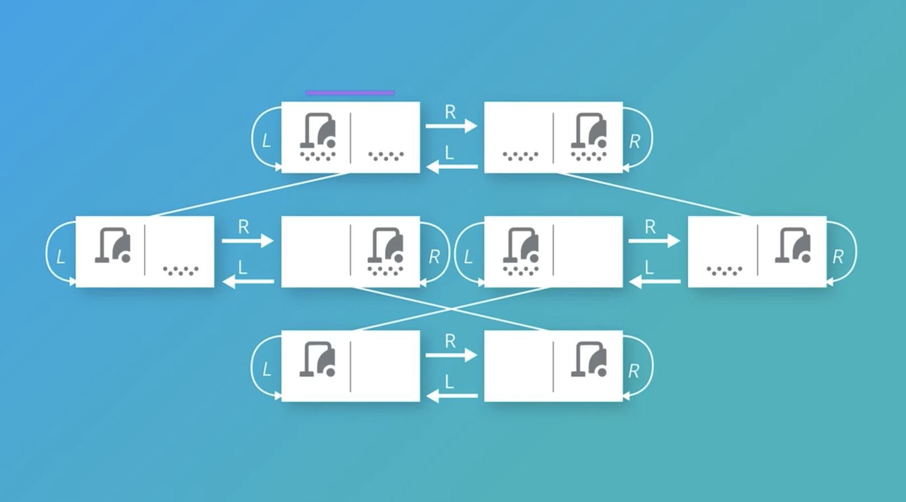
<p style="color: #555;">Figure: Visual representation of possible states in a vacuum cleaner world</p>
</div>

For example, in the statement "Peter Norvig wrote the best Artificial Intelligence textbook":

- Objects: "Peter Norvig" and "textbook"
- Properties: "the best" and "Artificial Intelligence"
- Relation: "wrote"

##### FOL Models and Components

In First Order Logic, a model represents a more complex structure than in propositional logic. While a propositional
logic model is simply a set of boolean values (e.g., {P: true, Q: false}), an FOL model consists of:

1. A domain of objects
2. Relations between these objects
3. Functions that map objects to other objects

For example, an FOL model might be represented as:

```python
fol_model = {Write( Author("Peter"), Book("AI textbook") )}
```

This model defines objects (Peter, AI textbook), functions (Author(), Book()), and relations (Write()).

Logical statements in FOL are built from these components:

1. **Sentences**: Express facts that can be true or false
    - Examples: Vowel(A), Above(A, B), 2 = 2
2. **Terms**: Refer to objects in the domain
    - Constants: A, B, 2
    - Variables: x, y
    - Functions: Number_of(A)
3. **Logical Connectives**: Same as in propositional logic (¬, ∧, ∨, ⇒, ⇔)
4. **Predicates**: Relations that can be true or false for various objects
    - Examples: Father(x, y), Above(x, y), Greater(x, y)

##### Universal and Existential Quantifiers

FOL introduces quantifiers that extend its expressive power by allowing statements about collections of objects:

1. **Universal Quantifier ($∀$)**: "For all" or "For every"
    - Example: ∀x Human(x) ⇒ Mortal(x)
    - Meaning: "All humans are mortal"
    - Often paired with implication (⇒)
2. **Existential Quantifier ($∃$)**: "There exists" or "For some"
    - Example: ∃x Planet(x) ∧ HasLife(x)
    - Meaning: "There exists at least one planet that has life"
    - Often paired with conjunction (∧)

These quantifiers allow FOL to express more complex ideas than propositional logic. They can also be combined:

$\forall x \, (Dog(x) \Rightarrow \exists y \, (Human(y) \land Owns(y, x)))$

This means: "For all x, if x is a dog, then there exists a y such that y is human and y owns x" or more simply, "Every
dog has a human owner.”

###### Expressing Different Quantification Relationships in First-Order Logic

Let's examine how to express "some dogs have human owners" rather than "all dogs have human owners."

###### Current Statement (All Dogs)

$$\forall x , (Dog(x) \Rightarrow \exists y , (Human(y) \land Owns(y, x)))$$

This universal statement claims every single dog has at least one human owner, which as you correctly noted, doesn't
reflect reality since many dogs are indeed stray or wild.

###### Expressing "Some Dogs Have Human Owners"

To express that only some dogs have human owners, we need to use the existential quantifier for dogs as well. Here's how
we would write it:

$$\exists x , (Dog(x) \land \exists y , (Human(y) \land Owns(y, x)))$$

In natural language, this means: "There exists at least one dog x such that there exists at least one human y who owns
that dog."

Or more simply: "Some dogs have human owners."

###### Understanding the Logical Structure

The key differences between these statements:

1. We replaced the universal quantifier ($\forall$) with an existential quantifier ($\exists$) for dogs
2. We replaced the implication ($\Rightarrow$) with a conjunction ($\land$)

This change is significant because:

- The original statement made a claim about ALL dogs
- The new statement only claims that SOME dogs (at least one) have human owners

###### More Nuanced Variations

We could express other, more specific relationships:

###### "Most dogs have human owners"

Let me break down this logical formula step by step to help you understand what it means in plain English:

$$\exists x , (Threshold(x) \land \forall y , (Count(Dog \land HasOwner, y) \Rightarrow y > x))$$

This formula translates to:

"There exists some threshold value x such that the count of dogs that have owners is greater than this threshold."

###### Detailed Breakdown

Let's analyze each component of this formula:

1. **$\exists x , (Threshold(x) \land ... )$** This part says "there exists some value x that is a threshold, and
   something else is true about this threshold."
2. **$Count(Dog \land HasOwner, y)$** This is a specialized predicate that counts how many entities satisfy both $Dog$
   and $HasOwner$. The result of this count is assigned to the variable $y$.
3. **$\forall y , (Count(Dog \land HasOwner, y) \Rightarrow y > x)$** This says "for all values y, if y is the count of
   dogs that have owners, then y is greater than the threshold x."

###### Why This Represents "Most"

This formula represents "most" because:

1. It establishes that there is some threshold value (which we could think of as representing 50% or some other
   significant portion of the total).
2. It then asserts that the actual count of dogs with owners exceeds this threshold.
3. By setting the threshold appropriately (which is implicit in the formula), we can capture the intuitive notion of
   "most" as "more than half" or "a significant majority."

###### The Formula's Limitations

This formula has some technical imprecisions:

1. The count operation typically produces exactly one value, not many values that would need universal quantification
   over $y$.
2. The formula doesn't explicitly define what makes $x$ a meaningful threshold (like being half the total dog
   population).

###### A More Precise Formulation

A more precise way to express "most dogs have human owners" might be:

$$\exists x , \exists y , (Count(z, Dog(z), x) \land Count(z, Dog(z) \land \exists w(Human(w) \land Owns(w,z)), y) \land 2y > x)$$

This says: "There exist numbers x and y where x is the total count of dogs, y is the count of dogs with human owners,
and y is greater than half of x."

This concept of "most" is important in planning contexts where we need to reason about majority cases without requiring
universality, allowing for exceptions while still making generally applicable plans.

###### Understanding the Formalization of "Most Dogs Have Human Owners"

Let me elaborate on this more precise formulation of "most dogs have human owners" in first-order logic with counting
extensions:

$$\exists x , \exists y , (Count(z, Dog(z), x) \land Count(z, Dog(z) \land \exists w(Human(w) \land Owns(w,z)), y) \land 2y > x)$$

###### Detailed Analysis of Each Component

###### The Counting Function

The expression uses a specialized counting function `Count`, which takes three arguments:

- A variable to be counted (z)
- A formula that defines what we're counting (e.g., `Dog(z)`)
- A variable to store the result (x or y)

This counting function extends basic first-order logic with the ability to count how many entities satisfy certain
conditions.

###### The First Count: All Dogs

$Count(z, Dog(z), x)$ means "count how many entities z satisfy the condition that z is a dog, and store this total in
x."

This gives us the total dog population in our domain.

###### The Second Count: Dogs with Human Owners

$Count(z, Dog(z) ∧ ∃w(Human(w) ∧ Owns(w,z)), y)$ is more complex and means:

"Count how many entities z satisfy BOTH of these conditions:

1. z is a dog
2. There exists some entity w such that w is human and w owns z
3. Store this count in y."

This gives us the number of dogs that have at least one human owner.

###### The "Most" Constraint

2y > x is the mathematical expression that captures the concept of "most." It states that twice the value of y is
greater than x, which means that y is greater than half of x.

In other words, the number of dogs with human owners (y) exceeds half the total number of dogs (x/2), which is precisely
what we mean by "most."

###### Why This Works Better Than the Previous Formula

This formulation is more precise than the earlier version with the `Threshold` predicate because:

1. It explicitly counts the two relevant populations (all dogs and dogs with owners)
2. It mathematically defines "most" as "more than half"
3. It avoids the ambiguity of what constitutes a valid threshold
4. It properly handles the single-valued nature of counting operations

###### Relation to Automated Planning

In automated planning, this kind of quantitative reasoning is crucial when:

1. **Generating plans that satisfy majority preferences**: If most affected entities need to have a certain property,
   the planner must find actions that achieve this.
2. **Resource allocation**: When planning actions that affect resource distribution, ensuring that "most" resources are
   properly allocated might be a goal constraint.
3. **Handling exceptions efficiently**: Plans often need to work for most cases without getting bogged down by handling
   every exception.
4. **Decision thresholds**: Automated planners might need to decide whether to pursue a course of action based on
   whether it benefits "most" affected entities.

###### Extensions and Variations

We could further refine this formulation to express more nuanced concepts:

1. **"A large majority"** of dogs have owners:
   $$\exists x , \exists y , (Count(z, Dog(z), x) \land Count(z, Dog(z) \land \exists w(Human(w) \land Owns(w,z)), y) \land 3y > 2x)$$
   (More than two-thirds)
2. **"Almost all"** dogs have owners:
   $$\exists x , \exists y , (Count(z, Dog(z), x) \land Count(z, Dog(z) \land \exists w(Human(w) \land Owns(w,z)), y) \land x-y < c)$$
   (Where c is a small constant representing the acceptable number of exceptions)
3. **"A significant minority"** of dogs have owners:
   $$\exists x , \exists y , (Count(z, Dog(z), x) \land Count(z, Dog(z) \land \exists w(Human(w) \land Owns(w,z)), y) \land 3y > x)$$
   (More than one-third)

The ability to express these kinds of quantitative relationships demonstrates how extensions to basic first-order logic
help bridge the gap between formal logical representations and the nuanced proportional concepts we use in everyday
reasoning and planning.

Does this more thorough explanation help clarify how the formula captures the concept of "most dogs have human owners"
and why this particular formulation is more precise?

###### "Exactly half of all dogs have human owners"

Again, this would require additional mathematical predicates not typically part of basic FOL.

Expressing the concept that "exactly half of all dogs have human owners" requires extending basic First-Order Logic
(FOL) with additional mathematical constructs. This is a fascinating challenge that demonstrates some limitations of
standard FOL when dealing with proportional or numerical concepts.

Standard FOL doesn't have built-in mechanisms for:

- Counting objects
- Expressing ratios or proportions
- Directly representing numerical concepts like "half"

For this reason, we need to extend our language with additional predicates and functions that handle these numerical
concepts.

###### Solution Using Extended FOL

Here's one way to express "exactly half of all dogs have human owners" using extended FOL with counting and arithmetic
capabilities:

$$\exists n, m \left( \begin{array}{l} Count(x, Dog(x), n) \land \ Count(x, Dog(x) \land \exists y(Human(y) \land Owns(y,x)), m) \land \ 2 \times m = n \end{array} \right)$$

Let me explain this formula step by step:

1. `∃n, m` - There exist numbers n and m
2. `Count(x, Dog(x), n)` - n equals the total count of all dogs x
3. `Count(x, Dog(x) ∧ ∃y(Human(y) ∧ Owns(y,x)), m)` - m equals the count of all dogs x that have at least one human
   owner y
4. `2 × m = n` - m is exactly half of n, meaning the number of dogs with human owners is exactly half the total number
   of dogs

###### Alternative Approach Using Second-Order Logic

If we allow ourselves to use Second-Order Logic (which permits quantification over predicates and functions), we could
express this more elegantly:

$$\exists P \left( \begin{array}{l} \forall x (P(x) \rightarrow Dog(x)) \land \\ \forall x (P(x) \rightarrow \exists y(Human(y) \land Owns(y,x))) \land \\ \forall x (Dog(x) \land \lnot P(x) \rightarrow \lnot \exists y(Human(y) \land Owns(y,x))) \land \\ |{x : P(x)}| = |{x : Dog(x) \land \lnot P(x)}| \end{array} \right)$$

This says:

- There exists a predicate P that:
    - Only applies to dogs
    - All x satisfying P have human owners
    - All dogs not satisfying P don't have human owners
    - The number of elements satisfying P equals the number of dogs not satisfying P meaning Exactly half of all dogs
      have human owners

###### The Overall Structure

This is a second-order logic formula because it quantifies over a predicate $P$. The formula begins with $\exists P$,
which means "there exists a predicate $P$ such that..." The predicate $P$ will be used to divide dogs into two groups:
those with owners and those without.

###### $\forall x (P(x) \rightarrow Dog(x))$

This first line states: "For all entities x, if P applies to x, then x is a dog."

This establishes that the predicate $P$ only applies to dogs. We're essentially creating a subset of dogs that satisfy
predicate $P$. This doesn't mean that all dogs satisfy $P$ – just that anything satisfying $P$ must be a dog.

###### $\forall x (P(x) \rightarrow \exists y(Human(y) \land Owns(y,x)))$

The second line states: "For all entities x, if P applies to x, then there exists some entity y such that y is human and
y owns x."

This means that every entity that satisfies predicate $P$ has at least one human owner. Combined with the first line, it
tells us that $P$ represents the subset of dogs that have human owners.

###### $\forall x (Dog(x) \land \lnot P(x) \rightarrow \lnot \exists y(Human(y) \land Owns(y,x)))$

The third line states: "For all entities x, if x is a dog and P does not apply to x, then there does not exist any
entity y such that y is human and y owns x."

This establishes that any dog that doesn't satisfy predicate $P$ does not have a human owner. Combined with the previous
lines, we now know that $P$ precisely divides the set of all dogs into two mutually exclusive groups: those with human
owners and those without.

###### $|{x : P(x)}| = |{x : Dog(x) \land \lnot P(x)}|$

The fourth line states: "The cardinality (size) of the set of entities satisfying P equals the cardinality of the set of
entities that are dogs but don't satisfy P."

This mathematical notation $|{x : condition}|$ refers to "the number of elements x that satisfy the given condition." So
this line is saying that the number of entities satisfying $P$ (which we now know are dogs with owners) equals the
number of dogs that don't satisfy $P$ (dogs without owners).

###### Putting It All Together

When we combine all four lines, this formula precisely captures the statement "exactly half of all dogs have human
owners" by:

1. Defining a predicate $P$ that applies only to dogs with human owners
2. Ensuring all dogs either satisfy $P$ (have owners) or don't satisfy $P$ (don't have owners)
3. Requiring that the number of dogs satisfying $P$ equals the number of dogs not satisfying $P$

This second-order logic formulation is elegant because it directly expresses the concept of "half" by partitioning the
set of dogs into two equal-sized subsets. It avoids the need for explicit counting functions while still capturing the
quantitative relationship we want to express.

The use of second-order logic (quantifying over predicates) makes this expression more elegant than the first-order
logic with counting extensions, but it's also more theoretically complex since second-order logic has different
computational properties than first-order logic.

###### Practical Implementation in Planning Systems

In actual automated planning systems, these kinds of proportional constraints would typically be handled through:

1. **Specialized extensions** to the planning language (like PDDL with numerical fluents)
2. **Constraint programming integration** that allows numerical constraints alongside logical ones
3. **Custom predicates** defined specifically for the planning domain

For example, in an extended PDDL-like syntax, you might see something like:

```
(:derived (equal-proportion has-owner no-owner)
    (= (count ?x - dog (exists (?y - human) (owns ?y ?x)))
       (count ?x - dog (not (exists (?y - human) (owns ?y ?x))))))
```

###### Implications for Knowledge Representation

This example highlights an important limitation of standard FOL for knowledge representation in planning systems: while
FOL excels at representing logical relationships, many real-world planning problems require numerical reasoning,
proportions, probabilities, or optimization criteria.

Modern planning systems overcome this by combining logical reasoning with:

- Constraint satisfaction techniques
- Linear programming
- Statistical methods
- Specialized numerical reasoners

This integration allows planning systems to handle both the logical structure of problems and their quantitative
aspects.

###### "No dogs have human owners"

$$\forall x , (Dog(x) \Rightarrow \neg \exists y , (Human(y) \land Owns(y, x)))$$

Or equivalently: $$\forall x , \forall y , (Dog(x) \land Human(y) \Rightarrow \neg Owns(y, x))$$

###### Implications for Planning

In automated planning, these distinctions are crucial:

- Universal statements (all dogs) create stricter constraints on valid plans
- Existential statements (some dogs) offer more flexibility
- The choice of quantifiers affects which actions a planner will consider valid and which goals are achievable

When modeling real-world planning problems, carefully choosing between universal and existential quantification helps
capture the actual constraints and possibilities in the domain.

<div align="center">
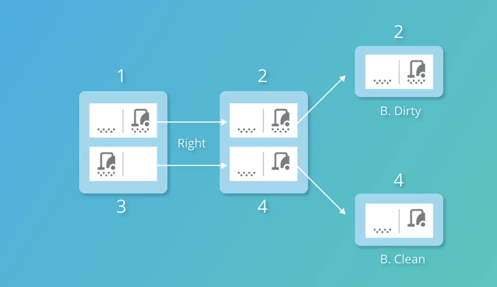
<p style="color: #555;">Figure: Example of partially observable environment for a vacuum cleaner agent</p>
</div>
##### FOL Syntax Patterns

Certain patterns appear frequently in FOL expressions:

1. **Universal quantification** often uses implication:

    $∀x Vowel(x) ⇒ Number_of(x) = 1$

    "For all x, if x is a vowel, then the number of x is 1."

2. **Existential quantification** often uses conjunction:

    $∃x Number_of(x) = 2$

    "There exists an x such that the number of x is 2."

In vacuum cleaner world examples, we might represent states and actions using FOL:

$∀d ∀l Dirt(d) ∧ Loc(l) ⇒ ¬At(d,l)$

"For all dirt d and locations l, if d is dirt and l is a location, then d is not at l." (Initially, no dirt is at any
location)

Let me analyze the First-Order Logic (FOL) expression that describes a vacuum cleaner and dirt scenario using proper
mathematical notation:

$$\exists l , \exists d , (Dirt(d) \land Loc(l) \land At(V,l) \land At(d,l))$$

This expression is an example of existential quantification in First-Order Logic, where we're asserting the existence of
specific objects that satisfy multiple conditions. Let's examine each component:

1. $\exists l$ - "There exists a location $l$"
2. $\exists d$ - "There exists some dirt $d$"

These quantifiers tell us that we're claiming the existence of at least one location and at least one dirt entity that
together satisfy the conditions that follow.

The expression contains four predicates joined by logical conjunctions ($\land$):

1. $Dirt(d)$ - "The entity $d$ is dirt"
2. $Loc(l)$ - "The entity $l$ is a location"
3. $At(V,l)$ - "The vacuum cleaner $V$ is at location $l$"
4. $At(d,l)$ - "The dirt $d$ is at location $l$"

When combined, this FOL expression precisely states:

"There exists at least one location $l$ and at least one dirt entity $d$ such that $d$ is dirt, $l$ is a location, the
vacuum cleaner is at location $l$, and the dirt $d$ is also at location $l$."

In simpler terms, this asserts that there is at least one location in the environment where both the vacuum cleaner and
some dirt are present simultaneously.

###### Significance in Planning Contexts

This expression represents an important state description in a vacuum cleaner planning problem:

1. **Goal Specification**: This could represent a precondition for a cleaning action—the vacuum must be at the same
   location as the dirt to clean it.
2. **State Representation**: In a belief state planning framework, this expression helps identify states where cleaning
   actions are immediately applicable.
3. **Problem Complexity**: The existence of such states adds complexity to the planning problem, as the vacuum may need
   to navigate to dirt locations before cleaning.

The ability to represent such conditions concisely using FOL is one of the key advantages of formal logical
representations in automated planning. This particular expression is relatively simple but demonstrates how FOL can
express relationships between objects (vacuum and dirt) at specific locations.

FOL also allows us to define properties of relations:

```
∀R Transitive(R) ⇔ (∀a,b,c R(a,b) ∧ R(b,c) ⇒ R(a,c))
```

"A relation R is transitive if and only if whenever R(a,b) and R(b,c) are true, R(a,c) is also true."

The power of FOL lies in its ability to represent complex relationships and make inferences that would be impossible in
propositional logic. This makes it fundamental to knowledge representation and reasoning in AI systems that need to
understand and operate in complex environments.

By building a foundation in symbolic logic, we prepare for the next step: using this formalism to represent planning
problems that knowledge-based agents can solve.

#### Introduction to Planning

In artificial intelligence, planning goes beyond simple search algorithms to create sequences of actions that achieve
specific goals in complex environments. While search focuses on finding paths through state spaces, planning addresses
how intelligent agents can reason about actions and their consequences to achieve desired outcomes.

##### Planning VS Execution

Planning and execution represent two distinct yet intertwined processes in intelligent agent decision-making.
Understanding the relationship between these processes is crucial for developing effective AI systems.

**Planning** involves devising a strategy or sequence of actions to achieve a specific goal, essentially mapping out a
path from the current state to a desired future state. It's a deliberative process that works with the agent's internal
model of the world.

**Execution**, on the other hand, is the implementation of these planned actions in the real environment. During
execution, the agent must adapt to actual conditions, which may differ from its internal model.

The relationship between planning and execution isn't simply sequential—it forms a continuous cycle:

1. The agent plans based on its current understanding of the world
2. It executes part of the plan
3. It observes the results of its actions
4. It updates its understanding and revises its plan if necessary

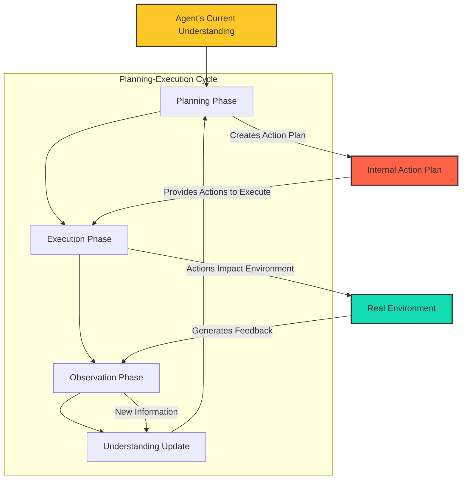

This cycle becomes particularly important in environments with uncertainty, where outcomes aren't perfectly predictable.
A good planning system must account for this uncertainty and be adaptable when things don't go exactly as expected.

<div align="center">
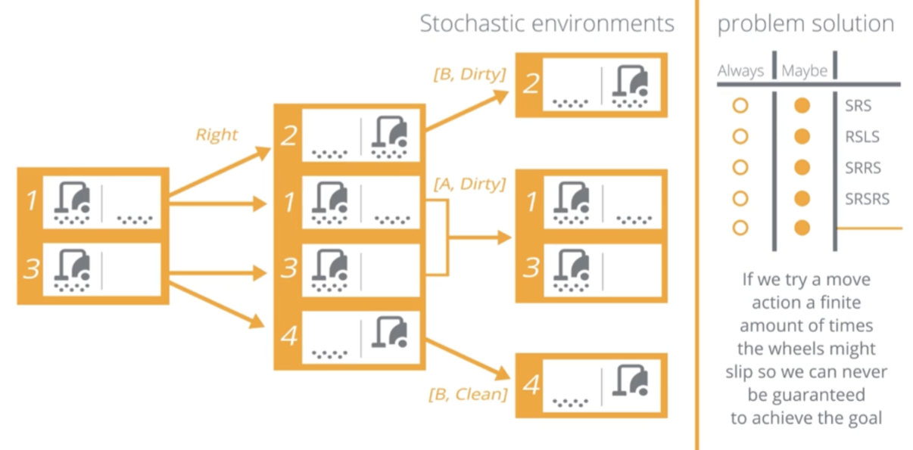
<p style="color: #555;">Figure: Example of a stochastic environment where actions have probabilistic outcomes</p>
</div>

##### Uncertain Environments

In the real world, agents rarely operate in perfectly predictable environments. Uncertainty can manifest in several
forms:

**Stochastic Environments**: In these settings, actions have probabilistic outcomes. Even when the same action is
performed in the same state multiple times, different results may occur. For example, in the vacuum cleaner world,
movement actions might sometimes fail due to a slippery floor.

**Multiagent Environments**: When multiple agents operate in the same environment, each agent's actions can affect
others, creating additional uncertainty. An agent cannot perfectly predict how other agents will behave, which
introduces complexity into planning.

**Partially Observable Environments**: In many realistic scenarios, agents cannot directly observe the entire state of
the environment. They must rely on sensors with limited range or accuracy, leading to incomplete information.

**Hierarchical Planning**: Some environments require planning at multiple levels of abstraction, with actions and
outcomes that aren't linearly related. This adds complexity to the planning process.

<div align="center">
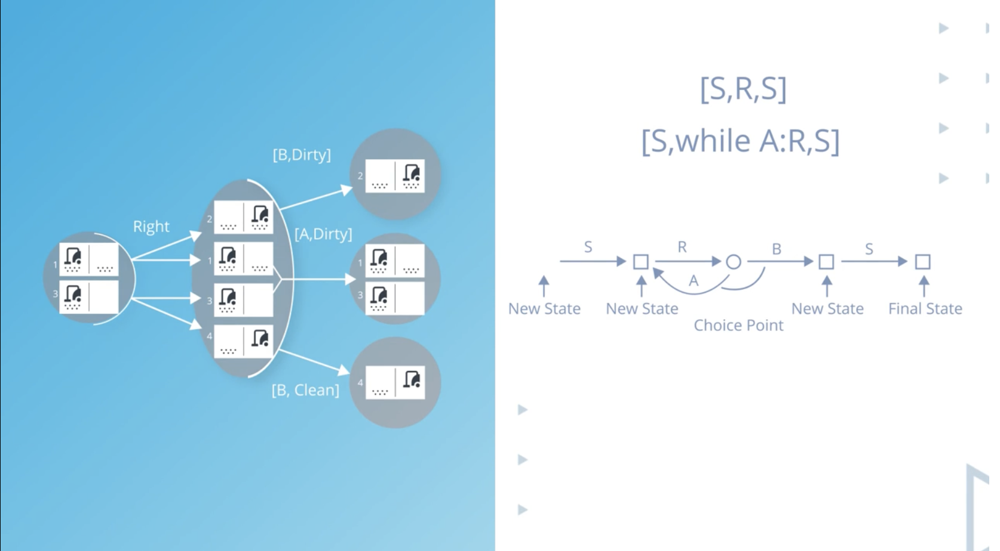
<p style="color: #555;">Figure: Planning in uncertain environments may require considering infinite sequences of actions</p>
</div>

##### Belief States

In environments with uncertainty or partial observability, agents cannot always know their exact state. Instead, they
work with "belief states" – representations of the agent's knowledge and uncertainty about the actual state of the
world.

A belief state can be thought of as a set of all possible states the agent might be in, given its history of actions and
observations. As the agent gathers more information through observations, it can refine its belief state, narrowing down
the possibilities.

For example, in the sensorless vacuum cleaner problem, the agent initially doesn't know its location or the dirt
distribution. Its initial belief state includes all possible combinations of positions and dirt configurations – a total
of 8 possible states (2 positions × 2 dirt states for each position).

As the agent takes actions and makes observations, it can eliminate incompatible states from its belief set. The goal in
belief space planning is to reach a belief state where all possible states are goal states – meaning the agent has
accomplished its objective regardless of which specific state it's actually in.

<div align="center">
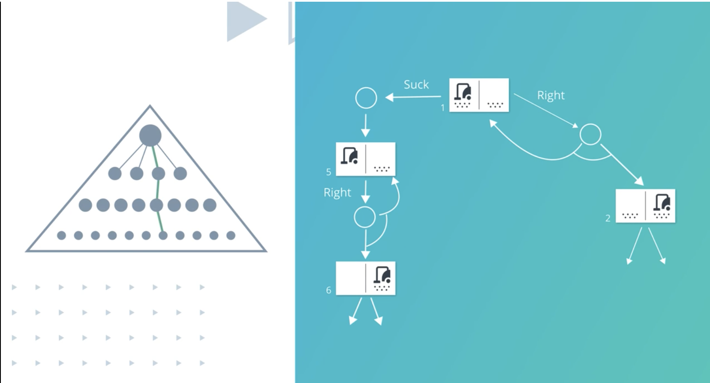
<p style="color: #555;">Figure: Finding a successful plan requires navigating through belief states</p>
</div>

##### Vacuum Cleaner Planning Problem

The vacuum cleaner world provides an excellent example for understanding planning in different types of environments.
Let's examine how planning varies as we introduce different levels of uncertainty:

**Fully Observable, Deterministic Environment**

- The vacuum knows its location and can see dirt everywhere
- Actions have predictable outcomes
- Planning is straightforward: search through state space for a goal state

**Partially Observable Environment**

- The vacuum can see its current location and whether there's dirt there
- It cannot see dirt in other locations
- Planning must account for information gathering actions

**Sensorless Environment**

- The vacuum cannot determine its location or sense dirt
- It must plan in belief space, considering all possible states
- Actions must systematically eliminate possibilities

<div align="center">
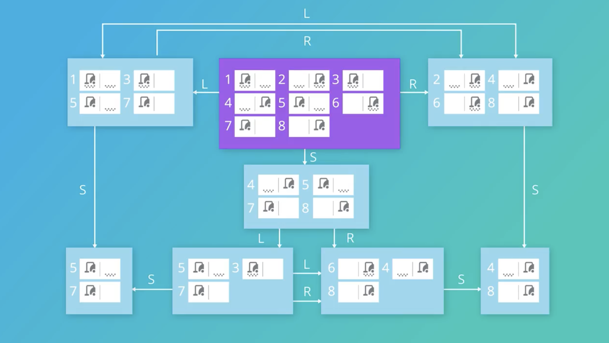
<p style="color: #555;">Figure: Sensorless vacuum cleaner problem with multiple possible states</p>
</div>
**Stochastic Environment**

- Movement actions might fail (e.g., the vacuum might slip and stay in place)
- Planning must account for all possible outcomes of each action
- May require conditional plans or policies rather than linear action sequences

The key insight is that as uncertainty increases, planning becomes more complex. Instead of planning a simple sequence
of actions, the agent must plan for contingencies and information gathering, working in the space of belief states
rather than world states.

<div align="center">
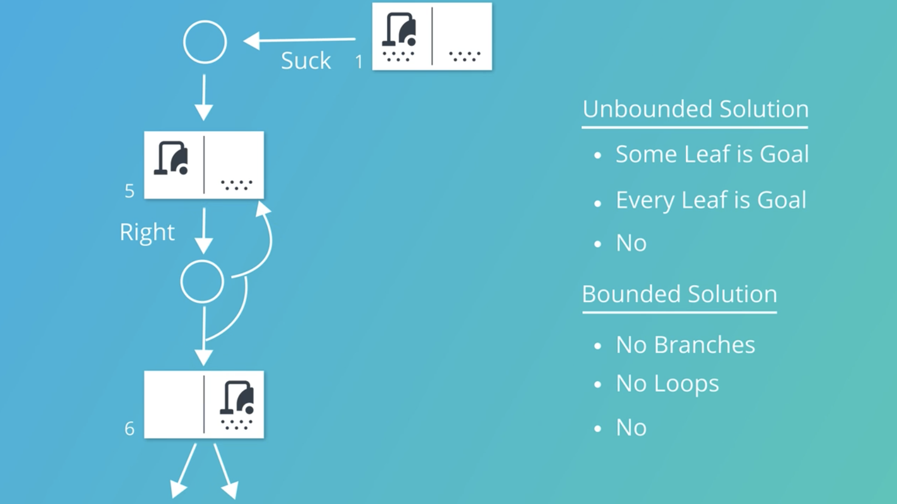
<p style="color: #555;">Figure: Different planning approaches based on environment characteristics</p>
</div>

##### Stochastic Environment Challenges

Planning in stochastic environments presents several unique challenges:

**Non-Deterministic Outcomes**: When actions have multiple possible outcomes, the planner must consider all possible
branches. This can lead to an exponential explosion in the number of states to consider.

**Infinite Planning Horizons**: In some stochastic environments, it's impossible to guarantee goal achievement with a
finite plan because actions might repeatedly fail. Instead, we might need to find policies that maximize the probability
of eventually reaching the goal.

**Slippery Execution**: Even a well-designed plan might fail during execution due to unexpected outcomes. Planning
systems must be able to recover and replan when things don't go as expected.

**Incomplete Knowledge**: Often, the exact probabilities of different outcomes aren't known in advance, making it
difficult to calculate optimal plans.

For example, in our vacuum cleaner world with a slippery floor, a simple plan like "Suck, Right, Suck" might not
guarantee that both squares are clean, because the "Right" action might fail, leaving the vacuum in place. Instead, the
agent might need a more complex policy that keeps trying the "Right" action until it succeeds.

##### Predict-Update Cycle

In environments with uncertainty, planning involves a continuous cycle of prediction and updating. This process allows
agents to refine their understanding of the world state as they take actions and make observations.

The cycle works as follows:

1. **Predict**: The agent uses its current belief state and planned action to predict possible new belief states. This
   prediction accounts for all possible outcomes of the action.
2. **Act**: The agent executes its chosen action in the environment.
3. **Observe**: The agent receives observations from the environment after taking the action.
4. **Update**: The agent updates its belief state based on these observations, eliminating impossible states and
   refining its knowledge.

Mathematically, this process can be represented as:

When,

Predict new belief state after action $a$,

$b' = \text{Predict}(b, a) $

Update belief based on observation $o$,

$b1 = \text{Update}(b', o)$

Where:

- b is the current belief state
- a is the action taken
- o is the observation received
- b' is the predicted belief state after action a
- b1 is the updated belief state incorporating the observation

<div align="center">
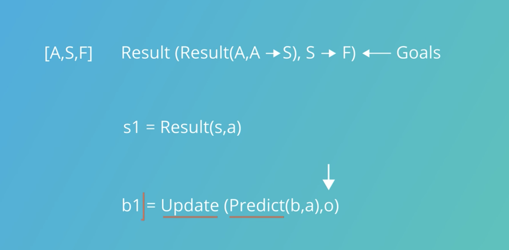
<p style="color: #555;">Figure: The predict-update cycle in belief state planning</p>
</div>

This cycle forms the foundation of planning algorithms for partially observable and stochastic environments. By
repeatedly applying this process, agents can navigate through belief space, gradually reducing uncertainty until they
achieve their goals.

A planning graph is a specialized data structure that implements this predict-update cycle. It's organized in
alternating layers of states and actions, with links representing preconditions and effects. This structure provides
better heuristic estimates for planning, helping agents find more efficient paths through complex belief spaces.

<div align="center">
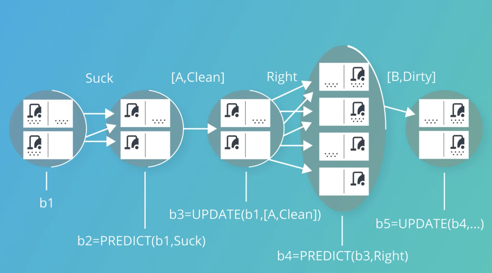
<p style="color: #555;">Figure: Tracking the predict-update cycle in a planning problem</p>
</div>

Understanding the predict-update cycle is essential for developing planning systems that can handle real-world
uncertainty. It allows agents to reason about their knowledge and uncertainties, adapting their plans as they gather
more information through interaction with the environment.

#### Classical Planning

Classical planning forms the foundation of automated planning in artificial intelligence. It provides formalized
approaches to representing problems and finding solutions in well-defined environments. While planning in uncertain
environments introduces additional complexities, understanding classical planning gives us the essential tools to build
more sophisticated planning systems.

##### State Space Representation

In classical planning, we need to clearly define the state space where our agent will operate. This representation
determines how we think about states, actions, and transitions between states.

There are two main approaches to state space representation:

**Complete Assignment** refers to a state space where every variable has a defined value. This approach works well in
deterministic, fully observable environments like those we encountered in basic search problems. In a complete
assignment, the agent knows exactly which state it's in at all times.

For example, in the vacuum cleaner world with a complete assignment, the agent would know:

- Its current location (A or B)
- Whether there's dirt in location A (yes or no)
- Whether there's dirt in location B (yes or no)

**Partial Assignment** assigns values to only some of the variables, leaving others unspecified. This is particularly
useful in stochastic or partially observable environments where the agent has incomplete information.

In a vacuum cleaner world with a partial assignment, the agent might know:

- Its current location is A
- But not know whether there's dirt in location B

**Belief State Space** generalizes these concepts by representing sets of possible states the agent might be in. A
belief state can be based on either complete or partial assignments and is essential for planning under uncertainty.

For the vacuum cleaner world, the total number of possible states is:

- 2 possible locations (A or B)
- 2 possible dirt states for each location (clean or dirty)
- Total: 2 × 2 × 2 = 8 possible states

This state space representation provides the foundation for defining planning problems and developing algorithms to
solve them.

##### Action Schemas

Action schemas describe the possible actions an agent can take in the environment. Each action schema consists of
several components that specify when the action can be applied and what happens when it is executed.

An action schema typically includes:

1. **Action Name**: A descriptive identifier for the action
2. **Parameters**: Variables that can be instantiated with specific objects
3. **Preconditions**: Logical conditions that must be true for the action to be applicable
4. **Effects**: Changes to the world state that result from executing the action

Here's an example of an action schema for a "Fly" action in an air travel domain:

$\begin{align} \\ &
\text{Action}(\text{Fly}(p, \text{from}, \text{to}), \\ &
\quad\text{PRECOND}: \text{At}(p, \text{from}) \wedge \text{Plane}(p) \wedge \text{Airport}(\text{from}) \wedge \text{Airport}(\text{to}) \\ &
\quad\text{EFFECT}: \neg\text{At}(p, \text{from}) \wedge \text{At}(p, \text{to})) \\ &
\end{align}$

Let's break down this schema:

- **Action name**: Fly
- **Parameters**: plane (p), departure airport (from), destination airport (to)
- **Preconditions**: The plane must be at the departure airport, p must be a plane, and both locations must be airports
- **Effects**: The plane is no longer at the departure airport and is now at the destination airport

Action schemas are powerful because they provide a concise way to represent many possible actions using variables. When
these variables are instantiated with specific objects from the domain, we get concrete actions that can be applied to
specific states.

A planning agent uses these action schemas to determine which actions are possible in a given state. It checks whether
the preconditions of an action are satisfied by the current state, and if so, it can predict the resulting state by
applying the effects.

##### Planning Domain Definition Language (PDDL)

The Planning Domain Definition Language (PDDL) is a standardized language for describing planning problems. It provides
a common format that allows different planning systems to work with the same problem descriptions, facilitating research
and development in the field.

A complete PDDL description typically includes:

1. **Initial State**: The starting configuration of the world
2. **Goal Specification**: The conditions that define success
3. **Action Schemas**: The possible actions in the domain

Here's an example of a PDDL description for a simple cargo transportation problem:

###### Initial State Specification

$$\begin{align} \ & \text{Init}(\text{At}(C1, \text{SFO}) \wedge \text{At}(C2, \text{JFK}) \wedge \text{At}(P1, \text{SFO}) \wedge \text{At}(P2, \text{JFK}) \\ & \quad \wedge \text{Cargo}(C1) \wedge \text{Cargo}(C2) \wedge \text{Plane}(P1) \wedge \text{Plane}(P2) \\ & \quad \wedge \text{Airport}(\text{JFK}) \wedge \text{Airport}(\text{SFO})) \\ \end{align}$$

###### Goal Specification

$$\begin{align} \ & \text{Goal}(\text{At}(C1, \text{JFK}) \wedge \text{At}(C2, \text{SFO})) \ \end{align}$$

###### Action Schemas

###### Loading Cargo onto a Plane

$$\begin{align} \ & \text{Action}(\text{Load}(c, p, a), \\ & \quad \text{PRECOND}: \text{At}(c, a) \wedge \text{At}(p, a) \wedge \text{Cargo}(c) \wedge \text{Plane}(p) \wedge \text{Airport}(a) \\ & \quad \text{EFFECT}: \neg\text{At}(c, a) \wedge \text{In}(c, p)) \\ \end{align}$$

###### Flying a Plane between Airports

$$\begin{align} \ & \text{Action}(\text{Fly}(p, \text{from}, \text{to}), \\ & \quad \text{PRECOND}: \text{At}(p, \text{from}) \wedge \text{Plane}(p) \wedge \text{Airport}(\text{from}) \wedge \text{Airport}(\text{to}) \\ & \quad \text{EFFECT}: \neg\text{At}(p, \text{from}) \wedge \text{At}(p, \text{to})) \\ \end{align}$$

###### Unloading Cargo from a Plane

$$\begin{align} \ & \text{Action}(\text{Unload}(c, p, a), \\ & \quad \text{PRECOND}: \text{In}(c, p) \wedge \text{At}(p, a) \wedge \text{Cargo}(c) \wedge \text{Plane}(p) \wedge \text{Airport}(a) \\ & \quad \text{EFFECT}: \text{At}(c, a) \wedge \neg\text{In}(c, p)) \\ \end{align}$$

###### Conceptual Analysis

This PDDL representation defines a cargo transportation problem with the following elements:

1. **Domain Objects**:
    - Two cargo items (C1 and C2)
    - Two planes (P1 and P2)
    - Two airports (SFO and JFK)
2. **Initial State**:
    - Cargo C1 is at SFO airport
    - Cargo C2 is at JFK airport
    - Plane P1 is at SFO airport
    - Plane P2 is at JFK airport
    - Object types are defined (cargo, planes, airports)
3. **Goal State**:
    - Cargo C1 should be at JFK airport
    - Cargo C2 should be at SFO airport
    - (Essentially, the cargoes need to be swapped between airports)
4. **Available Actions**:
    - **Load**: Place cargo onto a plane (when both are at the same airport)
    - **Unload**: Remove cargo from a plane (at an airport)
    - **Fly**: Move a plane from one airport to another

Each action has clearly defined preconditions (requirements for the action to be applicable) and effects (changes to the
world state after executing the action).

To solve this problem, a planning algorithm would need to find a sequence of these actions that transforms the initial
state into a state that satisfies the goal conditions. One possible solution would involve:

1. Loading C1 onto P1 at SFO
2. Flying P1 from SFO to JFK
3. Unloading C1 from P1 at JFK
4. Loading C2 onto P1 at JFK
5. Flying P1 from JFK to SFO
6. Unloading C2 from P1 at SFO

This PDDL representation exemplifies how classical planning problems can be formalized using logical predicates, actions
with preconditions and effects, and clear goal specifications. The structure enables automated planning systems to
systematically search for valid solutions.

In this example:

- The initial state describes the starting locations of cargo and planes, and defines the types of objects
- The goal is to transport C1 to JFK and C2 to SFO (essentially swapping their locations)
- Three action schemas define the possible operations: Load, Unload, and Fly

To solve this problem, a planner would need to find a sequence of actions that transforms the initial state into a state
satisfying the goal conditions. One possible solution would be:

1. Load C1 onto P1 at SFO
2. Fly P1 from SFO to JFK
3. Unload C1 from P1 at JFK
4. Load C2 onto P1 at JFK
5. Fly P1 from JFK to SFO
6. Unload C2 from P1 at SFO

PDDL has become the standard representation for planning problems in research and competitions, with various extensions
to handle more complex domains including time, resources, and uncertainty.

<div align="center">
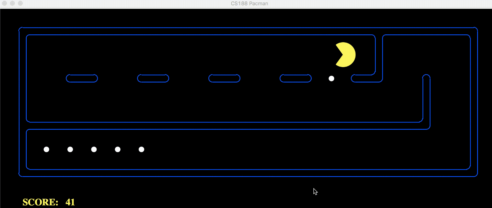
<p style="color: #555;">Figure: Planning problems can be applied to scenarios like navigating through a Pac-Man maze</p>
</div>

##### Progression Search

Progression search, also known as forward search, is one of the primary approaches to finding solutions in the planning
problem state space. It starts from the initial state and systematically applies applicable actions to generate new
states until a goal state is reached.

The basic progression search algorithm works as follows:

1. Start with the initial state
2. Find all actions whose preconditions are satisfied in the current state
3. Apply each action to generate successor states
4. Check if any successor state satisfies the goal conditions
5. If not, continue the search from these successor states

In a planning context, progression search is often visualized with the initial state on the left and the search
progressing to the right, rather than the top-to-bottom representation used in traditional tree search. This reflects
the temporal nature of planning, where we move forward in time as we execute actions.

For example, in our cargo transportation problem, progression search might start with the initial state where C1 is at
SFO and C2 is at JFK. It would consider all applicable actions in this state, such as loading C1 onto P1 at SFO or
flying P2 from JFK to SFO. For each action, it would generate a new state and continue the search.

###### Implementing a PDDL-Style Planning System in Python

Let's develop a Python implementation that can represent and solve the cargo transportation problem we've been
discussing. This will help solidify your understanding of how planning systems work internally.

###### Core Data Structures

First, we need classes to represent our planning components:

```python
class Predicate:
    """Represents a logical predicate like At(C1, SFO)"""
    def __init__(self, name, arguments):
        self.name = name
        self.arguments = arguments

    def __str__(self):
        return f"{self.name}({', '.join(self.arguments)})"

    def __eq__(self, other):
        return (self.name == other.name and
                self.arguments == other.arguments)

    def __hash__(self):
        return hash((self.name, tuple(self.arguments)))


class State:
    """Represents a planning state (set of predicates)"""
    def __init__(self, predicates):
        self.predicates = set(predicates)

    def satisfies(self, predicates):
        """Check if this state satisfies all given predicates"""
        return all(p in self.predicates for p in predicates)

    def apply_action(self, action):
        """Apply an instantiated action to this state, returning a new state"""
        if not self.satisfies(action.preconditions):
            raise ValueError("Preconditions not satisfied")

        # Create a new state with predicates not negated by the action
        new_predicates = {p for p in self.predicates
                         if not any(p == neg for neg in action.negative_effects)}

        # Add the positive effects
        new_predicates.update(action.positive_effects)

        return State(new_predicates)


class Action:
    """Represents an instantiated action with concrete parameters"""
    def __init__(self, name, parameters, preconditions, positive_effects, negative_effects):
        self.name = name
        self.parameters = parameters
        self.preconditions = preconditions
        self.positive_effects = positive_effects
        self.negative_effects = negative_effects

    def __str__(self):
        return f"{self.name}({', '.join(self.parameters)})"


class ActionSchema:
    """Represents an action schema with variables"""
    def __init__(self, name, parameters, preconditions, positive_effects, negative_effects):
        self.name = name
        self.parameters = parameters
        self.preconditions = preconditions
        self.positive_effects = positive_effects
        self.negative_effects = negative_effects

    def instantiate(self, arguments):
        """Create an instantiated action by substituting variables with concrete values"""
        # Create substitution map from parameters to arguments
        subst = dict(zip(self.parameters, arguments))

        # Apply substitution to preconditions and effects
        inst_precond = [substitute_variables(p, subst) for p in self.preconditions]
        inst_pos_effects = [substitute_variables(e, subst) for e in self.positive_effects]
        inst_neg_effects = [substitute_variables(e, subst) for e in self.negative_effects]

        return Action(self.name, arguments, inst_precond, inst_pos_effects, inst_neg_effects)


def substitute_variables(predicate, substitution):
    """Replace variables in a predicate according to the substitution map"""
    new_args = [substitution.get(arg, arg) for arg in predicate.arguments]
    return Predicate(predicate.name, new_args)
```

###### Planning Algorithm

Now let's implement a simple progression search planner:

```python
def progression_search(problem):
    """
    Implements a breadth-first progression search to find a plan.
    Returns a list of actions or None if no plan is found.
    """
    from collections import deque

    start = problem.initial_state
    if problem.is_goal_satisfied(start):
        return []  # Goal already satisfied

    # Queue of (state, plan) pairs
    queue = deque([(start, [])])
    visited = {frozenset(start.predicates)}

    while queue:
        state, plan = queue.popleft()

        # Try all applicable actions
        for action in get_applicable_actions(problem.actions, state):
            new_state = state.apply_action(action)
            new_state_hash = frozenset(new_state.predicates)

            # Skip if we've seen this state before
            if new_state_hash in visited:
                continue

            # Create new plan by appending this action
            new_plan = plan + [action]

            # Check if we've reached a goal state
            if problem.is_goal_satisfied(new_state):
                return new_plan

            # Add new state to visited and queue
            visited.add(new_state_hash)
            queue.append((new_state, new_plan))

    return None  # No plan found


def get_applicable_actions(action_schemas, state):
    """Find all actions that can be applied in the given state"""
    applicable_actions = []

    # This is a simplified version that would need more sophisticated
    # grounding of action schemas for a real implementation
    for schema in action_schemas:
        # Generate all possible groundings of the schema's parameters
        # In a real system, this would use a more efficient approach
        for grounding in generate_groundings(schema, state):
            action = schema.instantiate(grounding)
            if state.satisfies(action.preconditions):
                applicable_actions.append(action)

    return applicable_actions


def generate_groundings(schema, state):
    """
    Simplified function to generate parameter groundings.
    In a real system, this would use a more sophisticated approach.
    """
    # This is a placeholder - real implementation would be domain-specific
    # For this example, we would need to extract constants from the state
    # and generate all possible combinations
    pass
```

###### Representing the Cargo Problem

Now let's set up our cargo transportation problem:

```python
def create_cargo_problem():
    """Create and return the cargo transportation planning problem"""

    # Define predicates for initial state
    initial_predicates = [
        Predicate("At", ["C1", "SFO"]),
        Predicate("At", ["C2", "JFK"]),
        Predicate("At", ["P1", "SFO"]),
        Predicate("At", ["P2", "JFK"]),
        Predicate("Cargo", ["C1"]),
        Predicate("Cargo", ["C2"]),
        Predicate("Plane", ["P1"]),
        Predicate("Plane", ["P2"]),
        Predicate("Airport", ["JFK"]),
        Predicate("Airport", ["SFO"])
    ]

    # Define goal predicates
    goal_predicates = [
        Predicate("At", ["C1", "JFK"]),
        Predicate("At", ["C2", "SFO"])
    ]

    # Create initial and goal states
    initial_state = State(initial_predicates)
    goal_state = State(goal_predicates)

    # Define action schemas

    # Load action
    load_schema = ActionSchema(
        name="Load",
        parameters=["c", "p", "a"],
        preconditions=[
            Predicate("At", ["c", "a"]),
            Predicate("At", ["p", "a"]),
            Predicate("Cargo", ["c"]),
            Predicate("Plane", ["p"]),
            Predicate("Airport", ["a"])
        ],
        positive_effects=[
            Predicate("In", ["c", "p"])
        ],
        negative_effects=[
            Predicate("At", ["c", "a"])
        ]
    )

    # Unload action
    unload_schema = ActionSchema(
        name="Unload",
        parameters=["c", "p", "a"],
        preconditions=[
            Predicate("In", ["c", "p"]),
            Predicate("At", ["p", "a"]),
            Predicate("Cargo", ["c"]),
            Predicate("Plane", ["p"]),
            Predicate("Airport", ["a"])
        ],
        positive_effects=[
            Predicate("At", ["c", "a"])
        ],
        negative_effects=[
            Predicate("In", ["c", "p"])
        ]
    )

    # Fly action
    fly_schema = ActionSchema(
        name="Fly",
        parameters=["p", "from", "to"],
        preconditions=[
            Predicate("At", ["p", "from"]),
            Predicate("Plane", ["p"]),
            Predicate("Airport", ["from"]),
            Predicate("Airport", ["to"])
        ],
        positive_effects=[
            Predicate("At", ["p", "to"])
        ],
        negative_effects=[
            Predicate("At", ["p", "from"])
        ]
    )

    # Create the planning problem
    return PlanningProblem(
        initial_state=initial_state,
        goal_state=goal_state,
        actions=[load_schema, unload_schema, fly_schema]
    )
```

###### Implementation Challenges and Solutions

The implementation above provides a foundation, but there are several complexities that would need to be addressed for a
complete, working system:

1. **Grounding actions**: The `generate_groundings` function needs to efficiently find all possible parameter
   assignments that could lead to applicable actions. A naive approach would try all combinations of objects in the
   domain, but this quickly becomes intractable. Practical planners use sophisticated techniques to limit the search
   space.
2. **State representation**: Representing states as sets of predicates is intuitive but not always efficient. Many
   planners use bit-vector representations or other compressed formats to enable fast state comparison and manipulation.
3. **Search algorithms**: Our simple BFS progression search would be inefficient for complex problems. Real planners use
   informed search algorithms like A\* with domain-specific heuristics.
4. **Performance optimizations**: Planning is computationally intensive, and many techniques have been developed to
   improve performance, such as:
    - Automatic problem decomposition
    - Symmetry detection and elimination
    - Constraint propagation
    - Parallelization

For a fully-functional implementation, you could consider using existing planning libraries like PDDL Parser

###### Complete Working Example

Here's a simplified but working version that can solve our cargo problem:

```python
def solve_cargo_problem():
    """
    A simplified but complete implementation that solves the cargo problem
    using a hardcoded approach rather than a general planning algorithm.
    """
    # Define cargo problem components
    objects = {
        "airports": ["SFO", "JFK"],
        "planes": ["P1", "P2"],
        "cargo": ["C1", "C2"]
    }

    # Initial state: C1 at SFO, C2 at JFK, P1 at SFO, P2 at JFK
    state = {
        "at_cargo": {"C1": "SFO", "C2": "JFK"},
        "at_plane": {"P1": "SFO", "P2": "JFK"},
        "in_plane": {}  # No cargo in any plane initially
    }

    # Goal: C1 at JFK, C2 at SFO
    goal = {
        "at_cargo": {"C1": "JFK", "C2": "SFO"}
    }

    # Plan execution
    plan = []

    # Step 1: Load C1 onto P1 at SFO
    if state["at_cargo"]["C1"] == "SFO" and state["at_plane"]["P1"] == "SFO":
        state["in_plane"]["C1"] = "P1"
        del state["at_cargo"]["C1"]
        plan.append("Load(C1, P1, SFO)")

    # Step 2: Fly P1 from SFO to JFK
    if state["at_plane"]["P1"] == "SFO":
        state["at_plane"]["P1"] = "JFK"
        plan.append("Fly(P1, SFO, JFK)")

    # Step 3: Unload C1 from P1 at JFK
    if "C1" in state["in_plane"] and state["in_plane"]["C1"] == "P1" and state["at_plane"]["P1"] == "JFK":
        state["at_cargo"]["C1"] = "JFK"
        del state["in_plane"]["C1"]
        plan.append("Unload(C1, P1, JFK)")

    # Step 4: Load C2 onto P1 at JFK
    if state["at_cargo"]["C2"] == "JFK" and state["at_plane"]["P1"] == "JFK":
        state["in_plane"]["C2"] = "P1"
        del state["at_cargo"]["C2"]
        plan.append("Load(C2, P1, JFK)")

    # Step 5: Fly P1 from JFK to SFO
    if state["at_plane"]["P1"] == "JFK":
        state["at_plane"]["P1"] = "SFO"
        plan.append("Fly(P1, JFK, SFO)")

    # Step 6: Unload C2 from P1 at SFO
    if "C2" in state["in_plane"] and state["in_plane"]["C2"] == "P1" and state["at_plane"]["P1"] == "SFO":
        state["at_cargo"]["C2"] = "SFO"
        del state["in_plane"]["C2"]
        plan.append("Unload(C2, P1, SFO)")

    # Check if goal is achieved
    goal_achieved = all(
        cargo in state["at_cargo"] and state["at_cargo"][cargo] == location
        for cargo, location in goal["at_cargo"].items()
    )

    if goal_achieved:
        print("Plan successfully found:")
        for i, action in enumerate(plan, 1):
            print(f"{i}. {action}")
    else:
        print("Failed to achieve goal state.")
        print("Final state:", state)

    return plan if goal_achieved else None

# Execute the solution
solve_cargo_problem()
```

This simplified example demonstrates the key concepts without implementing a full planning system. In a real automated
planning system, the search algorithm would discover this plan automatically by exploring the state space.

When you run this code, it should output:

```
Plan successfully found:
1. Load(C1, P1, SFO)
2. Fly(P1, SFO, JFK)
3. Unload(C1, P1, JFK)
4. Load(C2, P1, JFK)
5. Fly(P1, JFK, SFO)
6. Unload(C2, P1, SFO)
```

This solution demonstrates how the abstract PDDL formulation translates into concrete computational steps that solve the
planning problem.

###### Extending the Python Planning System

Building on our cargo transportation planning example, let's develop more sophisticated components that would make our
planning system more powerful and flexible. I'll focus on enhancing the core algorithms and expanding the system's
capabilities.

###### Implementing a Heuristic Search Planner

Our previous implementation used a simple breadth-first search, which works for small problems but becomes inefficient
for larger ones. Let's improve it by implementing A\* search with a helpful heuristic:

```python
def a_star_search(problem, heuristic):
    """
    A* search algorithm for planning.
    Returns a solution plan or None if no solution exists.
    """
    import heapq

    start = problem.initial_state
    if problem.is_goal_satisfied(start):
        return []  # Goal already satisfied

    # Priority queue of (f_score, state_id, state, plan) tuples
    # f_score = g_score (path cost) + h_score (heuristic estimate)
    counter = 0  # Used to break ties consistently
    frontier = [(heuristic(start, problem.goal_state), counter, start, [])]
    counter += 1

    # Track visited states and their best known path cost
    visited = {}  # state_hash -> g_score

    while frontier:
        f_score, _, state, plan = heapq.heappop(frontier)

        # Get a unique representation of the state for comparison
        state_hash = hash(frozenset(state.predicates))

        # If we've seen this state with a better path, skip it
        g_score = len(plan)
        if state_hash in visited and visited[state_hash] <= g_score:
            continue

        # Record this as the best path to this state so far
        visited[state_hash] = g_score

        # Try all applicable actions
        for action in get_applicable_actions(problem.actions, state):
            new_state = state.apply_action(action)
            new_plan = plan + [action]

            # Check if we've reached a goal state
            if problem.is_goal_satisfied(new_state):
                return new_plan

            # Calculate scores for the new state
            new_g_score = len(new_plan)
            new_h_score = heuristic(new_state, problem.goal_state)
            new_f_score = new_g_score + new_h_score

            # Add to frontier with priority based on f_score
            heapq.heappush(frontier, (new_f_score, counter, new_state, new_plan))
            counter += 1

    return None  # No plan found
```

To make this work, we need a good heuristic function. For our cargo problem, we can use a simple "goal count" heuristic
that estimates the remaining work:

```python
def goal_count_heuristic(state, goal_state):
    """
    Simple heuristic that counts the number of goal predicates not satisfied in the current state.
    """
    unsatisfied = 0
    for goal_pred in goal_state.predicates:
        if goal_pred not in state.predicates:
            unsatisfied += 1
    return unsatisfied
```

A more sophisticated heuristic for transportation problems would be:

```python
def transportation_heuristic(state, goal_state):
    """
    A more domain-specific heuristic for transportation problems.
    Estimates the number of actions needed to transport all cargo to goal locations.
    """
    # Find cargo locations in current state
    cargo_locations = {}
    cargo_in_planes = {}
    plane_locations = {}

    for pred in state.predicates:
        if pred.name == "At" and any(pred.arguments[0].startswith("C") for arg in pred.arguments):
            cargo, location = pred.arguments
            cargo_locations[cargo] = location
        elif pred.name == "In":
            cargo, plane = pred.arguments
            cargo_in_planes[cargo] = plane
        elif pred.name == "At" and any(pred.arguments[0].startswith("P") for arg in pred.arguments):
            plane, location = pred.arguments
            plane_locations[plane] = location

    # Find goal locations for cargo
    goal_locations = {}
    for pred in goal_state.predicates:
        if pred.name == "At":
            cargo, location = pred.arguments
            goal_locations[cargo] = location

    # Estimate actions needed
    total_actions = 0
    for cargo, goal_loc in goal_locations.items():
        if cargo in cargo_locations:
            current_loc = cargo_locations[cargo]
            if current_loc != goal_loc:
                # Need to load, fly, and unload
                total_actions += 3
        elif cargo in cargo_in_planes:
            # Cargo is in a plane, need to fly and unload
            plane = cargo_in_planes[cargo]
            plane_loc = plane_locations.get(plane)
            if plane_loc != goal_loc:
                total_actions += 2
            else:
                # Just need to unload
                total_actions += 1

    return total_actions
```

###### Adding Action Constraints and Conditional Effects

Real planning problems often have more complex action definitions with conditional effects. Let's extend our action
representation:

```python
class EnhancedActionSchema:
    """Action schema with conditional effects and constraints"""
    def __init__(self, name, parameters, preconditions, effects, constraints=None):
        self.name = name
        self.parameters = parameters
        self.preconditions = preconditions
        self.effects = effects  # List of (condition, positive_effects, negative_effects)
        self.constraints = constraints or []  # Additional constraints (e.g., parameter types)

    def instantiate(self, arguments):
        """Create an instantiated action by substituting variables with concrete values"""
        # Create substitution map from parameters to arguments
        subst = dict(zip(self.parameters, arguments))

        # Check if constraints are satisfied
        if not self.check_constraints(subst):
            return None

        # Apply substitution to preconditions
        inst_precond = [substitute_variables(p, subst) for p in self.preconditions]

        # Apply substitution to effects
        inst_effects = []
        for condition, pos_effs, neg_effs in self.effects:
            inst_condition = [substitute_variables(c, subst) for c in condition]
            inst_pos = [substitute_variables(e, subst) for e in pos_effs]
            inst_neg = [substitute_variables(e, subst) for e in neg_effs]
            inst_effects.append((inst_condition, inst_pos, inst_neg))

        return EnhancedAction(self.name, arguments, inst_precond, inst_effects)

    def check_constraints(self, substitution):
        """Check if the parameter substitution satisfies all constraints"""
        for constraint_func in self.constraints:
            if not constraint_func(substitution):
                return False
        return True


class EnhancedAction:
    """Instantiated action with conditional effects"""
    def __init__(self, name, parameters, preconditions, effects):
        self.name = name
        self.parameters = parameters
        self.preconditions = preconditions
        self.effects = effects  # List of (condition, positive_effects, negative_effects)

    def apply(self, state):
        """Apply this action to a state, returning a new state"""
        if not state.satisfies(self.preconditions):
            raise ValueError("Preconditions not satisfied")

        # Start with a copy of the current state
        new_predicates = set(state.predicates)

        # Apply each effect whose condition is satisfied
        for condition, pos_effs, neg_effs in self.effects:
            if all(c in state.predicates for c in condition):
                # Remove negated predicates
                new_predicates = {p for p in new_predicates
                                 if not any(p == neg for neg in neg_effs)}
                # Add positive predicates
                new_predicates.update(pos_effs)

        return State(new_predicates)

    def __str__(self):
        return f"{self.name}({', '.join(self.parameters)})"
```

###### Planning with Resources and Time

Let's extend our system to handle resources and time, which are critical for real-world planning problems:

```python
class ResourceState:
    """
    Represents a state with resources (time, fuel, money, etc.)
    """
    def __init__(self, logical_state, resources):
        self.logical_state = logical_state  # State object with predicates
        self.resources = resources  # Dictionary of resource name -> amount

    def satisfies(self, predicates):
        """Check if this state satisfies all given predicates"""
        return self.logical_state.satisfies(predicates)

    def apply_action(self, action):
        """Apply an action, updating both logical state and resources"""
        # Apply logical effects
        new_logical_state = action.apply(self.logical_state)

        # Apply resource effects
        new_resources = dict(self.resources)
        for resource, change in action.resource_effects.items():
            if resource in new_resources:
                new_resources[resource] += change
            else:
                new_resources[resource] = change

            # Check resource constraints
            if resource in action.resource_constraints:
                min_val, max_val = action.resource_constraints[resource]
                if new_resources[resource] < min_val or new_resources[resource] > max_val:
                    raise ValueError(f"Resource constraint violated for {resource}")

        return ResourceState(new_logical_state, new_resources)


class TemporalAction:
    """
    Action with duration and time windows
    """
    def __init__(self, action, duration, time_window=None, resource_effects=None, resource_constraints=None):
        self.action = action
        self.duration = duration  # Time units required for action
        self.time_window = time_window or (0, float('inf'))  # Earliest start, latest end
        self.resource_effects = resource_effects or {}  # Resource changes
        self.resource_constraints = resource_constraints or {}  # Resource limits

    def apply(self, state, current_time):
        """Apply action at the current time, returning new state and completion time"""
        earliest_start, latest_end = self.time_window

        # Check time window constraints
        if current_time < earliest_start:
            raise ValueError(f"Too early to start action: {current_time} < {earliest_start}")

        completion_time = current_time + self.duration
        if completion_time > latest_end:
            raise ValueError(f"Action would complete too late: {completion_time} > {latest_end}")

        # Apply logical and resource effects
        new_state = self.action.apply(state)

        # Update time in new state
        new_state.resources['time'] = completion_time

        return new_state, completion_time
```

###### Example: Solving a Temporal Cargo Problem

Let's modify our cargo problem to include time and resources:

```python
def create_temporal_cargo_problem():
    """Create a cargo problem with temporal and resource constraints"""
    # Basic cargo problem
    cargo_problem = create_cargo_problem()

    # Add resource information
    initial_resources = {
        'time': 0,       # Starting time
        'fuel': 1000,    # Initial fuel units
        'money': 5000    # Initial budget
    }

    # Create resource state
    initial_state = ResourceState(cargo_problem.initial_state, initial_resources)

    # Create temporal actions
    load_duration = 30   # 30 minutes to load cargo
    fly_duration = {
        ('SFO', 'JFK'): 360,  # 6 hours east coast to west coast
        ('JFK', 'SFO'): 360   # 6 hours west coast to east coast
    }
    unload_duration = 20  # 20 minutes to unload cargo

    # Resource consumption
    fly_fuel = {
        ('SFO', 'JFK'): 500,  # Fuel units for transcontinental flight
        ('JFK', 'SFO'): 500
    }

    # Convert action schemas to temporal actions
    temporal_actions = []

    # Load actions
    for c in ['C1', 'C2']:
        for p in ['P1', 'P2']:
            for a in ['SFO', 'JFK']:
                # Create instantiated action
                load_action = cargo_problem.actions[0].instantiate([c, p, a])

                # Add temporal and resource information
                temporal_load = TemporalAction(
                    action=load_action,
                    duration=load_duration,
                    resource_effects={'money': -100}  # Cost of loading cargo
                )
                temporal_actions.append(temporal_load)

    # Fly actions
    for p in ['P1', 'P2']:
        for from_loc in ['SFO', 'JFK']:
            for to_loc in ['SFO', 'JFK']:
                if from_loc != to_loc:
                    # Create instantiated action
                    fly_action = cargo_problem.actions[2].instantiate([p, from_loc, to_loc])

                    # Add temporal and resource information
                    temporal_fly = TemporalAction(
                        action=fly_action,
                        duration=fly_duration[(from_loc, to_loc)],
                        resource_effects={
                            'fuel': -fly_fuel[(from_loc, to_loc)],
                            'money': -1000  # Cost of operating flight
                        },
                        resource_constraints={
                            'fuel': (0, float('inf'))  # Cannot have negative fuel
                        }
                    )
                    temporal_actions.append(temporal_fly)

    # Unload actions
    for c in ['C1', 'C2']:
        for p in ['P1', 'P2']:
            for a in ['SFO', 'JFK']:
                # Create instantiated action
                unload_action = cargo_problem.actions[1].instantiate([c, p, a])

                # Add temporal and resource information
                temporal_unload = TemporalAction(
                    action=unload_action,
                    duration=unload_duration,
                    resource_effects={'money': -50}  # Cost of unloading cargo
                )
                temporal_actions.append(temporal_unload)

    return TemporalPlanningProblem(
        initial_state=initial_state,
        goal_state=cargo_problem.goal_state,
        actions=temporal_actions
    )
```

To solve this temporal planning problem, we need a more sophisticated algorithm that handles time and resources:

```python
def solve_temporal_problem(problem):
    """
    Solves a temporal planning problem with resource constraints
    using a modified A* search.
    """
    # This would be a much more complex implementation
    # combining elements of scheduling and planning
    # ...

    # For demonstration purposes, let's sketch a sample solution:
    plan = [
        ("Load(C1, P1, SFO)", 0, 30),           # Start at t=0, end at t=30
        ("Fly(P1, SFO, JFK)", 30, 390),         # Start at t=30, end at t=390
        ("Unload(C1, P1, JFK)", 390, 410),      # Start at t=390, end at t=410
        ("Load(C2, P1, JFK)", 410, 440),        # Start at t=410, end at t=440
        ("Fly(P1, JFK, SFO)", 440, 800),        # Start at t=440, end at t=800
        ("Unload(C2, P1, SFO)", 800, 820)       # Start at t=800, end at t=820
    ]

    # Calculate resource usage
    final_resources = dict(problem.initial_state.resources)
    final_resources['time'] = 820
    final_resources['fuel'] -= 1000  # Two transcontinental flights
    final_resources['money'] -= 2300  # All operations

    print("Temporal plan found:")
    for action, start, end in plan:
        print(f"{action}: t={start} to t={end}")

    print("\nFinal resources:")
    for resource, amount in final_resources.items():
        print(f"{resource}: {amount}")

    return plan
```

###### Handling Partial Observability and Uncertainty

Finally, let's extend our system to handle partial observability and uncertainty, which is critical for real-world
planning:

```python
class BeliefState:
    """
    Represents a belief state - a distribution over possible states
    """
    def __init__(self, possible_states, probabilities=None):
        self.possible_states = list(possible_states)

        # If probabilities not provided, assume uniform distribution
        if probabilities is None:
            n = len(possible_states)
            self.probabilities = [1.0/n] * n if n > 0 else []
        else:
            self.probabilities = probabilities

        # Normalize probabilities
        total = sum(self.probabilities)
        if total > 0:
            self.probabilities = [p/total for p in self.probabilities]

    def apply_action(self, action):
        """Apply action to all possible states, returning new belief state"""
        new_states = []
        new_probs = []

        for i, state in enumerate(self.possible_states):
            try:
                # Action might have different possible outcomes
                outcomes = action.get_possible_outcomes(state)

                for outcome_state, outcome_prob in outcomes:
                    # Add each outcome to the new belief state
                    new_states.append(outcome_state)
                    new_probs.append(self.probabilities[i] * outcome_prob)
            except ValueError:
                # Action not applicable in this state
                pass

        return BeliefState(new_states, new_probs)

    def update_with_observation(self, observation):
        """
        Update belief state based on an observation.
        Observation is a function that returns probability of
        the observation given a state.
        """
        new_probs = []

        for i, state in enumerate(self.possible_states):
            # Calculate probability of observation in this state
            obs_prob = observation(state)

            # Update probability using Bayes' rule
            new_probs.append(self.probabilities[i] * obs_prob)

        # Normalize
        total = sum(new_probs)
        if total > 0:
            new_probs = [p/total for p in new_probs]

        return BeliefState(self.possible_states, new_probs)

    def most_likely_state(self):
        """Return the most likely state in the belief state"""
        if not self.possible_states:
            return None

        max_idx = self.probabilities.index(max(self.probabilities))
        return self.possible_states[max_idx]


class StochasticAction:
    """
    Represents an action with uncertain outcomes
    """
    def __init__(self, name, parameters, preconditions, outcomes):
        self.name = name
        self.parameters = parameters
        self.preconditions = preconditions
        # Each outcome is (probability, effects) where effects is (pos_effs, neg_effs)
        self.outcomes = outcomes

    def get_possible_outcomes(self, state):
        """
        Returns a list of (new_state, probability) pairs
        representing possible outcomes of applying this action.
        """
        if not state.satisfies(self.preconditions):
            raise ValueError("Preconditions not satisfied")

        result = []
        for prob, (pos_effs, neg_effs) in self.outcomes:
            # Create a new state by applying this outcome
            new_predicates = {p for p in state.predicates
                             if not any(p == neg for neg in neg_effs)}
            new_predicates.update(pos_effs)

            result.append((State(new_predicates), prob))

        return result

    def __str__(self):
        return f"{self.name}({', '.join(self.parameters)})"
```

This framework allows us to handle complex real-world planning problems with uncertainty, time constraints, and resource
limitations. The implementation provided here is a foundation that would need to be expanded with efficient algorithms
and heuristics for practical applications.

The field of automated planning continues to evolve, with researchers developing increasingly sophisticated techniques
for handling complex real-world problems. Modern planning systems combine logical reasoning with probabilistic methods,
constraint satisfaction, scheduling techniques, and machine learning to address the challenges of planning in uncertain
and dynamic environments.

While progression search is intuitive and widely used, it has some limitations:

1. **Irrelevant Actions**: The search may explore many actions that don't contribute to achieving the goal. For example,
   it might consider flying an empty plane between airports, which doesn't help in transporting cargo.
2. **Branching Factor**: As the number of possible actions increases, the search space grows exponentially, making
   exhaustive search impractical for large problems.

Despite these limitations, progression search forms the basis for many practical planning algorithms, often enhanced
with heuristics to guide the search toward promising directions.

<div align="center">
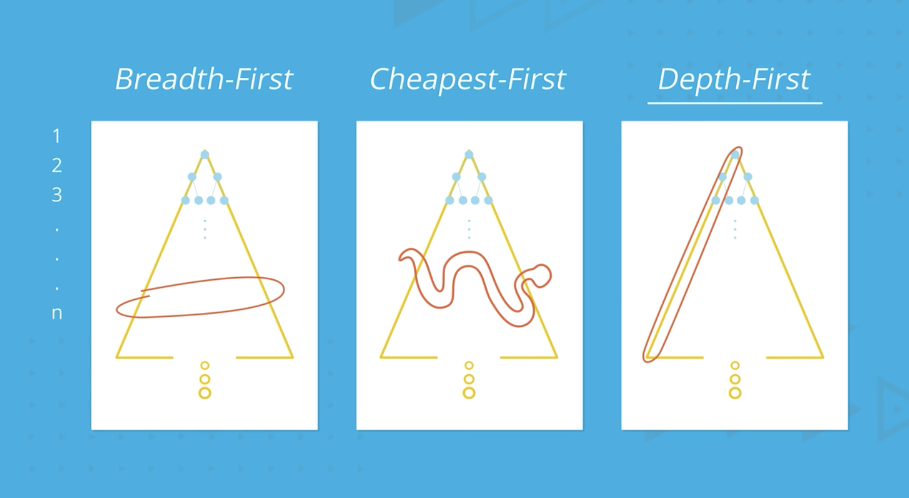
<p style="color: #555;">Figure: Different search strategies explore the state space in different patterns</p>
</div>

##### Regression Search

Regression search, also known as backward search or relevant-states search, approaches the planning problem from the
opposite direction. Instead of starting from the initial state and working forward, it begins with the goal conditions
and works backward to find a path to the initial state.

The basic regression search algorithm:

1. Start with the goal conditions
2. Find all actions whose effects could contribute to achieving the current conditions
3. For each action, compute the conditions that would need to be true before applying it
4. Check if these conditions are satisfied by the initial state
5. If not, continue the search with these conditions as new subgoals

Regression search has several advantages over progression search:

1. **Reduced Branching Factor**: By focusing on actions relevant to the goal, regression search typically explores fewer
   irrelevant paths. The branching factor is often smaller because we only consider actions that can directly contribute
   to achieving our current subgoals.
2. **Goal-Directed**: The search is naturally focused on the goal, which can make it more efficient for problems where
   only a small subset of actions leads to the goal.

However, regression search also has limitations:

1. **Complex Preconditions**: When action preconditions involve complex logical expressions, computing the regression
   (the conditions needed before an action) can be more difficult.
2. **Heuristic Application**: It can be harder to apply standard heuristics in regression search, as we're working with
   partial states rather than complete states.

In practice, the choice between progression and regression search depends on the specific characteristics of the
planning problem. Some problems are more naturally solved with one approach than the other, and many advanced planning
systems incorporate elements of both.

###### Understanding Regression Search with PDDL

Regression search, also known as backward search, represents a fundamentally different approach to automated planning
than the progression search we've discussed previously. Let me explain how regression search works with PDDL
representations and why it can be advantageous in certain planning scenarios.

###### The Concept of Regression Search

While progression search works forward from the initial state toward the goal, regression search works backward from the
goal state toward the initial state. This backward reasoning often proves more efficient because it focuses only on
actions relevant to achieving the goal.

In formal terms, regression search operates on partial states (sets of literals) rather than complete states. It starts
with the goal condition and repeatedly finds actions that could have produced those conditions, working backward until
reaching a state that is satisfied by the initial state.

Let's explore this process using our cargo transportation example:

$$\begin{align} \ & \text{Init}(\text{At}(C1, \text{SFO}) \wedge \text{At}(C2, \text{JFK}) \wedge \text{At}(P1, \text{SFO}) \wedge \text{At}(P2, \text{JFK}) \\ & \quad \wedge \text{Cargo}(C1) \wedge \text{Cargo}(C2) \wedge \text{Plane}(P1) \wedge \text{Plane}(P2) \\ & \quad \wedge \text{Airport}(\text{JFK}) \wedge \text{Airport}(\text{SFO})) \\ & \text{Goal}(\text{At}(C1, \text{JFK}) \wedge \text{At}(C2, \text{SFO})) \\ \end{align}$$

###### The Regression Process Step by Step

1. **Starting Point: The Goal State**

    We begin with the goal conditions: $$G = {\text{At}(C1, \text{JFK}), \text{At}(C2, \text{SFO})}$$

2. **Regression Step: Finding Relevant Actions**

    For each condition in our current state, we identify actions that could have produced it as an effect. Let's focus
    on the first goal condition: $\text{At}(C1, \text{JFK})$

    Looking at our action schemas, we see the $\text{Unload}$ action can produce this effect:

    $$\begin{align} \ & \text{Action}(\text{Unload}(c, p, a), \\ & \quad \text{PRECOND}: \text{In}(c, p) \wedge \text{At}(p, a) \wedge \text{Cargo}(c) \wedge \text{Plane}(p) \wedge \text{Airport}(a) \\ & \quad \text{EFFECT}: \text{At}(c, a) \wedge \neg\text{In}(c, p)) \ \end{align}$$

    When we instantiate this with $c=C1$, $a=\text{JFK}$, and any plane $p$, the action produces our desired effect.

3. **Compute Regression State**

    The regression of a state $S$ through an action $a$ produces a new state $S'$ that represents "what must be true
    before action $a$ to achieve state $S$ afterward." This involves:

    - Adding the action's preconditions
    - Removing effects of the action that are in $S$
    - Adding conditions from $S$ that are not affected by the action

    For our example, regressing ${\text{At}(C1, \text{JFK})}$ through $\text{Unload}(C1, P1, \text{JFK})$ gives us:

    $$S' = {\text{In}(C1, P1), \text{At}(P1, \text{JFK}), \text{Cargo}(C1), \text{Plane}(P1), \text{Airport}(\text{JFK})}$$

4. **Continuing the Regression**

    We now need to achieve this new state $S'$. The key element is $\text{At}(P1, \text{JFK})$, which can be achieved by
    the $\text{Fly}$ action:

    $$\begin{align} \ & \text{Action}(\text{Fly}(p, \text{from}, \text{to}), \\ & \quad \text{PRECOND}: \text{At}(p, \text{from}) \wedge \text{Plane}(p) \wedge \text{Airport}(\text{from}) \wedge \text{Airport}(\text{to}) \\ & \quad \text{EFFECT}: \neg\text{At}(p, \text{from}) \wedge \text{At}(p, \text{to})) \ \end{align}$$

    Regressing through $\text{Fly}(P1, \text{SFO}, \text{JFK})$ gives us:

    $$S'' = {\text{In}(C1, P1), \text{At}(P1, \text{SFO}), \text{Cargo}(C1), \text{Plane}(P1), \text{Airport}(\text{JFK}), \text{Airport}(\text{SFO})}$$

5. **Final Regression Step for First Goal Condition**

    We now need to achieve $\text{In}(C1, P1)$, which comes from the $\text{Load}$ action:

    $$\begin{align} \ & \text{Action}(\text{Load}(c, p, a), \\ & \quad \text{PRECOND}: \text{At}(c, a) \wedge \text{At}(p, a) \wedge \text{Cargo}(c) \wedge \text{Plane}(p) \wedge \text{Airport}(a) \\ & \quad \text{EFFECT}: \neg\text{At}(c, a) \wedge \text{In}(c, p)) \ \end{align}$$

    Regressing through $\text{Load}(C1, P1, \text{SFO})$ gives us:

    $$S''' = {\text{At}(C1, \text{SFO}), \text{At}(P1, \text{SFO}), \text{Cargo}(C1), \text{Plane}(P1), \text{Airport}(\text{SFO}), \text{Airport}(\text{JFK})}$$

6. **Similar Process for Second Goal Condition**

    We would perform a similar regression process for $\text{At}(C2, \text{SFO})$, eventually producing a sequence of
    needed conditions.

7. **Checking Consistency with Initial State**

    The regression process continues until we reach a state that is a subset of the initial state, indicating we've
    found a valid plan.

###### Mathematical Formulation of Regression

The regression operation can be formalized as follows. If $S$ is a state (set of literals) and $a$ is an action, then
the regression of $S$ through $a$ is:

$$\text{Regress}(S, a) = (S \setminus \text{add}(a)) \cup \text{pre}(a)$$

Where:

- $\text{add}(a)$ is the set of positive effects of action $a$
- $\text{pre}(a)$ is the set of preconditions of action $a$
- $S \setminus \text{add}(a)$ means all literals in $S$ except those added by $a$

This assumes that $a$ is relevant to $S$ (adds at least one literal in $S$) and consistent with $S$ (doesn't delete any
literal in $S$).

###### Advantages of Regression Search

1. **Reduced Branching Factor**: Regression search typically explores fewer irrelevant actions because it only considers
   actions that contribute directly to the goal.
2. **Goal-Directed**: By working backward from the goal, the search naturally focuses on relevant subproblems.
3. **Efficient for Problems with Specific Goals**: When the goal state specifies only a small subset of predicates
   (compared to a complete state description), regression search starts with a much smaller search space.

###### Example: Full Regression Search for Cargo Problem

Let's trace a complete regression search for our cargo transportation problem:

Initial Goal State: $$G = {\text{At}(C1, \text{JFK}), \text{At}(C2, \text{SFO})}$$

We'll perform regression for each goal condition separately and then combine them.

For $\text{At}(C1, \text{JFK})$:

1. Regress through $\text{Unload}(C1, P1, \text{JFK})$:
   $$G_1 = {\text{In}(C1, P1), \text{At}(P1, \text{JFK}), \text{Cargo}(C1), \text{Plane}(P1), \text{Airport}(\text{JFK})}$$
2. Regress through $\text{Fly}(P1, \text{SFO}, \text{JFK})$:
   $$G_2 = {\text{In}(C1, P1), \text{At}(P1, \text{SFO}), \text{Cargo}(C1), \text{Plane}(P1), \text{Airport}(\text{SFO}), \text{Airport}(\text{JFK})}$$
3. Regress through $\text{Load}(C1, P1, \text{SFO})$:
   $$G_3 = {\text{At}(C1, \text{SFO}), \text{At}(P1, \text{SFO}), \text{Cargo}(C1), \text{Plane}(P1), \text{Airport}(\text{SFO}), \text{Airport}(\text{JFK})}$$

For $\text{At}(C2, \text{SFO})$:

1. Regress through $\text{Unload}(C2, P1, \text{SFO})$:
   $$G_4 = {\text{In}(C2, P1), \text{At}(P1, \text{SFO}), \text{Cargo}(C2), \text{Plane}(P1), \text{Airport}(\text{SFO})}$$
2. Regress through $\text{Fly}(P1, \text{JFK}, \text{SFO})$:
   $$G_5 = {\text{In}(C2, P1), \text{At}(P1, \text{JFK}), \text{Cargo}(C2), \text{Plane}(P1), \text{Airport}(\text{JFK}), \text{Airport}(\text{SFO})}$$
3. Regress through $\text{Load}(C2, P1, \text{JFK})$:
   $$G_6 = {\text{At}(C2, \text{JFK}), \text{At}(P1, \text{JFK}), \text{Cargo}(C2), \text{Plane}(P1), \text{Airport}(\text{JFK}), \text{Airport}(\text{SFO})}$$

Now, combining these regression sequences and checking against the initial state, we find they are satisfied. The
resulting plan, read forward, is:

1. $\text{Load}(C1, P1, \text{SFO})$
2. $\text{Fly}(P1, \text{SFO}, \text{JFK})$
3. $\text{Unload}(C1, P1, \text{JFK})$
4. $\text{Load}(C2, P1, \text{JFK})$
5. $\text{Fly}(P1, \text{JFK}, \text{SFO})$
6. $\text{Unload}(C2, P1, \text{SFO})$

###### Implementation Considerations for Regression Search

While the concept of regression search is elegant, implementing it efficiently requires addressing several challenges:

1. **Handling Negative Literals**: Regression through actions that delete literals requires special care.
2. **Consistency Checking**: We must ensure that regressed states don't contain contradictions.
3. **Irrelevant Action Filtering**: Even though regression generally reduces the branching factor, we still need to
   filter actions that aren't relevant to the current subgoal.

A pseudocode implementation might look like:

```python
function REGRESSION-SEARCH(problem):
    current = problem.goal_conditions
    plan = []

    while not SUBSET(current, problem.initial_state):
        applicable_actions = []

        for action in problem.actions:
            if RELEVANT(action, current) and CONSISTENT(action, current):
                applicable_actions.append(action)

        if applicable_actions is empty:
            return failure

        action = SELECT-ACTION(applicable_actions, current, problem.initial_state)
        current = REGRESS(current, action)
        plan.prepend(action)

    return plan
```

###### Relation to Other Planning Techniques

Regression search complements other planning techniques:

1. **Bidirectional Search**: Some planners combine progression and regression search, working forward from the initial
   state and backward from the goal until the search frontiers meet.
2. **Partial-Order Planning**: This approach builds on regression principles but represents plans as partially ordered
   actions rather than total sequences.
3. **Heuristic Search**: Modern planners often use regression-based techniques to compute admissible heuristics for
   forward search.

###### Limitations of Regression Search

Despite its advantages, regression search has limitations:

1. **Handling Complex Preconditions**: When actions have complex preconditions involving disjunctions or existential
   quantification, regression becomes more complicated.
2. **Irrelevant Information**: The initial state often contains much information irrelevant to the goal, which
   regression search cannot easily filter out.
3. **Negative Goals**: Goals containing negative literals require special handling in regression search.

Regression search remains an important technique in the planning toolbox, particularly valuable when combined with other
approaches like progression search in a bidirectional framework or when used to develop powerful heuristics for forward
planning. Its focus on goal-relevance makes it especially suited for problems with specific goal conditions and many
potentially irrelevant actions.

##### Plan Space Search

Plan space search represents a different paradigm compared to progression and regression search. Instead of searching in
the state space, it searches in the space of partial plans, gradually refining an incomplete plan until it becomes a
complete solution.

A partial plan consists of:

1. A set of actions
2. Ordering constraints between actions
3. Causal links that capture dependencies between actions
4. A set of open conditions (subgoals) that still need to be achieved

The plan space search algorithm starts with a "null plan" that contains just two special actions: Start (representing
the initial state) and Finish (representing the goal conditions). All the goal conditions are initially listed as open
conditions that need to be achieved.

The search proceeds by selecting an open condition and either:

1. Using an existing action in the plan to achieve it, adding necessary ordering constraints and causal links
2. Adding a new action that can achieve it, along with appropriate constraints and links

This process continues until all open conditions are resolved, resulting in a complete plan.

Plan space search has several distinctive characteristics:

1. **Least Commitment**: It delays decisions about action ordering until necessary, only adding constraints when
   required by causal relationships or to resolve conflicts.
2. **Flexibility**: The resulting plans often have partial ordering, allowing for flexible execution where actions can
   be performed in different orders as long as they satisfy the constraints.
3. **Explanatory Power**: The causal links provide a clear explanation of why each action is included in the plan and
   how actions depend on each other.

###### Plan Space Search for the Sliding Puzzle Problem

One example of plan space search is shown in the context of a sliding puzzle problem. Let's analyze the sliding puzzle
action schema using proper mathematical notation:

$$\begin{align} \ & \text{Action}(\text{Slide}(t, a, b), \\ & \quad \text{Pre}: \text{On}(t, a) \wedge \text{Tile}(t) \wedge \text{Blank}(b) \wedge \text{Adj}(a, b) \\ & \quad \text{Eff}: \text{On}(t, b) \wedge \text{Blank}(a) \wedge \neg\text{On}(t, a) \wedge \neg\text{Blank}(b)) \\ \end{align}$$

This action schema represents the operation of sliding a tile in a puzzle like the 8-puzzle or 15-puzzle. Let me explain
each component:

- **Action name**: Slide(t, a, b) - This action slides tile t from position a to position b
- **Parameters**:
    - t: the tile being moved
    - a: the current position of the tile
    - b: the destination position (which must be blank)
- **Preconditions**:
    - On(t, a): Tile t is currently at position a
    - Tile(t): t is a tile (type checking)
    - Blank(b): Position b is empty (the blank space)
    - Adj(a, b): Positions a and b are adjacent to each other
- **Effects**:
    - On(t, b): Tile t is now at position b
    - Blank(a): Position a is now empty
    - ¬On(t, a): Tile t is no longer at position a
    - ¬Blank(b): Position b is no longer empty

###### Plan Space Search Approach

Plan space search differs fundamentally from state space search methods like progression or regression. Instead of
searching through possible world states, plan space search operates in the space of partial plans, gradually refining
them until a complete solution is found. Here's how it applies to the sliding puzzle:

1. **Partial Plans**: A partial plan consists of:
    - A set of actions (initially empty except for Start and Finish actions)
    - Ordering constraints between actions (which must happen before which)
    - Causal links showing how one action achieves preconditions for another
    - A set of open conditions (preconditions not yet achieved)
2. **Initial Partial Plan**: We begin with:
    - Start action (representing initial state)
    - Finish action (representing goal conditions)
    - Open conditions from the Finish action
    - No ordering constraints except Start → Finish
3. **Plan Refinement Process**: The algorithm repeatedly selects an open condition and either:
    - Uses an existing action in the plan to achieve it (establishing a causal link)
    - Adds a new action that can achieve it
4. **Resolving Threats**: When a causal link is threatened (an action might interfere with it), the planner resolves
   this by:
    - Promotion: Ordering the threatening action before the causal link's source
    - Demotion: Ordering the threatening action after the causal link's target

###### Example for the Sliding Puzzle

Let's walk through a simple example with a 3×2 sliding puzzle:

Initial state:

- Tile 1 at position A, Tile 2 at position B, Tile 3 at position C
- Blank space at position D
- Adjacent positions: (A,B), (A,D), (B,C), (B,E), (C,F), (D,E), (E,F)

Goal: Move Tile 1 to position B

Step 1: Create initial partial plan

- Start action with effects describing initial state
- Finish action with precondition On(1,B)
- Open condition: On(1,B)

Step 2: Select open condition On(1,B)

- We can achieve this with Slide(1,A,B)
- Add this action to the plan
- Add ordering: Start → Slide(1,A,B) → Finish
- Add causal link: Slide(1,A,B) →[On(1,B)]→ Finish
- Check preconditions of Slide(1,A,B):
    - On(1,A): Satisfied by initial state, add causal link
    - Tile(1): Satisfied by initial state, add causal link
    - Blank(B): Not satisfied, new open condition
    - Adj(A,B): Satisfied by initial state, add causal link

Step 3: Select open condition Blank(B)

- Currently Tile 2 is at B, so we need Slide(2,B,?)
- Where can Tile 2 go? It can go to position C or E if those are blank
- Let's say we choose Slide(2,B,E)
- Add this action to plan
- Add ordering: Start → Slide(2,B,E) → Slide(1,A,B) → Finish
- Add causal link: Slide(2,B,E) →[Blank(B)]→ Slide(1,A,B)
- Check preconditions of Slide(2,B,E):
    - On(2,B): Satisfied by initial state, add causal link
    - Tile(2): Satisfied by initial state, add causal link
    - Blank(E): Not satisfied, new open condition
    - Adj(B,E): Satisfied by initial state, add causal link

Step 4: Select open condition Blank(E)

- We keep working backward in this fashion until all open conditions are satisfied
- This might require several more Slide actions

Step 5: Check for threats

- For each causal link, check if any action threatens it
- E.g., if an action has the effect ¬Blank(B), it would threaten the causal link providing Blank(B)
- Resolve threats by adding ordering constraints

###### Mathematical Representation of the Search

Formally, the plan space search can be represented as a tuple ⟨A, O, L, B⟩ where:

- A is the set of actions in the plan
- O is a set of ordering constraints (ai ≺ aj)
- L is a set of causal links (ai →[p]→ aj)
- B is a set of binding constraints on variables

At each step, we:

1. Select an open condition p needed by some action aj
2. Choose an action ai (existing or new) with effect p
3. Add a causal link ai →[p]→ aj
4. Add ordering constraint ai ≺ aj
5. Update binding constraints if needed
6. Check for and resolve threats

###### Advantages for Sliding Puzzle Problems

Plan space search offers several advantages for sliding puzzle problems:

1. **Least Commitment Principle**: The planner only adds constraints when necessary, maintaining flexibility in the
   final plan. This is valuable because the order of moves in sliding puzzles can often be rearranged.
2. **Focus on Causal Structure**: By explicitly representing how actions achieve preconditions, the planner focuses on
   the critical dependencies between moves, avoiding irrelevant state details.
3. **Handling Interactions**: Plan space search naturally handles interactions between different tile movements,
   allowing the planner to detect when certain sequences of moves might interfere with each other.
4. **Partial-Order Solutions**: Instead of a total order of actions, the result can be a partial order, identifying
   which moves must precede others while allowing flexibility in the remaining ordering.

In practice, plan space search was historically important but has been overtaken by state space search methods with
sophisticated heuristics for problems like sliding puzzles. However, its focus on causal relationships between actions
provides valuable insights into planning problem structure, and elements of plan space reasoning appear in many modern
planning systems.

The sliding puzzle example illustrates how plan space search reasons about the dependencies between actions, gradually
building a consistent plan that transforms the initial configuration into the goal configuration.

In this puzzle, we can only slide a tile to an adjacent blank space. A plan space search would build a plan by
identifying which tiles need to move where, establishing causal relationships between moves, and ensuring that conflicts
(like trying to move two tiles to the same space) are resolved.

While plan space search can be more complex to implement than state space search, it offers advantages for certain types
of problems, particularly those with complex causal dependencies or where flexible execution is important.

Classical planning techniques provide the foundation for more advanced planning approaches that can handle uncertainty,
partial observability, and real-time constraints. By understanding these fundamental concepts, we can develop planning
systems capable of solving increasingly complex real-world problems.

###### Implementing a Plan Space Search for the Sliding Puzzle in Python

I'll create a comprehensive Python implementation for solving sliding puzzles using plan space search. This will help
demonstrate how this planning approach works in practice.

```python
class Predicate:
    """
    Represents a logical predicate like On(t, a) or Blank(b).
    """
    def __init__(self, name, arguments, negated=False):
        self.name = name
        self.arguments = tuple(arguments)  # Make immutable for hashing
        self.negated = negated

    def negate(self):
        """Return a negated version of this predicate."""
        return Predicate(self.name, self.arguments, not self.negated)

    def __eq__(self, other):
        if not isinstance(other, Predicate):
            return False
        return (self.name == other.name and
                self.arguments == other.arguments and
                self.negated == other.negated)

    def __hash__(self):
        return hash((self.name, self.arguments, self.negated))

    def __str__(self):
        prefix = "¬" if self.negated else ""
        return f"{prefix}{self.name}({', '.join(self.arguments)})"

    def __repr__(self):
        return self.__str__()


class Action:
    """
    Represents an action with preconditions and effects.
    """
    def __init__(self, name, parameters, preconditions, effects):
        self.name = name
        self.parameters = parameters
        self.preconditions = preconditions
        self.effects = effects

    def __str__(self):
        return f"{self.name}({', '.join(self.parameters)})"

    def __repr__(self):
        return self.__str__()


class CausalLink:
    """
    Represents a causal link where one action establishes a condition for another.
    """
    def __init__(self, from_action, to_action, condition):
        self.from_action = from_action
        self.to_action = to_action
        self.condition = condition

    def __str__(self):
        return f"{self.from_action} --[{self.condition}]--> {self.to_action}"

    def __repr__(self):
        return self.__str__()


class OrderingConstraint:
    """
    Represents an ordering constraint where one action must occur before another.
    """
    def __init__(self, before, after):
        self.before = before
        self.after = after

    def __eq__(self, other):
        if not isinstance(other, OrderingConstraint):
            return False
        return self.before == other.before and self.after == other.after

    def __hash__(self):
        return hash((self.before, self.after))

    def __str__(self):
        return f"{self.before} < {self.after}"

    def __repr__(self):
        return self.__str__()


class OpenCondition:
    """
    Represents a precondition that has not yet been achieved.
    """
    def __init__(self, condition, action):
        self.condition = condition
        self.action = action  # The action that needs this condition

    def __str__(self):
        return f"{self.condition} needed by {self.action}"

    def __repr__(self):
        return self.__str__()


class PartialPlan:
    """
    Represents a partial plan in the plan space search.
    """
    def __init__(self, actions=None, orderings=None, links=None, open_conditions=None):
        self.actions = actions or []
        self.orderings = orderings or set()
        self.links = links or []
        self.open_conditions = open_conditions or []

    def is_complete(self):
        """Check if the plan is complete (no open conditions)."""
        return len(self.open_conditions) == 0

    def select_open_condition(self):
        """Select an open condition to work on next."""
        # Simple strategy: take the first one
        return self.open_conditions[0] if self.open_conditions else None

    def add_action(self, action):
        """Add an action to the plan."""
        self.actions.append(action)

        # Add ordering constraints with start and finish actions
        start_action = self.get_start_action()
        finish_action = self.get_finish_action()

        if start_action and action != start_action:
            self.orderings.add(OrderingConstraint(start_action, action))

        if finish_action and action != finish_action:
            self.orderings.add(OrderingConstraint(action, finish_action))

    def add_ordering(self, before, after):
        """Add an ordering constraint."""
        self.orderings.add(OrderingConstraint(before, after))

    def add_link(self, from_action, to_action, condition):
        """Add a causal link."""
        link = CausalLink(from_action, to_action, condition)
        self.links.append(link)

    def remove_open_condition(self, open_condition):
        """Remove an open condition from the list."""
        self.open_conditions.remove(open_condition)

    def add_open_conditions(self, conditions, action):
        """Add new open conditions for an action's preconditions."""
        for condition in conditions:
            self.open_conditions.append(OpenCondition(condition, action))

    def get_start_action(self):
        """Get the start action."""
        for action in self.actions:
            if action.name == "Start":
                return action
        return None

    def get_finish_action(self):
        """Get the finish action."""
        for action in self.actions:
            if action.name == "Finish":
                return action
        return None

    def find_threats(self):
        """Find threats to causal links in the plan."""
        threats = []

        for link in self.links:
            for action in self.actions:
                # Skip if action is part of the causal link
                if action == link.from_action or action == link.to_action:
                    continue

                # Check if action threatens this causal link
                for effect in action.effects:
                    if effect == link.condition.negate():
                        # This action threatens the causal link
                        threats.append((action, link))

        return threats

    def copy(self):
        """Create a copy of this partial plan."""
        return PartialPlan(
            actions=self.actions.copy(),
            orderings=self.orderings.copy(),
            links=self.links.copy(),
            open_conditions=self.open_conditions.copy()
        )

    def __str__(self):
        return (f"Actions: {self.actions}\n"
                f"Orderings: {self.orderings}\n"
                f"Links: {self.links}\n"
                f"Open Conditions: {self.open_conditions}")


def create_sliding_puzzle_problem(initial_state, goal_state):
    """
    Create start and finish actions for a sliding puzzle problem.

    initial_state: Dictionary mapping positions to tiles (or 'blank')
    goal_state: Dictionary mapping positions to tiles (or 'blank')
    """
    # Create predicates for initial state
    initial_effects = []
    for pos, tile in initial_state.items():
        if tile == 'blank':
            initial_effects.append(Predicate("Blank", [pos]))
        else:
            initial_effects.append(Predicate("On", [tile, pos]))
            initial_effects.append(Predicate("Tile", [tile]))

    # Add adjacent positions (assuming a standard puzzle layout)
    # This would need to be customized for different puzzle sizes
    adjacency = get_adjacency_for_puzzle(initial_state)
    for pos1, pos2 in adjacency:
        initial_effects.append(Predicate("Adj", [pos1, pos2]))

    # Create predicates for goal state
    goal_preconditions = []
    for pos, tile in goal_state.items():
        if tile != 'blank' and tile in initial_state.values():
            goal_preconditions.append(Predicate("On", [tile, pos]))

    # Create start and finish actions
    start_action = Action("Start", [], [], initial_effects)
    finish_action = Action("Finish", [], goal_preconditions, [])

    # Create slide action schema
    slide_preconditions = [
        Predicate("On", ["t", "a"]),
        Predicate("Tile", ["t"]),
        Predicate("Blank", ["b"]),
        Predicate("Adj", ["a", "b"])
    ]

    slide_effects = [
        Predicate("On", ["t", "b"]),
        Predicate("Blank", ["a"]),
        Predicate("On", ["t", "a"], negated=True),
        Predicate("Blank", ["b"], negated=True)
    ]

    slide_action = Action("Slide", ["t", "a", "b"], slide_preconditions, slide_effects)

    return start_action, finish_action, slide_action


def get_adjacency_for_puzzle(state):
    """
    Determine adjacency relationships based on the puzzle layout.
    This implementation assumes a 3x2 puzzle, but could be generalized.
    """
    # For a 3x2 puzzle with positions A, B, C, D, E, F
    return [
        ('A', 'B'), ('B', 'A'),
        ('A', 'D'), ('D', 'A'),
        ('B', 'C'), ('C', 'B'),
        ('B', 'E'), ('E', 'B'),
        ('C', 'F'), ('F', 'C'),
        ('D', 'E'), ('E', 'D'),
        ('E', 'F'), ('F', 'E')
    ]


def instantiate_action(action_schema, bindings):
    """
    Create an instantiated action by applying variable bindings.
    """
    # Create parameter mapping
    param_map = dict(zip(action_schema.parameters, bindings))

    # Apply bindings to parameters
    new_params = bindings

    # Apply bindings to preconditions
    new_preconditions = []
    for precond in action_schema.preconditions:
        new_args = [param_map.get(arg, arg) for arg in precond.arguments]
        new_preconditions.append(Predicate(precond.name, new_args, precond.negated))

    # Apply bindings to effects
    new_effects = []
    for effect in action_schema.effects:
        new_args = [param_map.get(arg, arg) for arg in effect.arguments]
        new_effects.append(Predicate(effect.name, new_args, effect.negated))

    return Action(action_schema.name, new_params, new_preconditions, new_effects)


def find_action_for_condition(condition, actions, existing_actions):
    """
    Find actions that can establish the given condition.

    Returns a list of (action, is_new) pairs, where is_new indicates
    whether this is a new action or an existing one.
    """
    matching_actions = []

    # First, check existing actions
    for action in existing_actions:
        for effect in action.effects:
            if effect == condition:
                matching_actions.append((action, False))

    # Then, look at potential new actions to add
    for action_schema in actions:
        if action_schema.name == "Start" or action_schema.name == "Finish":
            continue  # Skip start and finish, they're already in the plan

        # For the Slide action, we need to instantiate it with appropriate arguments
        if action_schema.name == "Slide":
            # Find possible bindings that would achieve the condition
            if condition.name == "On" and not condition.negated:
                tile, pos_b = condition.arguments

                # We need to find where this tile could slide from
                for pos_a in ["A", "B", "C", "D", "E", "F"]:  # All possible positions
                    # Instantiate the Slide action to move tile from pos_a to pos_b
                    bindings = [tile, pos_a, pos_b]
                    instantiated = instantiate_action(action_schema, bindings)
                    matching_actions.append((instantiated, True))

            elif condition.name == "Blank" and not condition.negated:
                pos_a = condition.arguments[0]

                # We need to find a tile that could move to free up pos_a
                for tile in ["1", "2", "3"]:  # All possible tiles
                    for pos_b in ["A", "B", "C", "D", "E", "F"]:  # All possible destinations
                        bindings = [tile, pos_a, pos_b]
                        instantiated = instantiate_action(action_schema, bindings)
                        matching_actions.append((instantiated, True))

    return matching_actions


def detect_conflicts(plan, new_ordering):
    """
    Check if adding a new ordering constraint would create a cycle.
    """
    # Start with all existing orderings
    all_orderings = plan.orderings.copy()
    all_orderings.add(new_ordering)

    # Build a directed graph
    graph = {}
    for ordering in all_orderings:
        if ordering.before not in graph:
            graph[ordering.before] = []
        graph[ordering.before].append(ordering.after)

    # Check for cycles using DFS
    visited = set()
    rec_stack = set()

    def is_cyclic_util(node):
        visited.add(node)
        rec_stack.add(node)

        if node in graph:
            for neighbor in graph[node]:
                if neighbor not in visited:
                    if is_cyclic_util(neighbor):
                        return True
                elif neighbor in rec_stack:
                    return True

        rec_stack.remove(node)
        return False

    for node in graph:
        if node not in visited:
            if is_cyclic_util(node):
                return True

    return False


def plan_space_search(initial_state, goal_state):
    """
    Perform plan space search to solve a sliding puzzle problem.
    """
    # Create problem actions
    start_action, finish_action, slide_action_schema = create_sliding_puzzle_problem(
        initial_state, goal_state)

    # Initialize the partial plan
    initial_plan = PartialPlan()
    initial_plan.add_action(start_action)
    initial_plan.add_action(finish_action)
    initial_plan.add_ordering(start_action, finish_action)
    initial_plan.add_open_conditions(finish_action.preconditions, finish_action)

    # List of available action schemas
    actions = [start_action, finish_action, slide_action_schema]

    # Start search
    fringe = [initial_plan]

    while fringe:
        # Get the next plan to refine
        plan = fringe.pop(0)

        # Check if the plan is complete
        if plan.is_complete():
            return extract_solution(plan)

        # Select an open condition to work on
        open_condition = plan.select_open_condition()

        # Find actions that can establish this condition
        potential_actions = find_action_for_condition(
            open_condition.condition, actions, plan.actions)

        # Try each potential action
        for action, is_new in potential_actions:
            # Create a new plan by extending the current one
            new_plan = plan.copy()

            # If this is a new action, add it to the plan
            if is_new:
                new_plan.add_action(action)

            # Add causal link
            new_plan.add_link(action, open_condition.action, open_condition.condition)

            # Add ordering constraint
            new_ordering = OrderingConstraint(action, open_condition.action)

            # Check if this ordering would create a cycle
            if detect_conflicts(new_plan, new_ordering):
                continue  # Skip this action if it would create a cycle

            new_plan.add_ordering(action, open_condition.action)

            # Remove the open condition
            new_plan.remove_open_condition(open_condition)

            # If this is a new action, add its preconditions as open conditions
            if is_new:
                new_plan.add_open_conditions(action.preconditions, action)

            # Resolve threats
            threats = new_plan.find_threats()
            threat_resolved = True

            for threatening_action, threatened_link in threats:
                # Try promotion (ordering threatening action before link source)
                promotion = OrderingConstraint(threatening_action, threatened_link.from_action)
                if not detect_conflicts(new_plan, promotion):
                    new_plan.add_ordering(threatening_action, threatened_link.from_action)
                    continue

                # Try demotion (ordering threatening action after link target)
                demotion = OrderingConstraint(threatened_link.to_action, threatening_action)
                if not detect_conflicts(new_plan, demotion):
                    new_plan.add_ordering(threatened_link.to_action, threatening_action)
                    continue

                # If neither works, this plan is flawed
                threat_resolved = False
                break

            if threat_resolved:
                fringe.append(new_plan)

    return None  # No solution found


def extract_solution(plan):
    """
    Extract a linear sequence of actions from a complete partial plan.
    """
    # Build a directed graph from ordering constraints
    graph = {}
    for action in plan.actions:
        graph[action] = []

    for ordering in plan.orderings:
        graph[ordering.before].append(ordering.after)

    # Perform a topological sort
    visited = set()
    result = []

    def topological_sort_util(node):
        visited.add(node)

        if node in graph:
            for neighbor in graph[node]:
                if neighbor not in visited:
                    topological_sort_util(neighbor)

        result.insert(0, node)

    for action in plan.actions:
        if action not in visited:
            topological_sort_util(action)

    # Filter out Start and Finish actions
    return [action for action in result if action.name not in ["Start", "Finish"]]


def solve_sliding_puzzle(initial_state, goal_state):
    """
    Solve a sliding puzzle using plan space search.
    """
    solution = plan_space_search(initial_state, goal_state)

    if solution:
        print("Solution found:")
        for i, action in enumerate(solution, 1):
            print(f"{i}. {action}")
        return solution
    else:
        print("No solution found.")
        return None


# Example usage: solve a 3x2 sliding puzzle
if __name__ == "__main__":
    # Initial state: 1 2 3
    #                B 4 5
    initial_state = {
        'A': '1', 'B': '2', 'C': '3',
        'D': 'blank', 'E': '4', 'F': '5'
    }

    # Goal state: move tile 2 to position E
    goal_state = {
        'E': '2'
    }

    solve_sliding_puzzle(initial_state, goal_state)
```

###### Key Components of the Implementation

This implementation demonstrates several important aspects of plan space search:

1. **Representation of Partial Plans**: The `PartialPlan` class encapsulates the four key components:
    - Actions in the plan
    - Ordering constraints between actions
    - Causal links showing how effects satisfy preconditions
    - Open conditions that still need to be achieved
2. **Threat Detection and Resolution**: The code identifies and resolves threats to causal links using promotion and
   demotion strategies.
3. **Action Selection**: When choosing actions to satisfy open conditions, the algorithm considers both existing actions
   in the plan and new actions that could be added.
4. **Consistency Checking**: The implementation checks for cyclic ordering constraints, which would make a plan
   inconsistent.
5. **Solution Extraction**: Once a complete plan is found, a topological sort is used to extract a valid sequence of
   actions.

###### How to Use the Implementation

The main entry point is the `solve_sliding_puzzle` function. You provide:

1. An initial state dictionary mapping positions to tiles (with 'blank' representing the empty space)
2. A goal state dictionary (which can be partial, specifying only the tiles you care about)

For example:

```python
# Initial state: 1 2 3
#                B 4 5
initial_state = {
    'A': '1', 'B': '2', 'C': '3',
    'D': 'blank', 'E': '4', 'F': '5'
}

# Goal state: move tile 2 to position E
goal_state = {
    'E': '2'
}

solution = solve_sliding_puzzle(initial_state, goal_state)
```

This will find a sequence of slide actions to move tile 2 to position E.

###### Limitations and Potential Improvements

While this implementation demonstrates the core concepts of plan space search, there are several ways it could be
improved:

1. **Efficiency**: The current implementation does a breadth-first search through plan space. For larger puzzles, more
   sophisticated search strategies (like A\* with appropriate heuristics) would be needed.
2. **Action Generation**: The action generation code makes simplifying assumptions about the puzzle structure. A more
   general implementation would handle puzzles of any size.
3. **Variable Binding**: The handling of variable bindings and action instantiation is simplified. A more robust
   implementation would include unification algorithms.
4. **Plan Refinement Selection**: The implementation simply selects the first open condition. More sophisticated
   strategies could prioritize open conditions based on their estimated difficulty.
5. **Threat Resolution**: The current approach for threat resolution is basic. Advanced planners use more sophisticated
   strategies, including separation and confrontation.

This implementation provides a foundation that can be extended and optimized for more complex planning problems. The
plan space search approach demonstrated here captures the essence of least-commitment planning, which can be
particularly effective for problems where the causal structure is more important than the specific state transitions.

#### Planning Under Uncertainty

Classical planning assumes a deterministic, fully observable environment where the effects of actions are predictable
and the current state is completely known. However, real-world planning problems rarely satisfy these assumptions. When
robots navigate physical spaces, when automated systems interact with humans, or when planning occurs in dynamic
environments, uncertainty becomes unavoidable. This section explores how planning systems handle this uncertainty.

##### Nondeterministic Domains

In nondeterministic domains, actions can have multiple possible outcomes, and the planner cannot predict with certainty
which outcome will occur. This unpredictability fundamentally changes the nature of planning.

Unlike deterministic planning where a sequence of actions constitutes a solution, nondeterministic planning requires
solutions that can handle all possible action outcomes. The plan must account for various contingencies that might arise
during execution.

Consider a simple example: a robot navigating across a slippery floor. When the robot attempts to move forward, it
might:

1. Successfully move forward as intended
2. Slip and move farther than intended
3. Slip sideways while moving forward
4. Fail to move at all due to insufficient traction

A plan that simply says "move forward three times" would be inadequate in this environment because it doesn't account
for these variations. Instead, the plan must specify what to do in each possible situation that might arise from the
nondeterministic actions.

###### Representing a Stochastic Action in PDDL

Formally, we represent nondeterministic actions by modifying our action schema to include multiple possible outcome
sets. The stochastic robot movement action provided represents a non-deterministic action where the robot's attempt to
move might have different possible outcomes.

$$\begin{align} \ & \text{Action}(\text{Move}(\text{robot}, \text{from}, \text{to}), \\ & \quad \text{PRECOND}: \text{At}(\text{robot}, \text{from}) \wedge \text{Adjacent}(\text{from}, \text{to}) \\ & \quad \text{EFFECT}: [\text{At}(\text{robot}, \text{to}) \wedge \neg\text{At}(\text{robot}, \text{from})] \vee \\ & \quad\quad\quad\quad\; [\text{At}(\text{robot}, \text{from})] \vee \\ & \quad\quad\quad\quad\; [\text{At}(\text{robot}, \text{adjacent-unintended}) \wedge \neg\text{At}(\text{robot}, \text{from})]) \ \end{align}$$

This action schema represents a robot moving in an environment where outcomes are uncertain. Let me break down what this
means:

The action has two preconditions that must be satisfied before it can be executed:

1. The robot must currently be at location "from"
2. Locations "from" and "to" must be adjacent to each other

The following notation is a structured way to define what an action is, when it can be applied, and what happens when
it's executed. This particular representation follows the STRIPS-style action model that's foundational to modern
planning systems.

$\begin{align} \ & \text{Action}(\text{action\_name}(\text{parameters}), \\ & \quad \text{PRECOND}: \text{preconditions} \\ & \quad \text{EFFECT}: \text{effects}) \\ \end{align}$

What makes this action particularly interesting is that it has three possible outcomes (expressed as a disjunction with
$\vee$):

1. **Success**: The robot successfully moves to the intended location "to" and is no longer at "from"
2. **No movement**: The robot attempts to move but remains at the original location "from"
3. **Unintended movement**: The robot moves to some other adjacent location (not the intended "to") and is no longer at
   "from"

This type of action representation is crucial for planning under uncertainty, where the planner must account for all
possible outcomes rather than assuming deterministic results. Such representations are fundamental to contingency
planning and probabilistic planning approaches.

###### Understanding Deterministic vs. Stochastic Actions

In classical planning, actions are typically deterministic - meaning when you perform an action, you know exactly what
will happen. For example, if a robot moves from location A to location B, it will definitely end up at location B.

But real-world scenarios rarely work this way. In reality, actions often have uncertain outcomes. Imagine a robot trying
to move across a slippery floor - it might:

- Successfully reach its target location
- Slip and stay in place
- Slip and end up somewhere else entirely

This is what we call a stochastic or non-deterministic action.

###### Breaking Down the Move Action

The action you asked about represents this kind of uncertainty:

$$\begin{align} \ & \text{Action}(\text{Move}(\text{robot}, \text{from}, \text{to}), \\ & \quad \text{PRECOND}: \text{At}(\text{robot}, \text{from}) \wedge \text{Adjacent}(\text{from}, \text{to}) \\ & \quad \text{EFFECT}: [\text{At}(\text{robot}, \text{to}) \wedge \neg\text{At}(\text{robot}, \text{from})] \vee \; [\text{At}(\text{robot}, \text{from})] \vee \; [\text{At}(\text{robot}, \text{adjacent-unintended}) \wedge \neg\text{At}(\text{robot}, \text{from})]) \ \end{align}$$

Let's analyze each part:

###### Understanding Stochastic Action Representation in Planning

###### Action Name and Parameters

$\begin{align}\text{Move}(\text{robot}, \text{from}, \text{to}\end{align})$ names the action and specifies three
parameters:

- The robot performing the movement
- The starting location "from"
- The intended destination "to"

**Preconditions** Before the robot can attempt this move, two conditions must be true:

1. $$\text{At}(\text{robot}, \text{from})$$: The robot must currently be at the starting location
2. $$\text{Adjacent}(\text{from}, \text{to})$$: The starting and intended destination locations must be adjacent

**Effects** This is where things get interesting. The effects are listed as three possibilities connected by the logical
OR operator ($$\vee$$):

1. **First possibility**: $$[\text{At}(\text{robot}, \text{to}) \wedge \neg\text{At}(\text{robot}, \text{from})]$$
    - The robot successfully moves to the intended destination "to"
    - It is no longer at the starting location "from"
    - This represents the "everything went as planned" outcome
2. **Second possibility**: $$[\text{At}(\text{robot}, \text{from})]$$
    - The robot attempts to move but ends up staying at the same location
    - This might represent the robot slipping or failing to move
    - Note that we don't need to explicitly state that the robot is not at other locations because it hasn't moved
3. **Third possibility**:
   $$[\text{At}(\text{robot}, \text{adjacent-unintended}) \wedge \neg\text{At}(\text{robot}, \text{from})]$$
    - The robot moves, but not to the intended destination
    - Instead, it ends up at some other adjacent location
    - It is no longer at the starting location
    - "adjacent-unintended" would typically be a variable that could take the value of any location adjacent to "from"
      other than "to"

###### Why This Matters for Planning

When a planner encounters an action like this, it can't simply assume one outcome. Instead, it needs to consider all
possible results and plan accordingly. This leads to several planning approaches:

1. **Conformant Planning**: Creating plans that will succeed regardless of which outcome occurs
2. **Contingency Planning**: Creating branching plans with different strategies for each possible outcome
3. **Policy Generation**: Creating a complete mapping from states to actions that guides the robot no matter what
   happens

###### Real-World Example

Imagine a Mars rover navigating rocky terrain. When mission control sends a command to move 10 meters forward:

- The rover might successfully move 10 meters
- It might encounter an obstacle and not move at all
- It might slip on loose soil and veer off to the side

NASA planners must account for all these possibilities, which is why their planning systems incorporate models of action
uncertainty similar to what you've shown.

###### Comparison with Deterministic Actions

In contrast, a deterministic version of this action would simply be:

$$\begin{align} \ & \text{Action}(\text{Move}(\text{robot}, \text{from}, \text{to}), \\ & \quad \text{PRECOND}: \text{At}(\text{robot}, \text{from}) \wedge \text{Adjacent}(\text{from}, \text{to}) \\ & \quad \text{EFFECT}: \text{At}(\text{robot}, \text{to}) \wedge \neg\text{At}(\text{robot}, \text{from})) \ \end{align}$$

The difference is significant - with the deterministic version, a planner can build a simple linear sequence of actions.
With the stochastic version, planning becomes much more complex but also more realistic.

This representation captures the idea that the Move action might result in successfully reaching the destination,
remaining in place, or ending up in an unintended adjacent location.

To handle this nondeterminism, we need to represent belief states rather than individual states. A belief state is a set
of possible states the system might be in, given the actions taken and observations made. Planning in nondeterministic
domains thus becomes a search through belief space rather than state space.

##### Contingency Plans

Contingency plans (also called conditional plans) explicitly account for different possible outcomes of nondeterministic
actions. Rather than being a simple sequence of actions, a contingency plan is a tree-like structure where:

1. Each branch point represents a different possible outcome of an action
2. Each branch specifies what to do in that particular contingency
3. The plan continues until all possible execution paths reach a goal state

For example, a robot's contingency plan might look like:

- Move forward
- If successfully reached target location:
    - Pick up object
- If still at original location:
    - Try moving forward again
- If at unintended location:
    - Recalculate path and begin new plan

Contingency plans can be represented formally as a function mapping from belief states to actions. The function
specifies which action to take in each possible belief state that might be encountered during execution.

The size of contingency plans can grow exponentially with the number of nondeterministic actions and the planning
horizon. This "contingency explosion" is one of the key challenges in planning under uncertainty. If each action has
just two possible outcomes and the plan has a depth of 10, the contingency plan might need to account for up to 2^10 =
1,024 different scenarios.

Despite this complexity, contingency plans offer several advantages:

- They provide a complete solution that handles all possible scenarios
- They can be executed without further planning during runtime
- They make explicit the decision points and response strategies

One approach to mitigating the contingency explosion is to focus on relevant contingencies – those that significantly
impact goal achievement – while simplifying or abstracting others.

###### Mathematical Formulation of Contingency Plans

Contingency plans are critical for handling nondeterministic actions in automated planning. Unlike linear plans used in
classical planning, contingency plans have a branching structure to account for different possible outcomes.

Let me provide a formal mathematical representation of contingency plans using proper notation:

$$\text{A contingency plan can be defined as a tuple } \Pi = (N, E, n_0, \alpha, \beta) \text{ where:}$$

$$N \text{ is a set of nodes}$$ $$E \subseteq N \times N \text{ is a set of directed edges}$$
$$n_0 \in N \text{ is the root node (starting point)}$$
$$\alpha: N \rightarrow A \cup {\text{null}} \text{ assigns an action to each node}$$
$$\beta: E \rightarrow O \text{ assigns an observation to each edge}$$

In this formulation, each node represents a decision point in the plan. The function $\alpha$ specifies which action to
take at each node, and the function $\beta$ indicates which observation leads to which next node.

###### Example of a Contingency Plan

Consider a robot navigating through uncertain terrain. When it attempts to move from location $\text{loc}_1$ to
$\text{loc}_2$, three outcomes are possible:

1. Success: The robot reaches $\text{loc}_2$
2. Failure: The robot remains at $\text{loc}_1$
3. Error: The robot slips to an unintended location $\text{loc}_k$

A contingency plan for this scenario might be formally represented as:

$$\Pi = \begin{cases} \text{At node } n_0: \text{ Execute } \text{Move}(\text{robot}, \text{loc}_1, \text{loc}_2) \\ \text{If observe } \text{At}(\text{robot}, \text{loc}_2): \text{ Go to node } n_1 \\ \text{If observe } \text{At}(\text{robot}, \text{loc}_1): \text{ Go to node } n_0 \text{ (retry)} \\ \text{If observe } \text{At}(\text{robot}, \text{loc}_k): \text{ Go to node } n_2 \ \\ \text{At node } n_1: \text{ Execute } \text{Move}(\text{robot}, \text{loc}_2, \text{loc}_3) \\ \text{If observe } \text{At}(\text{robot}, \text{loc}_3): \text{ Goal achieved} \\ \text{If observe } \text{At}(\text{robot}, \text{loc}_2): \text{ Go to node } n_1 \text{ (retry)} \\ \text{If observe } \text{At}(\text{robot}, \text{loc}_m): \text{ Go to node } n_3 \ \\ \text{At node } n_2: \text{ Execute recovery action for being at loc}_k \\ \text{At node } n_3: \text{ Execute recovery action for being at loc}_m \ \end{cases}$$

###### Execution Semantics

The execution of a contingency plan follows a simple procedure that can be defined recursively:

$$\text{Execute}(\Pi, s) = \begin{cases} s & \text{if } \alpha(n_0) = \text{null and } s \text{ satisfies the goal} \\ \text{Execute}(\Pi_{n'}, \text{Result}(s, \alpha(n_0), o)) & \text{otherwise} \end{cases}$$

Where:

- $s$ is the current state
- $o$ is the observed outcome after executing action $\alpha(n_0)$
- $n'$ is the next node such that $\beta((n_0, n')) = o$
- $\Pi_{n'}$ is the sub-plan rooted at node $n'$

###### Comparison with Classical Plans

The key difference between contingency plans and classical plans can be expressed mathematically:

Classical Plan: $\pi = \langle a_1, a_2, ..., a_n \rangle$

Contingency Plan: $\Pi = (N, E, n_0, \alpha, \beta)$

This difference reflects the fundamental shift from planning with certainty to planning under uncertainty. While a
classical plan is simply a sequence of actions, a contingency plan is a directed graph that branches according to
observed outcomes.

###### Properties of Valid Contingency Plans

A valid contingency plan must satisfy several mathematical properties:

1. **Executability**: $\forall n \in N, \forall s \in \text{Belief}(n): \text{Applicable}(\alpha(n), s)$
2. **Completeness**:
   $\forall n \in N, \forall o \in \text{Outcomes}(\alpha(n)): \exists (n, n') \in E \text{ such that } \beta((n, n')) = o$
3. **Goal Achievement**: Every execution path must eventually reach a goal state.

These formal properties ensure that the contingency plan can be successfully executed regardless of which outcomes
actually occur during execution.

##### And-Or Search Trees

And-Or search trees provide a natural framework for generating contingency plans in nondeterministic domains. Unlike
standard search trees (which contain only OR nodes representing choice points), And-Or trees contain two types of nodes:

1. **OR nodes**: Represent choice points where the agent selects an action
2. **AND nodes**: Represent contingency points where the environment determines the outcome

The search process works as follows:

1. Start with the initial belief state as an OR node
2. For each applicable action, create an AND node representing that action choice
3. For each possible outcome of the chosen action, create an OR node representing the resulting belief state
4. Continue this process until reaching goal belief states (where all possible states satisfy the goal)

A solution to an And-Or search problem is a subtree where:

- Every OR node has exactly one child (representing the chosen action)
- Every AND node has all its children (representing all possible outcomes)
- All leaf nodes are goal states

The key is understanding the difference between the search process (how we explore the space of possible plans) and the
solution (the final plan we extract).

During the search process, we build a large AND-OR tree by:

1. Starting with the initial belief state as an OR node
2. Creating multiple AND nodes under it (one for each possible action)
3. Creating multiple OR nodes under each AND node (one for each possible outcome)
4. And so on, building a large tree with many branches

However, a solution is not the entire search tree - it's a carefully pruned subtree that represents our contingency
plan. This is where the three properties come in:

1. "Every OR node has exactly one child" - This means we've made a decision about which action to take at each choice
   point. We've pruned away all the other action choices, keeping only our selected action.
2. "Every AND node has all its children" - This means we must plan for all possible outcomes of our chosen actions. We
   can't ignore any possible outcome, or our plan would be incomplete.
3. "All leaf nodes are goal states" - This ensures our plan always achieves the goal, regardless of which outcomes
   occur.

Let me illustrate with a simple example:

Imagine a robot trying to cross a slippery bridge. At each position, it can choose to move forward carefully or quickly.
If it moves carefully, it will either succeed (90% chance) or stay in place (10% chance). If it moves quickly, it might
succeed (70%), stay in place (20%), or fall off the bridge (10%).

During search, we build a large tree exploring all these possibilities. But a solution might be:

- At the start (OR node), choose "move carefully" (keeping just one child)
- The "move carefully" action (AND node) has two possible outcomes (keeping all children)
- If the robot succeeds, it reaches the goal
- If the robot stays in place, it tries "move carefully" again
- And so on

This solution is a subtree of the full search space that satisfies our three conditions.

To directly address your question: Yes, during the search process, an OR node has multiple children (representing
different possible actions). But in the final solution, we select just one of those actions at each OR node, pruning
away the others.

The distinction is between the search space (which contains all possibilities) and the solution (which contains only our
chosen actions but must account for all possible outcomes).

The search algorithm can be implemented as follows:

```python
function AND-OR-GRAPH-SEARCH(problem) returns a conditional plan, or failure
    return OR-SEARCH(problem.INITIAL-STATE, problem, [])

function OR-SEARCH(state, problem, path) returns a conditional plan, or failure
    if problem.IS-GOAL(state) then return the empty plan
    if state is on path then return failure
    for each action in problem.ACTIONS(state) do
        plan ← AND-SEARCH(RESULTS(state, action), problem, [state | path])
        if plan ≠ failure then return [action | plan]
    return failure

function AND-SEARCH(states, problem, path) returns a conditional plan, or failure
    for each s_i in states do
        plan_i ← OR-SEARCH(s_i, problem, path)
        if plan_i = failure then return failure
    return [if s_1 then plan_1 else if s_2 then plan_2 else ... if s_n-1 then plan_n-1 else plan_n]
```

The search can be guided by various heuristics that estimate the difficulty of reaching the goal from different belief
states. These heuristics often consider factors like:

- The minimum number of actions required to reach the goal from any state in the belief state
- The fraction of states in the belief state that are close to goal states
- The worst-case number of actions needed from any state in the belief state

Since And-Or search spaces grow extremely quickly, practical implementations often use techniques like branch-and-bound,
progressive deepening, or Monte Carlo sampling to manage the computational complexity.

###### And-Or Search Trees for Contingency Planning

Let me create a Mermaid diagram that illustrates the structure and process of And-Or search trees for generating
contingency plans in nondeterministic domains:

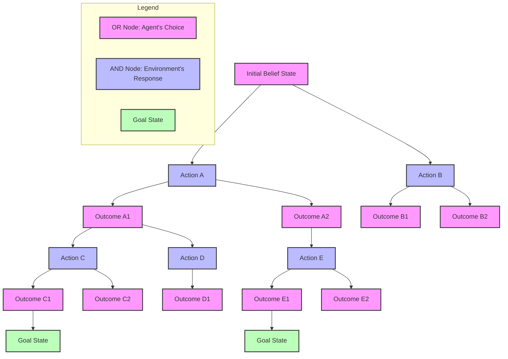

This diagram illustrates the alternating layers of OR and AND nodes that characterize And-Or search trees. Let me
explain what's happening:

1. We begin with an initial belief state (OR1), where the agent must choose which action to take. This is an OR node
   because the agent has a choice between different actions.
2. Each action choice (AND1, AND2) creates an AND node, representing the fact that the agent must be prepared for all
   possible outcomes of the chosen action.
3. Each outcome of an action creates a new OR node (like OR2, OR3, OR4, OR5), representing a new belief state where the
   agent again has choices about what to do next.
4. This pattern continues, creating a tree structure that branches at both OR nodes (agent choices) and AND nodes
   (environment responses).
5. The search terminates when it reaches belief states that satisfy the goal (GOAL1, GOAL2).

The key insight is that a solution to an And-Or search problem is a subtree where:

- Every OR node has exactly one child (representing the chosen action)
- Every AND node has all its children (representing all possible outcomes)
- All leaf nodes are goal states

This structure naturally represents contingency plans because it captures both the agent's decision points and the need
to plan for all possible environmental responses to each action. By following this search process, we can systematically
generate plans that handle the nondeterminism inherent in many real-world domains.

##### Planning with Partial Observability

Partial observability adds another layer of complexity to planning under uncertainty. In partially observable
environments, the agent cannot directly determine the current state based on its observations. Instead, it must maintain
a probabilistic belief over possible states consistent with its observation history.

These environments are often formalized as Partially Observable Markov Decision Processes (POMDPs), which extend MDPs
with an observation model. In POMDPs:

- States are not directly observable
- Actions have uncertain effects (as in nondeterministic planning)
- After each action, the agent receives an observation that provides partial information about the current state
- The agent maintains a belief state representing a probability distribution over possible states

Planning in POMDPs is particularly challenging because:

1. The belief space is continuous (representing probability distributions)
2. The planning horizon can be unlimited
3. Finding optimal policies is computationally intractable (PSPACE-complete)

Several approaches have been developed for planning in partially observable environments:

1. **Belief-state planning**: Treat belief states as regular states and plan in belief space, using contingency plans to
   handle different observations.
2. **POMDP value iteration**: Approximate the optimal value function for belief states and derive a policy from it. This
   is often done by representing the value function as a collection of alpha-vectors.
3. **Point-based methods**: Focus computation on a representative sample of reachable belief points rather than the
   entire belief space.
4. **Online planning**: Rather than computing a complete policy in advance, perform limited-horizon planning at
   execution time based on the current belief state.

Let's consider a simple example of a robot navigating a hallway with some uncertainty about its position. It can move
left or right and has sensors that detect walls, but with some error probability. A partially observable plan might look
like:

- Move right
- If sensor detects wall:
    - Belief state indicates likely at right end of hallway
    - Move left twice
- If sensor detects no wall:
    - Belief state indicates likely in middle of hallway
    - Move right again

The key insight is that observations update the agent's belief state, and the plan must specify actions based on these
updated beliefs.

###### Planning with Partial Observability in a Navigation Scenario

Let me provide a complete example of planning with partial observability that illustrates the key concepts using a robot
navigation scenario.

**Example: Search and Rescue Robot**

Imagine a search and rescue robot in a building with four rooms arranged linearly (Rooms 1-4). The robot needs to find a
person who is in one of these rooms but doesn't know which room they're in. Due to smoke and debris, the robot's sensors
are unreliable.

The robot's state is defined by:

- Its location (which room it's in)
- The person's location (which room they're in)

The robot can only directly observe its own room, but even this observation is noisy. When the robot scans a room, it
has:

- 80% chance of correctly detecting if a person is present
- 20% chance of getting a false reading (either false positive or false negative)

The robot can take these actions:

- Move Left or Right to an adjacent room
- Scan the current room
- Rescue (which succeeds only if the person is actually in the room)

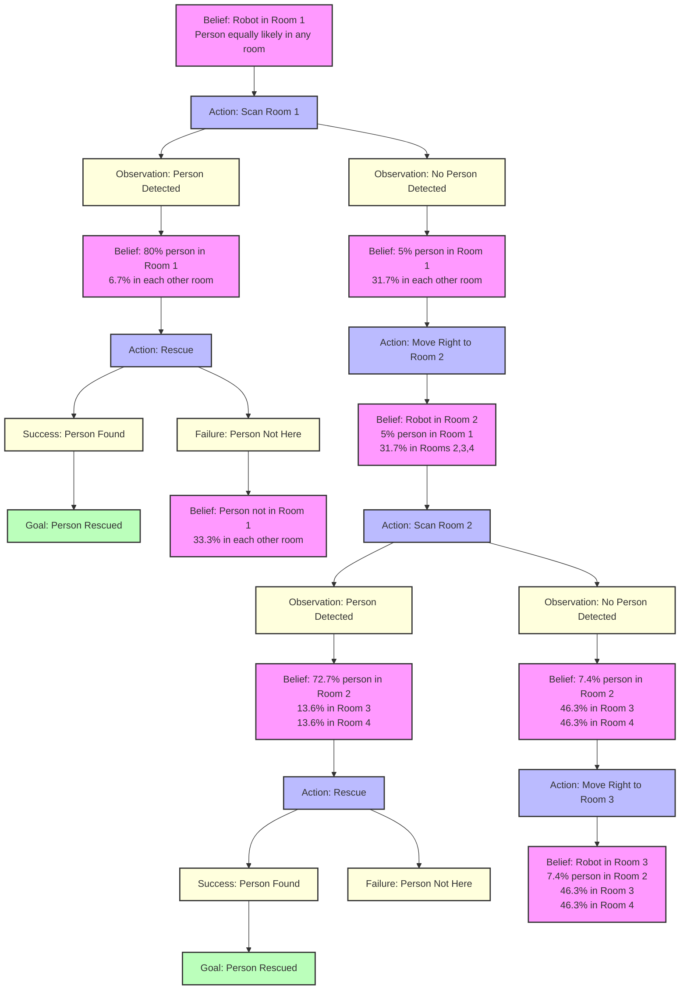

In this diagram, I've illustrated how a POMDP planning process might unfold for our search and rescue robot. Let me walk
through this example step by step:

1. **Initial Belief State (B0)**: The robot starts in Room 1, with a uniform probability distribution over the person's
   location (25% chance they're in each room).
2. **First Action (A1)**: The robot decides to scan the current room to gather information.
3. **Possible Observations**: This action can yield two observations:
    - O1: Person detected (which might be a true or false positive)
    - O2: No person detected (which might be a true or false negative)
4. **Belief Update after Observation**:
    - If person detected (O1), the robot updates its belief to assign 80% probability the person is in Room 1
    - If no person detected (O2), the probability the person is in Room 1 drops to just 5%
5. **Action Selection Based on Updated Belief**:
    - After a positive detection (B1), the robot's best action is to attempt a rescue (A2)
    - After a negative detection (B2), the robot should move to Room 2 (A3) to continue searching
6. **Contingencies for Rescue Attempt**:
    - Success (O3): The person was indeed there, mission accomplished
    - Failure (O4): The person wasn't there (it was a false positive), so continue searching

The plan continues in this manner, with each action and observation updating the robot's beliefs, which in turn inform
its next action selection. The example demonstrates several key features of partially observable planning:

1. **Belief-Based Decision Making**: The robot doesn't know the true state but maintains a probability distribution and
   acts based on this distribution.
2. **Information-Gathering Actions**: Some actions (like scanning) are taken primarily to gain information rather than
   to directly achieve the goal.
3. **Contingency Planning**: The plan branches based on observations, with different actions prescribed for different
   observation outcomes.
4. **Balancing Exploration and Exploitation**: The robot must balance gathering more information versus acting on its
   current beliefs.

The computational challenges mentioned in the text are evident even in this simple example:

1. **Continuous Belief Space**: The belief states are probability distributions over possible world states.
2. **Exponential Branching**: The number of possible contingencies grows exponentially with the planning horizon.
3. **Computational Intractability**: Finding the optimal solution requires considering all possible observation
   sequences.

Real POMDP solvers use techniques like point-based value iteration to approximate the value function over reachable
belief states, rather than trying to compute it over the entire belief space. Online planners often use techniques like
Monte Carlo Tree Search to explore the most promising action sequences given the current belief state.

The key insight is that in partially observable domains, the agent must reason not just about how actions change the
world state, but also about how observations change its knowledge about the world state. The resulting plans are
fundamentally different from those in fully observable domains, incorporating information-gathering actions and
contingencies for different possible observations.

##### Replanning and Execution Monitoring

Rather than generating complete contingency plans in advance, an alternative approach is to interleave planning and
execution. This strategy, known as replanning or plan repair, works as follows:

1. Generate a plan assuming a deterministic model (ignoring uncertainty)
2. Begin executing the plan
3. Monitor execution to detect discrepancies between expected and actual outcomes
4. When discrepancies occur, replan from the current state
5. Continue this process until the goal is achieved

Execution monitoring is a critical component of this approach. The system must be able to:

- Detect when execution deviates from expectations
- Determine whether these deviations are significant enough to warrant replanning
- Diagnose the causes of failures to improve future planning

Several types of execution monitoring can be employed:

1. **Action monitoring**: Verify that actions have the expected effects
2. **Plan monitoring**: Check that the overall plan remains valid
3. **Goal monitoring**: Ensure that the goal remains achievable
4. **Environment monitoring**: Detect changes in the environment that might affect the plan

Replanning approaches offer several advantages:

- They avoid the exponential contingency explosion of pre-computed plans
- They can adapt to unexpected situations not anticipated during planning
- They focus computational resources on the situations actually encountered

However, they also have limitations:

- They may repeatedly encounter the same failures if the planner doesn't learn from past experiences
- They might miss opportunities for contingency planning that would be more efficient
- They can struggle with deadlines or situations requiring advance preparation

Modern systems often employ a hybrid approach, using limited contingency planning for critical or highly uncertain
aspects of the problem while relying on replanning for other parts.

##### Online Planning Agents

Online planning agents take the replanning approach to its logical conclusion. Rather than generating complete plans in
advance, they make decisions one step at a time based on their current belief state and a limited-horizon analysis of
possible futures.

The general architecture of an online planning agent includes:

1. **Belief state maintenance**: Tracking the current belief state based on the history of actions and observations
2. **Action selection**: Choosing the next action based on the current belief state
3. **Execution**: Performing the selected action and receiving observations
4. **Belief update**: Updating the belief state based on the action taken and observation received

This cycle repeats until the goal is achieved or the process is terminated.

The action selection component often employs limited-horizon planning methods such as:

1. **Receding horizon control**: Plan for a fixed horizon (e.g., 10 steps ahead), execute the first action, then replan
2. **Monte Carlo Tree Search (MCTS)**: Simulate many possible futures from the current belief state, building a search
   tree that balances exploration and exploitation
3. **Hindsight optimization**: Plan assuming full observability in the future, then average over possible current states
4. **UCT (Upper Confidence bounds applied to Trees)**: Combine MCTS with UCB (Upper Confidence Bound) action selection
   to efficiently balance exploration and exploitation

Online planning agents are particularly well-suited for problems with:

- Large or infinite state spaces
- Significant uncertainty about the current state
- Dynamic environments that change over time
- Limited computational resources

For example, a robot navigating through a crowded environment might use online planning to continuously adjust its path
based on observed human movements, rather than trying to pre-compute a contingency plan for all possible human
behaviors.

The computational efficiency of online planning comes from focusing only on the current belief state and a limited set
of likely future scenarios, rather than attempting to solve the entire problem in advance. This focused computation
allows online planners to tackle problems that would be intractable for offline planning approaches.

Recent advances in online planning include:

- Anytime algorithms that can be interrupted at any point and still provide a reasonable action
- Hierarchical approaches that plan at multiple levels of abstraction
- Learning techniques that improve planning efficiency based on experience
- Parallelized implementations that leverage modern computing architectures

Planning under uncertainty represents a significant evolution beyond classical planning, addressing the complexity and
unpredictability of real-world environments. By developing methods that handle nondeterministic actions, partial
observability, and dynamic conditions, these approaches bridge the gap between idealized planning problems and practical
applications in robotics, autonomous systems, and other domains requiring intelligent decision-making under uncertainty.

Online planning agents represent a powerful approach to handling complex, uncertain environments in real-time. Unlike
traditional planners that compute complete plans in advance, online planning agents interleave planning and execution,
making decisions one step at a time based on the current situation.

Let me walk you through a concrete example of how online planning works in practice, illustrating the key components and
processes.

**Example: Autonomous Delivery Robot in a Dynamic City Environment**

Imagine an autonomous robot delivering packages in a busy city. The robot must navigate through streets that have
changing traffic conditions, unexpected obstacles, and varying weather. A traditional offline planner would struggle in
this environment because conditions change too rapidly for a fixed plan to remain optimal.

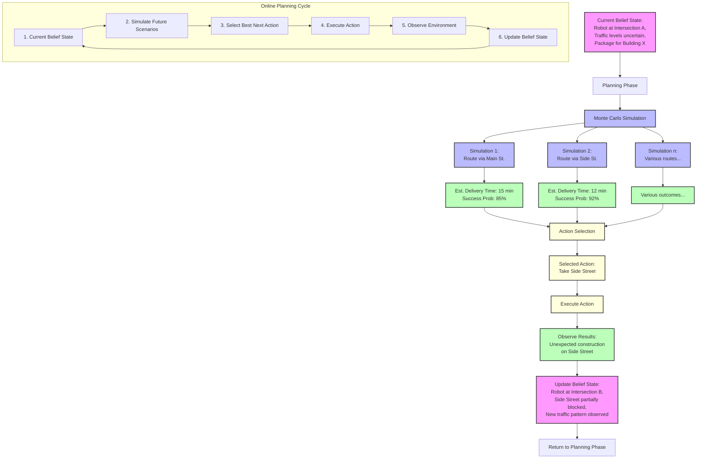

This diagram illustrates the continuous cycle of an online planning agent. Let me explain each component in detail:

1. **Current Belief State**: The agent starts with its current understanding of the world, including:

    - Its own position (Intersection A)
    - Uncertainty about traffic conditions
    - Its goal (deliver a package to Building X)

    This belief state combines what the agent knows for certain with probabilistic information about uncertain aspects.

2. **Planning Phase**: Rather than planning a complete route, the agent performs limited-horizon planning using
   techniques like Monte Carlo Tree Search (MCTS):

    - It simulates many possible futures from the current state
    - Each simulation explores a different potential sequence of actions
    - Simulations account for uncertainty by sampling possible outcomes

    For instance, Simulation 1 explores taking Main Street, while Simulation 2 explores a route via Side Street. Each
    simulation estimates the delivery time and success probability.

3. **Action Selection**: Based on the simulation results, the agent selects the best immediate action:

    - In this case, taking Side Street appears optimal based on the simulations
    - The decision maximizes the expected value considering both time and reliability

    Importantly, the agent only commits to this single next action, not the entire plan.

4. **Execution**: The agent executes the selected action in the real world, moving to the Side Street.

5. **Observation**: After executing the action, the agent observes the actual outcome:

    - It detects unexpected construction on Side Street
    - This new information wasn't in its original belief state

6. **Belief Update**: The agent updates its belief state based on:

    - Its new position (Intersection B)
    - The observed construction
    - Any new information about traffic patterns

    This updated belief becomes the starting point for the next planning cycle.

The key characteristics that make online planning effective include:

1. **Receding Horizon**: The agent only plans a limited distance into the future (perhaps 5-10 steps ahead), which keeps
   computation manageable while still considering long-term consequences.
2. **Real-time Adaptation**: By replanning after each action, the agent can adapt to changes in the environment that
   weren't anticipated in advance.
3. **Focused Computation**: Computational resources are focused on the current situation rather than potential futures
   that may never materialize.
4. **Anytime Algorithms**: Online planners often use anytime algorithms that can be interrupted at any point and still
   return a reasonable action, allowing for time-constrained decision making.

Online planning is particularly valuable in domains with:

- Large or infinite state spaces where complete planning is impossible
- Partially observable environments where the agent's knowledge improves over time
- Dynamic environments that change in unpredictable ways
- Time constraints that prevent exhaustive planning

For our delivery robot, online planning allows it to adapt to changing traffic conditions, road closures, weather
events, and other unforeseen circumstances—much like a human driver would. Rather than rigidly following a predetermined
path, it continuously reassesses and adjusts its route based on current conditions.

The computational efficiency of online planning comes from focusing only on the current situation and a limited set of
likely futures, rather than attempting to solve the entire problem in advance. This targeted use of computational
resources allows these agents to tackle problems that would be intractable for offline planning approaches.

#### Temporal Planning and Resources

Classical planning approaches treat actions as instantaneous and focus primarily on the logical relationships between
states and actions. However, real-world planning problems almost always involve time and resource considerations.
Actions take time to execute, may overlap with other actions, and consume limited resources. Temporal planning extends
the planning framework to address these critical dimensions.

##### Time Representation in Planning

Incorporating time into planning requires fundamental changes to how we represent states, actions, and plans. We must
move beyond the traditional state-transition model to one that captures temporal relationships.

There are several approaches to representing time in planning:

**Discrete Time Models** divide time into fixed intervals or steps. Each step represents a time point where state
changes can occur. This approach is conceptually simple but can be inefficient for problems with widely varying action
durations or when precise timing is important.

For example, in a discrete time model with one-minute intervals, an action that takes 30 seconds would need to occupy a
full time step, potentially introducing inefficiency.

**Continuous Time Models** represent time as a real-valued variable, allowing for more precise representation of
durations and temporal constraints. In these models, actions and events can start and end at arbitrary points on the
timeline.

The continuous approach better captures the nature of many real-world problems but introduces computational challenges
since the space of possible action timings becomes infinite.

**Point-Based vs. Interval-Based Representations**

Time can be represented either in terms of points or intervals:

1. **Point-based representations** focus on instantaneous events, typically the start and end points of actions.
   Temporal constraints are expressed as relationships between these time points. For example, we might specify that the
   end point of "boil water" must precede the start point of "brew tea."

2. **Interval-based representations** treat actions as occupying intervals of time. Temporal relationships are expressed
   using Allen's interval algebra, which defines 13 possible relationships between intervals (such as "before,"
   "during," "overlaps," etc.).

For example, "stirring the mixture" might occur during the interval of "heating the mixture."

**Timeline-Based Planning**

A particularly powerful approach is timeline-based planning, where the state of the world is represented as a set of
state variables, each with a timeline showing how its value changes over time.

For example, a cooking domain might have timelines for:

- The state of the oven (off, preheating, at temperature)
- The location of various ingredients and tools
- The state of each dish being prepared

The plan consists of a set of actions placed on these timelines, with temporal constraints ensuring they occur in a
feasible order.

Mathematically, we can formalize temporal constraints as inequalities between time points:

- $t_{\text{end}}(a_i) \leq t_{\text{start}}(a_j)$ (action $a_i$ must complete before action $a_j$ starts)
- $t_{\text{start}}(a_i) + d_{\text{min}} \leq t_{\text{end}}(a_i)$ (action $a_i$ must take at least $d_{\text{min}}$
  time)
- $t_{\text{start}}(a_i) \geq t_0$ (action $a_i$ cannot start before time $t_0$)

These constraints form a temporal constraint network that can be analyzed using specialized algorithms to determine
feasibility and compute possible execution times.

##### Durative Actions

In temporal planning, actions are no longer instantaneous but have duration. This fundamental change has several
important implications:

**Action Representation with Duration**

Durative actions are typically represented with three components:

1. **Conditions**: Requirements that must be satisfied for the action to execute
2. **Effects**: Changes that the action makes to the world state
3. **Duration**: How long the action takes to execute

Both conditions and effects can be specified at different times relative to the action:

- **At start**: Apply at the beginning of the action
- **Over all**: Must hold throughout the action's duration
- **At end**: Apply at the conclusion of the action

For example, a "move" action might be represented as:

```
Action(Move(robot, from, to, duration),
    AT-START: At(robot, from) ∧ PathClear(from, to)
    OVER-ALL: PathClear(from, to)
    AT-END: At(robot, to) ∧ ¬At(robot, from)
    DURATION: Distance(from, to) / Speed(robot))
```

This representation captures that the robot must initially be at the starting location, the path must remain clear
throughout the movement, and at the end, the robot will be at the destination.

**Concurrent Actions**

With durative actions, multiple actions can execute concurrently if their conditions and effects are compatible. This
introduces new complexity but also opportunities for more efficient plans.

For example, while a robot is moving from one location to another, it might simultaneously be processing data or
planning its next moves.

Concurrency requires careful tracking of interactions between actions. Two actions can execute concurrently only if:

- Neither action negates the conditions required by the other
- The effects of one action don't conflict with the effects of the other

For instance, two robots cannot simultaneously occupy the same location, but they can move along different paths at the
same time.

**Temporal Constraints**

Durative actions create implicit temporal constraints between the start and end points of actions. Additional explicit
constraints might include:

- **Deadlines**: Actions must complete by a specified time
- **Release times**: Actions cannot start before a specified time
- **Synchronization**: Multiple actions must start or end simultaneously
- **Temporal separation**: Two actions must be separated by a minimum time interval

These constraints are typically represented in a Simple Temporal Network (STN) or a Temporal Constraint Satisfaction
Problem (TCSP), which can be analyzed to determine the feasibility of the plan and to compute execution windows for each
action.

##### Critical Path Methods

Critical path analysis is a key technique in temporal planning and scheduling, originating from project management. It
identifies the sequence of actions that determine the minimum completion time for the entire plan.

**Critical Path Calculation**

To identify the critical path in a temporal plan:

1. Represent the plan as a directed graph where:
    - Nodes represent events (action start and end points)
    - Edges represent actions or temporal constraints
    - Edge weights indicate durations or temporal constraints
2. Calculate the earliest possible start time (ES) for each event by traversing the graph from start to finish:
    - ES(start) = 0
    - ES(j) = max{ES(i) + duration(i,j)} for all predecessors i of j
3. Calculate the latest allowable start time (LS) for each event by traversing the graph backward:
    - LS(finish) = ES(finish)
    - LS(i) = min{LS(j) - duration(i,j)} for all successors j of i
4. Calculate the slack (float) for each activity:
    - Slack(i,j) = LS(j) - ES(i) - duration(i,j)
5. The critical path consists of all activities with zero slack

Activities on the critical path must be executed as scheduled, with no delays, or the overall completion time will
increase. This information helps planners identify which parts of the plan require the most careful monitoring and
management.

**Critical Path in Planning**

In automated planning, critical path analysis serves several purposes:

1. **Plan Optimization**: Identifying the critical path helps focus optimization efforts on actions that directly impact
   the plan's overall duration.
2. **Resource Allocation**: Critical activities should receive priority when allocating limited resources.
3. **Risk Management**: Actions on the critical path represent potential bottlenecks and may warrant contingency
   planning.
4. **Heuristic Guidance**: During plan generation, heuristics based on critical path analysis can guide the search
   toward promising action sequences.

For example, in a construction planning scenario, the critical path might include site preparation, foundation
construction, and structural work, while interior finishing might have considerable slack. Resources should be
prioritized for the critical activities to ensure the project completes on time.

##### Resource Constraints

Real-world planning problems almost always involve resource constraints. Resources might include equipment, personnel,
energy, materials, or space. Incorporating resource constraints significantly increases the complexity of planning but
is essential for generating executable plans.

**Types of Resources**

Resources can be classified along several dimensions:

1. **Consumable vs. Reusable**:
    - Consumable resources (like fuel or raw materials) are depleted when used
    - Reusable resources (like machines or personnel) become available again after use
2. **Discrete vs. Continuous**:
    - Discrete resources come in indivisible units (like vehicles or workers)
    - Continuous resources can be allocated in arbitrary amounts (like water or energy)
3. **Unary vs. Multi-capacity**:
    - Unary resources can only be used by one action at a time
    - Multi-capacity resources can support multiple concurrent users up to a capacity limit

**Resource Constraint Representation**

Resource constraints can be represented in various ways:

1. **Resource Profiles**: Timelines showing resource availability and consumption over time
2. **Resource Capacity Constraints**: Inequalities ensuring that resource usage never exceeds capacity
3. **Resource Dependency Constraints**: Relationships between actions competing for the same resources

For example, if actions A and B both require the same unary resource, they cannot execute concurrently, creating an
implicit temporal constraint.

Mathematically, resource constraints can be expressed as:

$$\sum_{a \in A(t)} r(a) \leq C_r \quad \forall t, r$$

Where:

- $A(t)$ is the set of actions executing at time $t$
- $r(a)$ is the amount of resource $r$ required by action $a$
- $C_r$ is the capacity of resource $r$

**Resource Conflict Resolution**

When resources are insufficient to support all desired actions, conflict resolution strategies include:

1. **Scheduling**: Sequencing actions to avoid simultaneous resource demands
2. **Resource Substitution**: Using alternative resources when preferred ones are unavailable
3. **Action Postponement**: Delaying non-critical actions when resources are constrained
4. **Plan Refinement**: Modifying the plan to reduce resource requirements

For instance, if two delivery tasks require the same vehicle, one approach is to schedule them sequentially.
Alternatively, if another vehicle is available, resource substitution might allow concurrent execution.

**Resource Optimization**

Beyond mere feasibility, planners often seek to optimize resource utilization:

1. **Minimizing Resource Consumption**: Finding plans that achieve goals with minimal resource use
2. **Balancing Resource Load**: Distributing resource requirements evenly across time
3. **Maximizing Resource Efficiency**: Achieving the most value from limited resources

These objectives might be incorporated into the planning process through cost functions or constraints that guide the
search toward resource-efficient solutions.

##### Scheduling Techniques

Scheduling is closely related to planning but focuses specifically on determining when actions should occur,
particularly when resources are limited. Several powerful scheduling techniques can be integrated with planning
approaches.

**Job Shop Scheduling**

The job shop scheduling problem is a fundamental model in scheduling theory. It involves:

- A set of jobs, each consisting of a sequence of operations
- A set of machines, each capable of performing certain operations
- Constraints on operation ordering within each job
- The goal of minimizing the overall completion time (makespan)

This framework can represent many real-world scheduling scenarios, from manufacturing to process control.

Job shop scheduling is typically NP-hard, but effective heuristic methods include:

- **Dispatching Rules**: Priority rules for selecting which operation to schedule next (e.g., earliest due date,
  shortest processing time)
- **Shifting Bottleneck Procedure**: Iteratively identifies and schedules the most constrained resources
- **Tabu Search and Genetic Algorithms**: Meta-heuristic approaches that explore the space of possible schedules

**Constraint-Based Scheduling**

Constraint programming offers a powerful framework for scheduling:

1. Variables represent start times and resource assignments for activities
2. Constraints capture temporal requirements and resource limitations
3. Specialized constraint propagation techniques efficiently prune infeasible schedules
4. Search strategies explore the remaining solution space

Constraint-based approaches excel at handling complex scheduling problems with diverse constraints, such as
non-overlapping activities, resource capacity limits, and temporal dependencies.

For example, in a hospital scheduling scenario, constraint programming can handle requirements like:

- Each patient procedure must occur in a specific sequence
- Certain procedures require specialized equipment available in limited quantities
- Staff schedules limit when certain procedures can be performed
- Emergency cases must be accommodated with minimal disruption

**Critical Chain Scheduling**

The Critical Chain method, derived from the Theory of Constraints, focuses on managing uncertainty in project
scheduling:

1. Create a feasible schedule based on reasonable activity duration estimates
2. Identify the critical chain (similar to the critical path, but accounting for resource constraints)
3. Add buffers strategically:
    - Project buffer at the end of the critical chain
    - Feeding buffers where non-critical chains join the critical chain
    - Resource buffers to ensure critical resources are available when needed

This approach provides protection against schedule disruptions while avoiding the inefficiencies of padding individual
activity durations.

**Integration with Planning**

Several approaches integrate scheduling techniques with planning:

1. **Decomposition**: First generate a logical plan (what to do), then schedule it (when to do it)
2. **Constraint Posting**: Interleave planning and scheduling, adding temporal and resource constraints as the plan
   develops
3. **Unified Models**: Represent planning and scheduling within a single framework, solving both aspects simultaneously

Integration challenges include:

- Balancing logical correctness (planning) with temporal/resource feasibility (scheduling)
- Managing the increased computational complexity of the combined problem
- Handling interactions between logical dependencies and resource constraints

Advanced approaches like Hierarchical Task Network (HTN) planning naturally incorporate both planning and scheduling
considerations, making them well-suited for complex real-world applications.

##### Analysis of Planning Approaches

With the various approaches to temporal and resource-constrained planning, it's important to understand their relative
strengths, limitations, and appropriate applications.

**Complexity Analysis**

Adding time and resources significantly increases the computational complexity of planning:

- Classical STRIPS planning is PSPACE-complete
- Temporal planning is generally EXPSPACE-complete
- Resource-constrained planning and scheduling combinations are typically NP-hard or worse

This increased complexity necessitates careful algorithm design and heuristic development to achieve practical
performance on real-world problems.

**Completeness and Optimality**

Different planning approaches offer varying guarantees:

1. **Complete Methods**: Guarantee finding a valid plan if one exists
    - SAT-based temporal planners
    - Some constraint-based approaches
2. **Optimal Methods**: Guarantee finding the best plan according to some metric
    - Temporal A\* variants with admissible heuristics
    - Mixed Integer Linear Programming formulations
3. **Incomplete/Suboptimal Methods**: Trade guarantees for computational efficiency
    - Local search approaches
    - Decomposition methods
    - Many practical industrial planners

The appropriate choice depends on the application requirements and problem characteristics.

**Scalability Comparison**

Empirical analysis reveals different scaling behaviors:

1. **State-Space Temporal Planners** (like SAPA, TFD):
    - Good performance on problems with complex logical structure
    - Can struggle with many concurrent actions
    - Scale well with the number of objects and actions
2. **Constraint-Based Approaches** (like IxTeT, EUROPA):
    - Excel at complex temporal constraints
    - Handle resource reasoning effectively
    - May struggle with large domains having many possible actions
3. **Decomposition Approaches** (like SHOP2):
    - Scale well for problems with natural hierarchical structure
    - Can leverage domain-specific knowledge effectively
    - May miss optimal solutions due to early commitment

**Domain-Specific Considerations**

The effectiveness of different approaches varies by domain:

1. **Logistics and Transportation**:
    - Temporal planners with good resource modeling typically excel
    - Critical path analysis provides valuable heuristic guidance
    - Mixed discrete/continuous representations often appropriate
2. **Manufacturing and Production**:
    - Job-shop scheduling techniques integrate well
    - Hierarchical approaches match natural process decomposition
    - Resource alternatives and substitutions are important
3. **Space and Satellite Operations**:
    - Timeline-based approaches handle complex state evolution
    - Continuous time models capture precise timing requirements
    - Uncertainty handling is critical

**Practical Implementation Considerations**

When implementing temporal and resource-constrained planning systems, several practical factors should be considered:

1. **Modeling Effort**: Some approaches require more detailed domain modeling, creating a trade-off between model
   development time and solver efficiency.
2. **Solution Quality**: Applications vary in their emphasis on finding optimal solutions versus finding good solutions
   quickly.
3. **Explainability**: Some approaches produce plans that are easier to understand and justify to human users.
4. **Adaptability**: Real-world execution often requires plan adaptation when circumstances change; some approaches
   facilitate this better than others.
5. **Integration Capabilities**: Many applications require integration with existing systems, databases, or human
   workflows.

Temporal planning with resource constraints represents the frontier where planning theory meets practical application.
By considering time and resource dimensions, these approaches can address complex real-world problems across domains
including manufacturing, logistics, healthcare, construction, and space operations. The field continues to advance
through theoretical developments, algorithmic innovations, and practical lessons from deployed systems.

#### Additional Planning Topics

As we delve deeper into automated planning, we encounter more sophisticated frameworks that build upon the foundation of
classical planning. These approaches provide greater expressiveness and flexibility, allowing us to represent and solve
increasingly complex problems.

##### Situation Calculus

Situation Calculus is a logical formalism specifically designed for reasoning about actions and change in dynamic
worlds. Developed by John McCarthy in the 1960s and refined over decades, it offers a powerful framework for
representing planning problems within first-order logic.

The key insight of Situation Calculus is treating situations—complete snapshots of the world at a particular moment—as
first-class objects that can be reasoned about. This allows us to formally represent how actions transform one situation
into another.

The fundamental components of Situation Calculus include:

1. **Situations**: Objects that represent complete states of the world at specific points in time. The initial situation
   is typically denoted as S₀.
2. **Actions**: Objects that represent things that can be done (like Fly(p,x,y) for a plane p flying from x to y).
3. **Fluents**: Relations or functions whose values can change across situations. Fluents take a situation as their last
   argument. For example, At(p,x,s) means "plane p is at location x in situation s."
4. **Result Function**: Written as Result(s,a) or sometimes do(a,s), this represents the new situation that results from
   performing action a in situation s.
5. **Possibility Axiom**: Poss(a,s) is true if action a is possible to execute in situation s.

###### Understanding Situation Calculus and the Fly Action Precondition

Let's see how Situation Calculus represents a simple flying scenario:

Situation Calculus is a logical formalism specifically designed for reasoning about actions and change. Let me explain
the axiom you've provided:

$$\text{Plane}(p,s) \wedge \text{Airport}(x,s) \wedge \text{Airport}(y,s) \wedge \text{At}(p,x,s) \Rightarrow \text{Poss}(\text{Fly}(p,x,y),s)$$

This formula represents a fundamental concept in Situation Calculus: the preconditions for an action to be possible. Let
me break it down piece by piece:

1. In Situation Calculus, a **situation** (denoted by $s$) represents a complete state of the world at a specific moment
   in time.
2. Fluents (like $\text{Plane}$, $\text{Airport}$, and $\text{At}$) are predicates whose truth values can change across
   different situations. They always take a situation as their last argument.
3. $\text{Poss}(a,s)$ is a special predicate indicating that action $a$ is possible to execute in situation $s$.

The specific axiom you've provided defines when the $\text{Fly}$ action is possible:

- $\text{Plane}(p,s)$ means "in situation $s$, $p$ is a plane"
- $\text{Airport}(x,s)$ means "in situation $s$, $x$ is an airport"
- $\text{Airport}(y,s)$ means "in situation $s$, $y$ is an airport"
- $\text{At}(p,x,s)$ means "in situation $s$, plane $p$ is at location $x$"

The entire formula states: "If, in situation $s$, $p$ is a plane, $x$ and $y$ are airports, and plane $p$ is at airport
$x$, then it's possible for plane $p$ to fly from airport $x$ to airport $y$."

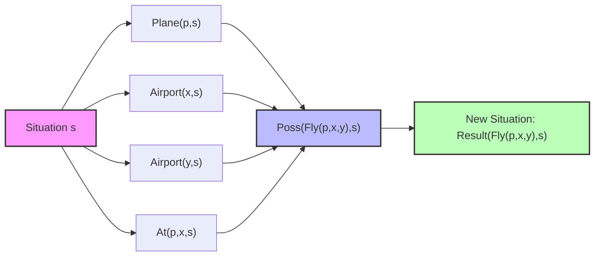

To fully understand how this fits into Situation Calculus, we need to consider what happens when the $\text{Fly}$ action
is executed. This would be captured by successor-state axioms, which might look like:

$$\begin{align} \text{Poss}(a,s) \Rightarrow [\text{At}(p,l,\text{Result}(a,s)) \Leftrightarrow & (\exists x,y [a = \text{Fly}(p,x,y) \wedge l = y]) \vee \\ & (\text{At}(p,l,s) \wedge \neg \exists x,y [a = \text{Fly}(p,x,l)])] \end{align}$$

This successor-state axiom states that a plane $p$ is at location $l$ in the situation resulting from action $a$ if and
only if either:

1. Action $a$ was flying plane $p$ from some location $x$ to location $l$ (which is $y$), or
2. Plane $p$ was already at location $l$ and action $a$ didn't involve flying the plane away from $l$

The power of Situation Calculus lies in how it cleanly separates:

- What actions are possible in a given situation (possibility axioms)
- How actions change the world (successor-state axioms)
- What's true in the initial situation (initial state axioms)

This separation allows for clear reasoning about sequences of actions and their effects, making Situation Calculus
particularly well-suited for planning problems where we need to determine which actions to take to achieve desired
goals.

The example you provided specifically deals with the preconditions for flying an aircraft - a common scenario in
planning problems. By formalizing when the Fly action is possible, we establish constraints that any valid plan must
respect. This enables automated reasoning systems to generate correct and executable plans for complex domains like air
traffic control, logistics, or travel planning.

###### Successor-State Axioms

A key challenge in representing dynamic worlds is the frame problem—specifying what stays the same when an action
occurs. Intuitively, most properties of the world remain unchanged by most actions, but explicitly listing all these
non-effects would be impractical.

Successor-State Axioms provide an elegant solution to this problem. Rather than separately specifying what changes and
what stays the same, they offer a complete specification of when a fluent is true in the result of an action.

The general form of a successor-state axiom for a fluent F is:

$$\text{Poss}(a,s) \Rightarrow [F(\text{result}(a,s)) \Leftrightarrow (a \text{ made } F \text{ true}) \vee (F \text{ was already true and } a \text{ didn't make it false})]$$

For example, consider the successor-state axiom for the $\text{In}(c,p,s)$ fluent, which indicates that cargo $c$ is in
plane $p$ in situation $s$:

$$\text{Poss}(a,s) \Rightarrow \text{In}(c,p,\text{result}(a,s)) \Leftrightarrow (a=\text{Load}(c,p,x) \vee (\text{In}(c,p,s) \wedge a \neq \text{Unload}(c,p,x)))$$

This axiom states that cargo $c$ is in plane $p$ after action $a$ if and only if either:

1. Action $a$ was loading $c$ into $p$, or
2. $c$ was already in $p$ and action $a$ wasn't unloading $c$ from $p$

The beauty of successor-state axioms is that they simultaneously handle both effects (what changes) and frame axioms
(what stays the same) in a single, concise formula. This makes them a powerful tool for representing dynamic domains.

When combined with initial state axioms (describing $S_0$) and goal statements, successor-state axioms allow us to
formulate planning problems entirely within first-order logic:

$$\text{Initial state: } S_0$$

$$\text{At}(P_1,\text{JFK},S_0) \quad \forall c \text{ Cargo}(c) \Rightarrow \text{At}(c,\text{JFK},S_0)$$

$$\text{Goal} \quad \exists s \forall c \quad \text{Cargo}(c) \Rightarrow \text{At}(c,\text{SFO},s)$$

This example represents a cargo transportation problem where:

- Initially, plane P₁ and all cargo are at JFK airport
- The goal is to find a situation s where all cargo is at SFO airport

Since these formulations are expressed in standard first-order logic, we can use existing theorem provers to find
solutions without needing specialized planning algorithms.

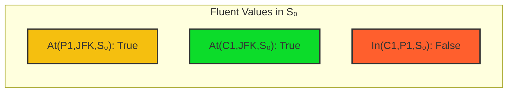

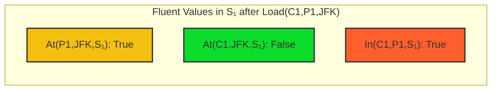

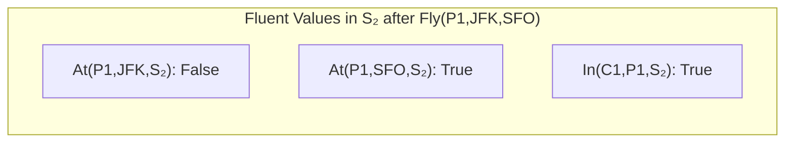

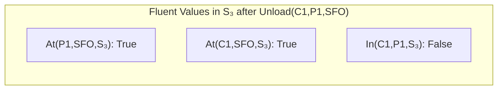

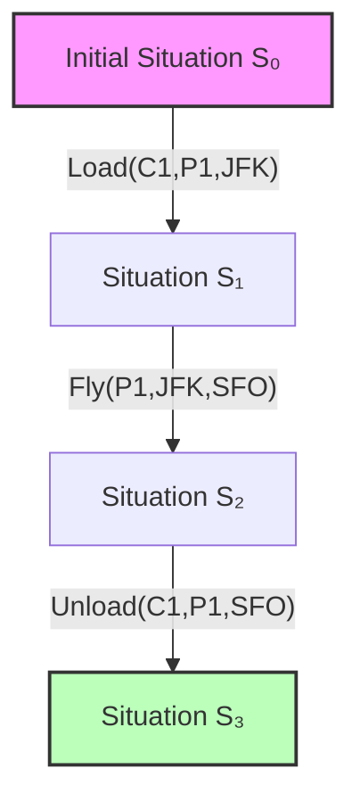

These diagrams show how the world state changes through the sequence of actions in our cargo transportation example. The
first four graphs show the fluent values (truth values of properties) at each situation, while the fifth graph shows the
overall sequence of actions that transforms the initial situation into the goal situation.

The sequence demonstrates how successor-state axioms work in practice. For example, when the Load action is performed,
the In(C1,P1) fluent becomes true and the At(C1,JFK) fluent becomes false, while the At(P1,JFK) fluent remains
unchanged - exactly as specified by the relevant successor-state axioms for each fluent.

This sequential transformation from S₀ to S₃ represents a valid plan that solves the goal of moving cargo C1 from JFK to
SFO.

This diagram illustrates how successor-state axioms determine the truth values of fluents across situations as actions
are performed. Each action transforms one situation into another, and the successor-state axioms precisely define which
fluents change and which remain the same.

Let's walk through how the successor-state axiom for $\text{In}(c,p,s)$ is applied at each step:

1. In $S_0$, cargo C1 is not in plane P1.
2. After executing $\text{Load}(C1,P1,JFK)$, we get $S_1$:
    - The first part of our successor-state axiom applies: $a=\text{Load}(c,p,x)$
    - Therefore, $\text{In}(C1,P1,S_1)$ becomes true
3. After executing $\text{Fly}(P1,JFK,SFO)$, we get $S_2$:
    - Neither part of the axiom for loading or unloading applies
    - $\text{In}(C1,P1,S_1)$ was already true, and the action is not an unload
    - Therefore, $\text{In}(C1,P1,S_2)$ remains true (frame axiom at work)
4. After executing $\text{Unload}(C1,P1,SFO)$, we get $S_3$:
    - The first part of our axiom doesn't apply (not loading)
    - The second part fails because $a = \text{Unload}(C1,P1,SFO)$
    - Therefore, $\text{In}(C1,P1,S_3)$ becomes false

The same reasoning applies to all other fluents in the domain, with their own successor-state axioms determining how
they change across situations.

This formulation allows us to reason about the effects of action sequences and automatically determine what changes and
what stays the same, all while avoiding the complexity of explicitly listing all the non-effects of each action. This is
what makes successor-state axioms such a powerful solution to the frame problem in AI planning and reasoning.

##### First-Order Logic Planning

First-Order Logic (FOL) planning combines the expressive power of FOL with planning techniques. This approach allows us
to represent and reason about complex relationships and dependencies that would be difficult to capture in simpler
formalisms.

The key advantages of FOL planning include:

1. **Expressiveness**: FOL can represent complex relationships, quantified statements, and conditional effects that
   propositional representations struggle with.
2. **Generalization**: FOL planning problems can be specified independently of the specific objects involved, allowing
   for generalized solutions.
3. **Theoretical Foundation**: The well-established semantics and inference rules of FOL provide a solid foundation for
   planning algorithms.

###### Understanding Complex FOL Constraints in Planning

For example, consider a complex planning problem involving multiple agents, resources, and locations. In FOL, we can
concisely express constraints like:

$$\forall a,t,l , \big(\text{Agent}(a) \land \text{Task}(t) \land \text{Location}(l) \land \text{AssignedTo}(a,t) \land \text{At}(t,l)\big) \Rightarrow \text{MustBeAt}(a,l)$$

This formula represents an important constraint in a planning domain that involves agents, tasks, and locations. Let me
break down what it means in detail.

The formula uses universal quantification (∀) to state that for all agents, tasks, and locations, a certain relationship
must hold. We can read it as:

"For all agents $a$, tasks $t$, and locations $l$, if $a$ is an agent, $t$ is a task, $l$ is a location, $a$ is assigned
to $t$, and task $t$ is at location $l$, then agent $a$ must be at location $l$."

This creates a constraint that agents need to be physically present at the locations of tasks they're assigned to.

This kind of constraint is extremely useful in planning domains like:

1. **Resource Allocation:** If you assign a worker to repair a machine, the worker must travel to the machine's
   location.
2. **Team Coordination:** When assigning team members to tasks across different locations, you must ensure they can
   physically be present.
3. **Scheduling with Location Constraints:** Any schedule that assigns agents to tasks must account for travel time and
   location restrictions.

The constraint expresses a fundamental physical limitation: to work on a task, an agent must be co-located with that
task. This might seem obvious, but formalizing it allows planning systems to generate valid plans that respect physical
limitations.

###### How This Would Function in a Planning System

In a planning system, this formula would act as a constraint that must be satisfied for any valid plan. For example:

1. If the initial state has Agent A assigned to Task T1, which is at Location L1, but Agent A is at Location L2, then
   the planner must include actions to move Agent A from L2 to L1 before work on T1 can begin.
2. When assigning tasks, the planner must consider the current locations of agents and either:
    - Assign tasks to agents who are already at the right location
    - Include movement actions to relocate agents
    - Or potentially reassign tasks to minimize movement
3. The planner might even choose to change task assignments to create more efficient plans based on the current
   locations of agents.

###### Example Scenario

Imagine a hospital setting with doctors (agents), patients (tasks), and rooms (locations):

- Doctor Smith (a1) is assigned to Patient Jones (t1)
- Patient Jones is in Room 204 (l1)

According to our constraint:

$$\begin{align}&\text{Agent}(\text{Smith}) \land \text{Task}(\text{Jones}) \land \\ &\text{Location}(\text{Room204}) \land \text{AssignedTo}(\text{Smith},\text{Jones}) \land \\ &\text{At}(\text{Jones},\text{Room204}) \Rightarrow \text{MustBeAt}(\text{Smith},\text{Room204})\end{align}$$

This means Doctor Smith must be in Room 204 to attend to Patient Jones. Any valid planning solution would need to ensure
this constraint is satisfied, potentially by including actions for Doctor Smith to move to Room 204 if they're currently
elsewhere.

This logic constraint creates important requirements for our planning system. If we know that:

- Smith is a doctor (Agent)
- Jones is a patient (Task)
- Room204 is a hospital room (Location)
- Smith is assigned to care for Jones (AssignedTo)
- Jones is located in Room204 (At)

Then our planning system must enforce that Smith is physically present in Room204 (MustBeAt). This might require adding
movement actions to our plan if Smith is initially located somewhere else in the hospital.

The constraint effectively captures a fundamental physical requirement of the domain: medical care can only be provided
when the caregiver and patient are in the same location. By formalizing this in logic, we enable automated planning
systems to generate realistic and executable plans.

This type of logical constraint is fundamental to creating realistic and executable plans in complex domains where
spatial relationships matter. By formalizing these constraints in First-Order Logic, automated planning systems can
reason about them systematically.

This axiom states that if an agent a is assigned to a task t, and task t is at location l, then agent a must be at
location l.

FOL planning approaches include:

1. **Deductive Planning**: Using logical inference to derive a plan from axioms describing the domain.
2. **Inductive Planning**: Learning planning knowledge from examples of successful plans.
3. **Hybrid Approaches**: Combining logical reasoning with heuristic search or other planning techniques.

While FOL planning is powerful, it comes with computational challenges. The expressiveness of FOL makes inference more
complex, and many reasoning tasks in FOL are theoretically undecidable. Despite these challenges, FOL planning
techniques have been successfully applied to domains requiring rich representations, such as robotic manipulation,
natural language understanding, and complex workflow management.
