# **C-7 | Representations and Inference for Logic**

1. Knowledge Base Architecture and Design
    - Abstract KB Class Structure and Interface Methods
    - Propositional vs First-Order Logic Knowledge Bases
    - Tell, Ask, and Retract Operations
    - Query Processing and Substitution Handling
2. Logical Expression Representation
    - Expr Class Structure and Symbol Classification
    - Variable, Proposition, and Predicate Symbol Types
    - Expression Tree Construction and Manipulation
    - Parsing and String-to-Logic Conversion
3. Propositional Logic Inference Methods
    - Truth Table Enumeration Algorithm
    - Model Evaluation and Entailment Checking
    - Forward Chaining for Definite Clauses
    - Resolution-Based Theorem Proving
4. Conjunctive Normal Form Processing
    - CNF Conversion Algorithm Steps
    - Implication Elimination and Negation Movement
    - Distribution Laws and Clause Formation
    - Association and Dissociation Operations
5. Satisfiability and DPLL Algorithm
    - Boolean Satisfiability Problem Formulation
    - DPLL Search Strategy and Optimizations
    - Pure Symbol and Unit Clause Heuristics
    - Backtracking and Model Construction
6. First-Order Logic and Unification
    - Variable Binding and Substitution Mechanisms
    - Unification Algorithm Implementation
    - Occur Check and Variable Standardization
    - Backward Chaining Inference Engine
7. Symbolic Computation Applications
    - Expression Differentiation and Simplification
    - Mathematical Rule Application
    - Algebraic Manipulation Techniques
    - Integration with Logical Reasoning Systems

The realm of logical reasoning represents one of the most foundational aspects of artificial intelligence, bridging the
gap between human-like reasoning and computational precision. When we examine the AIMA logic implementation, we
encounter a sophisticated system that embodies decades of research in automated reasoning, knowledge representation, and
symbolic computation.

Understanding this code requires us to think about logic not merely as an abstract mathematical concept, but as a
practical tool for building intelligent systems. Just as humans use logical reasoning to solve problems, make decisions,
and understand the world around them, artificial intelligence systems need mechanisms to represent knowledge and draw
valid conclusions from that knowledge.

The beauty of this implementation lies in its layered architecture, where simple foundational concepts build upon each
other to create powerful reasoning capabilities. We begin with basic symbol manipulation and progress through
increasingly sophisticated inference algorithms that can handle complex logical relationships.

#### Knowledge Base Architecture

At the heart of any logical reasoning system lies the knowledge base—a structured repository that not only stores
information but provides intelligent access to that information. The knowledge base concept transcends simple data
storage by incorporating reasoning capabilities that allow it to derive new knowledge from existing facts and rules.

##### Abstract KB Class Structure and Interface Methods

The abstract `KB` class establishes a fundamental contract for all knowledge base implementations. This design pattern,
known as the Template Method pattern, provides a consistent interface while allowing different implementations to handle
specific types of logical reasoning.

```python
class KB:
    def tell(self, sentence):
        "Add the sentence to the KB."
        raise NotImplementedError

    def ask(self, query):
        """Return a substitution that makes the query true, or False."""
        return first(self.ask_generator(query), default=False)

    def ask_generator(self, query):
        "Yield all the substitutions that make query true."
        raise NotImplementedError
```

The elegance of this design becomes apparent when we consider the different types of queries we might want to make. In
propositional logic, asking whether "P & Q" is true returns simply `True` or `False`. However, in first-order logic,
asking "Brother(x, y)" might return multiple substitutions like `{x: Cain, y: Abel}` or `{x: George, y: Jeb}`. The
`ask_generator` method handles this complexity by yielding all possible answers, while `ask` provides a simple interface
for cases where we only need the first answer.

This architectural decision reflects a deep understanding of how logical reasoning works in practice. Consider how a
human expert might respond to questions: sometimes with a simple yes or no, sometimes with specific examples, and
sometimes with a comprehensive list of all possibilities. The KB class captures this flexibility while maintaining
computational efficiency.

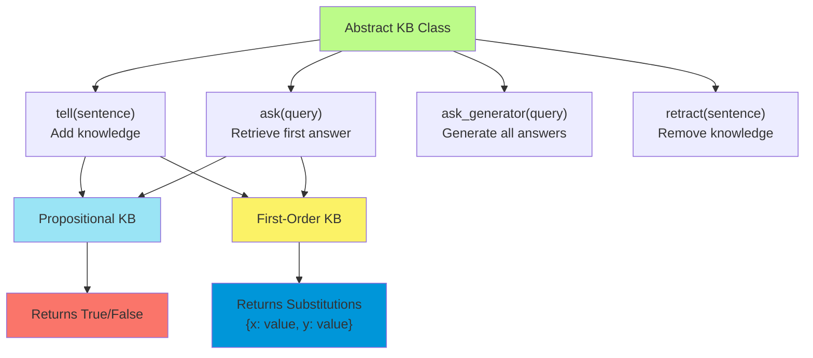

##### Propositional vs First-Order Logic Knowledge Bases

The distinction between propositional and first-order logic knowledge bases reflects fundamentally different approaches
to representing and reasoning about knowledge. This difference is not merely technical but philosophical, touching on
how we understand the nature of knowledge itself.

Propositional logic deals with atomic statements that are either true or false. When we create a `PropKB`, we're working
in a world where statements like "It is raining" or "The door is open" have definite truth values. The power of
propositional logic lies in its simplicity and the efficiency of its reasoning algorithms.

```python
class PropKB(KB):
    def __init__(self, sentence=None):
        self.clauses = []  # Store clauses in CNF form
        if sentence:
            self.tell(sentence)

    def tell(self, sentence):
        "Add the sentence's clauses to the KB."
        self.clauses.extend(conjuncts(to_cnf(sentence)))
```

The `PropKB` implementation demonstrates several important design decisions. First, it automatically converts all
sentences to Conjunctive Normal Form (CNF), a standardized representation that facilitates efficient reasoning. This
conversion might seem like unnecessary overhead, but it's actually a crucial optimization that enables the use of
powerful resolution-based inference algorithms.

First-order logic knowledge bases, represented by the `FolKB` class, handle a much richer form of knowledge
representation. Here we can express relationships between objects, use variables to represent general patterns, and
employ quantifiers to make statements about all or some members of a domain.

```python
class FolKB(KB):
    def __init__(self, initial_clauses=[]):
        self.clauses = []  # More complex: handles variables and predicates
        for clause in initial_clauses:
            self.tell(clause)
```

The apparent simplicity of the `FolKB` constructor belies the complexity of the reasoning mechanisms it supports.
First-order logic requires sophisticated unification algorithms to match patterns with specific instances, and the
inference process must handle variable bindings across multiple steps of reasoning.

##### Conjunctive Normal Form (CNF)

CNF stands for **Conjunctive Normal Form**, which is a standardized way of representing logical expressions that makes
automated reasoning much more efficient. Let me break this down systematically to help you understand why this
representation is so crucial in artificial intelligence and logic systems.

Conjunctive Normal Form is a specific structural pattern for logical expressions where the formula is organized as a
conjunction (AND) of disjunctions (OR). In mathematical terms, CNF has the structure:

$$(L_{1,1} \lor L_{1,2} \lor \ldots \lor L_{1,k_1}) \land (L_{2,1} \lor L_{2,2} \lor \ldots \lor L_{2,k_2}) \land \ldots \land (L_{m,1} \lor L_{m,2} \lor \ldots \lor L_{m,k_m})$$

where each $L_{i,j}$ is a **literal**—either an atomic proposition (like $P$) or its negation (like $\neg P$).

Think of CNF as having two levels: the outer level connects clauses with AND operations, while each clause internally
connects literals with OR operations. For example:

$$(\neg A \lor B) \land (A \lor \neg C) \land (B \lor C)$$

This expression consists of three clauses, each containing two literals connected by OR, and the clauses themselves are
connected by AND.

##### Theoretical Significance

The power of CNF lies in its uniformity—by converting all logical expressions to this standard form, we can apply
systematic algorithms without worrying about the varied structures of the original expressions. This is similar to how
mathematicians often convert equations to standard forms before applying solution techniques.

CNF serves as a canonical representation that preserves logical equivalence while enabling efficient processing. Any
propositional logic formula can be converted to CNF through systematic transformations, and the resulting formula is
logically equivalent to the original—meaning they have identical truth values under all possible interpretations.

Several key inference algorithms work most efficiently with CNF:

**Resolution Theorem Proving**: The resolution algorithm, one of the most powerful automated reasoning techniques,
requires clauses in CNF format. It can systematically derive new clauses by resolving complementary literals across
different clauses.

**DPLL Algorithm**: The Davis-Putnam-Logemann-Loveland algorithm for satisfiability testing works directly with CNF
clauses, using optimizations like unit propagation and pure literal elimination that are only easily identifiable in CNF
format.

**Forward and Backward Chaining**: Many inference engines that work with definite clauses (a subset of CNF) can
efficiently chain through implications.

##### The CNF Conversion Process

Converting arbitrary logical expressions to CNF involves a systematic four-step transformation process. Let me walk you
through each step with examples:

###### Step 1: Eliminate Implications

The first step replaces implication operators with equivalent expressions using only negation, conjunction, and
disjunction:

- $A \rightarrow B$ becomes $\neg A \lor B$
- $A \leftrightarrow B$ becomes $(A \rightarrow B) \land (B \rightarrow A)$, which further becomes
  $(\neg A \lor B) \land (\neg B \lor A)$

**Example**: $(P \rightarrow Q) \land (Q \rightarrow R)$ becomes $(\neg P \lor Q) \land (\neg Q \lor R)$

###### Step 2: Move Negations Inward

This step applies De Morgan's laws and double negation elimination to push negation signs down to the atomic level:

- $\neg(A \land B)$ becomes $\neg A \lor \neg B$
- $\neg(A \lor B)$ becomes $\neg A \land \neg B$
- $\neg\neg A$ becomes $A$

**Example**: $\neg((P \land Q) \lor R)$ becomes $\neg(P \land Q) \land \neg R$, which becomes
$(\neg P \lor \neg Q) \land \neg R$

###### Step 3: Distribute AND over OR

The final step applies the distributive law to ensure the proper CNF structure:

$(A \land B) \lor C$ becomes $(A \lor C) \land (B \lor C)$

This step can potentially cause exponential growth in formula size, which is why CNF conversion can be computationally
expensive for some expressions.

**Example**: $(P \land Q) \lor (R \land S)$ becomes $(P \lor R) \land (P \lor S) \land (Q \lor R) \land (Q \lor S)$

Here's a visual representation of the complete process:

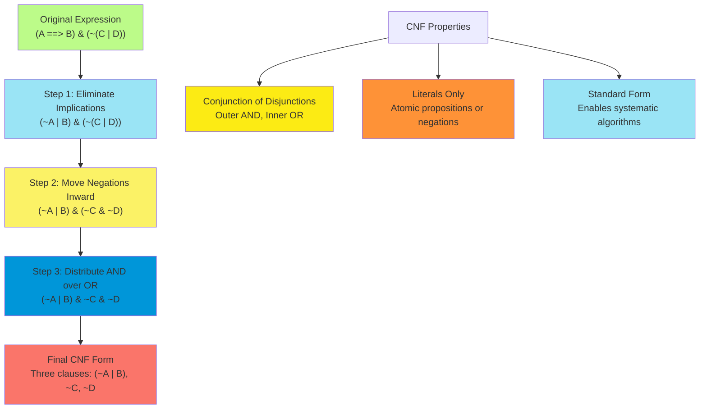

Understanding CNF helps explain why some logical reasoning problems are computationally challenging. The conversion
process can sometimes lead to exponential explosion in formula size, which reflects the inherent complexity of logical
reasoning.

However, this standardization enables the use of highly optimized algorithms that have been refined over decades of
research. Modern SAT solvers, which work with CNF formulas, can handle problems with millions of variables and clauses,
making them practical for real-world applications in verification, planning, and constraint satisfaction.

The CNF representation also reveals structural properties of logical problems. For instance, Horn clauses (a special
case of CNF where each clause has at most one positive literal) enable polynomial-time inference, while general CNF
requires exponential algorithms in the worst case.

Would you like me to elaborate on any particular aspect of CNF, such as the relationship between CNF and specific
inference algorithms, or would you prefer to explore how CNF conversion works with more complex examples?

##### Tell, Ask, and Retract Operations

The three fundamental operations of a knowledge base—tell, ask, and retract—mirror basic human cognitive processes. When
we learn something new, we add it to our knowledge (tell). When we need information, we query our knowledge (ask). When
we discover something is incorrect, we remove it from our knowledge (retract).

The `tell` operation represents knowledge acquisition. In the propositional case, this involves converting the new
sentence to CNF and adding its clauses to the knowledge base:

```python
def tell(self, sentence):
    "Add the sentence's clauses to the KB."
    self.clauses.extend(conjuncts(to_cnf(sentence)))
```

This implementation reveals a crucial insight about logical knowledge representation: raw sentences are less useful than
their normalized forms. By converting to CNF, we ensure that all knowledge is stored in a uniform format that
facilitates efficient reasoning.

The `ask` operation implements query processing. For propositional logic, this typically involves checking whether the
knowledge base entails (involved) the query:

```python
def ask_generator(self, query):
    "Yield the empty substitution {} if KB entails query; else no results."
    if tt_entails(Expr('&', *self.clauses), query):
        yield {}
```

The elegance of this implementation lies in its use of the entailment relation. Rather than searching through stored
facts, the system uses logical inference to determine whether the query necessarily follows from the known information.

##### Query Processing and Substitution Handling

Query processing in logical reasoning systems involves much more than simple pattern matching. It requires sophisticated
algorithms that can handle variable bindings, unification, and the generation of multiple consistent answers.

In first-order logic, a query like `Hates(Mac, x)` doesn't just ask whether Mac hates someone—it asks for all the
specific entities that Mac hates. The system must find all substitutions for the variable `x` that make the query true
given the current knowledge base.

The substitution mechanism provides the foundation for this process. A substitution is represented as a dictionary
mapping variables to their values:

```python
# Example substitution: {x: Flopsie, y: Mac}
# This means x is bound to Flopsie and y is bound to Mac
```

The power of substitutions becomes apparent when we consider how they enable pattern matching. If we have a rule "All
farmers hate rabbits" and facts "Mac is a farmer" and "Flopsie is a rabbit," the system can use substitutions to derive
"Mac hates Flopsie."

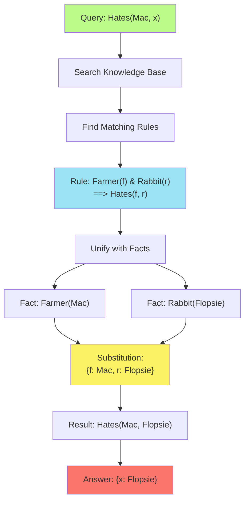

#### Logical Expression Representation

The representation of logical expressions forms the foundation upon which all reasoning algorithms operate. The
challenge lies in creating a system that is both computationally efficient and semantically rich enough to capture the
nuances of logical relationships.

##### Expr Class Structure and Symbol Classification

The `Expr` class serves as the universal representation for all logical expressions, from simple atomic propositions to
complex nested formulas. This unified approach enables the system to handle diverse logical constructs through a single,
consistent interface.

The fundamental insight behind the `Expr` design is that all logical expressions can be viewed as trees, where internal
nodes represent logical operators and leaves represent atomic symbols. This tree structure naturally captures the
compositional nature of logical expressions and enables recursive processing algorithms.

```python
# Examples of Expr usage:
A = Expr('A')                    # Atomic proposition
not_A = Expr('~', A)            # Negation, ¬ can also be used
A_and_B = Expr('&', A, B)       # Conjunction
implication = Expr('==>', A, B)  # Implication
```

The classification of symbols into different categories reflects the semantic roles they play in logical reasoning. The
system distinguishes between several types of symbols, each with specific properties and behaviors:

```python
def is_symbol(s):
    "A string s is a symbol if it starts with an alphabetic char."
    return isinstance(s, str) and s[:1].isalpha()

def is_var_symbol(s):
    "A logic variable symbol is an initial-lowercase string."
    return is_symbol(s) and s[0].islower()

def is_prop_symbol(s):
    """A proposition logic symbol is an initial-uppercase string."""
    return is_symbol(s) and s[0].isupper()
```

This naming convention provides immediate visual feedback about the role of each symbol. Variables (lowercase) can be
bound to different values during reasoning, while propositions (uppercase) represent fixed logical atoms. This
distinction is crucial for the unification algorithms that form the heart of first-order logic inference.

##### Variable, Proposition, and Predicate Symbol Types

The distinction between different symbol types reflects deep semantic differences in how they participate in logical
reasoning. Understanding these differences is crucial for grasping how the inference algorithms work.

**Variables** represent unknown or unspecified entities. In the expression `Likes(x, y)`, both `x` and `y` are variables
that can be bound to specific objects during reasoning. The power of variables lies in their ability to express general
patterns that can be instantiated in multiple ways.

**Propositions** represent atomic facts about the world. In propositional logic, symbols like `Rain` or `Wet` represent
basic statements that are either true or false. These symbols have fixed meanings and cannot be decomposed further.

**Predicates** represent relationships or properties. In first-order logic, predicates like `Likes(x, y)` or `Red(x)`
express relationships between objects or properties of objects. Predicates can be thought of as functions that return
truth values.

The interaction between these different symbol types creates the expressive power of logical representation. Consider
how the sentence "All red objects are beautiful" might be represented:

$$\forall x , (Red(x) \rightarrow Beautiful(x))$$

Here, `x` is a variable, `Red` and `Beautiful` are predicates, and the entire expression uses logical connectives to
express a universal relationship.

##### Expression Tree Construction and Manipulation

The tree structure of logical expressions enables powerful recursive algorithms for manipulation and analysis. Each
`Expr` object contains an operator (`op`) and a list of arguments (`args`), creating a natural tree structure.

```python
# Example expression tree for (A & B) | C
root = Expr('|', Expr('&', A, B), C)
# Tree structure:
#     |
#   /   \
#  &     C
# / \
#A   B
```

Tree manipulation operations enable transformations that preserve logical equivalence while optimizing for specific
inference algorithms. For example, the conversion to CNF involves systematic tree transformations that eliminate
implications, move negations inward, and distribute conjunctions over disjunctions.

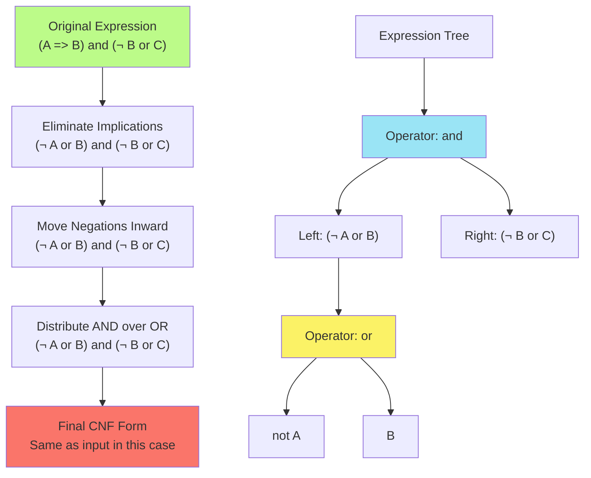

##### Parsing and String-to-Logic Conversion

The conversion from human-readable strings to internal logical representations bridges the gap between natural
expression and computational processing. The system provides both low-level `Expr` construction and high-level string
parsing capabilities.

The string parsing system handles logical connectives with appropriate precedence rules:

```python
# These expressions are equivalent:
expr1 = expr('A ==> B & C')
expr2 = Expr('==>', A, Expr('&', B, C))
```

The parsing system must handle operator precedence carefully to ensure that expressions are interpreted correctly. The
implementation warns users about potential precedence issues, particularly with the equivalence operators (`<=>`,
`<=>`), which have the precedence of commas and may require explicit parentheses.

This attention to parsing details reflects a broader concern with usability. While the internal representation is
optimized for computational efficiency, the external interface must be accessible to human users who think in terms of
mathematical notation rather than tree structures.

#### Propositional Logic Inference Methods

Propositional logic inference represents the foundation of automated reasoning, providing both theoretical insights and
practical algorithms for determining logical consequences. The AIMA implementation includes several complementary
approaches, each with distinct computational characteristics and use cases.

##### Truth Table Enumeration Algorithm

Truth table enumeration provides the most straightforward approach to propositional inference. By systematically
examining all possible truth value assignments, we can definitively determine whether a knowledge base entails a given
query.

```python
def tt_entails(kb, alpha):
    """Does kb entail (involves) the sentence alpha? Use truth tables."""
    assert not variables(alpha)  # Must be propositional
    return tt_check_all(kb, alpha, prop_symbols(kb & alpha), {})
```

The algorithm's elegance lies in its exhaustive approach. For every possible assignment of truth values to the
propositional symbols, it checks whether the knowledge base is satisfied. If the knowledge base is satisfied and the
query is false under any assignment, then the entailment fails. Otherwise, the entailment holds.

The mathematical foundation rests on the semantic definition of entailment: $KB \models \alpha$ if and only if in every
model where $KB$ is true, $\alpha$ is also true. The truth table method implements this definition directly by
enumerating all possible models.

```python
def tt_check_all(kb, alpha, symbols, model):
    "Auxiliary routine to implement tt_entails."
    if not symbols:  # Base case: all symbols assigned
        if pl_true(kb, model):
            result = pl_true(alpha, model)
            return result  # KB true implies alpha must be true
        else:
            return True  # KB false: entailment vacuously true
    else:
        P, rest = symbols[0], symbols[1:]
        # Try both truth values for P
        return (tt_check_all(kb, alpha, rest, extend(model, P, True)) and
                tt_check_all(kb, alpha, rest, extend(model, P, False)))
```

The recursive structure mirrors the mathematical induction underlying the entailment definition. The base case handles
complete models, while the recursive case systematically explores all possible extensions of partial models.

The computational complexity is $O(2^n)$ where $n$ is the number of propositional symbols. This exponential complexity
makes truth table enumeration impractical for large knowledge bases, but it provides a reliable foundation for
understanding more sophisticated algorithms.

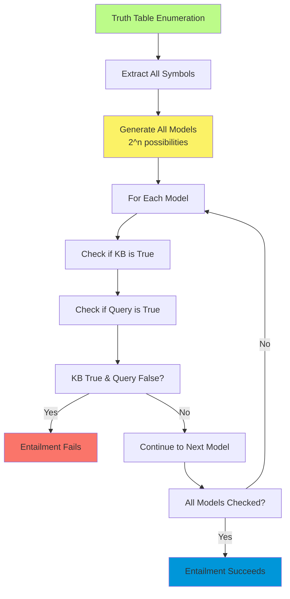

##### Model Evaluation and Entailment Checking

The model evaluation function `pl_true` implements the recursive evaluation of logical expressions under specific truth
value assignments. This function exemplifies how compositional semantics can be implemented computationally.

```python
def pl_true(exp, model={}):
    """Return True if the propositional logic expression is true in the model."""
    if exp in (True, False):
        return exp
    op, args = exp.op, exp.args
    if is_prop_symbol(op):
        return model.get(exp)  # Look up truth value
    elif op == '~' || op == '¬':
        p = pl_true(args[0], model)
        return None if p is None else not p
    elif op == '|':
        # Disjunction: true if any disjunct is true
        result = False
        for arg in args:
            p = pl_true(arg, model)
            if p is True:
                return True
            if p is None:
                result = None
        return result
```

The handling of partial models (where some propositions have unknown truth values) demonstrates sophisticated reasoning
about uncertainty. The function returns `None` when the truth value cannot be determined from the available information,
enabling efficient short-circuiting in many inference algorithms.

The implementation of logical connectives follows their standard semantic definitions while handling the three-valued
logic that arises from partial models. For disjunction, if any disjunct is true, the entire expression is true
regardless of other disjuncts. This implements the semantic rule that disjunction succeeds with the first true disjunct.

##### Forward Chaining for Definite Clauses

Forward chaining represents a more efficient approach to inference when the knowledge base consists of definite
clauses—implications with single positive conclusions. This restriction enables algorithms with polynomial rather than
exponential complexity.

```python
def pl_fc_entails(KB, q):
    """Use forward chaining to see if a PropDefiniteKB entails symbol q."""
    count = {c: len(conjuncts(c.args[0]))
             for c in KB.clauses if c.op == '==>'}
    inferred = defaultdict(bool)
    agenda = [s for s in KB.clauses if is_prop_symbol(s.op)]
```

The algorithm maintains several data structures that enable efficient inference:

- **count**: Tracks how many antecedents of each rule remain to be satisfied
- **inferred**: Records which propositions have been derived
- **agenda**: Contains propositions ready for processing

The forward chaining process resembles spreading activation in neural networks. Known facts trigger rules whose
antecedents are satisfied, which in turn derive new facts that may trigger additional rules.

```python
while agenda:
    p = agenda.pop()
    if p == q:
        return True  # Goal reached
    if not inferred[p]:
        inferred[p] = True
        for c in KB.clauses_with_premise(p):
            count[c] -= 1
            if count[c] == 0:  # All antecedents satisfied
                agenda.append(c.args[1])  # Add conclusion
return False
```

The elegance of forward chaining lies in its goal-directed efficiency. Rather than exploring all possible inferences, it
propagates information forward from known facts toward the query goal. This makes it particularly suitable for reactive
systems that need to respond to new information quickly.

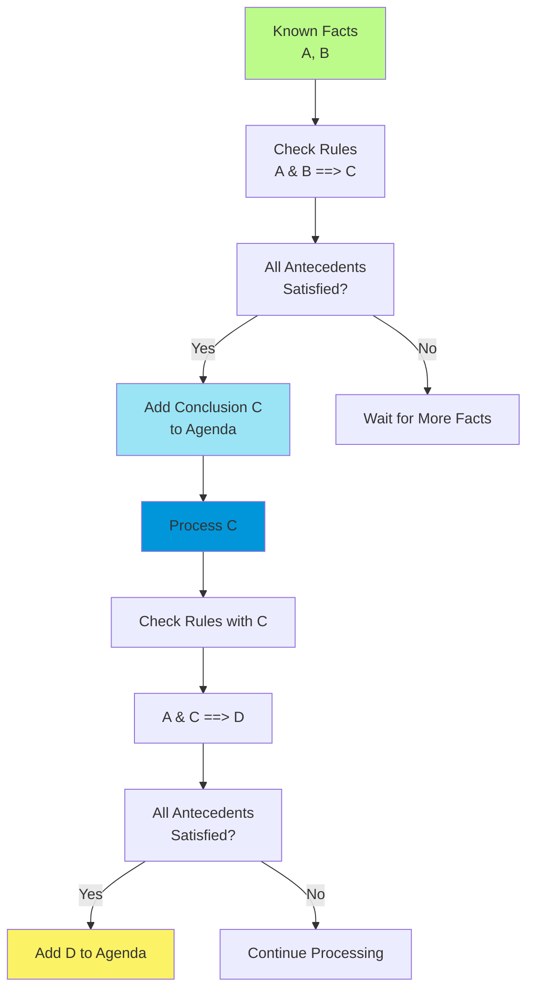

##### Resolution-Based Theorem Proving

Resolution represents the most powerful and general approach to propositional inference implemented in the system. Based
on a single inference rule, resolution can determine the satisfiability of arbitrary propositional formulas.

The resolution algorithm works by contradiction. To prove that $KB \models \alpha$, it assumes $KB \land \neg \alpha$
and attempts to derive a contradiction (the empty clause). If successful, the original entailment holds.

```python
def pl_resolution(KB, alpha):
    "Propositional-logic resolution: say if alpha follows from KB."
    clauses = KB.clauses + conjuncts(to_cnf(~alpha))
    new = set()
    while True:
        n = len(clauses)
        pairs = [(clauses[i], clauses[j])
                 for i in range(n) for j in range(i+1, n)]
        for (ci, cj) in pairs:
            resolvents = pl_resolve(ci, cj)
            if False in resolvents:  # Empty clause derived
                return True
            new = new.union(set(resolvents))
        if new.issubset(set(clauses)):  # No new clauses
            return False
        for c in new:
            if c not in clauses:
                clauses.append(c)
```

The resolution rule itself is elegantly simple: from clauses $(A \lor C)$ and $(\neg A \lor D)$, we can derive
$(C \lor D)$. This rule captures the essence of reasoning by cases—if we know that either $A$ or $C$ must be true, and
either $\neg A$ or $D$ must be true, then either $C$ or $D$ (or both) must be true.

```python
def pl_resolve(ci, cj):
    """Return all clauses that can be obtained by resolving clauses ci and cj."""
    clauses = []
    for di in disjuncts(ci):
        for dj in disjuncts(cj):
            if di == ~dj or ~di == dj:  # Complementary literals
                dnew = unique(removeall(di, disjuncts(ci)) +
                              removeall(dj, disjuncts(cj)))
                clauses.append(associate('|', dnew))
    return clauses
```

The mathematical elegance of resolution lies in its completeness—any valid entailment can be proven using resolution,
and any invalid entailment will eventually be recognized when no new clauses can be derived. This makes resolution a
complete decision procedure for propositional logic.

#### Conjunctive Normal Form Processing

Conjunctive Normal Form represents the standardized representation that enables efficient logical reasoning. The
conversion to CNF transforms arbitrary logical expressions into a uniform format that facilitates systematic processing
by inference algorithms.

##### CNF Conversion Algorithm Steps

The conversion to CNF follows a systematic four-step process that preserves logical equivalence while transforming
expressions into the required format. Each step implements specific equivalence laws from propositional logic.

```python
def to_cnf(s):
    """Convert a propositional logical sentence to conjunctive normal form."""
    s = expr(s)
    s = eliminate_implications(s)  # Step 1: Remove implications
    s = move_not_inwards(s)       # Step 2: Push negations inward
    return distribute_and_over_or(s)  # Step 3: Distribute AND over OR
```

The step-by-step transformation ensures that the final result is logically equivalent to the original expression while
conforming to the CNF format requirements. This systematic approach prevents errors that might arise from ad hoc
transformation attempts.

##### Implication Elimination and Negation Movement

The first step eliminates implications using the fundamental equivalences of propositional logic. These transformations
convert complex connectives into combinations of negation, conjunction, and disjunction.

```python
def eliminate_implications(s):
    "Change implications into equivalent form with only &, |, and ~ as operators."
    if s.op == '==>':
        return b | ~a  # A ==> B ≡ ~A | B
    elif s.op == '<==':
        return a | ~b  # A <== B ≡ A | ~B
    elif s.op == '<=>':
        return (a | ~b) & (b | ~a)  # A <=> B ≡ (A | ~B) & (B | ~A)
    elif s.op == '^':
        return (a & ~b) | (~a & b)  # A ^ B ≡ (A & ~B) | (~A & B)
```

Each transformation implements a fundamental logical equivalence. The biconditional case demonstrates how complex
relationships can be decomposed into simpler components—$A \leftrightarrow B$ is equivalent to
$(A \rightarrow B) \land (B \rightarrow A)$, which further decomposes into conjunctions and disjunctions.

The second step moves negations inward using De Morgan's laws and double negation elimination:

```python
def move_not_inwards(s):
    """Rewrite sentence s by moving negation sign inward."""
    if s.op == '~':
        a = s.args[0]
        if a.op == '~':
            return move_not_inwards(a.args[0])  # ~~A ==> A
        if a.op == '&':
            return associate('|', list(map(NOT, a.args)))  # ~(A & B) ==> ~A | ~B
        if a.op == '|':
            return associate('&', list(map(NOT, a.args)))  # ~(A | B) ==> ~A & ~B
```

This transformation ensures that negations appear only at the level of atomic propositions, simplifying the structure of
complex expressions and enabling the final distribution step.

###### De Morgan's Laws

**The Two Laws:**

1. **¬(A ∧ B) ≡ ¬A ∨ ¬B** "Not (A and B)" equals "Not A or Not B"
2. **¬(A ∨ B) ≡ ¬A ∧ ¬B** "Not (A or B)" equals "Not A and Not A"

**In plain terms:**

- The negation of a conjunction becomes a disjunction of negations
- The negation of a disjunction becomes a conjunction of negations

**Examples:**

- ¬(Rain ∧ Cold) = ¬Rain ∨ ¬Cold "It's not both raining and cold" = "It's either not raining or not cold"
- ¬(Hot ∨ Sunny) = ¬Hot ∧ ¬Sunny "It's not hot or sunny" = "It's not hot and not sunny"

**In CNF conversion:** De Morgan's laws are used in Step 2 (Move Negations Inward) to push negations down to atomic
propositions, which is essential for achieving the proper CNF structure.

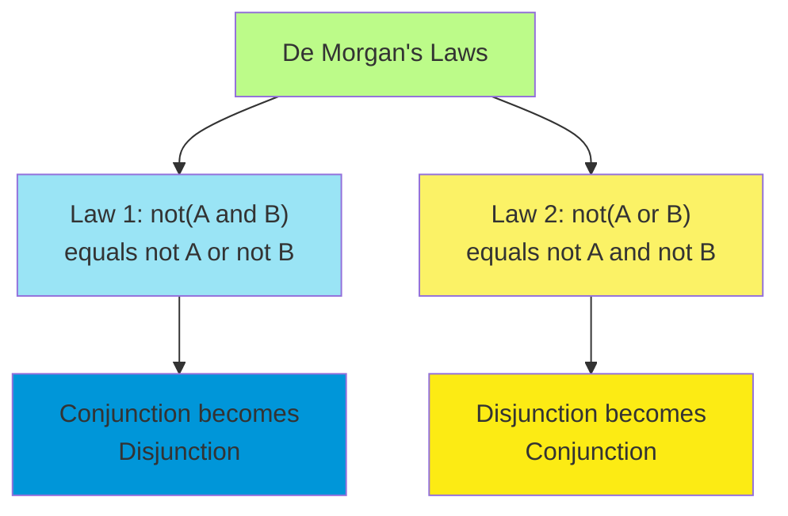

##### Distribution Laws and Clause Formation

The final step implements the distributive law to convert the expression into CNF. This step is the most complex because
it can potentially cause exponential expansion of the expression size.

```python
def distribute_and_over_or(s):
    """Given a sentence s consisting of conjunctions and disjunctions
    of literals, return an equivalent sentence in CNF."""
    if s.op == '|':
        conj = first(arg for arg in s.args if arg.op == '&')
        if not conj:
            return s  # Already in CNF
        others = [a for a in s.args if a is not conj]
        rest = associate('|', others)
        return associate('&', [distribute_and_over_or(c | rest)
                               for c in conj.args])
```

The distribution process implements the law $(A \land B) \lor C \equiv (A \lor C) \land (B \lor C)$. This transformation
can lead to exponential growth because distributing over multiple conjunctions creates multiple clauses.

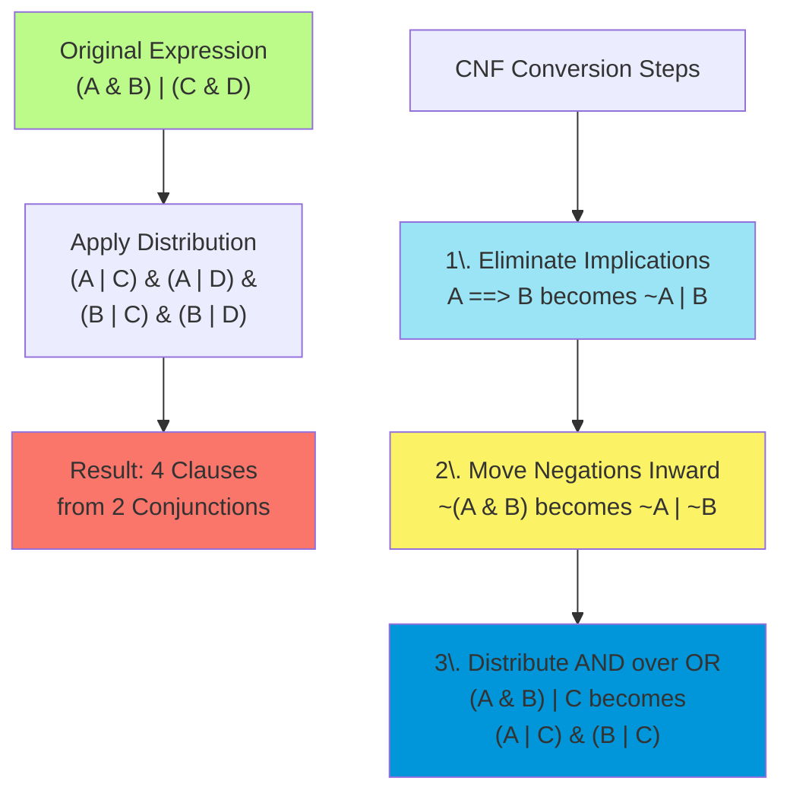

##### Real-World Example: Weather and Activities

**Original Complex Statement:** "If it's sunny, then we'll go to the beach, and if it's raining, then we'll go to the
movies or stay home."

Let me break this down into logical components:

- S = "It's sunny"
- B = "We go to the beach"
- R = "It's raining"
- M = "We go to the movies"
- H = "We stay home"

**Original logical expression:** (S ⇒ B) ∧ (R ⇒ (M ∨ H))

Now let's see the CNF conversion process with English interpretations at each step:

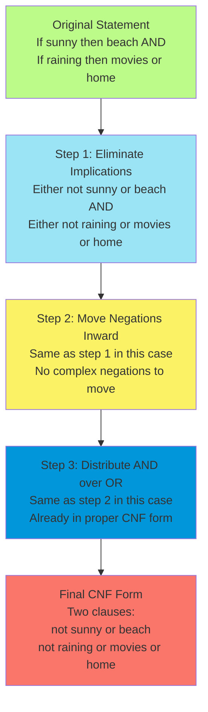

###### More Complex Example with Distribution

Let me show you a more complex example where the distribution step creates dramatic changes:

**Original Statement:** "Either (it's both sunny and warm) or (it's both cloudy and cool)."

- S = "It's sunny"
- W = "It's warm"
- C = "It's cloudy"
- O = "It's cool"

**Original expression:** (S ∧ W) ∨ (C ∧ O)

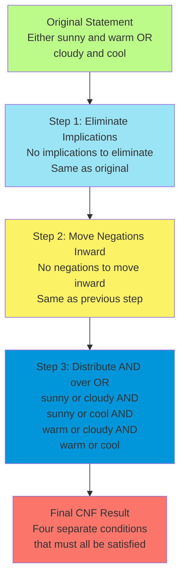

**English interpretation of the final CNF form:** The original statement "Either (sunny and warm) or (cloudy and cool)"
becomes four separate conditions that must all hold:

1. "Either it's sunny or it's cloudy" (S ∨ C)
2. "Either it's sunny or it's cool" (S ∨ O)
3. "Either it's warm or it's cloudy" (W ∨ C)
4. "Either it's warm or it's cool" (W ∨ O)

###### Why This Transformation Matters

Think about what happened here. The original statement expressed two complete scenarios: perfect beach weather (sunny
and warm) or typical indoor weather (cloudy and cool). But the CNF form breaks this down into the minimal logical
constraints that any valid situation must satisfy.

This transformation reveals something profound about logical reasoning. The CNF form makes explicit all the implicit
constraints that were bundled together in the original statement. An automated reasoning system can now work with these
individual constraints much more efficiently.

###### De Morgan's Law Example

Let me show you De Morgan's laws with a practical example:

**Original Statement:** "It's not the case that it's both raining and cold." **Logical form:** ¬(R ∧ C)

**Applying De Morgan's Law:** "Either it's not raining or it's not cold." **Logical form:** ¬R ∨ ¬C

The original statement tells us that we won't have both rain and cold simultaneously. De Morgan's law transforms this
into a more usable form: in any given situation, at least one of these must be true—either it's not raining, or it's not
cold (or both).

This transformation is crucial for automated reasoning because the CNF form makes the logical structure explicit and
uniform. Instead of having to handle many different types of logical constructions, the reasoning system can focus on a
single, standardized format while preserving all the logical relationships from the original statements.

##### Association and Dissociation Operations

The association and dissociation operations handle the flattening of nested expressions with the same operator. These
operations are crucial for maintaining the canonical form required by inference algorithms.

```python
def associate(op, args):
    """Given an associative op, return an expression with the same
    meaning as Expr(op, *args), but flattened."""
    args = dissociate(op, args)
    if len(args) == 0:
        return _op_identity[op]  # Identity element
    elif len(args) == 1:
        return args[0]
    else:
        return Expr(op, *args)
```

The dissociation process recursively flattens nested structures:

```python
def dissociate(op, args):
    """Given an associative op, return a flattened list result."""
    result = []
    def collect(subargs):
        for arg in subargs:
            if arg.op == op:
                collect(arg.args)  # Recursive flattening
            else:
                result.append(arg)
    collect(args)
    return result
```

This flattening process ensures that expressions like $(A \land B) \land (C \land D)$ are represented as flat
conjunctions $A \land B \land C \land D$, which simplifies processing by inference algorithms.

#### Satisfiability and DPLL Algorithm

The Davis-Putnam-Logemann-Loveland (DPLL) algorithm represents one of the most important advances in automated theorem
proving. Unlike truth table enumeration, DPLL uses intelligent search strategies to determine satisfiability without
exhaustively exploring all possible truth assignments.

##### Boolean Satisfiability Problem Formulation

The Boolean satisfiability problem asks whether there exists a truth assignment that makes a given propositional formula
true. This problem is fundamental to computer science, being the first problem proven to be NP-complete, yet it has
numerous practical applications in artificial intelligence, verification, and optimization.

```python
def dpll_satisfiable(s):
    """Check satisfiability of a propositional sentence.
    This returns a model rather than True when it succeeds."""
    clauses = conjuncts(to_cnf(s))
    symbols = prop_symbols(s)
    return dpll(clauses, symbols, {})
```

The DPLL algorithm works with clauses in CNF, where the satisfiability problem becomes finding an assignment that makes
every clause true. Since each clause is a disjunction of literals, it's satisfied if at least one of its literals is
true.

##### DPLL Search Strategy and Optimizations

The core DPLL algorithm combines backtracking search with two key optimizations: unit propagation and pure literal
elimination. These optimizations dramatically reduce the search space compared to naive backtracking.

```python
def dpll(clauses, symbols, model):
    "See if the clauses are true in a partial model."
    unknown_clauses = []  # Clauses with unknown truth value
    for c in clauses:
        val = pl_true(c, model)
        if val is False:
            return False  # Unsatisfiable branch
        if val is not True:
            unknown_clauses.append(c)
    if not unknown_clauses:
        return model  # All clauses satisfied
```

The algorithm first checks which clauses remain unsatisfied under the current partial assignment. If any clause is
definitely false, the current branch cannot lead to a satisfying assignment. If all clauses are satisfied, we've found a
solution.

The power of DPLL lies in its optimization strategies, which often allow it to avoid extensive backtracking:

```python
P, value = find_pure_symbol(symbols, unknown_clauses)
if P:
    return dpll(clauses, removeall(P, symbols), extend(model, P, value))
P, value = find_unit_clause(clauses, model)
if P:
    return dpll(clauses, removeall(P, symbols), extend(model, P, value))
```

##### Pure Symbol and Unit Clause Heuristics

Pure literal elimination identifies variables that appear with only one polarity (either always positive or always
negative) in the remaining clauses. Such variables can be assigned the value that satisfies all their occurrences
without risk of making any clause false.

```python
def find_pure_symbol(symbols, clauses):
    """Find a symbol and its value if it appears only as a positive literal
    (or only as a negative) in clauses."""
    for s in symbols:
        found_pos, found_neg = False, False
        for c in clauses:
            if not found_pos and s in disjuncts(c):
                found_pos = True
            if not found_neg and ~s in disjuncts(c):
                found_neg = True
        if found_pos != found_neg:
            return s, found_pos
    return None, None
```

The pure symbol heuristic exploits a key insight: if a variable appears with only one polarity, assigning it the
satisfying value can never make any clause false. This assignment may satisfy multiple clauses simultaneously,
potentially eliminating large portions of the search space.

Unit propagation identifies unit clauses—clauses containing exactly one unassigned literal. Such clauses force the
assignment of their remaining literal, creating additional constraints that propagate through the formula.

```python
def find_unit_clause(clauses, model):
    """Find a forced assignment if possible from a clause with only 1
    variable not bound in the model."""
    for clause in clauses:
        P, value = unit_clause_assign(clause, model)
        if P:
            return P, value
    return None, None

def unit_clause_assign(clause, model):
    """Return a single variable/value pair that makes clause true in
    the model, if possible."""
    P, value = None, None
    for literal in disjuncts(clause):
        sym, positive = inspect_literal(literal)
        if sym in model:
            if model[sym] == positive:
                return None, None  # Clause already satisfied
        elif P:
            return None, None      # More than 1 unbound variable
        else:
            P, value = sym, positive
    return P, value
```

Unit propagation implements the mathematical principle of resolution at the propositional level. When a clause has only
one unassigned literal, that literal must be true for the clause to be satisfied. This forced assignment may create
additional unit clauses, leading to a cascade of implications.

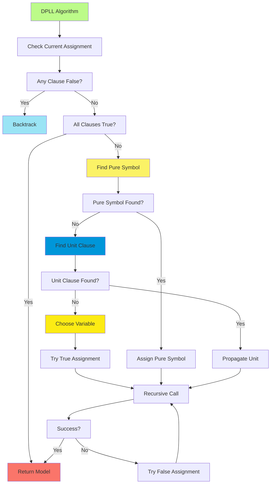

##### Backtracking and Model Construction

When neither pure symbols nor unit clauses can be found, DPLL resorts to case analysis, choosing an unassigned variable
and trying both possible truth values. This backtracking search explores the space of partial assignments
systematically.

```python
if not symbols:
    raise TypeError("Argument should be of the type Expr.")
P, symbols = symbols[0], symbols[1:]
return (dpll(clauses, symbols, extend(model, P, True)) or
        dpll(clauses, symbols, extend(model, P, False)))
```

The backtracking mechanism implements the logical principle of excluded middle—every proposition is either true or
false. By trying both possibilities for each variable, DPLL ensures completeness: if a satisfying assignment exists, it
will eventually be found.

The model construction aspect of DPLL provides more than just a yes/no answer to the satisfiability question. When a
satisfying assignment is found, the algorithm returns the complete model, which can be used for further reasoning or as
a counterexample in theorem proving applications.

The efficiency of DPLL comes from its ability to avoid exploring large portions of the search space through its
optimization heuristics. In practice, many satisfiability problems can be solved without exhaustive search, making
DPLL-based solvers practical for real-world applications.

#### First-Order Logic and Unification

First-order logic extends propositional logic with the power to express relationships between objects and to quantify
over domains of objects. This extension requires sophisticated algorithms for matching logical expressions containing
variables—a process known as unification.

##### Variable Binding and Substitution Mechanisms

Variable binding provides the foundation for reasoning with quantified expressions. Unlike propositional variables that
have fixed interpretations, first-order variables can be bound to any object in the domain, enabling the expression of
general patterns and relationships.

The substitution mechanism implements variable binding computationally. A substitution is represented as a dictionary
mapping variables to terms:

```python
# Example substitutions:
{x: Expr('John'), y: Expr('Mary')}  # Bind x to John, y to Mary
{x: Expr('f', Expr('a'))}           # Bind x to f(a)
```

The substitution operation applies these bindings throughout a logical expression:

```python
def subst(s, x):
    """Substitute the substitution s into the expression x."""
    if isinstance(x, list):
        return [subst(s, xi) for xi in x]
    elif isinstance(x, tuple):
        return tuple([subst(s, xi) for xi in x])
    elif not isinstance(x, Expr):
        return x
    elif is_var_symbol(x.op):
        return s.get(x, x)  # Look up variable binding
    else:
        return Expr(x.op, *[subst(s, arg) for arg in x.args])
```

The recursive structure of substitution reflects the compositional nature of logical expressions. Variables are replaced
with their bindings, while compound expressions are processed recursively to ensure that all variable occurrences are
properly substituted.

##### Unification Algorithm Implementation

Unification determines whether two logical expressions can be made identical through appropriate variable bindings. This
process is central to first-order inference because it enables the matching of general patterns with specific instances.

```python
def unify(x, y, s):
    """Unify expressions x,y with substitution s; return a substitution that
    would make x,y equal, or None if x,y can not unify."""
    if s is None:
        return None  # Previous unification failed
    elif x == y:
        return s     # Already unified
    elif is_variable(x):
        return unify_var(x, y, s)
    elif is_variable(y):
        return unify_var(y, x, s)
    elif isinstance(x, Expr) and isinstance(y, Expr):
        return unify(x.args, y.args, unify(x.op, y.op, s))
    elif isinstance(x, str) or isinstance(y, str):
        return None  # Strings don't unify with other types
    elif issequence(x) and issequence(y) and len(x) == len(y):
        if not x:
            return s
        return unify(x[1:], y[1:], unify(x[0], y[0], s))
    else:
        return None  # Cannot unify
```

The unification algorithm implements a recursive descent through the structure of both expressions. The base cases
handle identical expressions and atomic mismatches, while the recursive cases handle compound expressions by unifying
corresponding subparts.

The handling of variables requires special care because variable bindings must be consistent across the entire
unification process:

```python
def unify_var(var, x, s):
    if var in s:
        return unify(s[var], x, s)  # Use existing binding
    elif occur_check(var, x, s):
        return None  # Would create infinite structure
    else:
        return extend(s, var, x)    # Create new binding
```

Variable unification first checks whether the variable already has a binding in the current substitution. If so, it
unifies the binding with the target expression. Otherwise, it creates a new binding after performing the occur check to
prevent infinite structures.

##### Occur Check and Variable Standardization

The occur check prevents the creation of infinite data structures during unification. It ensures that a variable is not
unified with a term that contains the variable itself:

```python
def occur_check(var, x, s):
    """Return true if variable var occurs anywhere in x
    (or in subst(s, x), if s has a binding for x)."""
    if var == x:
        return True
    elif is_variable(x) and x in s:
        return occur_check(var, s[x], s)
    elif isinstance(x, Expr):
        return (occur_check(var, x.op, s) or
                occur_check(var, x.args, s))
    elif isinstance(x, (list, tuple)):
        return first(e for e in x if occur_check(var, e, s))
    else:
        return False
```

Without the occur check, we might attempt to unify $x$ with $f(x)$, creating the infinite binding $x = f(f(f(...)))$.
The occur check prevents such situations by detecting when a variable appears within the term it would be bound to.

Variable standardization ensures that variables in different logical expressions don't accidentally share names. This
process renames variables to create unique identifiers across different contexts:

```python
def standardize_variables(sentence, dic=None):
    """Replace all the variables in sentence with new variables."""
    if dic is None:
        dic = {}
    if not isinstance(sentence, Expr):
        return sentence
    elif is_var_symbol(sentence.op):
        if sentence in dic:
            return dic[sentence]
        else:
            v = Expr('v_{}'.format(next(standardize_variables.counter)))
            dic[sentence] = v
            return v
    else:
        return Expr(sentence.op,
                    *[standardize_variables(a, dic) for a in sentence.args])
```

Variable standardization is crucial for correctness in first-order inference. Without it, variables from different rules
might be confused, leading to incorrect unifications and invalid conclusions.

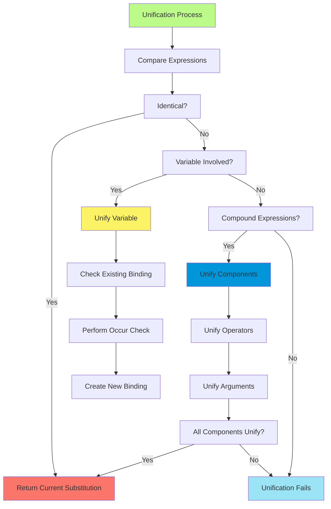

##### Backward Chaining Inference Engine

Backward chaining implements goal-directed reasoning for first-order logic. Starting from a query, it works backward
through the knowledge base to find a chain of inference that supports the query.

```python
def fol_bc_ask(KB, query):
    """A simple backward-chaining algorithm for first-order logic."""
    return fol_bc_or(KB, query, {})

def fol_bc_or(KB, goal, theta):
    for rule in KB.fetch_rules_for_goal(goal):
        lhs, rhs = parse_definite_clause(standardize_variables(rule))
        for theta1 in fol_bc_and(KB, lhs, unify(rhs, goal, theta)):
            yield theta1
```

The backward chaining algorithm uses a generator-based approach that yields all possible solutions to a query. For each
rule that could potentially prove the goal, it attempts to unify the rule's conclusion with the goal and then
recursively proves the rule's premises.

The AND-OR structure of the search reflects the logical structure of definite clauses. To prove a goal, we need to find
some rule (OR) whose conclusion matches the goal, and then prove all the premises of that rule (AND).

```python
def fol_bc_and(KB, goals, theta):
    if theta is None:
        pass  # Unification failed
    elif not goals:
        yield theta  # All goals proven
    else:
        first, rest = goals[0], goals[1:]
        for theta1 in fol_bc_or(KB, subst(theta, first), theta):
            for theta2 in fol_bc_and(KB, rest, theta1):
                yield theta2
```

The recursive structure implements the logical semantics of conjunction: to prove $A \land B$, we must prove both $A$
and $B$. The algorithm proves goals sequentially, accumulating variable bindings as it proceeds.

#### Symbolic Computation Applications

The logic system extends beyond pure logical reasoning to support symbolic computation, demonstrating the versatility of
expression-based representations. The symbolic differentiation capabilities illustrate how logical expression trees can
support mathematical computation.

##### Expression Differentiation and Simplification

Symbolic differentiation implements the rules of calculus algorithmically, demonstrating how mathematical knowledge can
be encoded in computational procedures:

```python
def diff(y, x):
    """Return the symbolic derivative, dy/dx, as an Expr."""
    if y == x:
        return 1  # d/dx(x) = 1
    elif not y.args:
        return 0  # d/dx(c) = 0 for constants
    else:
        u, op, v = y.args[0], y.op, y.args[-1]
        if op == '+':
            return diff(u, x) + diff(v, x)  # Sum rule
        elif op == '*':
            return u * diff(v, x) + v * diff(u, x)  # Product rule
        elif op == '/':
            return (v * diff(u, x) - u * diff(v, x)) / (v * v)  # Quotient rule
```

Each rule of differentiation is implemented as a case in the recursive algorithm. The structure mirrors the mathematical
definitions precisely, making the code both readable and mathematically correct.

The simplification system applies algebraic rules to reduce expressions to canonical forms:

```python
def simp(x):
    "Simplify the expression x."
    if isnumber(x) or not x.args:
        return x
    args = list(map(simp, x.args))
    u, op, v = args[0], x.op, args[-1]
    if op == '+':
        if v == 0:
            return u  # x + 0 = x
        if u == 0:
            return v  # 0 + x = x
        if u == v:
            return 2 * u  # x + x = 2x
```

The simplification rules implement mathematical identities that reduce expressions to simpler equivalent forms. This
process is essential for making symbolic computation practical, as unsimplified expressions can become unwieldy.

##### Mathematical Rule Application

The symbolic computation system demonstrates how domain knowledge can be encoded as computational procedures. Each
mathematical rule is implemented as a pattern-matching case that recognizes when the rule applies and performs the
appropriate transformation.

The integration of logical and mathematical reasoning illustrates a broader principle in AI: the power of unified
representational frameworks. The same expression tree structure that supports logical inference also enables
mathematical computation, demonstrating the generality of symbolic approaches to AI.

##### Algebraic Manipulation Techniques

The algebraic manipulation capabilities extend the basic differentiation and simplification to support more complex
mathematical reasoning. The system can handle polynomial expressions, rational functions, and transcendental functions
through systematic application of algebraic rules.

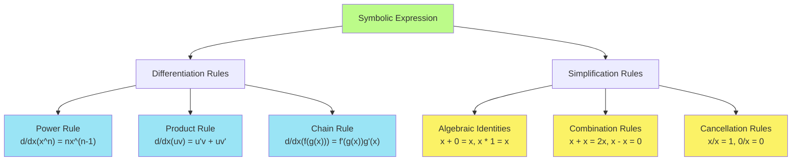

##### Integration with Logical Reasoning Systems

The symbolic computation capabilities demonstrate how logical reasoning systems can be extended to support mathematical
computation. The same unification algorithms that support logical inference can be used for pattern matching in
algebraic manipulation.

This integration suggests broader possibilities for AI systems that combine logical reasoning with mathematical
computation. Such systems could support scientific reasoning, engineering design, and mathematical problem-solving
applications that require both logical inference and symbolic computation.

The AIMA logic implementation thus serves as both a tutorial in automated reasoning and a foundation for more
sophisticated AI applications. Its clean design and comprehensive coverage of fundamental algorithms make it an
excellent starting point for understanding how logical reasoning can be implemented computationally.

The code demonstrates that sophisticated reasoning capabilities can emerge from relatively simple foundational concepts
when they are properly organized and systematically applied. This principle extends beyond logic to other areas of AI,
suggesting that complex intelligent behavior often arises from the systematic application of simple, well-understood
principles.

```

```
