# COURSE-2: CLASSICAL SEARCH 

<br>
<br>

# CHAPTER-2: Uninformed Search

<br>
<br>

### What Is A Problem?

<br>

The route finding problem can be formulated as with the following components: Initial state, denoted by S0, is any state that can be designated as the starting point. Actions, denoted by: {a1, a2, a3, ...}, is a set of the possible actions available to the agent at any given state.Results, denoted by S', is the new stage where the agent ends up after taking an action at a given state. Goal Test, denoted by a boolean of True or False, checks whether the current state is the goal state. Path Cost is the sum of the cost of the individual steps. In the route finding problem, the cost could be the distance between two cities.

With the framework just established for describing search problems, we'll first cover strategies that come under the heading of uninformed search. These strategies have no additional information about states beyond that provided in the problem definition, so they can only proceed by generating successors until they find a goal state. Later, we'll introduce additional search strategies that can prioritize “more promising” states, called **informed search** or **heuristic search strategies**.

<br>

Most common types of uninformed search are:

1. Breadth-first Search (BFS) is a search strategy that expands the shallowest unexpanded node first. BFS expands the root node, then explores all the children of the root node, and so on.
2. Depth-first Search (DFS) applies a similar search strategy as BFS but expands the deepest node in the current frontier of the search tree. DFS expands the first child of the root node and explores farther to the deepest leaf node.
3. Uniform Cost Search (UCS) is a search strategy that expands the successor node with the cheapest cost. In a route finding problem, the cheapest cost could be defined as the shortest distance (in miles) between two cities.

<br>   
   
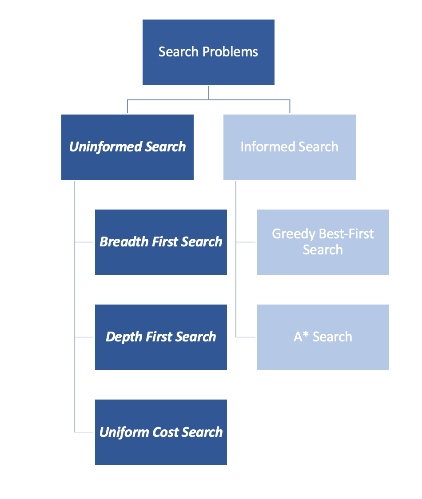

<br>


### Algorithm for Tree Search

<br>

```
function Tree.Search (problem):
    frontier = { [initial] }
    loop:
        if frontier is empty: return FAIL
        path = remove.choice(frontier)
        s = path.end
        if s is a goal: return path
        for a in actions:
            add [path + a > Result(s,a)]
            to frontier
```

<br>

The line, add[path + a > Results(s,a)], is not a mathematical operation. This line appends the current action,a, into the previous path, path. After taking the action, the search agent will be in a new state, Results(s,a). Finally, the algorithm will add the list into the frontier dictionary through add[] function.

<br>

### Graph Search

<br>

The pseudocodes for graph search and tree search algorithms are quite similar. The key difference is that the graph search algorithm keeps track of the explored states, as highlighted in the pseudocode. Graph search algorithm removes the redundancy to revisit the explored states as it happens in the tree search algorithm.

<br>

```
function Graph.Search (problem):
   frontier = { [initial] }; explored = { }
   loop:
       if frontier is empty: return FAIL
       path = remove.choice(frontier)
       s = path.end; add s to explored
       if s is a goal: return path
       for a in actions:
           add [path + a -> Result(s,a)]
           to frontier
           unless Result(s,a) in frontier or explored
```

<br>
<br>

## Graph Search Algorithms

<br>

**Basic Concept**

Graph search is a fundamental approach to solving problems by exploring nodes and their connections. Unlike tree search which might revisit states, graph search keeps track of explored nodes to avoid cycles. Two primary methods are **Breadth-First Search (BFS)** which explores level by level, and **Depth-First Search (DFS)** which explores as far as possible along each branch.

**Technical Details**

The graph search algorithm uses two key data structures:

1. **Frontier**: Contains nodes that have been discovered but not yet explored
2. **Explored Set**: Keeps track of already visited nodes to prevent cycles

BFS implements the frontier as a queue (FIFO), ensuring nodes are explored in order of their distance from the start. DFS implements the frontier as a stack (LIFO), exploring deeply along one path before backtracking.

<br>
<br>

**Mathematical Formulation**

<br>

```
frontier = { [initial] }; explored = { }
loop:
    if frontier is empty: return FAIL
    path = remove.choice(frontier)
    s = path.end; add s to explored
    if s is a goal: return path
    for a in actions:
        add [path + a -> Result(s,a)]
        to frontier
        unless Result(s,a) in frontier or explored
```

<br>

**Time Complexity:**

- BFS: O(b^d) where b = branching factor, d = depth
- DFS: O(b^m) where m = maximum depth
- Space Complexity: O(b*d) for BFS, O(m) for DFS

**Completeness:**

- BFS: Complete if b is finite
- DFS: Complete in finite spaces with loop detection

<br>
<br>

This algorithm forms the basis for more advanced search strategies like A\* and best-first search, which add heuristic information to guide the exploration.

<br>
<br>

## Breadth-First Search (BFS)

<br>

**Basic Concept**

BFS explores a graph layer by layer, like ripples spreading in a pond. It guarantees finding the shortest path in unweighted graphs by systematically exploring nodes at the current depth before moving to nodes at the next depth level.

**Technical Details**

BFS uses a FIFO queue as its frontier, ensuring that nodes are explored in order of their distance from the start node. Each level of the graph is completely explored before moving to the next level. This makes it particularly useful for finding shortest paths and in scenarios where the goal may be close to the start.

**Mathematical Formulation**

<br>

```
function BFS(start_node):
    queue = [start_node]
    visited = {start_node}

    while queue is not empty:
        node = queue.dequeue()
        if node is goal: return SUCCESS

        for neighbor in node.neighbors:
            if neighbor not in visited:
                queue.enqueue(neighbor)
                visited.add(neighbor)
```

<br>
<br>

**Properties:**

- Time Complexity: O(V + E) where V = vertices, E = edges
- Space Complexity: O(V)
- Complete: Yes (will find solution if exists)
- Optimal: Yes (for unweighted graphs)

<br>
<br>

## Depth-First Search (DFS)

<br>

**Basic Concept**

DFS explores a graph by going as deep as possible along each branch before backtracking. It's like exploring a maze by following each path to its end before trying alternate routes.

**Technical Details**

DFS uses a LIFO stack as its frontier, which means it fully explores each path before backtracking. It has a significantly smaller memory footprint compared to BFS as it only needs to store nodes on the current path. However, it may not find the shortest path and can get stuck in infinite paths without proper cycle detection.

<br>

**Mathematical Formulation**

<br>

```
function DFS(start_node):
    stack = [start_node]
    visited = {start_node}

    while stack is not empty:
        node = stack.pop()
        if node is goal: return SUCCESS

        for neighbor in node.neighbors:
            if neighbor not in visited:
                stack.push(neighbor)
                visited.add(neighbor)
```

<br>
<br>

**Properties:**

- Time Complexity: O(V + E)
- Space Complexity: O(h) where h = height of graph
- Complete: Only with cycle detection
- Optimal: No guarantee of shortest path

**Key Differences:**

- BFS is better for finding shortest paths
- DFS uses less memory
- BFS explores breadth-wise (level by level)
- DFS explores depth-wise (path by path)
- BFS is complete, DFS needs cycle detection for completeness

<br>
<br>

## Uniform Cost Search (UCS)

<br>

**Basic Concept**

Uniform Cost Search is a variant of Dijkstra's algorithm that finds the least-cost path to a goal node in a weighted graph. Unlike BFS which assumes uniform edge costs, UCS takes into account varying path costs by always expanding the lowest-cost path first, making it optimal for paths with different costs.

**Technical Details**

UCS uses a priority queue as its frontier, where the priority is determined by the cumulative path cost from the start node. The key difference from BFS is that nodes are explored in order of their total path cost rather than their level in the tree. The algorithm continues until it reaches a goal state, ensuring that the path found is the lowest-cost path to that goal.

**Mathematical Formulation**

```
function UniformCostSearch(problem):
    frontier = PriorityQueue()
    frontier.add(path=[initial], priority=0)
    explored = {}

    while frontier is not empty:
        path = frontier.pop()  # Path with lowest cost
        s = path.end
        cost = path.cost

        if s is goal: return path

        explored.add(s)
        for action in s.actions:
            new_path = path + action
            new_cost = cost + action.cost

            if new_path.end not in explored and
               new_path.end not in frontier:
                frontier.add(new_path, new_cost)
            elif new_path.end in frontier with higher cost:
                frontier.update(new_path, new_cost)
```

<br>
<br>

**Properties:**

- Time Complexity: O(b^(1 + ⌊C*/ε⌋))
  where C* = cost of optimal solution
  ε = minimum action cost
- Space Complexity: O(b^(1 + ⌊C*/ε⌋))
- Complete: Yes, if all costs > 0
- Optimal: Yes, finds least-cost path


**Key Features:**

1. Explores paths in order of increasing cost
2. Guarantees optimal solution when costs are positive
3. Can be inefficient when many paths have similar costs
4. More general than BFS but slower
5. Forms the basis for more advanced algorithms like A\*

<br>

**Common Applications:**

- GPS and navigation systems
- Network routing protocols
- Robot path planning
- Game pathfinding with varying terrain costs

<br>

<br>
<br>


<br>


This image illustrates **3** different tree traversal or search strategies commonly used in computer science and artificial intelligence:

1. Breadth-First (Left):
- Explores all nodes at the current depth level before moving to nodes at the next depth level
- Moves horizontally through the tree, level by level
- No costs/weights shown as it treats all paths equally

2. Cheapest-First (AKA Uniform Cost Search, UCS) (Middle):
- Similar to Dijkstra's algorithm or Uniform Cost Search
- Shows edge costs/weights (numbers on edges: 5, 2, 3, 2, 4, 2)
- Explores paths based on cumulative cost, prioritizing the cheapest total path
- Numbers represent the cost to traverse each edge

3. Depth-First (Right):
- Explores a path all the way down to a leaf before backtracking
- Moves vertically through the tree, going as deep as possible before exploring siblings
- No costs/weights shown as it prioritizes depth over cost

<br>

All **3** trees have the same structure (a binary tree with 3 levels and 7 nodes total), but they represent different strategies for exploring or searching through the tree structure. The choice between these strategies depends on the specific problem requirements, such as whether finding the shortest path is important (Cheapest-First), memory constraints (Depth-First uses less memory), or ensuring the shortest number of steps to a goal (Breadth-First).

<br>
<br>


Depth-First search will expand all the way down one route first to look for a goal. If it cannot find the goal down that path, it turns around to go back to the next-furthest node and searches along that route. It does find the goal down that route, no matter how far, it will terminate. Cheapest-First and Uniform Cost refer to the same search method and these are optimal. The DFS is not optimal as it will go down the deepest path and if find it, will return it. This is not a good method for planning but its great for storage as provided image below. If a path is infinite, the DFS is incomplete but others are not.

<br>
<br>


<br>
<br>


### Search Algorithms Comparison


Search algorithms vary significantly in their space complexity and optimality. Let's examine the key characteristics of three fundamental search strategies.


### Search Methods Comparison

```
| Search Method  | Optimal? | Frontier size | Size @ n = 20 | Complete? |
| -------------- | -------- | ------------- | ------------- | --------- |
| Breadth-First  | Yes      | 2^n           | 1,048,576     | Yes       |
| Cheapest-First | Yes      | 2^n           | 1,048,576     | Yes       |
| Depth-First    | No       | n             | 20            | No        |
```

<br>
<br>

This table provides a comprehensive comparison of three fundamental search algorithms, showing:

- Whether they guarantee optimal solutions
- Their frontier size complexity
- A concrete example with n=20
- Whether they are complete (guaranteed to find a solution if one exists)

BFS and Cheapest-First (UCS) share similar characteristics but differ in their implementation, while DFS trades completeness and optimality for better space efficiency.

<br>

## Key Insights

### Space Complexity

- BFS and Cheapest-First (UCS) have exponential space requirements (2^n)
- DFS has linear space complexity (n)
- At n=20, the difference is dramatic: over 1 million nodes vs just 20 nodes

### Optimality

- Both BFS and Cheapest-First guarantee optimal solutions
- DFS trades optimality for space efficiency
- This makes DFS more practical for deep searches where memory is limited

### Practical Implications

- BFS/UCS are better for problems requiring optimal solutions
- DFS is better for deep searches or when memory is constrained
- Space complexity often becomes the deciding factor in real-world applications

<br>
<br>

## Summary

While BFS and Cheapest-First guarantee optimal solutions, their exponential space requirements can make them impractical for large problems. DFS, despite not guaranteeing optimality, remains useful due to its modest memory requirements. The three search strategies that come under the heading of uninformed search. These strategies have no additional information about states beyond that provided in the problem definition, so they can only proceed by generating successors until they find a goal state. We describe two types of search representations: **tree search** and **graph search**. A tree search is a formal description of the available states and actions in the problem in the forms of nodes (states) and edges (actions). The graph search is different from the tree search in which graph search prevents redundancy by going back to the explored states.

<br>
<br>

# CHAPTER-3: Informed Search

<br>
<br>

Informed search strategies have additional information about search states, so they can guide the search by ranking successors according to some fitness score until they find a goal state. Informed search strategies include:

<br>

1. **Uniform Cost search** - expands out equally in all directions, may expend additional effort getting to a fairly direct path to the goal.
2. **Greedy best-first search** - expands outward toward locations estimated as closer to the goal. If a direct path is available, expends much less effort than Uniform Cost; however, it does not consider any routes in which it may need to temporarily take a further away path in order to arrive at an overall shorter path.
3. **A\* Search** - utilizes both of these - will try to optimize with both the shortest path and the goal in mind.


## A\* Search Algorithm

A\* (A-star) is an informed search algorithm that combines the benefits of both uniform-cost search and greedy best-first search. It uses a heuristic function to guide its search, making it more efficient than uninformed search methods while maintaining optimality under certain conditions.


### Key Components

- g(n): Actual cost from start node to current node n
- h(n): Heuristic estimated cost from node n to goal
- f(n): Total estimated cost of path through node n
- **f(n) = g(n) + h(n)**

### Properties

- Optimal if h(n) is admissible (never overestimates)
- Complete if h(n) is consistent (satisfies triangle inequality)
- More efficient than Dijkstra's algorithm
- Maintains a priority queue ordered by f(n)

## Common Heuristics

- Manhattan Distance: |x1 - x2| + |y1 - y2|
- Euclidean Distance: √[(x1 - x2)² + (y1 - y2)²]
- Diagonal Distance: max(|x1 - x2|, |y1 - y2|)

## Advantages

1. More efficient than uninformed search
2. Guarantees optimal path with admissible heuristics
3. Versatile across many problem domains
4. Can be modified for different performance needs

## Applications

- Pathfinding in games
- Robot navigation
- Route planning systems
- Network routing
- Puzzle solving

## Performance Characteristics

- Time Complexity: O(b^d) worst case
- Space Complexity: O(b^d)
- Performance heavily dependent on heuristic quality
- Can degenerate to Dijkstra's if h(n) = 0

<br>   
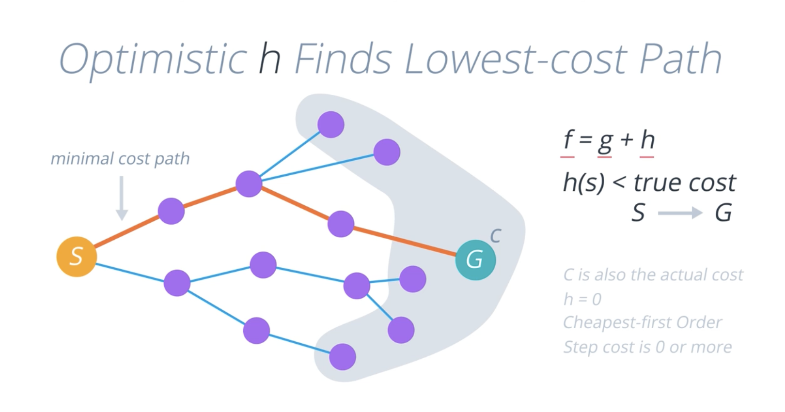
<br>

<br>
<br>

## Vaccum Cleaner State Spaces

<br>

There is a total of 8 possible states in this environment as follows:

- 2 possible states of the location property: location A or location B
- 2 possible states of vacuum cleaner property in each location: True or False
- 2 possible states of dirt property in each location: True or False

Therefore, the total number of state space is **2 x 2 x 2 = 23 = 8**

<br>   
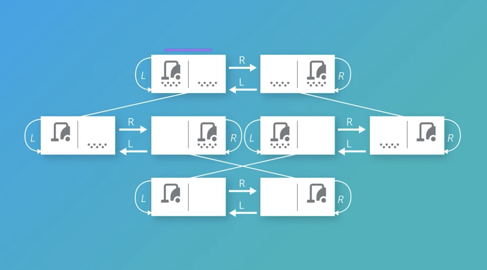
<br>

### Vacuum Cleaner States

1- ⏻ on / off / sleep
2- 📷 on / off
3- Brush Height 1 / 2 / 3 / 4 / 5
4- Extend Positions to 10

<br>   
<br>   

Route finding is a difficult search problem to solve. The problem lies in the fact that we want the optimal route between two nodes without having to explore all possible routes. Informed search algorithms, such as A\* Search, employ the strategies that considerably narrow down the state space in the problem’s environment.

Whenever the A\* Search algorithm decides on the next node to visit, it computes an estimate of the candidate nodes’ distance to the target. In addition, A\* Search uses the edge-weight method made popular by Dijkstra’s algorithm. A\* Search is basically an informed variation of Dijkstra’s algorithm with the heuristic function.


<br>   
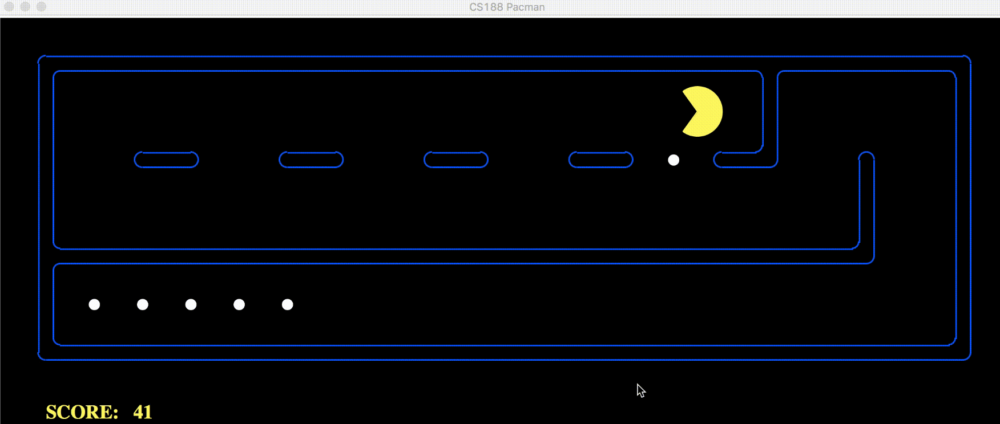
<br>


<br>
<br>

# COURSE-3: Automated Planning

<br>
<br>

# CHAPTER-1: Symbolic Logic and Reasoning

<br>
<br>

## Classical Search

<br>

This course introduces a knowledge-based AI agent who can reason and plan and will discuss how to use symbols to represent logic and reasoning. A problem-solving AI agent does not store knowledge about the world. The agent relies on the algorithms, such as Constraint Satisfaction Problem and Search, to find the solutions in state space. A knowledge-based AI agent, however, has full or partial knowledge about the world and can make inferences from the knowledge.

For a knowledge-based AI agent to be able to reason and plan, they must apply logic to the knowledge about the world. The simplest form of logic is **Propositional Logic**. **Propositional logic** is the simplest language consisting of symbols and logical connectives. But it can only handle boolean propositions, which are **True**, **False** or **Unknown**.

Knowledge-based agents use **First Order Logic (FOL)** to learn about the knowledge of the world and to reason through the more powerful knowledge representations. **FOL** is built around objects and relations. It also has universal and existential quantifiers to construct assertions about all or some of the possible values of the quantified variables. We will also learn how to define problems so our knowledge-based AI agents can plan to solve the problems
through explicit propositional and relations between states and actions.

<br>
<br>

### Propositional Logic

<br>

Propositional logic is a fundamental form of logic that deals with propositions (statements that are either true or false) and logical connectives. It's a building block for more complex logical systems and is crucial in AI for representing and reasoning about knowledge.

Propositional Logic is a simple logic where the truth of sentences is determined. A propositional logic sentence is either true or false with respect to a model of the world. The example of an atomic sentence is P = True . Complex sentences can consists of several atomic sentences connected through parentheses and logical connectives (see table below). A model is a set of true-false values for all the propositional symbols, for example:

```
model = { B: True, E: False, ... }.
```

<br>

| Logical Connective | Meaning        |
| ------------------ | -------------- |
| ¬                  | NOT            |
| ∧                  | AND            |
| ∨                  | OR             |
| ⇒                  | IMPLY          |
| ⇔                  | IF AND ONLY IF |

<br>

This is a table showing the basic logical connectives used in propositional logic and their meanings:

- NOT (¬) is used for negation
- AND (∧) is used for conjunction
- OR (∨) is used for disjunction
- IMPLY (⇒) is used for implication
- IF AND ONLY IF (⇔) is used for equivalence/biconditional

The alphabets in the video represent the following atomic sentences:

B is true if there is a burglary and false if not.
E is true if there is an earthquake and false if not.
A is true if the alarm rings and false if not.
M is true if Mary calls and false if not.
J is true if Mary calls and false if not.
We can combine these atomic sentences using logical connectives, such as:

(E ∨ B) ⇒ A means if there is an earthquake or a burglary happening, the alarm will trigger.
A ⇒ (J ∧ M) means if the alarm is triggered, John and Mary will call.
J ⇔ M means John calls if and only if Mary calls. In other words, if John calls, Mary will call as well.
J ⇔ ¬M is the opposite of the above. If John calls, Mary won’t call.

<br>
<br>

**Key Components:**

<br>

1. Propositional Symbols:

   - Represent atomic propositions (e.g., B for Burglary, E for Earthquake)
   - Can be either true or false

2. Logical Connectives:

   - NOT (¬): Negation
   - AND (∧): Conjunction
   - OR (∨): Disjunction
   - IMPLY (⇒): Implication
   - IF AND ONLY IF (⇔): Biconditional

3. Model:

   - A set of true/false assignments to all propositional symbols
   - Example: {B: True, E: False, A: True, M: False, J: True}

4. Sentences:

   - Formed by combining propositional symbols with connectives
   - Example: (E ∨ B) ⇒ A (If there's an Earthquake OR Burglary, then the Alarm will sound)

5. Truth Values:
   - Sentences are evaluated as either true or false with respect to a given model
   - Truth tables are used to define the meaning of connectives

Example Sentences:

- A ⇒ (J ∧ M): If the Alarm sounds, then John AND Mary will call
- J ⇔ M: John calls if and only if Mary calls
- J ⇔ ¬M: John calls if and only if Mary doesn't call

<br>
<br>

**Key Points:**

<br>

1. Propositional logic deals with absolute truth values, not probabilities.
2. It's limited to expressing facts about specific propositions and can't generalize.
3. Truth tables are used to evaluate complex sentences.
4. It forms the basis for more complex logics like First-Order Logic.

<br>

In AI and automated planning, propositional logic is used to represent states, actions, and goals in a simple, boolean manner. It allows for basic reasoning about the truth of statements in different scenarios, which is fundamental for planning and decision-making algorithms.

<br>

**Truth Table**

| P     | Q     | ¬P    | P ∧ Q | P ∨ Q | P ⇒ Q | P ⇔ Q |
| ----- | ----- | ----- | ----- | ----- | ----- | ----- |
| False | False | True  | False | False | True  | True  |
| False | True  | True  | False | True  | True  | False |
| True  | False | False | False | True  | False | False |
| True  | True  | False | True  | True  | True  | True  |

<br>
<br>

Explanation of the truth table:

1. ¬P (NOT P):

   - True when P is False, False when P is True.

2. P ∧ Q (P AND Q):

   - True only when both P and Q are True.

3. P ∨ Q (P OR Q):

   - True when either P or Q (or both) are True.

4. P ⇒ Q (P IMPLIES Q):

   - False only when P is True and Q is False.
   - True in all other cases, including when P is False (vacuous truth).

5. P ⇔ Q (P IF AND ONLY IF Q):
   - True when P and Q have the same truth value (both True or both False).
   - False when P and Q have different truth values.

<br>
<br>

This truth table is fundamental in propositional logic as it defines the behavior of logical connectives for all possible combinations of truth values of P and Q. It allows us to evaluate complex logical statements by breaking them down into their constituent parts and applying these rules.

<br>
<br>

**Q#1: (P is false, Q is false):**

Correct answer: (P ∧ (P ⇒ Q)) ⇔ (¬ (¬P ∨ ¬Q))

Explanation:

- P ∧ (P ⇒ Q) is false because P is false.
- ¬ (¬P ∨ ¬Q) is false because ¬P ∨ ¬Q is true (both ¬P and ¬Q are true).
- The equivalence of two false statements is true.

**Q#2(P is false, Q is true):**

Correct answer: (P ∧ (P ⇒ Q)) ⇔ (¬ (¬P ∨ ¬Q))

Explanation:

- P ∧ (P ⇒ Q) is false because P is false.
- ¬ (¬P ∨ ¬Q) is false because ¬P ∨ ¬Q is true (¬P is true).
- The equivalence of two false statements is true.

**Q#3(P is true, Q is false):**

Correct answer: (P ∧ (P ⇒ Q)) ⇔ (¬ (¬P ∨ ¬Q))

Explanation:

- P ∧ (P ⇒ Q) is false because P ⇒ Q is false when P is true and Q is false.
- ¬ (¬P ∨ ¬Q) is false because ¬P ∨ ¬Q is true (¬Q is true).
- The equivalence of two false statements is true.

**Q#4(P is true, Q is true):**

Correct answers: All three statements

Explanation:

- P ∧ (P ⇒ Q) is true because both P and P ⇒ Q are true.
- ¬ (¬P ∨ ¬Q) is true because ¬P ∨ ¬Q is false (both ¬P and ¬Q are false).
- (P ∧ (P ⇒ Q)) ⇔ (¬ (¬P ∨ ¬Q)) is true because both sides are true.

In all cases, the equivalence statement is true because it represents a tautology - a statement that is always true regardless
of the truth values of its components. This demonstrates an important principle in propositional logic about logical
equivalences.

**Q#1:Given that (E v B) ⇔ A, A ⇔ (J ∧ M), and B are all true statements, what is the value of the variable E?**

Correct Answer: Cannot be determined
Explanation: While we know B is true, E could be either true or false. If E is true, (E v B) is true. If E is false, (E v B)
is still true because B is true. Therefore, we can't determine E's specific value.

**Q#2:Given that (E v B) ⇔ A, A ⇔ (J ∧ M), and B are all true statements, what is the value of the variable B?**

Correct Answer: True
Explanation: The question directly states that B is a true statement.

**Q#3:Given that (E v B) ⇔ A, A ⇔ (J ∧ M), and B are all true statements, what is the value of the variable A?**

Correct Answer: True
Explanation: Since (E v B) ⇔ A is true and B is true, (E v B) is true. Therefore, A must be true for the equivalence to hold.

**Q#4:Given that (E v B) ⇔ A, A ⇔ (J ∧ M), and B are all true statements, what is the value of the variable J?**

Correct Answer: Cannot be determined
Explanation: We know A is true, and A ⇔ (J ∧ M) is true. This means (J ∧ M) must be true, but we can't determine if J is true
or false without knowing M's value.

**Q#5:Given that (E v B) ⇔ A, A ⇔ (J ∧ M), and B are all true statements, what is the value of the variable M?**

Correct Answer: Cannot be determined
Explanation: Similar to J, we know (J ∧ M) is true, but we can't determine M's specific value without knowing J's value.

A valid sentence is one that is true in every possible model for every combination of values of the propositional symbols, and a satisfiable sentence is one that is true in some model and not necessarily in all the models. a unsatisfiable sentence is one that cannot be true in every possible model.

1. Valid Sentence:

   - Definition: A sentence that is true in every possible model.
   - Explanation: No matter what truth values you assign to the individual propositional symbols, the sentence always evaluates to true.
   - Example: P ∨ ¬P (P or not P) is valid because it's always true regardless of whether P is true or false.
   - Also known as a tautology.

2. Satisfiable Sentence:

   - Definition: A sentence that is true in at least one model.
   - Explanation: There exists at least one assignment of truth values to the propositional symbols that makes the sentence true.
   - Example: P ∧ Q is satisfiable because it's true when both P and Q are true, even though it's not true in all cases.
   - Note: All valid sentences are satisfiable, but not all satisfiable sentences are valid.

3. Unsatisfiable Sentence:
   - Definition: A sentence that cannot be true in any possible model.
   - Explanation: No matter what truth values you assign to the propositional symbols, the sentence always evaluates to false.
   - Example: P ∧ ¬P (P and not P) is unsatisfiable because it's always false.
   - Also known as a contradiction.

Key Points:

- A valid sentence is true in all models.
- A satisfiable sentence is true in at least one model.
- An unsatisfiable sentence is false in all models.
- Every sentence is either satisfiable or unsatisfiable.
- Valid sentences are a subset of satisfiable sentences.

These concepts are crucial in logical reasoning and form the basis for many algorithms in artificial intelligence, including
automated theorem proving and logical inference systems.

## VSU Analysis Table


| V   | S   | U   | Logical Expression                                  |
| --- | --- | --- | --------------------------------------------------- |
| ●   | ○   | ○   | P∨¬P                                                |
| ○   | ○   | ●   | P∧¬P                                                |
| ●   | ○   | ○   | P∨Q∨(P⇔Q)                                           |
| ●   | ○   | ○   | (P⇒Q)∨(Q⇒P)                                         |
| ○   | ○   | ○   | ((Food⇒Party)∨(Drinks⇒Party))⇒((Food∧Drinks)⇒Party) |

Where:

- V = Valid (true in all interpretations)
- S = Satisfiable (true in some interpretations)
- U = Unsatisfiable (false in all interpretations)
- ● = Yes
- ○ = No

**Q#1: Is the following sentence valid, satisfiable, or unsatisfiable? P ∨ ¬P**

Correct Answer: Valid
Explanation: This sentence is a tautology, which is always true regardless of the truth value of P. If P is true, P ∨ ¬P
is true. If P is false, ¬P is true, so P ∨ ¬P is still true. Therefore, it's valid (true in all possible models).

**Q#2: Is the following sentence valid, satisfiable, or unsatisfiable? P ∧ ¬P**

Correct Answer: Unsatisfiable
Explanation: This sentence is a contradiction. It can never be true because P cannot be simultaneously true and false.
Therefore, it's unsatisfiable (false in all possible models).

**Q#3: Is the following sentence valid, satisfiable, or unsatisfiable? P ∨ (P ∧ Q)**

Correct Answer: Not provided in the image, but the correct answer would be Satisfiable.
Explanation: This sentence is true whenever P is true, regardless of Q's value. It's also true when both P and Q are true.
However, it's false when P is false and Q is true. Therefore, it's satisfiable (true in some models, but not all).

**Q#4:Is the following sentence valid, satisfiable, or unsatisfiable? (P ∧ Q) ∨ (P ∧ ¬Q)**

Correct Answer: Not provided in the image, but the correct answer would be Satisfiable.
Explanation: This sentence is equivalent to P ∧ (Q ∨ ¬Q). It's true whenever P is true, regardless of Q's value. However,
it's false when P is false. Therefore, it's satisfiable (true in some models, but not all).

**Q#5: Is the following sentence valid, satisfiable, or unsatisfiable? ((Food ∧ Party) ∨ (Drinks ∧ Party)) ⇔ ((Food ∨ Drinks) ∧ Party)**

Correct Answer: The correct answer would be Valid.
Explanation: This sentence is a logical equivalence. The left side is true when there's a party with food or drinks (or both).
The right side expresses the same condition. This equivalence holds for all possible combinations of truth values for Food, Drinks,
and Party. Therefore, it's valid (true in all possible models).

<br>
<br>

**Limitations of Propositional Logic**

1.  It can only handle boolean value (ie. true or false) and does not have a capability to handle complex values, such as
    uncertainty (probability value).
2.  It can't include objects that have properties, such as size, weight, color, nor shows the relationship between objects.
3.  There are no shortcuts to succinctly talk about a lot of different things happening.

Building Elements of First Order Logic (FOL)

1.  Objects: are the noun phrases that refer to things, such as a house, a person, an event.

2.  Relations: are the verb phrases among the objects. The relations can be a "property", such as "the car is red", or a function,
    which maps the input to an output, such as "times two". FOL expresses the facts about some or all of the objects in the world.
    It represents the general laws or rules. For example, in this sentence of "Peter Norvig wrote the best Artificial Intelligence
    textbook", the objects are "Peter Norvig" and "textbook", the property are "the best" and "Artificial Intelligence", and the relation is "wrote".

FOL may remind you of the Object-Oriented Programming (OOP). Similar to FOL, OOP is a programming paradigm around objects,
rather than functions or logics. Both FOL and OOP objects can have properties and functions (or methods). FOL, however,
is different from OOP, in which FOL has a declarative nature that separates the knowledge of the world and their inferences.
The other difference is that OOP lacks the expressiveness required to handle partial information, such as

      if x is in loc A, then it is not in loc B.

<br>
<br>

### FOL Models 

The model in First Order Logic can process more complex representations than that in Propositional Logic.

In the Propositional Logic, a model is a set of objects with boolean values, such as pl_model = { P: true, Q: false, ... }. Whereas, in the First Order Logic, a model is a set of tuples and can consist of the properties or functional relationship of the objects, such as fol_model = { Write(Author(Peter), Book(AI textbook)) }.

<br>
<br>

1. Propositional Logic Models:

   - In PL, a model is a simple assignment of truth values (true or false) to propositional variables.
   - Each variable represents an entire proposition, which is a statement that is either true or false.
   - Example: pl_model = { P: true, Q: false, R: true }
   - This model states that proposition P is true, Q is false, and R is true.
   - PL cannot represent internal structure within these propositions.

2. First Order Logic Models:

   - In FOL, a model is more complex and represents a richer structure of the world.
   - It consists of:
     a) A domain of objects (e.g., people, books)
     b) Relations between these objects
     c) Functions that map objects to other objects
   - Example: fol_model = { Write(Author(Peter), Book(AI textbook)) }
   - This model represents:
     - Objects: Peter (an Author), AI textbook (a Book)
     - Function: Author() maps a name to an author object
     - Function: Book() maps a title to a book object
     - Relation: Write() represents the action of an author writing a book

3. Key Differences:

   - Expressiveness: FOL can express relationships and properties of objects, while PL can only express truth values of whole statements.
   - Structure: FOL models have internal structure (objects, relations, functions), while PL models are flat assignments.
   - Quantification: FOL allows for statements about all objects or some objects in the domain, which is not possible in PL.
   - Partial Information: FOL can handle partial information about objects and their relationships, which PL cannot do effectively.

4. Implications:

   - FOL can represent more complex scenarios and reasoning tasks.
   - It allows for more nuanced and detailed modeling of real-world situations.
   - FOL supports reasoning about categories of objects and their properties, not just individual propositions.

5. Example Comparison:
   - PL: "It's raining" (R) and "The ground is wet" (W) might be represented as R ∧ W
   - FOL: "All days when it rains, the ground is wet" might be represented as ∀x(Raining(x) → Wet(Ground, x))
     where x represents days, Raining is a predicate about days, and Wet is a relation between objects and days.

In summary, FOL models provide a much richer and more flexible framework for representing knowledge about the world, allowing
for more sophisticated reasoning and inference compared to the simpler boolean world of Propositional Logic.

The symbols ∀ and ∃ are quantifiers in First Order Logic (FOL). They are fundamental to expressing complex logical statements
about sets of objects. Let's break them down:

<br>

1. ∀ (Universal Quantifier):

   - Pronunciation: "For all" or "For every"
   - Meaning: It indicates that the statement is true for all instances in the domain.
   - Example: ∀x P(x) means "For all x, P(x) is true"
   - Real-world usage: ∀x (Human(x) → Mortal(x))
     This means "For all x, if x is human, then x is mortal"

2. ∃ (Existential Quantifier):
   - Pronunciation: "There exists" or "For some"
   - Meaning: It indicates that the statement is true for at least one instance in the domain.
   - Example: ∃x P(x) means "There exists an x such that P(x) is true"
   - Real-world usage: ∃x (Planet(x) ∧ HasLife(x))
     This means "There exists an x such that x is a planet and x has life"

Key points:

- ∀ is often used with implications (→)
- ∃ is often used with conjunctions (∧)
- These quantifiers allow FOL to express more complex ideas than propositional logic
- They can be combined to create even more sophisticated statements

Example combining both:
∀x (Dog(x) → ∃y (Human(y) ∧ Owns(y, x)))
This means "For all x, if x is a dog, then there exists a y such that y is human and y owns x"

In AI and automated reasoning, these quantifiers are crucial for representing general knowledge and making inferences about
sets of objects or entities.

1. Components of FOL Syntax:

   a) Sentences: Describe facts that are true or false.
   Examples:

   - Vowel(A)
   - Above(A, B)
   - 2 = 2

   b) Terms: Describe objects.
   Examples:

   - Constants: A, B, 2
   - Variables: x, y
   - Functions: Number_of(A)

2. Logical Connectives:
   ¬ (NOT), ∧ (AND), ∨ (OR), ⇒ (IMPLY), ⇔ (IF AND ONLY IF)

   These work similarly to propositional logic.

3. Quantifiers:
   a) Universal Quantifier (∀): "For all"
   b) Existential Quantifier (∃): "There exists"

4. Syntax Patterns:

   a) Universal Quantification often uses implication:
   ∀x Vowel(x) ⇒ Number_of(x) = 1
   "For all x, if x is a vowel, then the number of x is 1."

   b) Existential Quantification often uses conjunction:
   ∃x Number_of(x) = 2
   "There exists an x such that the number of x is 2."

5. Additional Examples:

   a) ∀x Dog(x) ⇒ Mammal(x)
   "All dogs are mammals."

   b) ∃x Planet(x) ∧ HasRings(x)
   "There exists a planet that has rings."

   c) ∀x (Student(x) ∧ Hardworking(x)) ⇒ WillSucceed(x)
   "For all x, if x is a student and x is hardworking, then x will succeed."

   d) ∃x Politician(x) ∧ Honest(x)
   "There exists a politician who is honest."

6. Important Notes:

   - Omitting quantifiers usually implies universal quantification.
   - Universal quantification (∀) naturally pairs with implication (⇒).
   - Existential quantification (∃) naturally pairs with conjunction (∧).
   - FOL allows for more complex and nuanced expressions than propositional logic.

7. Practical Application:

   In AI and automated reasoning, FOL can be used to represent complex knowledge and make inferences. For example, in a
   robot navigation system:

   ∀x (Obstacle(x) ⇒ Avoid(robot, x))
   "For all x, if x is an obstacle, the robot should avoid x."

   ∃x (SafePath(x) ∧ LeadsTo(x, goal))
   "There exists a safe path that leads to the goal."

These constructs allow AI systems to reason about general principles and specific instances in a way that closely mimics
human logical thinking.


### First Order Logic (FOL) Syntax

**Logical Connectives**

| Logical Connective | Meaning |
|-------------------|----------|
| ¬ | NOT |
| ∧ | AND |
| ∨ | OR |
| ⇒ | IMPLY |
| ⇔ | IF AND ONLY IF |

<br>

### Quantifiers

FOL extends propositional logic by adding quantifiers to express properties of collections of objects:

### Universal Quantification (∀)
- Interpreted as "For all x, ..."
- Example: ∀x Bird(x) ⇒ Animal(x)
- Means "all birds are animal"

### Existential Quantification (∃)
- Interpreted as "For some x, ..."
- Example: ∃x Car(x) ∧ Color(x,red)
- Means "there exists some cars with red color"

## Important Notes
- ⇒ is a natural connective with ∀ quantification
- ∧ is a natural connective with ∃ quantification

This extension of propositional logic to first-order logic allows us to express more complex logical statements and relationships between objects and their properties.

<br>

## First Order Logic in Vacuum World

1. Initial State:
   At(V,A)

   - The vacuum cleaner V is initially at location A.

2. Equations:

   a) ∀d ∀l Dirt(d) ∧ Loc(l) ⇒ ¬At(d,l)
   Interpretation: For all dirt d and locations l, if d is dirt and l is a location, then d is not at l.
   Meaning: Initially, no dirt is at any location.

   b) ∃l ∃d Dirt(d) ∧ Loc(l) ∧ At(V,l) ∧ At(d,l)
   Interpretation: There exists a location l and dirt d such that d is dirt, l is a location, the vacuum is at l, and the dirt is at l.
   Meaning: There is at least one location where both the vacuum and some dirt are present.

   c) ∀R Transitive(R) ⇔ (∀a,b,c R(a,b) ∧ R(b,c) ⇒ R(a,c))
   Interpretation: For all relations R, R is transitive if and only if for all a, b, and c, if R(a,b) and R(b,c) are true, then R(a,c) is true.
   Meaning: This defines the property of transitivity for any relation R.

3. Key Points:

   - Equation (a) seems to contradict (b). This likely represents different states of the world (initial vs. possible future state).
   - Equation (b) implies that the vacuum can coexist with dirt in the same location, possibly representing a state before cleaning.
   - Equation (c) is a general logical statement about transitive relations, not specific to the vacuum world but useful in logical reasoning.

4. Implications for AI Planning:

   - These statements provide both constraints and possibilities for the AI system.
   - The planner must consider how to move from the state in (a) to achieve states like (b), and then to a clean state.
   - Understanding transitive relations (c) could be crucial for planning efficient cleaning routes.

5. FOL Advantages:
   - Allows expression of complex relationships and rules.
   - Can represent both specific facts (like the vacuum's location) and general rules (like the definition of transitivity).
   - Provides a foundation for logical inference in AI systems.

These equations demonstrate how First Order Logic can be used to represent and reason about complex scenarios in AI planning
and problem-solving.

<br>
<br>

**Q#1:Is the following sentence valid, satisfiable, or unsatisfiable? ∃x: y: x = y**

Correct Answer: Valid

**Q#2:Is the following sentence valid, satisfiable, or unsatisfiable? (∃x: x = x) ∨ (∀y ∃z: y = z)**

Correct Answer: Valid
Explanation: This sentence is always true, making it valid. The left part (∃x: x = x) is always true because for any domain,
there exists an x that equals itself. Even if the right part were false, the sentence would still be true due to the OR (∨)
operator.

**Q#3:Is the following sentence valid, satisfiable, or unsatisfiable? ∀x: P(x) ∨ ¬ P(x)**

Correct Answer: Valid
Explanation: This sentence is a tautology in first-order logic. For any predicate P and any object x, either P(x) is true
or its negation ¬P(x) is true. This holds for all possible interpretations of P and all possible domains, making it valid.

**Q#4:Is the following sentence valid, satisfiable, or unsatisfiable? ∃x: P(x)**

Correct Answer: Satisfiable
Explanation: This sentence states that there exists an x for which the predicate P is true. It's satisfiable because we can construct a model where P is true for at least one object. However, it's not valid because we can also construct models where P is false for all objects. It's also not unsatisfiable because it can be true in some models.

<br>
<br>

List of logical statements under the heading "VSU", which stands for Valid, Satisfiable, and Unsatisfiable.

1. ∃x,y x=y

   - This statement is Satisfiable.
   - It means "There exist x and y such that x equals y."
   - This is true in any non-empty domain, as any object can be equal to itself.

2. (∃x x=x) ⇒ (∀y ∃z y=z)

   - This statement is Valid.
   - The left side (∃x x=x) is always true in any non-empty domain.
   - The right side (∀y ∃z y=z) is also always true, as for any y, we can choose z to be y itself.
   - Since the implication is from a true statement to another true statement, it's always valid.

3. ∀x P(x) ∨ ¬P(x)

   - This statement is Valid.
   - For any x, either P(x) is true or its negation ¬P(x) is true.
   - This is a tautology in first-order logic, true for any predicate P and any domain.

4. ∃x P(x)
   - This statement is Satisfiable.
   - It means "There exists an x for which P(x) is true."
   - This can be true or false depending on the interpretation of P and the domain.
   - It's not valid (as it's not necessarily true for all interpretations) and not unsatisfiable (as we can construct models where it's true).

<br>
<br>

The VSU classification helps in understanding the nature of these logical statements:

- Valid statements are true in all possible interpretations.
- Satisfiable statements are true in at least one interpretation.
- Unsatisfiable statements are false in all possible interpretations.

This classification is crucial in logic and reasoning systems, helping to determine which statements are always true, which
can be true under certain conditions, and which are never true.

1. ∃x,y Job(Sam,x) ∧ Job(Sam,y) ∧ ¬(x=y)
   Answer: Y (Yes)
   Explanation: This statement is true (Yes) because it asserts that Sam has at least two different jobs. The existential
   quantifier (∃) allows for the possibility of Sam having multiple jobs, and the inequality (¬(x=y)) ensures they are distinct.

2. ∀x,s Member(x, Add(x,s))
   Answer: Y (Yes)
   Explanation: This is likely true (Yes) as it states that for all x and s, x is a member of the set resulting from adding
   x to s. This is a fundamental property of set addition.

3. ∀x,s Member(x,s) ⇒ (∀y Member(x, Add(y,s)))
   Answer: Y (Yes)
   Explanation: This is true (Yes) because it states that if x is a member of s, then x remains a member of s after adding
   any y to s. This is a logical property of set operations.

4. ∀x,y Adj(Sq(x,y), Sq(+(x,1),y)) ∧ Adj(Sq(x,y), Sq(x,+(y,1)))
   Answer: Y (Yes)
   Explanation: This statement is true (Yes) as it defines adjacent squares on a grid. It states that for all x and y, the
   square at (x,y) is adjacent to the square at (x+1,y) and the square at (x,y+1). This correctly defines horizontal and
   vertical adjacency in a grid.

<br>
<br>

The "Y N | Adjacent squares" header suggests that these statements are all true (Y) and relate to the concept of adjacent squares,
which is consistent with the explanations provided.

<br>

| Y | N | Expression |
|---|---|------------|
| ● | ○ | ∃x,y Job(Sam,x) ∧ Job(Sam,y) ∧ ¬(x=y) |
| ○ | ● | ∀x,s Member(x,Add(x,s)) |
| ○ | ● | ∀x,s Member(x,s) ⇒ (∀y Member(x,Add(y,s))) |
| ○ | ● | ∀x,y Adj(Sq(x,y), Sq(+(x,1),y)) ∧ <br> Adj(Sq(x,y), Sq(x,+(y,1))) <br> Sq(1,1) Sq(2,1) <br> Sq(1,2) ⇔ |

<br>

Where:
- Y: Yes (●) or No (○)
- N: Yes (●) or No (○)
- Expression: First Order Logic expression

<br>
<br>

**Q#1:Is the following first-order logic sentence a good representation of the English language sentence, "Sam has two jobs"?**

∃x, y: Job(Sam, x) ∧ Job(Sam, y) ∧ ¬(x = y)

Correct Answer: Yes

Explanation: This first-order logic sentence accurately represents "Sam has two jobs." It states that there exist two
things (x and y) such that both are jobs of Sam (Job(Sam, x) and Job(Sam, y)), and these two things are not the same (¬(x = y)).
This captures the essence of having two distinct jobs.

**Q#2:Is the following first-order logic sentence a good representation of the concept of set membership?**

∀x, s: Member(x, Add(x, s)) ∀x, s: Member(x, s) ⇒ (∀y: Member(x, Add(y, s)))

Correct Answer: No


**Q#3:Is the following first-order logic sentence a good representation of the concept of adjacent squares on a chessboard?**

∀x, y: Adj(sq(x, y), sq(+(x, 1), y)) ∧ Adj(sq(x, y), sq(x, +(y, 1)))

Correct Answer: No


This captures both horizontal and vertical adjacency, which are the two types of adjacency on a chessboard (excluding diagonal
adjacency, which isn't typically considered in chess movements except for specific pieces).


<br>
<br>


# CHAPTER-2: Introduction to Planning

<br>

## Planning VS Execution

<br>

In the realm of artificial intelligence and decision-making, planning and execution are two distinct yet intertwined processes. Planning involves devising a strategy or sequence of actions to achieve a specific goal, while execution is the actual implementation of these planned actions.

<br>

**Planning:**

1. Uncertain Environments: Planning often occurs in environments where outcomes are uncertain. This can be due to stochastic elements, where outcomes are probabilistic, or multiagent settings, where other agents' actions influence the outcomes.
2. Agent's Knowledge: The planning process relies on the agent's internal knowledge, which might be incomplete or hierarchical, meaning actions and outcomes don't always follow a straightforward path.
3. Non-Deterministic vs Stochastic: While both terms describe uncertainty, stochastic environments allow for probabilistic quantification of outcomes, whereas non-deterministic environments can result in different outcomes with the same inputs.

**Execution:**

1. Execution is the phase where the planned actions are carried out. It requires real-time decision-making and adaptability to changes in the environment.
2. In partially observable environments, execution depends on the agent's belief state rather than the actual state of the world, requiring continuous updates and adjustments to the plan.

Together, planning and execution form a cycle where plans are created, executed, and revised based on feedback and changes in the environment. Understanding the nuances between planning and execution is crucial for developing robust AI systems capable of operating in complex and dynamic settings.

<br>
<br>

1. Uncertain Environments:
   a) Stochastic:

   - Outcomes of actions are not deterministic
   - Results can't be predicted with certainty
   - Example: Weather affecting outdoor plans

   b) Multiagent:

   - Multiple actors in the environment
   - Actions of one agent affect others
   - Example: Traffic flow affected by multiple drivers

   c) Partial Observability:

   - Agent can't fully observe the environment
   - Relies on belief state rather than actual state
   - Example: Robot navigation with limited sensor range

2. Agent's Internal Knowledge:
   a) Unknown:

   - Agent lacks prior knowledge about certain states
   - Must learn or discover information during execution
   - Example: Exploring an unmapped area

   b) Hierarchical:

   - Actions and outcomes aren't linear
   - Involves nested or layered decision-making
   - Example: Project management with multiple subprojects

3. Key Terminology:

   - Non-deterministic vs. Stochastic:
     - Both describe uncertainty
     - Stochastic: Quantifiable randomness (probabilities)
     - Non-deterministic: Different outcomes possible, not quantified

4. Implications for Planning:

   - Plans must be flexible and adaptable
   - Need for contingency planning
   - Importance of real-time decision making
   - Continuous monitoring and re-planning may be necessary

5. Strategies to Address Challenges:

   - Probabilistic planning methods
   - Multi-agent coordination algorithms
   - Belief state updating techniques
   - Learning and adaptation mechanisms
   - Hierarchical planning approaches

6. [A,S,F,B] Notation:
   - Likely represents different aspects or approaches to planning
   - Could stand for: Action, State, Function, Belief (but context is needed for confirmation)

These challenges highlight the complexity of real-world planning and the need for sophisticated AI planning systems that
can handle uncertainty, partial information, and dynamic environments.

<br>
<br>

## Vacuum Cleaner Planning Problem


In the “informed search” lesson, the vacuum cleaner operates in a fully observable and deterministic environment. Under these conditions, the vacuum cleaner knows where it is and whether there is dirt in all locations (fully observable). Also, the actions taken by the vacuum cleaner will result in certain states (deterministic). In order to achieve its goal under this environment, the vacuum cleaner can search the state space.

In this lesson, our planning agent will take on a more challenging environment, where it is only partially observable and nondeterministic. Under this challenging environment, we will introduce the concepts of belief state (a set of possible worlds). The belief state represents the agent’s current belief (not actual state) about the possible states it might be in after taking an action (or a sequence of actions) up to that point.


1. Fully Observable, Deterministic Environment:

   - 2 locations: A (left) and B (right)
   - Vacuum cleaner can be in either location
   - Dirt can be present or absent in each location
   - Total states: 2 (vacuum position) x 2 (A dirt) x 2 (B dirt) = 8 states
   - Actions: Move Left, Move Right, Suck
   - Planning is straightforward: search through state space for goal state

2. Unobservable (Sensorless) Environment:

   - Vacuum cleaner's sensors break down
   - Cannot determine location or presence of dirt
   - Introduces concept of "belief state"

3. Belief States:

   - Represent all possible states the agent could be in
   - Initial belief state: all 8 possible states
   - Actions change belief states, not just individual states

4. Planning with Belief States:

   - Search occurs in the space of belief states
   - Each action transforms one belief state into another
   - Goal is to reach a belief state where all possible states are goal states

5. Implications:

   - Increases complexity of planning
   - Requires considering all possible outcomes of actions
   - Introduces uncertainty into the planning process

6. Advantages of Belief State Planning:
   - Can handle partial observability
   - More robust in real-world scenarios
   - Allows for contingency planning

### Sensorless Vacuum Cleaner Problem

<br>

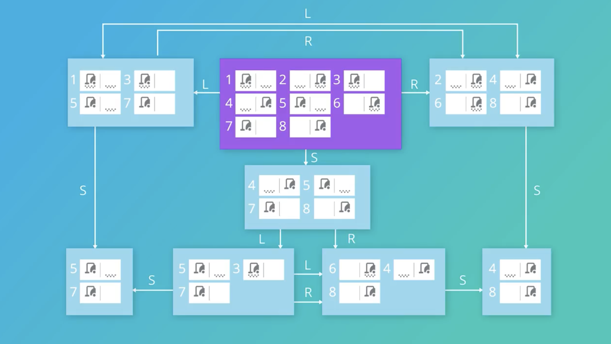

<br>

### Partially Observable Vacuum Cleaner Problem

- Can see what location it is in
- Can see what is going on 
  in the current location
- It cannot see whether there is 
  dirt in any other location

<br>

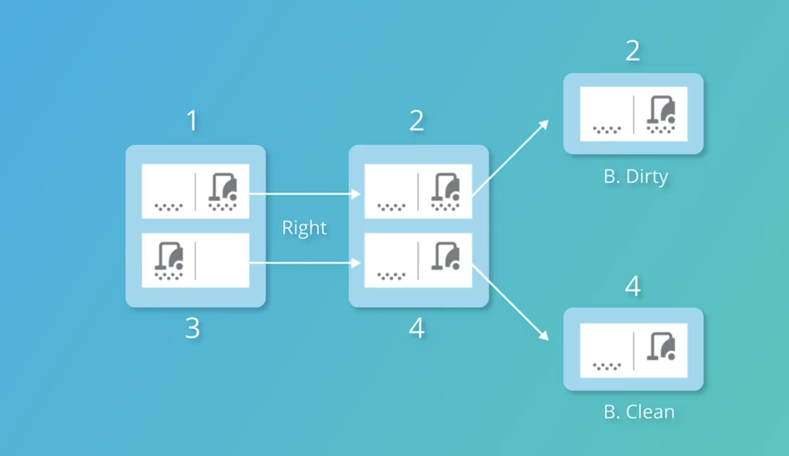

<br>


### Stochastic Environment Vacuum Cleaner Problem

<br>

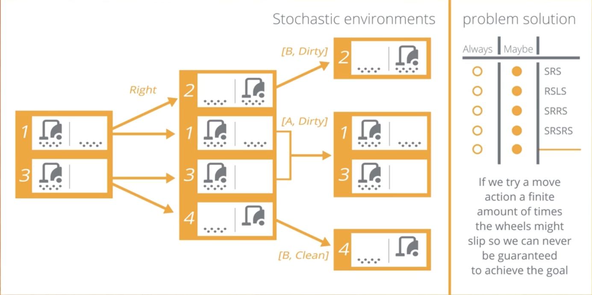

<br>

### Infinite Sequences

<br>

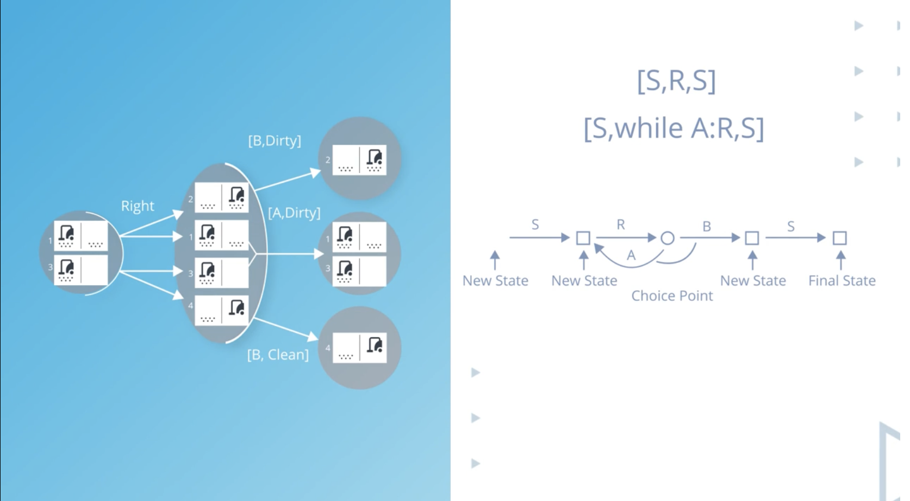

<br>

### Finding a Successful Plan

<br>

<div align="center">
   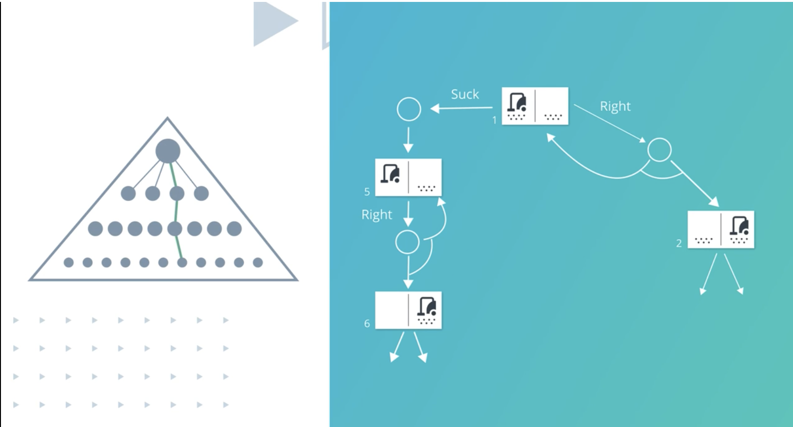
</div>

<br>

<br>

<div align="center">
   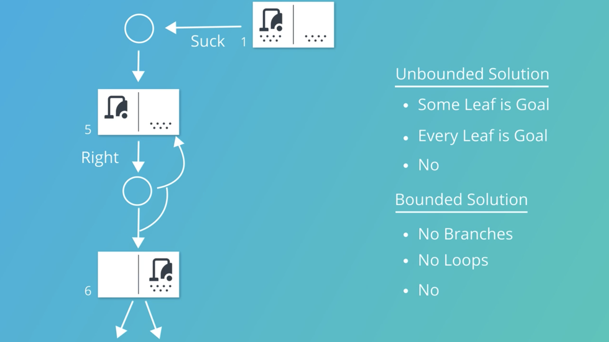
</div>

<br>

### Problem Solving via Mathematical Notation

In a deterministic environment, we can observe the new state directly from the result of taking an action in the current state. We can write this condition as a mathematical notation: s’ = Results(s, a), where s in the current state, a is an action, and s’ is the new state.

However, in a stochastic and partially-observable environment, we can only rely on the belief state, rather than the state space of the world. We apply two-step process iteratively to find the goal or solution in the planning tree as follows:

Predict(b, a), where b is the current belief state and a is the action, and
Update(Predict(b, a), o), where o is the observation from taking an action above.


<br>

<div align="center">
   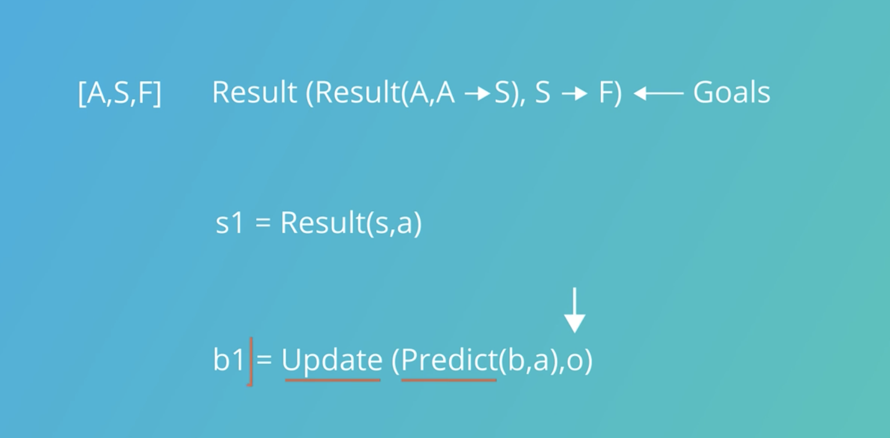
</div>

<br>

### Tracking the-Predict Update Cycle


<br>

<div align="center">
   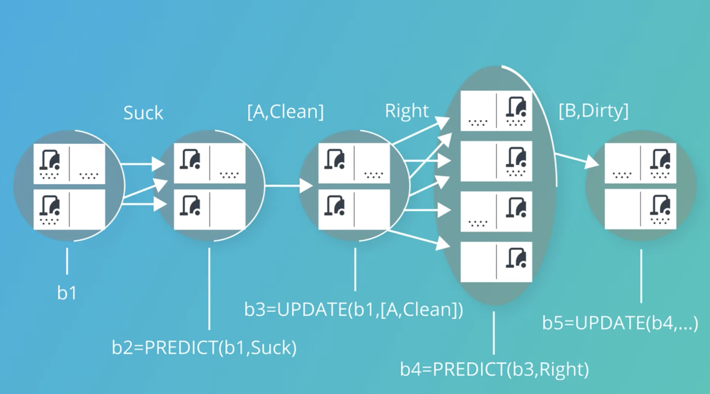
</div>

<br>

In the next lesson, we will deep dive into a planning graph that utilizes this predict and update cycle. A planning graph is a special data structure that gives better heuristic estimates from the initial planning state to the goal states. It is a directed graph organized by alternate layers, between states and actions layers, with preconditions and effects of each action.


Sensorless vacuum cleaner's belief state space consists of:

Nodes: the initial state and all possible new states after the agent takes an action.
Edges: all possible actions for the agent to learn about its environment. In the sensorless vacuum cleaner example, the possible actions are move-left (L), move-right (R), or suck (S).

This example illustrates the transition from simple, fully observable environments to more complex, partially observable
ones. In the real world, agents (like robots or AI systems) often have to deal with uncertainty and incomplete information.
The concept of belief states allows us to model this uncertainty explicitly.

Instead of knowing exactly which state the system is in, we maintain a set of possible states (the belief state). Actions
then transform these belief states. The challenge becomes finding a sequence of actions that, regardless of the actual
initial state, will lead to a desirable outcome.

This approach is more powerful and flexible than traditional state-space search, as it can handle a wider range of real-world
scenarios where perfect information is not available. It's a crucial concept in AI planning, robotics, and decision-making under
uncertainty.

Agent's belief state includes all 8 possible states (2 locations x 2 dirt conditions for each location). Let's explain this:

1. There are 2 locations: A (left) and B (right)

2. For each location, there are 2 possible dirt conditions:

   - Clean (no dirt)
   - Dirty (has dirt)

3. The vacuum cleaner can be in either location A or B

So, we calculate the total number of possible states:

- Vacuum location options: 2 (A or B)
- Dirt condition for location A: 2 (Clean or Dirty)
- Dirt condition for location B: 2 (Clean or Dirty)

Total combinations: 2 x 2 x 2 = 8 possible states

These 8 states are:

1. (Vacuum in A, A clean, B clean)
2. (Vacuum in A, A clean, B dirty)
3. (Vacuum in A, A dirty, B clean)
4. (Vacuum in A, A dirty, B dirty)
5. (Vacuum in B, A clean, B clean)
6. (Vacuum in B, A clean, B dirty)
7. (Vacuum in B, A dirty, B clean)
8. (Vacuum in B, A dirty, B dirty)

In the sensorless scenario, because the vacuum cleaner can't determine its location or sense dirt, all of these 8 states
are possible in its initial belief state. The agent must consider all these possibilities when planning its actions.

1. Belief State:

   - A belief state is a set of all possible actual states the agent might be in, given its lack of sensory information.
   - In the sensorless vacuum cleaner problem, because the agent can't sense its location or the presence of dirt, it must consider all possibilities.

2. Initial Belief State:

   - At the start, the agent's belief state includes all 8 possible states (2 locations x 2 dirt conditions for each location).
   - This is represented by the box encompassing all states in the diagram.

3. Actions and Belief State Transitions:

   - Move Left (L), Move Right (R), Suck (S)
   - When the agent takes an action, it transitions to a new belief state.
   - The new belief state represents all possible states the agent could be in after taking that action.

4. Example Transitions:

   - If the agent moves right (R) from the initial belief state, its new belief state would exclude all left-side states.
   - If the agent sucks (S), its new belief state would include states where the current location (whichever it might be) is clean.

5. Goal in Belief Space:

   - The goal is to reach a belief state where all possible states within it are goal states (i.e., both locations are clean).

6. Planning in Belief Space:
   - The agent plans a sequence of actions that will lead from the initial belief state to a goal belief state.
   - This sequence must work regardless of which actual state the agent started in.

The key idea is that instead of planning in the space of actual states (which the agent can't observe), it plans in the
space of belief states, which represent its knowledge and uncertainty about the world. Each action updates this knowledge,
narrowing down the possibilities until the agent can be certain it has achieved its goal.

Question:
Which of the following plans will lead to a state where we know all squares are clean?
Use 'L' for left, 'R' for right, and 'S' for suck.

Correct Answer:
None of these, and there does not exist a plan that will guarantee achieving the goal.

Explanation:

1. Sensorless Environment: The vacuum cleaner cannot determine its location or detect dirt.
2. Slippery Floor (Stochastic Environment): Movement actions (L or R) may fail, leaving the vacuum in its current location.

Given these conditions:

- No finite sequence of actions can guarantee with 100% certainty that both squares are clean.
- Even if a sequence like SRSRS is executed, there's no guarantee that the 'R' (Right) movements will succeed due to the slippery floor.
- The vacuum has no way to confirm its location or the cleanliness of the squares due to lack of sensors.

This scenario demonstrates the challenges of planning in stochastic, partially observable environments:

- Actions may not have deterministic outcomes.
- The agent cannot rely on sensory feedback to confirm the results of its actions.
- It's impossible to guarantee a specific outcome with a fixed, finite plan.

In such environments, instead of a guaranteed plan, we would typically use probabilistic approaches or policies that adapt over
time, aiming to increase the likelihood of achieving the goal state without being able to guarantee it absolutely.

Planning in Deterministic vs. Stochastic Environments

1. Problem Representation:
   [A,S,F] - Likely represents Actions, States, and Functions/Goals

2. Goal Representation:
   Result(Result(A,A → S), S → F) ← Goals
   This indicates a sequence of actions and their results leading to the goal state.

3. Deterministic Environments:

   - State transitions are predictable
   - Represented as: s1 = Result(s,a)
     Where:
     s1 is the new state
     s is the current state
     a is the action taken

4. Stochastic and Partially-Observable Environments:

   - State transitions are uncertain
   - Agent works with belief states rather than exact states
   - Two-step iterative process:
     a) Prediction: b' = Predict(b,a)
     Where:
     b' is the predicted belief state
     b is the current belief state
     a is the action taken

     b) Update: b1 = Update(Predict(b,a), o)
     Where:
     b1 is the updated belief state
     o is the observation after taking action a

5. Key Differences:

   - Deterministic: Direct state observation
   - Stochastic: Belief state updates based on predictions and observations

6. Implications for Planning:

   - Deterministic: Can plan a fixed sequence of actions
   - Stochastic: Requires adaptive planning, considering uncertainties

7. Belief State Concept:

   - Represents a distribution over possible states
   - Updated based on actions and observations
   - Crucial for decision-making in uncertain environments

8. Predict-Update Cycle:
   - Predict: Estimates possible outcomes of an action
   - Update: Incorporates new observations to refine the belief state

This approach allows for planning in environments where the outcomes of actions are not certain and the agent's knowledge
of the world state is incomplete. It's a fundamental concept in AI planning for real-world scenarios where uncertainty and
partial observability are common.

Predict-Update Cycle and Planning Graphs in AI Planning

1. Predict-Update Cycle in Stochastic Environments:

   a) Belief States (b1, b2, b3, b4, b5):

   - Represent possible world states due to uncertainty
   - Updated through actions and observations

   b) PREDICT function:

   - Estimates new belief state after an action
   - Example: b2 = PREDICT(b1, Suck)

   c) UPDATE function:

   - Refines belief state based on observations
   - Example: b3 = UPDATE(b1, [A, Clean])

   d) Action Sequence:

   - Suck → [A, Clean] observation → Right → [B, Dirty] observation

   e) Belief State Transitions:
   b1 → b2 (after Suck) → b3 (after [A, Clean] update) → b4 (after Right) → b5 (after [B, Dirty] update)

2. Planning Graphs:

   a) Definition:

   - Special data structure for heuristic estimates
   - Directed graph with alternating layers

   b) Structure:

   - Alternates between state and action layers
   - Includes preconditions and effects of actions

   c) Purpose:

   - Provides better heuristic estimates
   - Maps initial state to goal states more effectively

   d) Components:

   - State layers: Represent possible world states
   - Action layers: Represent possible actions
   - Precondition links: Connect states to actions
   - Effect links: Connect actions to resulting states

   e) Advantages:

   - Improves planning efficiency
   - Handles uncertainty and partial observability

3. Application in Vacuum Cleaner Scenario:

   - Initial belief state (b1): Uncertainty about cleaner location and dirt
   - Actions: Suck, Right
   - Observations: [A, Clean], [B, Dirty]
   - Final belief state (b5): Updated knowledge after actions and observations

4. Key Concepts:

   - Stochastic environment: Outcomes of actions are uncertain
   - Partial observability: Agent doesn't have full information about the world state
   - Belief state: Probability distribution over possible world states
   - Planning under uncertainty: Requires adaptive strategies

5. Next Steps:

   - Detailed exploration of planning graph structure
   - Understanding heuristic generation from planning graphs
   - Applying planning graphs to more complex scenarios

This approach allows AI systems to plan effectively in real-world scenarios where perfect information is not available,
and actions may have unpredictable outcomes.


# classical Planning


### Classical Planning State Space Representation

A complete assignment is state space where every variable is assigned and a solution is consistent. A partial assignment is state space that assigns values to only some of the variables.

A complete assignment is possible in a deterministic and fully observable environment, such as those in the search problems. However, most environments are stochastic and partially deterministic. Therefore, we use belief state space, which can be complete or partial assignments.

Classical Planning Actions Representation
A planning agent relies on the action schemas to know what actions are possible in the current state. An action schema consists of

the action name,
a list of state variables in current space,
the preconditions to create this action schema possible, and
the effects after this action is completed.
An example of an action schema is as follows:

Action (Fly (p, from , to ),  
	PRECOND:At(p, from) ∧ Plane(p) ∧ Airport(from) ∧ Airport(to) 
	EFFECT:¬At(p, from) ∧ At(p, to))

- Schema: Action()
- Action name: Fly
- A list of state variables: plane (p), the airport it flies from (from), and the airport it's flying to (to)
- Preconditions: there is a plane ("Plane(p )") and two airports ("Airport(from)") and "Airport(to)"), the current location of the plane("At(p, from)")
- Effects: the plane is no longer at previous location ("¬At(p, from)") and plane's new location("At(p, to)")


Planning Domain Definition Language (PDDL)
The writings of planning domains and problems are commonly standardized in a Planning Domain Definition Language (PDDL). A complete PDDL consists of an initialization of the planning domains, the goal of the planning problem, and a set of action schemas.

An example of a PDDL is as follows:

```textmate
Init(At(C1, SFO) ∧ At(C2, JFK) ∧ At(P1, SFO) ∧ At(P2, JFK) 
∧ Cargo(C1) ∧ Cargo(C2) ∧ Plane(P1) ∧ Plane(P2)  
∧ Airport(JFK) ∧ Airport(SFO))

Goal(At(C1, JFK) ∧ At(C2, SFO)) 

Action(Load(c, p, a),
	PRECOND: At(c, a) ∧ At(p, a) ∧ Cargo(c) ∧ Plane(p) ∧ Airport(a)
	EFFECT: ¬ At(c, a) ∧ In(c, p)) 

Action(Unload(c, p, a),
	PRECOND: In(c, p) ∧ At(p, a) ∧ Cargo(c) ∧ Plane(p) ∧ Airport(a)
	EFFECT: At(c, a) ∧ ¬ In(c, p)) 

Action(Fly(p, from, to),
	PRECOND: At(p, from) ∧ Plane(p) ∧ Airport(from) ∧ Airport(to) 	
	EFFECT: ¬ At(p, from) ∧ At(p, to))
```


### Progression Search

There are two approaches to find possible solutions in the planning problem state space. They are

Progression Search: a forward search from the initial state to the goal state.
Regression Search: a reverse search from the goal state back to the initial state.
In a tree search, we stack the nodes from top to bottom (the initial state is set as the root node). In the planning graph, it is common to line up the initial state to the goal state from left to right. In the progression search, we start from the initial node on the left and expand the nodes to the right until we find the possible solutions by reaching the goal states.

While the progression search is commonly used, there are two limitations with this approach:

   1. The graph may explore unnecessary actions. For example, the graph may explore a state where a plane with an empty cargo flies from one airport to another.
   2. The graph may require large storage as the number of nodes expands exponentially with the number of variables.

In the next video, we will learn how the regression search only considers the relevant action schemas from the goal state.

### Regression Search

The regression search is also known as the relevant-state search. As we have seen in the previous lesson, a complete PDDL includes the action schemas along with the preconditions and effects associated with certain actions. By working backward from the goal state, the regression search will expand only the relevant nodes according to the action schemas. Therefore, the branching factor for the regression search is smaller than the progression search. However, the regression search has a limitation because we cannot apply heuristics to speed up the search back to the initial state.


1. State Space Representation:
   a) Complete Assignment:

   - Every variable is assigned a value
   - Represents a fully defined state
   - Suitable for deterministic and fully observable environments

   b) Partial Assignment:

   - Only some variables are assigned values
   - Represents incomplete knowledge of the state
   - Useful in stochastic and partially observable environments

   c) Belief State Space:

   - Can be complete or partial assignments
   - Represents agent's knowledge about possible states
   - Essential for planning in uncertain environments

   2. State Space Characteristics:

      - k-Boolean (2^k): Represents the total number of possible states
      - For the vacuum cleaner example: 3 Boolean variables (Dirt A, Dirt B, Vac A)
        Total possible states: 2^3 = 8 states

      3. Action Representation:
         a) Action Schema:

         - Defines possible actions in a given state
         - Components:
           - Action name
           - List of state variables
           - Preconditions
           - Effects

         b) Example: Fly Action Schema

      ```textmate
         Action(Fly(p, from, to),
                    PRECOND: At(p, from) ∧ Plane(p) ∧ Airport(from) ∧ Airport(to)
                    EFFECT: ¬At(p, from) ∧ At(p, to))
      ```

      - Name: Fly
      - Variables: p (plane), from (departure airport), to (arrival airport)
      - Preconditions: Plane is at departure airport, both locations are airports
      - Effects: Plane is no longer at departure, now at arrival airport

2. Planning Process:

   - Agent uses action schemas to determine possible actions
   - Evaluates preconditions against current state
   - Applies effects to predict new states
   - Builds a plan by chaining actions to reach goal state

3. Advantages of Classical Planning:

   - Provides a structured approach to problem-solving
   - Allows for generalization across similar problems
   - Facilitates automated reasoning about actions and their consequences

4. Limitations:

   - May struggle with highly complex or uncertain environments
   - Assumes perfect knowledge in complete assignments

5. Applications:
   - Robotics navigation
   - Logistics and supply chain optimization
   - Game AI for strategy games

This framework of Classical Planning provides a foundation for more advanced planning techniques, especially when dealing
with real-world complexities and uncertainties.

Classical Planning Actions Representation

A planning agent relies on the action schemas to know what actions are possible in the current state. An action schema consists of
the action name, a list of state variables in current space, the preconditions to create this action schema possible, and the effects
after this action is completed. An example of an action schema is as follows:

```textmate
Action (Fly (p, from , to ),
	PRECOND:At(p, from) ∧ Plane(p) ∧ Airport(from) ∧ Airport(to)
	EFFECT:¬At(p, from) ∧ At(p, to))
```

Schema: Action()
Action name: Fly
A list of state variables: plane (p), the airport it flies from (from), and the airport it's flying to (to)
Preconditions: there is a plane ("Plane(p )") and two airports ("Airport(from)") and "Airport(to)"), the current location of the plane("At(p, from)")
Effects: the plane is no longer at previous location ("¬At(p, from)") and plane's new location("At(p, to)")

This is an action schema in classical planning, specifically for a "Fly" action. Let's break it down in detail:

```textmate
Action(Fly(p, from, to),
  PRECOND: At(p, from) ∧ Plane(p) ∧ Airport(from) ∧ Airport(to)
  EFFECT: ¬At(p, from) ∧ At(p, to))
```

1. Action Name: Fly

   - This defines the action being described.

2. Parameters: (p, from, to)

   - p: represents the plane
   - from: represents the departure airport
   - to: represents the destination airport

3. PRECOND (Preconditions):

   - At(p, from): The plane p is currently at the departure airport 'from'
   - Plane(p): p is indeed a plane
   - Airport(from): 'from' is an airport
   - Airport(to): 'to' is an airport
   - The ∧ symbol represents logical AND, meaning all these conditions must be true for the action to be possible

4. EFFECT (Effects):
   - ¬At(p, from): The plane p is no longer at the departure airport 'from'
     (¬ represents logical NOT)
   - At(p, to): The plane p is now at the destination airport 'to'
   - The ∧ symbol here means both these effects occur simultaneously

Explanation of how this works in planning:

1. Before the action can be executed, the planner checks if all preconditions are met in the current state.

2. If the preconditions are satisfied, the action can be applied.

3. When applied, the effects modify the current state:

   - It removes the fact that the plane is at the departure airport
   - It adds the fact that the plane is at the destination airport

4. This new state then becomes the basis for the next action in the plan.

This action schema allows the planner to reason about moving planes between airports. It ensures that planes only fly between
actual airports and that a plane must be at the departure airport before it can fly to the destination. The effects accurately
represent the change in the plane's location after the flight.

Planning Domain Definition Language (PDDL)

The writings of planning domains and problems are commonly standardized in a Planning Domain Definition Language (PDDL).
A complete PDDL consists of an initialization of the planning domains, the goal of the planning problem, and a set of
action schemas.

An example of a PDDL is as follows:

```textmate
Init(At(C1, SFO) ∧ At(C2, JFK) ∧ At(P1, SFO) ∧ At(P2, JFK)
∧ Cargo(C1) ∧ Cargo(C2) ∧ Plane(P1) ∧ Plane(P2)
∧ Airport(JFK) ∧ Airport(SFO))

Goal(At(C1, JFK) ∧ At(C2, SFO))

Action(Load(c, p, a),
	PRECOND: At(c, a) ∧ At(p, a) ∧ Cargo(c) ∧ Plane(p) ∧ Airport(a)
	EFFECT: ¬ At(c, a) ∧ In(c, p))

Action(Unload(c, p, a),
	PRECOND: In(c, p) ∧ At(p, a) ∧ Cargo(c) ∧ Plane(p) ∧ Airport(a)
	EFFECT: At(c, a) ∧ ¬ In(c, p))

Action(Fly(p, from, to),
	PRECOND: At(p, from) ∧ Plane(p) ∧ Airport(from) ∧ Airport(to)
	EFFECT: ¬ At(p, from) ∧ At(p, to))
```

Classical planning problem for cargo transportation:

1. Initial State (Init):

   - C1 (Cargo 1) is at SFO (San Francisco Airport)
   - C2 (Cargo 2) is at JFK (John F. Kennedy Airport)
   - P1 (Plane 1) is at SFO
   - P2 (Plane 2) is at JFK
   - C1 and C2 are defined as Cargo
   - P1 and P2 are defined as Planes
   - JFK and SFO are defined as Airports

2. Goal State:

   - C1 should be at JFK
   - C2 should be at SFO
     (Essentially, the cargos need to swap locations)

3. Actions:
   a) Load(c, p, a):

   - Loads cargo c into plane p at airport a
   - Preconditions:
     - Cargo c is at airport a
     - Plane p is at airport a
     - c is Cargo, p is a Plane, a is an Airport
   - Effects:
     - Cargo c is no longer at airport a
     - Cargo c is now in plane p

   b) Unload(c, p, a):

   - Unloads cargo c from plane p at airport a
   - Preconditions:
     - Cargo c is in plane p
     - Plane p is at airport a
     - c is Cargo, p is a Plane, a is an Airport
   - Effects:
     - Cargo c is now at airport a
     - Cargo c is no longer in plane p

   c) Fly(p, from, to):

   - Flies plane p from airport 'from' to airport 'to'
   - Preconditions:
     - Plane p is at airport 'from'
     - p is a Plane, 'from' and 'to' are Airports
   - Effects:
     - Plane p is no longer at airport 'from'
     - Plane p is now at airport 'to'

To solve this problem, a planner would need to:

1. Load C1 into P1 at SFO
2. Fly P1 from SFO to JFK
3. Unload C1 from P1 at JFK
4. Load C2 into P1 at JFK
5. Fly P1 from JFK to SFO
6. Unload C2 from P1 at SFO

This sequence of actions would achieve the goal state. The planner would use the action schemas to determine which actions
are possible at each step and how they change the world state, gradually working towards the goal state.

Progression Search in Planning Problems

There are two approaches to find possible solutions in the planning problem state space. They are

1.  Progression Search: a forward search from the initial state to the goal state.
2.  Regression Search: a reverse search from the goal state back to the initial state.

In a tree search, we stack the nodes from top to bottom (the initial state is set as the root node). In the planning graph,
it is common to line up the initial state to the goal state from left to right. In the progression search, we start from the
initial node on the left and expand the nodes to the right until we find the possible solutions by reaching the goal states.

While the progression search is commonly used, there are two limitations with this approach:

The graph may explore unnecessary actions. For example, the graph may explore a state where a plane with an empty cargo flies
from one airport to another. The graph may require large storage as the number of nodes expands exponentially with the number
of variables.

1. Definition:
   Progression Search is a forward search strategy that starts from the initial state and moves towards the goal state in planning problems.

2. Process:
   a) Start with the initial state (e.g., At(P1, SFO), At(C1, SFO))
   b) Apply possible actions (e.g., Load(C1, P1, SFO))
   c) Generate new states
   d) Continue until a goal state is reached

3. Visual Representation:

   - Initial state on the left
   - Goal state on the right
   - States and actions represented as nodes and edges in between

4. Example (from image):
   Initial State: At(P1, SFO), At(C1, SFO)
   Action: Load(C1, P1, SFO)
   New State: In(C1, P1), At(P1, SFO)

5. Advantages:

   - Intuitive approach
   - Can find solutions by systematically exploring the state space

6. Limitations:
   a) May explore unnecessary actions:

   - E.g., flying an empty plane between airports
     b) State space explosion:
   - Number of nodes grows exponentially with the number of variables
   - Can require large storage and computational resources

7. Comparison:

   - Contrasted with Regression Search, which works backwards from the goal state

8. Applications:

   - Used in various planning scenarios, including logistics, robotics, and scheduling

9. Considerations:

   - Efficiency can be improved with heuristics and pruning techniques
   - May be combined with other search strategies for better performance

10. Next Steps:
    - Exploration of Regression Search as an alternative approach
    - Focus on relevant action schemas from the goal state

This approach provides a systematic way to explore the planning problem space, but it's important to be aware of its limitations
and consider alternative or complementary strategies for complex problems.

Regression Search in Planning Problems

1. Definition:
   Regression Search, also known as relevant-state search, is a backward search strategy that starts from the goal state and
   works towards the initial state in planning problems.

2. Process:
   a) Start with the goal state (e.g., At(C1, JFK), At(C2, SFO))
   b) Identify relevant actions that could lead to the goal state
   c) Work backward, applying inverse actions
   d) Continue until the initial state is reached

3. Key Characteristics:

   - Uses action schemas, preconditions, and effects to guide the search
   - Expands only relevant nodes based on action schemas
   - Typically has a smaller branching factor compared to progression search

4. Example (from image):
   Goal State: At(C1, JFK), At(C2, SFO)
   Relevant Action: Unload(C1, P, JFK)
   Preconditions added: In(C1, P), At(P, JFK)

5. Action Schema (Unload):
   PRECOND: In(c,p) ∧ At(p, a) ∧ Cargo(c) ∧ Plane(p) ∧ Airport(a)
   EFFECT: At(c, a) ∧ ¬In(c,p)

6. Advantages:

   - Focuses on relevant actions and states
   - Reduces the search space compared to progression search
   - Can be more efficient in certain types of problems

7. Limitations:

   - Difficulty in applying heuristics to speed up the search
   - May struggle with problems where the goal state is less well-defined

8. Comparison to Progression Search:

   - Regression: works backward from goal to initial state
   - Progression: works forward from initial state to goal

9. Applications:

   - Effective in domains where the goal state is well-defined
   - Useful in planning problems with many irrelevant actions

10. Considerations:

    - Choice between regression and progression search depends on the specific problem characteristics
    - May be combined with other techniques for improved performance

11. Key Takeaway:
    Regression search can be more efficient by focusing on relevant states and actions, but it has limitations in applying
    heuristics for search optimization.

This approach provides an alternative strategy for exploring the planning problem space, particularly useful when the goal
state is well-defined and there are many potentially irrelevant actions in the problem domain.


### Regression vs Progression

### Planning Graph


In the following project, you will implement a planning graph, which is a special data structure that is optimized to search for the solutions for a PDDL.

A planning graph is a directed graph organized into levels: the first level S0 is the initial state, consisting of nodes representing each fluent; then the first level A0 consisting of nodes for each possible action from the states in S0; followed by the alternating levels of Si and Ai until we reach a termination condition. A planning graph terminates when two consecutive levels are identical. At this point, we say that the graph has leveled off.

A planning graph is more efficient than progression and regression searches because the graphplan algorithm can eliminate conflicting actions within an action layer. The conflicting actions can be prevented by the mutual exclusion (mutex) relationships. When the algorithm decides to not taking any action, it is called taking a persistence action, also known as no-op.

There are three possible mutex conditions holds between two actions:

   1. Inconsistent effects: one action negates an effect of the other. For example, Load(Cargo) and the persistence of Unload(Cargo) have inconsistent effects because they disagree on the effect Unload(Cargo).
   2. Interference: one of the effects of one action is the negation of a precondition of the other. For example Fly(p, a, b) interferes with the persistence of At(p, a) by negating its precondition.
   3. Competing needs: one of the preconditions of one action is mutually exclusive with a precondition of the other. For example, Fly(p, a, b) and Fly(p, a, c) are mutex because they compete on the value of the At(p, a) precondition.

The planning graph is a robust data structure to solve a planning problem. If a solution is not found by the end of the planning graph layer, the problem is considered unsolvable.

The planning graph can also provide a heuristic estimation, which calculates the cost to reach the goal states. The cost is known as the level cost based on the number of layers that the algorithm needs to go through to find the solutions. For example, let’s say we have a planning graph with the following alternating layers: S0, A0, S1, A1, S2, A2, S3, A3. If the algorithm finds the conjunction goals at S2 and S3, we can say the cost or level-sum heuristic estimation is 5 (=2 + 3).


# Additional Planing Topics


### Plan Space Search


The action is called "Slide(t,a,b)" where t, a, and b are parameters.

Action (Slide (t,a,b)
Pre: On(t,a) ∧ Tile(t) ∧ Blank(b)
     ∧ Adj(a,b))
EFF: On(t,b) ∧ Blank(a) ∧ 
     ¬On(t,a) ∧ ¬Blank(b))


Preconditions (Pre):
- On(t,a): Object t is on position a
- Tile(t): t is a tile
- Blank(b): Position b is blank/empty
- Adj(a,b): Positions a and b are adjacent

Effects (EFF):
- On(t,b): Object t is now on position b
- Blank(a): Position a becomes blank
- ¬On(t,a): Object t is no longer on position a
- ¬Blank(b): Position b is no longer blank

This appears to be a formal representation of a sliding tile puzzle action, where:
1. You can only slide a tile to an adjacent blank space
2. When you slide a tile, it moves from its current position to the blank position
3. The original position becomes blank
4. The destination is no longer blank

This is written in a logical notation where:
- ∧ represents AND
- ¬ represents NOT
- Capital letters indicate predicates (relations or properties)
- Lowercase letters represent variables

This kind of formal representation is commonly used in automated planning systems to define valid moves and their consequences in a problem space.


### Situation Calculus

Situation Calculus is a logical formalism used in artificial intelligence and robotics to represent and reason about dynamic worlds and actions. It was introduced by John McCarthy in 1963 and further developed by Raymond Reiter and others.

Key concepts of Situation Calculus include:

1. Situations: These represent complete snapshots of the world at a particular moment. Each situation captures the state of all objects and their relationships.

2. Fluents: These are properties or relations that can change over time. They take a situation as their last argument. For example, On(block,table,s) means "block is on table in situation s".

3. Actions: These are functions that transform one situation into another. Each action has:
   - Preconditions: What must be true for the action to be possible
   - Effects: How the action changes the world state

4. Result Function: Written as do(action, situation), this represents the new situation that results from performing an action in a given situation.

For example, in your sliding puzzle action from the previous image, we could represent it in situation calculus as:

```
On(t,a,s) ∧ Tile(t) ∧ Blank(b,s) ∧ Adj(a,b) →
  [On(t,b,do(slide(t,a,b),s)) ∧ 
   Blank(a,do(slide(t,a,b),s)) ∧ 
   ¬On(t,a,do(slide(t,a,b),s)) ∧ 
   ¬Blank(b,do(slide(t,a,b),s))]
```

Situation Calculus is particularly useful for:
- Planning problems
- Reasoning about action sequences
- Handling the frame problem (specifying what doesn't change)
- Representing complex dynamic systems

The main challenge with Situation Calculus is that it can become computationally expensive for complex domains, as the situation terms grow longer with each action.


```textmate
Situation Calculus
First order logic (FOL)

Actions: objects    Fly(p,x,y)
Situations: objects    S₀ S'=Result(s,a)
Poss(a,s)            --Actions(s)--
SomePrecond(s) ⇒ Poss(a,s)

Plane(p,s) ∧ Airport(x,s) ∧ Airport(y,s) ∧ At(p,x,s) ⇒ Poss(Fly(p,x,y),s)
```

Situation Calculus using first-order logic, specifically illustrating an airplane flying example:

1. Basic Components:
   - Actions are represented as objects (e.g., Fly(p,x,y) representing a plane p flying from x to y)
   - Situations (S₀ is the initial situation, and new situations are created using Result(s,a))
   - Possibility axiom Poss(a,s) indicating when actions are possible

2. The main formula at the bottom describes when flying is possible:
   - Plane(p,s): p is a plane in situation s
   - Airport(x,s): x is an airport in situation s
   - Airport(y,s): y is an airport in situation s
   - At(p,x,s): plane p is at location x in situation s
   - When all these conditions are met, it's possible for the plane to fly from x to y (Poss(Fly(p,x,y),s))

3. The notation shows how preconditions are structured:
   - The ∧ symbol represents logical AND
   - The ⇒ symbol represents logical implication (if-then)
   - Each predicate includes a situation parameter s to specify when the condition holds

This formalization allows for reasoning about actions and their effects in a dynamic world, particularly useful for automated planning systems.


```textmate
Situation Calculus
Successor - State Axioms

At(p,x,s)
∀a, s Poss(a,s) ⇒ (fluent true ⇔ a made it true
                                ∨ a didn't undo)
Poss(a,s) ⇒ In(c,p,result(s,a)) ⇔ 
    (a=Load(c,p,x) ∨ (In(c,p,s)
                      a≠Unload(c,p,x)))

Initial state: S₀
    At(P₁,JFK,S₀)    ∀c Cargo(c)⇒ 
                         At(c,JFK,S₀)
Goal    ∃s ∀c    Cargo(c)⇒ At(c,SFO,s)
```

### Situation Calculus: Successor - State Axioms

Once we've described this in the ordinary language of first order logic. We don't need any special programs to manipulate it and come up with the solution. Because we already have theorem provers for first order logic

This example shows a cargo transportation problem using Situation Calculus. Let me break it down:

1. Successor State Axioms:
   - These describe how fluents (changeable properties) evolve after actions
   - The general form states that a fluent is true if an action made it true or if it was already true and wasn't undone

2. The Cargo Problem:
   - Initial State: 
     * Plane P₁ is at JFK airport
     * All cargo starts at JFK airport
   - Goal State: 
     * All cargo should end up at SFO (San Francisco airport)

3. Action Effects:
   - Load(c,p,x): Loading cargo c into plane p at location x
   - Unload(c,p,x): Unloading cargo c from plane p at location x
   - The In(c,p,s) predicate tracks whether cargo c is in plane p in situation s

4. Key Advantage (from Image 2):
   - By expressing the problem in first-order logic, we can use existing theorem provers
   - No need for special-purpose programs
   - The formal logical representation allows for automated reasoning

This formalization enables automated planning systems to find sequences of actions (loading, flying, unloading) that will achieve the goal of moving all cargo from JFK to SFO.


Sliding Puzzle Action Schema:

1. Action: Slide(t,a,b)

   - t: tile being moved
   - a: starting position
   - b: destination position

2. Preconditions (Pre):

   - On(t,a): Tile t is on position a
   - Tile(t): t is a tile
   - Blank(b): Position b is blank (empty)
   - Adj(a,b): Positions a and b are adjacent

3. Effects (EFF):
   - On(t,b): Tile t is now on position b
   - Blank(a): Position a is now blank
   - ¬On(t,a): Tile t is no longer on position a
   - ¬Blank(b): Position b is no longer blank

Key Points:

1. This action represents sliding a tile from one position to an adjacent empty position.
2. The puzzle consists of tiles and blank spaces on a grid.
3. Moves are only possible to adjacent blank spaces.
4. Each move changes the state of two positions: the start and destination.
5. The action preserves the overall structure of the puzzle (number of tiles and blank spaces).

Implications for Planning:

- The planner must consider the arrangement of tiles and blank spaces.
- Only one tile can be moved at a time.
- The sequence of moves is important to reach the goal state.
- The branching factor at each state depends on the number of tiles adjacent to the blank space.

This action schema forms the basis for solving sliding puzzle problems in automated planning systems. It defines the rules
and constraints of the puzzle, allowing a planner to generate valid sequences of moves to reach a goal configuration.

Situation Calculus in AI Planning

Situation Calculus
Successor - State Axioms

Once we've described this in the ordinary language
of first order logic

We don't need any special programs to manipulate
it and come up with the solution

Because we already have
theorem provers for first order logic

```textmate
Situation Calculus
First order logic (FOL)

Actions: objects    Fly(p,x,y)

Situations: objects    S0   S'=Result(s,a)
Poss(a,s)             --Actions(s)--
SomePrecond(s) ⇒ Poss(a,s)

Plane(p,s) ∧ Airport(x,s) ∧ Airport(y,s) ∧ At(p,x,s) ⇒
                    Poss(Fly(p,x,y)
```

```textmate
Situation Calculus
Successor - State Axioms

At (p,x,s)
∀a, s Poss (a,s) ⇒ (fluent true ⇔ a made it true)
∨ a didn't undo)

Poss (a,s) ⇒ In(c,p,result(s,a)) ⇔
(a=Load(c,p,x) ∨ (In(c,p,s)∧
a≠Unload(c,p,x)))
```

```textmate
Situation Calculus
Successor - State Axioms

At (p,x,s)
∀a, s Poss (a,s) ⇒ (fluent true ⇔ a made it true)
∨ a didn't undo)

Poss (a,s) ⇒ In(c,p,result(s,a)) ⇔
(a=Load(c,p,x) ∨ (In(c,p,s)
a≠Unload(c,p,x)))

Initial state: S0
At (P1,JFK,S0)    ∀c Cargo(c)⇒
At (c,JFK,S0)

Goal  ∃s ∀c  Cargo(c)⇒ At (c,SFO,s)
```

1. Introduction to Situation Calculus:
   Situation Calculus is a logical formalism used in artificial intelligence for representing and reasoning about dynamic worlds.
   It's particularly useful in AI planning, where we need to model how actions change the state of the world.

2. Key Components:

a) Actions: Objects that represent things that can be done.
Example: Fly(p,x,y) - representing a plane p flying from x to y

b) Situations: Objects that represent the state of the world.

- S0: Initial state
- S' = Result(s,a): The situation that results from performing action a in situation s

c) Fluents: Properties that can change over time.
Example: At(p,x,s) - true if plane p is at location x in situation s

3. First-Order Logic (FOL) Representation:
   Situation Calculus uses first-order logic to describe the world and its changes. This allows us to use existing theorem
   provers for first-order logic to reason about dynamic situations.

4. Key Predicates:

a) Poss(a,s): Action a is possible in situation s
b) SomePreCond(s) ⇒ Poss(a,s): Some precondition must be true for an action to be possible

5. Axioms:

a) Successor-State Axioms:
These describe how fluents change with actions. For example:
At(p,x,s) ∧ ∀a, s Poss(a,s) ⇒ (fluent true ⇔ a made it true ∨ a didn't undo)

b) Action Precondition Axioms:
Example for the Fly action:
Plane(p,s) ∧ Airport(x,s) ∧ Airport(y,s) ∧ At(p,x,s) ⇒ Poss(Fly(p,x,y),s)

6. Example Scenario - Cargo Transport:

Initial state: At(P1,JFK,S0) ∀c Cargo(c) ⇒ At(c,JFK,S0)
Goal: ∃s ∀c Cargo(c) ⇒ At(c,SFO,s)

This represents a scenario where a plane P1 and all cargo start at JFK airport, and the goal is to have all cargo at SFO
airport in some future situation.

7. Planning Process:
   To solve this problem, an AI planner would:
1. Start from the initial state S0
1. Use the axioms to determine possible actions
1. Apply actions to generate new situations
1. Continue until it reaches a situation that satisfies the goal condition

1. Advantages of Situation Calculus:

- Provides a formal, logical framework for reasoning about actions and change
- Can handle complex scenarios with multiple objects and actions
- Allows for the use of existing theorem provers for first-order logic

9. Challenges:

- Can be computationally expensive for complex scenarios
- Requires careful formulation of axioms to avoid inconsistencies

By using Situation Calculus, AI planners can formally represent and reason about complex, dynamic worlds, enabling them to
solve sophisticated planning problems.

# Heuristic Overview

Heuristics derived from the planning graph are defined in Chapter 10 of Artificial Intelligence: a Modern Approach (AIMA) 3rd edition (Chapter 11 in the 2nd edition–linked in the project readme). The pseudocode below provides functional descriptions of the three planning graph heuristics that must be implemented for this project.

Note that the pseudocode is _accurate_, but it isn't necessarily _efficient_ to compute them this way. The most significant inefficiency is that each function starts by building a _complete_ planning graph until it levels off. However, in many cases the heuristics can be computed before the full planning graph is built. See the last section below for an example of changing the pseudocode for the MaxLevel heuristic so that it incrementally constructs the planning graph, cutting the runtime for that heuristic on most problems in half. You should discuss the other heuristics below with your peers to look for more efficient implementations.

## LevelCost

The level cost is a helper function used by MaxLevel and LevelSum. The level cost of a goal is equal to the level number of the first literal layer in the planning graph where the goal literal appears.
